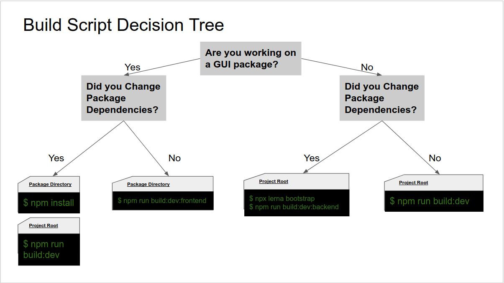

# Hyperledger Cacti Build Guide

This guide is for contributors who want to build and modify the Cacti codebase locally.
If you only want to consume Cacti as an npm dependency, you likely do not need this document.

---

## Table of Contents

- [Who This Guide Is For](#who-this-guide-is-for)
- [Fast Developer Loop](#fast-developer-loop)
- [Quick Start](#quick-start)
- [Environment Setup](#environment-setup)
  - [VS Code Dev Container](#vs-code-dev-container)
  - [macOS](#macos)
  - [Linux](#linux)
  - [Windows](#windows)
  - [Windows Notes](#windows-notes)
- [Configure Cacti](#configure-cacti)
- [Common Development Commands](#common-development-commands)
- [Build Script Decision Tree](#build-script-decision-tree)
- [Enable Upterm in CI](#enable-upterm-in-ci)

---

## Who This Guide Is For

Use this guide if you want to:

- contribute code to Cacti
- run and debug local packages
- build plugins and test integrations

Cacti is primarily TypeScript across both backend and frontend components.

## Fast Developer Loop

For most day-to-day development, use:

```sh
npm run watch
```

This command recompiles only what changed (instead of rebuilding everything), and it can also regenerate OpenAPI code when `openapi.json` files are updated.


## Quick Start

If you already have Docker, Node, and Git installed:

```sh
git clone https://github.com/hyperledger-cacti/cacti.git
cd cacti
npm run enable-corepack
yarn run configure
```

Then start iterative development with:

```sh
npm run watch
```

## Environment Setup

### VS Code Dev Container

#### Prerequisites

- [Git](https://github.com/git-guides/install-git#install-git-on-mac)
- [Visual Studio Code](https://code.visualstudio.com/)
- [Docker Desktop](https://www.docker.com/) (must be running)
- [Dev Containers extension](https://marketplace.visualstudio.com/items?itemName=ms-vscode-remote.remote-containers)

#### Option A: Direct Dev Container (beginner friendly)

```sh
git clone https://github.com/hyperledger-cacti/cacti.git
```

1. Open the `cacti` folder in VS Code.
2. Open command palette (`F1` or `Ctrl+Shift+P`).
3. Select **Reopen in Container**.
4. Wait for setup to finish.

#### Option B: Persistent Volume Dev Container (advanced)

```sh
git clone https://github.com/hyperledger-cacti/cacti.git
docker volume create cacti_volume
docker run -v cacti_volume:/workspace -w /workspace -it node:20.20.0 bash
```

Add this mount to `devcontainer.json`:

```json
"mounts": [
  "source=cacti_volume,target=/workspace,type=volume"
]
```

Then reopen in container as in Option A.

### macOS

Unless noted, steps apply to both Intel and Apple Silicon.

- **Git**
  - [Install Git](https://github.com/git-guides/install-git#install-git-on-mac)
- **Node.js and npm**
  - Required: Node.js `20.20.0`, npm `10.8.2`
  - Recommended: install with `nvm`
    - [Install/update nvm via script](https://github.com/nvm-sh/nvm?tab=readme-ov-file#install--update-script)
    - [Apple Silicon troubleshooting](https://github.com/nvm-sh/nvm?tab=readme-ov-file#macos-troubleshooting)
  - Install and select version:
    ```sh
    nvm install 20.20.0
    nvm use 20.20.0
    ```
- **Yarn (via Corepack)**
  - Run from project root: `npm run enable-corepack`
- **Docker + Docker Compose**
  - [Install Docker Desktop for Mac](https://docs.docker.com/desktop/install/mac-install/)
  - Docker Compose is included with Docker Desktop
- **OpenJDK**
  - Corda supports Java 8 JDK (Java 9+ is not currently supported for this use case)
  - [Install guide](https://github.com/supertokens/supertokens-core/wiki/Installing-OpenJDK-for-Mac-and-Linux)
- **Go**
  - [Install Go](https://go.dev/dl/)
  - [VS Code Go tooling setup](https://code.visualstudio.com/docs/languages/go)
- **Foundry** (required for SATP Hermes smart contract compilation)
  - Install:
    ```sh
    curl -L https://foundry.paradigm.xyz | bash
    ```
  - Restart shell, then run:
    ```sh
    foundryup
    forge --version
    ```

### Linux

Recommended baseline:

- Git
- Node.js `20.20.0` and npm `10.8.2` (prefer `nvm`)
- Docker Engine + Docker Compose
- OpenJDK 8 (for Corda-related flows)
- Go
- Foundry (for SATP Hermes contract compilation)

If you need a reference distro, Ubuntu LTS is the most frequently tested environment.

### Windows

Use **WSL2** if possible for the smoothest development experience.

Recommended:

- Windows 11/10 + WSL2
- Ubuntu LTS inside WSL2
- Docker Desktop with WSL integration enabled
- Node.js via `nvm` inside WSL

### Windows Notes

If you see `File paths too long` when cloning, run PowerShell as Administrator:

```sh
git config --system core.longpaths true
```

## Configure Cacti

1. Clone and enter the repo:

```sh
git clone https://github.com/hyperledger-cacti/cacti.git
cd cacti
```

2. Enable Corepack:

```sh
npm run enable-corepack
```

3. Run initial configuration (can take 10+ minutes on low-spec machines):

```sh
yarn run configure
```

After this, local packages should be ready for development.

## Common Development Commands

- Start incremental rebuild/watch mode:

  ```sh
  npm run watch
  ```

- Run an example integration test:

  ```sh
  npx tap --ts --timeout=600 packages/cactus-test-plugin-htlc-eth-besu/src/test/typescript/integration/plugin-htlc-eth-besu/get-single-status-endpoint.test.ts
  ```

- Generate API server config:

  ```sh
  npm run generate-api-server-config
  ```

  This creates `.config.json` in the project root. The `plugins` array is the most important section for loading plugin packages and options.

- Start API server:

  ```sh
  npm run start:api-server
  ```

By default:

- API server listens on port `4000`
- Cockpit UI is disabled unless `cockpitEnabled` is set to `true` in `.config.json` (default Cockpit port is typically `3000`)

> You may need to manually set CORS patterns in your configuration. Cacti follows a secure-by-default approach.

With the API server running, you can:

- test endpoints via cURL/Postman
- develop applications against Cacti API clients
- build and test custom plugins

## Build Script Decision Tree

`npm run watch` should cover most development scenarios. For less common cases (for example, when adding new dependencies), use the build script decision tree:



## Enable Upterm in CI

To debug GitHub Actions jobs interactively, you can add an Upterm step.

1. Ensure your SSH public key is added to GitHub:
   - [Generating a new SSH key and adding it to the ssh-agent](https://docs.github.com/en/github/authenticating-to-github/connecting-to-github-with-ssh/generating-a-new-ssh-key-and-adding-it-to-the-ssh-agent)
2. Edit `.github/workflows/ci.yml` and add this step **after checkout**:

```yaml
- name: Setup upterm session
  uses: lhotari/action-upterm@v1
  with:
    repo-token: ${{ secrets.GITHUB_TOKEN }}
```

3. Open the workflow run (`PR checks` tab or `Actions` tab), then open the Upterm step output.
4. Copy the provided `ssh ...@uptermd.upterm.dev` command and connect from your terminal.

Reference:

- [Debug your GitHub Actions by using SSH](https://github.com/marketplace/actions/debugging-with-ssh)
