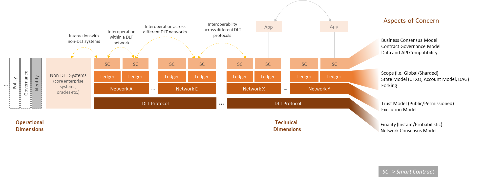
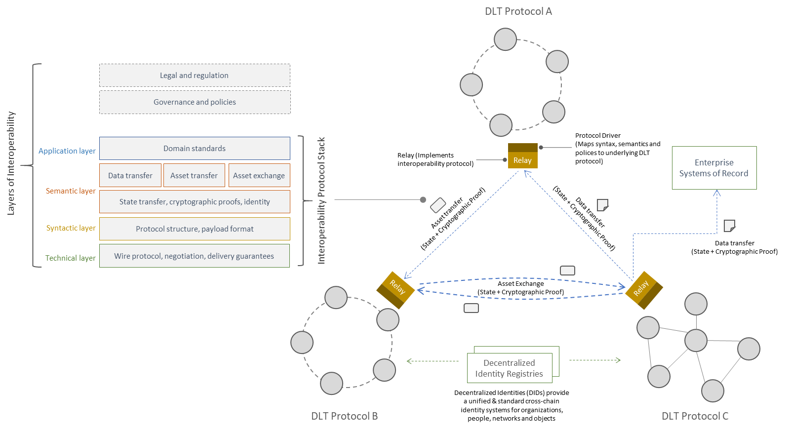
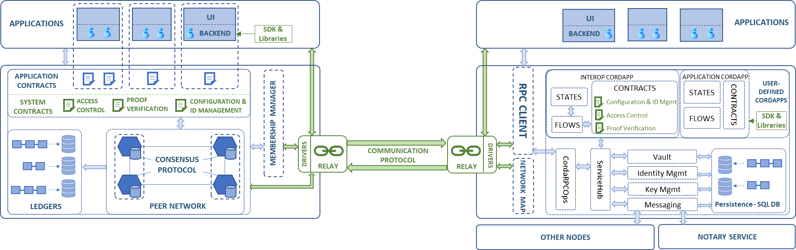
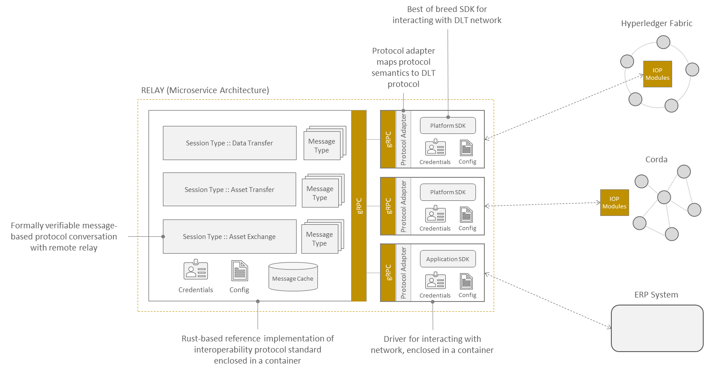
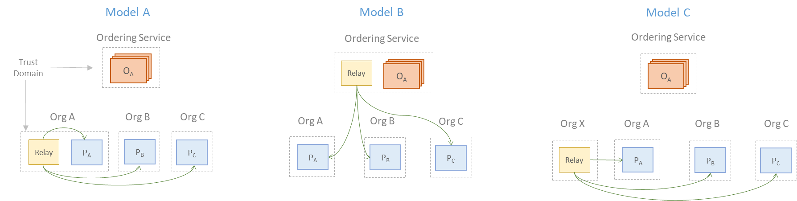

<!--
 Copyright IBM Corp. All Rights Reserved.

 SPDX-License-Identifier: CC-BY-4.0
 -->
# Weaver: Interoperability across DLT Networks

Weaver is an architectural framework with a family of protocols that enables scalable interconnectivity between independent distributed ledgers in a manner that preserves core tenets of decentralisation and security.

This framework addresses the problem of fragmentation that has emerged in the past few years, especially because of the proliferation of permissioned blockchain protocols and networks of limited process scope that nonetheless need to share assets and various ledger records to drive their workflows.

## Vision

The scope of DLT interoperability is illustrated in the figure below. We envision any form of trustworthy information communication across ledgers, whether they belong to a single network or to multiple networks running on very different DLTs, to require a standard set of capabilities. Communication between distributed ledgers and non-DLT systems are also covered in this vision. The common feature in all these scenarios is that the ledgers are governed and maintained independently and ought to have the ability to interoperate with other ledgers or systems on-demand.

The vertical layers in the above figure illustrate the typical DLT network stack, from smart contracts at the top to commitment and consensus protocols at the bottom. There are different aspects of concerns in each layer, as has been called out at the right of the figure. Operational concerns like identity management, governance, and policy, must be handled across all layers, treating networks as holistic units.

The figure below illustrates our layered view of what a general-purpose interoperability framework (like Weaver) ought to handle. Like the OSI model for networking protocols, low-level communication concerns in the bottom layers give way to orchestrational and policy concerns higher up. The _semantic layer_ is the most interesting from a blockchain practitioner's perspective as it presents research and engineering challenges unique to DLTs.

Toward the right of the figure, you can see functions in the semantic layer called out as distinct use cases involving some exchange of information across two networks, leading to ledger record updates in those networks. The three scenarios are:
- Data sharing
- Asset transfer
- Asset exchange

You can find details on these use cases (or _modes_ of interoperation) in [Interoperability Modes](https://hyperledger-labs.github.io/weaver-dlt-interoperability/docs/external/interoperability-modes).

_Relay_ modules owned and managed by networks enable cross-network communications or even communications between networks and enterprises systems of record. Cross-network identity management occurs on a separate plane from the information exchanges, and our vision for this is described in [Decentralized Identity](https://hyperledger-labs.github.io/weaver-dlt-interoperability/docs/external/architecture-and-design/decentralized-identity) and [Distributed Identity Management for Interoperation](./rfcs/models/identity/decentralized-network-identity-discovery-management.md).

## Architecture and Deployment

Because DLTs can be highly divergent, it is difficult to create components that are not in some way architected to fit a particular technology. But the templates these components are based on can be standardized, as is illustrated in the architecture diagram below which shows a Hyperledger Fabric network at the left and a Corda network at the right, both augmented for interoperability with each other.

In the middle, for cross-network communications, lie DLT-agnostic relays, which can have one or more DLT-specific _drivers_ to interpret requests and orchestrate response collection from the network. _Interoperation modules_ lie within the network and operate the way smart contracts for that platform natively do. Hence, in a Fabric network, these are implemented and deployed as _chaincode_ on all peers, whereas in a Corda network, they are implemented and deployed within a special _Interop Cordapp_ that can trigger flows across the network. Lastly, for applications that are already deployed on these networks to exercise interoperation capabilities, Weaver provides SDK extensions and libraries.

For a data sharing use case, the following are the functions that are performed network-wide using the interoperation modules (i.e., through consensus):
- Access control of requests for data from another network
- Proof of response data authenticity generated in the form of peers' digital signatures
- Optionally, encryption of repsonse data and signatures to avoid confidentiality and integrity attacks mounted by relays
- Verification of proofs in the response by the requesting network

The basis for this protocol is a priori knowledge of counterparty networks' membership providers' certificate chains.

For more details, see the [RFCs](./rfcs).

The architecture of the relay, which we envision can be the basis of a universal DLT interoperability standard, is illustrated in the figure below. As mentioned above, there are both DLT-agnostic components as well as DLT-specific components called drivers. Relays can manage requests and responses for different interoperability modes as well as targets (other DLT networks or ERP systems).

Because relays are additional components introduced by Weaver into a DLT network, the nature of their deployment is a matter of concern (and debate). Below, you can see three ways in which a relay can be deployed within a typical Hyperledger Fabric network, each with different trust assumptions and governance requirements.

## Articles

1. Venkatraman Ramakrishna and Vinayaka Pandit, [Making permissioned blockchains interoperable with Weaver](https://www.ibm.com/blogs/blockchain/2021/07/making-permissioned-blockchains-interoperable-with-weaver/), _Blockchain Pulse: IBM Blockchain Blog_
2. Venkatraman Ramakrishna, [Meet Weaver, one of the new Hyperledger Labs taking on cross-chain and off-chain operations](https://www.hyperledger.org/blog/2021/06/09/meet-weaver-one-the-new-hyperledger-labs-projects-taking-on-cross-chain-and-off-chain-operations), _Hyperledger Global Forum 2021 Blog_
3. Dileban Karunamoorthy and Ermyas Abebe, [On the Interoperability of Distributed Ledgers](https://medium.com/thinkdecentralized/on-the-interoperability-of-distributed-ledgers-15f584b79808), _Medium.com_

## Presentations

1. [Blockchain Interoperability with Hyperledger Cactus & Weaver](https://www.youtube.com/watch?v=l-nZlLK8IMM), Peter Somogyvari and Venkatraman Ramakrishna, _Hyperledger NYC Meetup_, October 14, 2021
2. Panel discussion on Blockchain Interoperability: Moderator: Vinayaka Pandit; Panelists: Rafael Belchior, Hart Montgomery, and Venkatraman Ramakrishna, _IEEE Services 2021: Blockchain Interoperability_, September 8, 2021
3. Blockchain Interoperability: Challenges, Ongoing Efforts, and Potential Solutions: Vinayaka Pandit, _Hyperledger Global Forum 2021_, June 9, 2021
4. Hosted Discussion: The Future of Blockchain Interoperability: Hart Montgomery, Tracy Kuhrt, Susumu Toriumi, and Venkatraman Ramakrishna, _Hyperledger Global Forum 2021_, June 8, 2021

## Peer-Reviewed Research Publications

1. Ermyas Abebe, Dushyant Behl, Chander Govindarajan, Yining Hu, Dileban Karunamoorthy, Petr Novotny, Vinayaka Pandit, Venkatraman Ramakrishna, Christian Vecchiola, [Enabling Enterprise Blockchain Interoperability with Trusted Data Transfer](https://arxiv.org/abs/1911.01064), _Middleware 2019 - Industry Track_
2. Ermyas Abebe, Yining Hu, Allison Irvin, Dileban Karunamoorthy, Vinayaka Pandit, Venkatraman Ramakrishna, Jiangshan Yu, [Verifiable Observation of Permissioned Ledgers](https://arxiv.org/abs/2012.07339), _ICBC 2021_
3. Bishakh Chandra Ghosh, Venkatraman Ramakrishna, Chander Govindarajan, Dushyant Behl, Dileban Karunamoorthy, Ermyas Abebe, Sandip Chakraborty, [Decentralized Cross-Network Identity Management for Blockchain Interoperation](https://arxiv.org/abs/2104.03277), _ICBC 2021_
