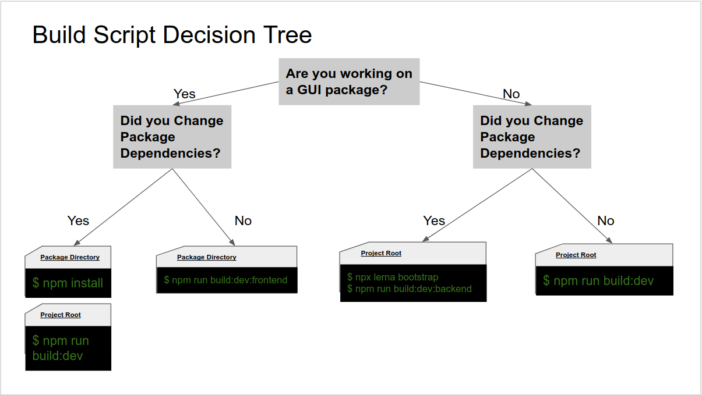

# Hyperledger Cactus

 [](https://open.vscode.dev/hyperledger/cactus)
  [](https://bestpractices.coreinfrastructure.org/projects/4089) [](https://codecov.io/gh/hyperledger/cactus)
 

This project is an _Incubation_ Hyperledger project. For more information on the history of this project see the [Cactus wiki page](https://wiki.hyperledger.org/display/cactus). Information on what _Active_ entails can be found in
the [Hyperledger Project Incubation Exit Criteria document](https://wiki.hyperledger.org/display/TSC/Project+Incubation+Exit+Criteria).

Hyperledger Cactus aims to provide Decentralized, Secure and Adaptable Integration between Blockchain Networks.
Hyperledger Cactus is currently undergoing a major refactoring effort to enable the desired to-be architecture which will enable plug-in based collaborative development to increase the breadth of use cases & Ledgers supported.

## Scope of Project

As blockchain technology proliferates, blockchain integration will become an increasingly important topic in the broader blockchain ecosystem.  For instance, people might want to trade between multiple different blockchains that are run on different platforms. Hyperledger Cactus is a web application system designed to allow users to securely integrate different blockchains. It includes a set of libraries, data models, and SDK to accelerate development of an integrated services application. Our goal is to deliver a system that allows users of our code to securely conduct transactions between all of the most commonly used blockchains.

## Run the Examples

### Supply Chain Example

1. Ensure a working installation of [Docker](https://docs.docker.com/desktop/) is present on your machine.
2. Run the following command to pull up the container that will run the example application and the test ledgers as well:
    ```sh
    docker run \
      --rm \
      --privileged \
      -p 3000:3000 \
      -p 3100:3100 \
      -p 3200:3200 \
      -p 4000:4000 \
      -p 4100:4100 \
      -p 4200:4200 \
      ghcr.io/hyperledger/cactus-example-supply-chain-app:2024-03-08--pr-3059-1
    ```
3. Wait for the output to show the message `INFO (supply-chain-app): SupplyChainApp Web GUI - reachable at: http://127.0.0.1:3200`
4. Token generated by the application is displayed below
5. Visit http://127.0.0.1:3200 in a web browser with Javascript enabled and insert the token when prompted
6. Use the graphical user interface to create data on both ledgers and observe that a consistent view of the data from different ledgers is provided.

Once the last command has finished executing, open link printed on the console with a web browser of your choice

### Discounted Asset Trade Example

- The guidance is [here](./examples/cactus-example-discounted-asset-trade/README.md).

### Electricity Trade Example

- The guidance is [here](./examples/cactus-example-electricity-trade/README.md).


## Documentation

* [Project Wiki](https://wiki.hyperledger.org/display/cactus): Schedule and logs of the maintainer meetings
* [Understanding and Using](https://hyperledger-cacti.github.io/cacti/cactus/introduction/): Description of components and instructions for usage and testing
* [Whitepaper](./whitepaper/whitepaper.md): The official document on Cactus design specifications (_Note_: this is deprecated. We are working on a new version.)
* [Contributing](./CONTRIBUTING.md): How to get from an idea to an approved pull request
* [Build](./BUILD.md): Instructions on how to set up the project for development

  
* [FAQ](./FAQ.md): A collection of frequently asked questions

## Inclusive Language Statement

These guiding principles are very important to the maintainers and therefore
we respectfully ask all contributors to abide by them as well:

- Consider that users who will read the docs are from different backgrounds and
cultures and that they have different preferences.
- Avoid potential offensive terms and, for instance, prefer "allow list and
deny list" to "white list and black list".
- We believe that we all have a role to play to improve our world, and even if
writing inclusive documentation might not look like a huge improvement, it's a
first step in the right direction.
- We suggest to refer to
[Microsoft bias free writing guidelines](https://docs.microsoft.com/en-us/style-guide/bias-free-communication)
and
[Google inclusive doc writing guide](https://developers.google.com/style/inclusive-documentation)
as starting points.

## Roadmap

Can be found here: [ROADMAP.md](./ROADMAP.md)

## Contact
* mailing list: [cacti@lists.hyperledger.org](mailto:cacti@lists.hyperledger.org)
* discord channel: [https://discord.com/invite/hyperledger](https://discord.com/invite/hyperledger)

## Build/Development Flow

To go from zero to hero with project setup and working on your contributions: [BUILD.md](./BUILD.md)

## Contributing
We welcome contributions to Hyperledger Cactus in many forms, and there’s always plenty to do!

Please review [contributing](/CONTRIBUTING.md) guidelines to get started.

## License
This distribution is published under the Apache License Version 2.0 found in the [LICENSE](/LICENSE) file.
