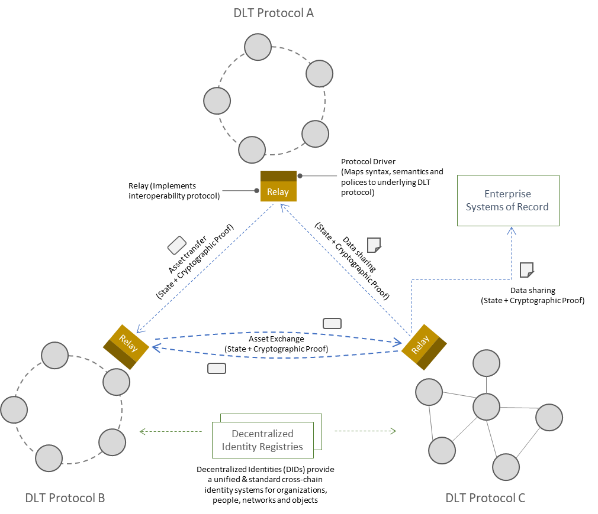
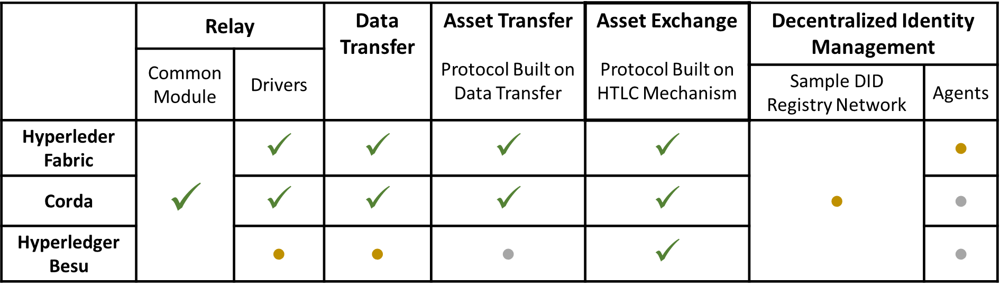

<!--
 Copyright IBM Corp. All Rights Reserved.

 SPDX-License-Identifier: CC-BY-4.0
 -->
# Weaver: DLT Interoperability

Weaver is a framework, with a family of protocols, to enable interoperation for data sharing and asset movements among independent networks built on similar or different distributed ledger technologies (DLTs) in a manner that preserves the core blockchain tenets of decentralization and security. To this end, it is built on a particular design philosophy that differentiates it from other DLT interoperability solutions in the market. This philosophy can be summarized through the following design principles or guidelines:
- A network is self-sovereign in matters of governance and should be able to choose who, how, and when, to interoperate with.
- Interoperation does not rely on trusted mediators. Rules and requirements are framed using the networks' internal governance mechanisms.
- Interoperation relies minimally on shared infrastructure, which may provide identity, discovery, and routing, services but does not play a part in core cross-network transactions (which may involve request-response protocols).
- Interoperation occurs through protocols that derive their trust from the counterparty networks' native consensus mechanisms, because any cross-network transaction method that eschews or bypasses the respective networks' consensus mechanisms will be vulnerable to failure or attack.
- Interoperation should be enabled without requiring modifications to the DLT stack on which a network is built nor should it disrupt regular network operation. All that should be required are addition and configuration of enabling modules and adapting application workflows to make them interoperation-aware.

## Weaver Use Cases
The framework allows two independent networks built on the same or different DLTs to interoperate on a need basis. Though presently, Weaver supports only permissioned DLTs (Hyperledger Fabric, Corda, and to some extent Hyperledger Besu), the design encompasses both permissioned and open DLTs. We expect to add support to the latter (e.g., Ethereum, Bitcoin) in due course.

Weaver, in effect, allows smart contracts managing data and assets on their respective ledgers to interlink and thereby produce an augnmented business workflow that can span multiple shared ledgers and networks. The core capabilities (or use cases) in Weaver that are the building blocks for cross-network operations are:
- Data sharing across ledgers with proof of authenticity and provenance
- Atomic asset transfers between networks
- Atomic asset exchanges in multiple networks

Each capability is implemented as a protocol with the endpoints being the respective peer networks that arrive at ledger state update decisions through consensus. See the [project overview](./OVERVIEW.md) for more information and references.

With Weaver, limited-scope blockchain networks can be scaled up to a _network-of-networks_ where different DLT networks can interoperate using Weaver's protocols ad hoc, thereby creating an illusion of a worldwide distributed ledger (or blockchain) without requiring netowrks to sacrifice their independence. This is illustrated in the figure below.

## Weaver Components
The framework offers common components that can be reused in networks built on any arbitrary DLT as well as design templates for components that must be built on DLT-specific tech stacks. We will strive to provide acclerators that minimize the effort involved in building DLT-specific components. Presently, we support Hyperledger Fabric and Corda, and to some extent Hyperledger Besu.
- The key platform elements are:
  * Protocol units, namely request access control, generation and verification of ledger state authenticity proofs, hash- and time-locking of assets, and claiming and unlocking of assets. These units leverage the networks' native smart contract frameworks.
  * Generic and extensible patterns for _ledger views_ and _view addresses_ for seamless inter-network communication. Our goal is to provide a basis for an eventual standard that is not tied to a particular DLT implementation.
  * Generic (i.e., not DLT-specific) semi-trusted _relay_ modules that mediate communication while acting on behalf of individual networks. They serve discovery and routing purposes akin to the routing and DNS infrastructure of the conventional internet.
  * DLT-specific plugins called _drivers_ that augment relay capabilities with query- and response-translation mechanisms.
  * Agents, consisting of both generic and DLT-specific features, that sync foreign networks' membership lists and identity provider credentials, using existing decentralized identity (DID) and verifiable credential (VC) infrastructure.
- Apart from the core platform features listed above, we provide SDK extensions for network application users to adapt existing apps for interoperability.
- We provide and maintain basic _testnets_ built on different DLTs (Fabric, Corda, Besu at present) for rapid prototyping and testing.

For more details and illustrations, see the [project overview](./OVERVIEW.md).

## Weaver Applications

Weaver can be used to link business workflows (implemented as smart contracts or decentralized applications) spanning multiple independent permissioned ledgers, in effect scaling up the reach and impact of those processes without sacrificing decentralized operation and network sovereignty.

Two popular categories of enterprise applications in which blockchain or distributed ledger technology play a major role today and which need interoperability support of the kind Weaver offers are:
- [Global Trade](https://labs.hyperledger.org/weaver-dlt-interoperability/docs/external/user-stories/global-trade)
- [Financial Markets](https://labs.hyperledger.org/weaver-dlt-interoperability/docs/external/user-stories/financial-markets)

## Weaver Support Status
The table below shows what interoperation capabilities (or use cases) are presently supported by Weaver, and what DLTs the platform offers out-of-the-box components for.
- Any network built on a supported DLT can utilize Weaver capabilities with additional effort required only in configuration and minor adaptations in applications to exercise those capabilities as required in their workflows.
- For any unsupported DLT, engineering effort will be required to build protocol units, drivers, and identity sync agents, using Weaver's common protobuf structures, design templates, and API specifications. (Because DLTs are heterogeneous with divergent models for data storage, smart contracts, and distributed application development procedures, it is difficult to write reusable code for this purpose.)

Prominent features in our future roadmap are:
- Make the protocols for data sharing, asset transfers, and asset exchanges, more robust and foolproof using techniques validated through research and experimentation.
- Support the use cases of cross-network transaction invocations (i.e., instructions) and event dissemination (publish/subscribe).

## Repository Structure
- Blockchain practitioners who wish to understand what Weaver offers, use Weaver capabilities, or experiment with the code, should check the [Documentation](https://hyperledger-labs.github.io/weaver-dlt-interoperability).
  * To dive straight into running a basic setup and testing sample interoperation scenarios, start with [Getting Started](https://labs.hyperledger.org/weaver-dlt-interoperability/docs/external/getting-started/guide).
  * The source code for the documents lies in the [docs folder](./docs).
- Comprehensive specifications of our architecture and protocol suite are written in the style of RFCs and found in the [rfcs folder](./rfcs).
- Core Weaver components are implemented in the [core folder](./core).
- SDK extensions and libraries for DLT network applications to exercise Weaver interoperation capabilities are implemented in the [sdks folder](./sdks).
- Sample applications used for testing and benchmarking interoperation flows are implemented in the [samples folder](./samples).
- Common data structures and features used by different platform components and applications are implemented in the [common folder](./common).
- Testing, experimentation, and evaluation frameworks, are implemented in the [tests](./tests) folder.
  * An extensible _testnet_ is implemented in the [tests/network-setups folder](./tests/network-setups) to spin up basic Fabric, Corda, and Besu networks, and test various cross-network operations.

## Active Maintainers
- https://github.com/VRamakrishna
- https://github.com/sanvenDev
- https://github.com/knarayan
- https://github.com/dhinakaran2705

## Other Contributors
- https://github.com/ghoshbishakh

## Initial Committers
- https://github.com/ermyas
- https://github.com/nwaywood
- https://github.com/dileban
- https://github.com/airvin
- https://github.com/AntTargett
- https://github.com//Yining-Hu
- https://github.com/Vinayaka-Pandit
- https://github.com/hyp0th3rmi4

## Sponsor
- https://github.com/lehors - TSC Member

# Former Members
- https://github.com/ChanderG
- https://github.com/dushyantbehl
