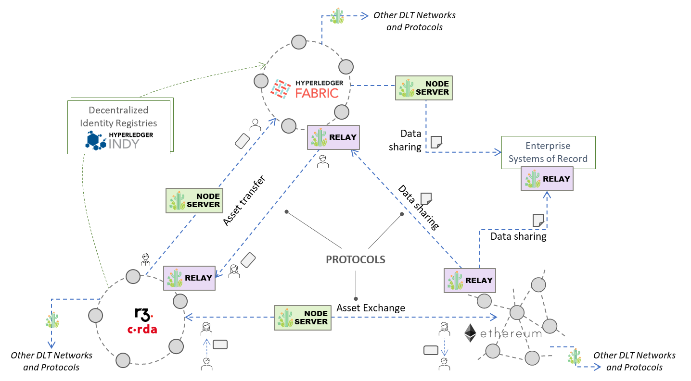
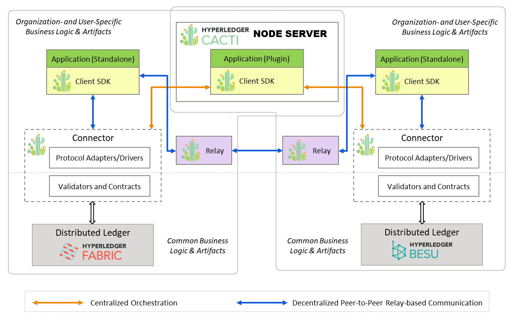

 
  
 
 

# Hyperledger Cacti

Hyperledger Cacti is a multi-faceted pluggable interoperability framework to link networks built on heterogeneous distributed ledger and blockchain technologies and to run transactions spanning multiple networks. This project is the result of a merger of the [Weaver Lab](https://github.com/hyperledger-labs/weaver-dlt-interoperability) project with **Hyperledger Cactus**, which was subsequently renamed to **Cacti**. It draws on the cutting-edge technological features of both constituent projects to provide a common general purpose platform and toolkit for DLT interoperability. This was the first-of-a-kind merger of two systems, architecture and code bases, to create a new project, under the Hyperledger Foundation. See this [Hyperledger Foundation blog article](https://www.hyperledger.org/blog/2022/11/07/introducing-hyperledger-cacti-a-multi-faceted-pluggable-interoperability-framework) for more information about the merger.

[Cacti is a _Graduated_ Hyperledger project](https://www.hyperledger.org/blog/hyperledger-cacti-a-general-purpose-modular-interoperability-framework-moves-to-graduated-status). Information on the different stages of a Hyperledger project and graduation criteria can be found in
the [Hyperledger Project Incubation Exit Criteria document](https://wiki.hyperledger.org/display/TSC/Project+Incubation+Exit+Criteria).

## Scope of Project

The existence of several blockchain and distributed ledger technologies of different flavours in the market as well as networks of varying scopes and sizes built on them necessitates the need for interoperability and integration, lest we end up with a fragmented ecosystem where digital assets and the workflows (often contracts) governing them remain isolated in silos. The solution to this is not to force all chains to coalesce (i.e., "*a single chain to rule them all*") but rather enable the networks to orchestrate transactions spanning their boundaries without sacrificing security, privacy, or governance autonomy (i.e., self-sovereignty). Hyperledger Cacti offers a family of protocols, modules, libraries, and SDKs, that can enable one network to be interoperable with, and carry out transactions directly with, another while eschewing the need for a central or common settlement chain. Cacti will allow networks to share ledger data, and exchange and transfer assets atomically, and manage identities, across their boundaries, as illustrated in the figure below.

As a fusion of two earlier systems (Cactus and Weaver) that have similar philosophies and goals, yet offer distinct mechanisms backed by different design and trust assumptions, Cacti offers a spectrum of selectable and configurable features for cross-network transaction orchestrations. An example illustrated below shows how distributed applications running on Fabric and Besu ledgers respectively can carry out the same set of cross-network transactions using the **Node Server** (Cactus legacy) or through **Relays** (Weaver legacy).

The current Cacti code base contains the legacy Cactus and Weaver source code in aggregated form with their original folder structures intact. But the packages built from the two sections of code are unified and released under a common `cacti` namespace, and the CI/CD pipelines for testing and releases are also integrated under a common set of GitHub Actions. A _deeper_ merge and integration of source code is part of our roadmap, and will be carried out over a longer time period, but the current setup of code and release packages makes it easy for new users to navigate Cacti and for legacy users to carry out seamless upgrades.

(Reference for legacy users: Cactus source code lies here (i.e., the root folder), excluding the `weaver` folder. Weaver source code lies within the [weaver](./weaver/) folder.

## Documentation

See the official [Hyperledger Cacti documentation](https://hyperledger-cacti.github.io/cacti/) to get all your questions answered about the project, to get started with setup, testing, and evaluation, and to get hands-on with code and configurations. Here, you can find separate (and specific) instructions for getting started with running and experimenting with [Cactus modules](https://hyperledger-cacti.github.io/cacti/cactus/introduction/) and [Weaver modules](https://hyperledger-cacti.github.io/cacti/weaver/introduction/) respectively.

## Roadmap

See [ROADMAP.md](./ROADMAP.md) for details on the envisioned integration.

## Inclusive Language Statement

These guiding principles are very important to the maintainers and therefore
we respectfully ask all contributors to abide by them as well:

- Consider that users who will read the docs are from different backgrounds and
cultures and that they have different preferences.
- Avoid potential offensive terms and, for instance, prefer "allow list and
deny list" to "white list and black list".
- We believe that we all have a role to play to improve our world, and even if
writing inclusive documentation might not look like a huge improvement, it's a
first step in the right direction.
- We suggest to refer to
[Microsoft bias free writing guidelines](https://docs.microsoft.com/en-us/style-guide/bias-free-communication)
and
[Google inclusive doc writing guide](https://developers.google.com/style/inclusive-documentation)
as starting points.

## Contact
* mailing list: [cacti@lists.hyperledger.org](mailto:cacti@lists.hyperledger.org)
* discord channel: [https://discord.com/invite/hyperledger](https://discord.com/invite/hyperledger)

## Contributing
We welcome contributions to Hyperledger Cacti in many forms, and there’s always plenty to do!

Please review [contributing](/CONTRIBUTING.md) guidelines to get started.

## License
This distribution is published under the Apache License Version 2.0 found in the [LICENSE](/LICENSE) file.
