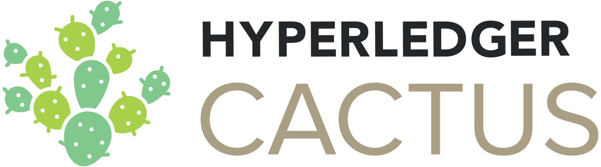

# Hyperledger Cactus

This project is an _Incubation_ Hyperledger project. For more information on the history of this project see the [Cactus wiki page](https://wiki.hyperledger.org/display/cactus). Information on what _Active_ entails can be found in
the [Hyperledger Project Lifecycle document](https://wiki.hyperledger.org/display/TSC/Project+Lifecycle).

Hyperledger Cactus aims to provide Decentralized, Secure and Adaptable Integration between Blockchain Networks. 
Hyperledger Cactus is currently undergoing a major refactoring effort to enable the desired to-be architecture which will enable plug-in based collaborative development to increase the breadth of use cases & Ledgers supported.

## Scope of Project

As blockchain technology proliferates, blockchain integration will become an increasingly important topic in the broader blockchain ecosystem.  For instance, people might want to trade between multiple different blockchains that are run on different platforms. The blockchain integration framework is a web application system designed to allow users to securely integrate different blockchains. It includes a set of libraries, data models, and SDK to accelerate development of an integrated services application. Our goal is to build a system that allows users of our code to securely conduct transactions between all of the most commonly used blockchains.  

## Documentation

* [Hyperledger Cactus Home](https://wiki.hyperledger.org/display/cactus)
* [Whitepaper](./whitepaper/whitepaper.md)
* [Hyperledger Forum Introduction To Cactus](https://www.youtube.com/watch?v=fgYrUIc_-sU)

## How It Works

### Interworking patterns
Hyperledger Cactus is planning to support following interworking patterns.

- Note: In the following description, **Value (V)** means numerical assets (e.g. money). **Data (D)** means non-numerical assets (e.g. ownership proof). Ledger 1 is source ledger, Ledger 2 is destination ledger.

| No. | Name                | Pattern | Consistency                                                                                    |
| --- | ------------------- | ------- | ---------------------------------------------------------------------------------------------- |
| 1.  | value transfer      | V -> V  | check if V1 = V2   (as V1 is value on ledger 1, V2 is value on ledger 2)                    |
| 2.  | value-data transfer | V -> D  | check if data transfer is successful when value is transferred                                 |
| 3.  | data-value transfer | D -> V  | check if value transfer is successful when data is transferred                                 |
| 4.  | data transfer       | D -> D  | check if all D1 is copied on ledger 2   (as D1 is data on ledger 1, D2 is data on ledger 2) |
| 5.  | data merge          | D <-> D | check if D1 = D2 as a result   (as D1 is data on ledger 1, D2 is data on ledger 2)          |

### Interworking architecture
Hyperledger Cactus will provide integrated service(s) by executing ledger operations across multiple blockchain ledgers. The execution of operations are controlled by the module of Hyperledger Cactus which will be provided by vendors as the single Hyperledger Cactus Business Logic plugin.
The supported blockchain platforms by Hyperledger Cactus can be added by implementing new Hyperledger Cactus Ledger plugin.
Once an API call to Hyperledger Cactus framework is requested by a User, Business Logic plugin determines which ledger operations should be executed, and it ensures reliability on the issued integrated service is completed as expected.
Following diagram shows the architecture of Hyperledger Cactus based on the discussion made at Hyperledger Cactus project calls.
The overall architecture is as the following figure.

Each entity is as follows:
- **Business Logic Plugin**: The entity executes business logic and provide integration services that are connected with multiple blockchains. The entity is composed by web application or smart contract on a blockchain. The entity is a single plugin and required for executing Hyperledger Cactus applications.
- **Ledger Plugin**: The entity communicates Business Logic Plugin with each ledger.  The entity is composed by a validator and a verifier as follows. The entity(s) is(are) chosen from multiple plugins on configuration.
- **Validator**: The entity verifies transactions on the connected ledger and makes signatures for requesting to the verifier. The entity connects the verifier using a bi-directional channel.
- **Verifier**: The entity verifies the signatures from the validator. The entity connects the validator using a bi-directional channel.
- **Cactus Routing Interface**: The entity is a routing service between Business Logic Plugin and  Ledger Plugin(s). The entity is also a routing service between Business Logic Plugin and API calls from application users.
- **Ledger-n**: Ledger (e.g. Ethereum, Quorum, Hyperledger Fabric, ...)

The execution steps are described as follows:
- **Step 1**: Application user(s) makes an API call for operations on a single ledger or between multiple ledgers.  The API call is sent to Business Logic Plugin via Hyperledger Cactus Routing Interface.
- **Step 2**: Business Logic Plugin requests ledger operation(s) to Ledger Plugin(s) via Hyperledger Cactus Routing Interface.  Ledger plugin requests the operation(s) to its connected ledger. The operation is settled on the ledger.
- **Step 3**: The Ledger Plugin is monitoring transaction data on its connected ledger.  If Ledger Plugin receives transaction data related with the operation(s) of Step 2, Ledger Plugin verifies the transaction and send the verified transaction information to Business Logic Plugin via Hyperledger Cactus Routing Interface, then Business Logic Plugin receives this information and records it.

## Contact
* mailing list: [cactus@lists.hyperledger.org](mailto:cactus@lists.hyperledger.org)
* rocketchat channel: [https://chat.hyperledger.org/channel/cactus](https://chat.hyperledger.org/channel/cactus).

## Contributing
We welcome contributions to Hyperledger Cactus in many forms, and there’s always plenty to do!

Please review [contributing](/CONTRIBUTING.md) guidelines to get started.

## License
This distribution is published under the Apache License Version 2.0 found in the [LICENSE](/LICENSE) file.
