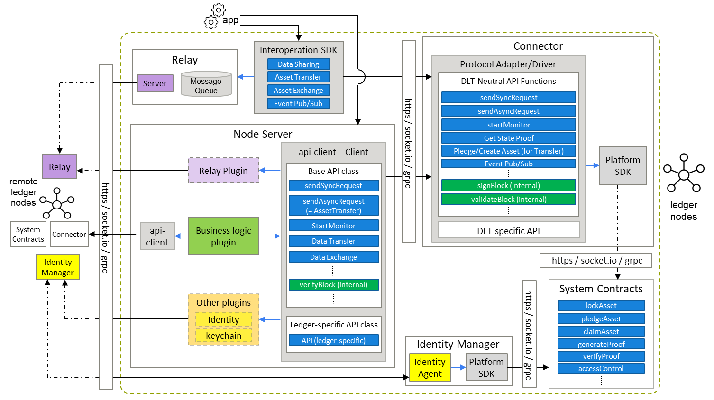

# Hyperledger Cacti Roadmap

A living document with the maintainers' plans regarding the general direction of the project:

## Can I Add Things to the Roadmap?

If you take on the burden of implementing a feature yourself no one should stop you from adding it here as well, as long as the majority of the maintainers also agree that it is something that has a place in the framework.

For example: 
* Support being added for new ledgers by implementing new connector plugins is always welcome.
* On the other hand, if you want to repurpose Cacti to be the operating system for a driverless ice-cream truck you are developing that that **may** not get accepted by the maintainers even if you are happy to do all the work yourself.

# Breakdown by each release

## Release plan

### Cacti V1 (= Cactus)
- Date: 
    - Start: March 2022
    - Expired: ****
- Goal:
    - Ledger Connectors: Supply Ledger Connectors for all Hyperledger blockchains
    - Integrating other projects: Integrate with Hyperledger-labs Weaver
- Sub release
    - [V1.0] First release of Cacti V1
        - Date: March 2022
        - Goal:
            - Ledger Connectors – connectors to communicate with various blockchain platforms using multiple programming languages: (TypeScript and Python)
                - Hyperledger Besu, Fabric, Indy, Iroha, Sawtooth
                - Go-Ethereum, Quorum, Xdai
                - Corda
    - [V1.1] Improved version reflecting security-audit advice
        - Date: October 2022

### Cacti V2
- Date: 
    - Start: March 2023 (planned)
    - Expired: ****
- Goal:
    - To integrate different Cacti APIs to provide user-friendly APIs.  In detail, the goal is to combine the following strengths of existing APIs on Cacti V1 and Weaver to provide better functionality
        - c.f.: APIs on Cacti V1
            - OpenAPI-api-client users need to use slightly different names, data types between different ledger types.
            - Verifier interface users only need to know four functions, but arguments passed to the function differs between different ledger types.
            - Weaver interface.
        - Notes: The above goal will make some of Cacti V1 features incompatibilities on Cacti V2
- Sub release
  *Note*: We envision three phases of evolution of the Cacti code base until the creation of a single undifferentiated platform offering a spectrum of features.
    - [V2.0-alpha] First release of the merged version of Cactus and Weaver
        - Date: February 2023 (completed)
        - Status:
            - The present version of the Cacti code base is simply an aggregation of the legacy Cactus and Weaver code bases with their original folder structures.
            - Until merge and integration (see further below), users should examine, test, and use them separately as follows:
                - Cactus code and documentation lies within this (root) folder, excluding the `weaver` folder. See [Cactus documentation](./README-cactus.md) to test and use Cactus.
                - Weaver code and documentation lies within the [weaver](./weaver/) folder. See [Weaver documentation](./weaver/README.md) to test and use Weaver.
              We will soon integrate the Github Workflows and publish packages under the `hyperledger/cacti` namespace. Watch out for updates!
    - [V2.0-beta]
        - Date: April 2023 (planned)
        - Goal:
            - Large-scale refactoring of the code base to create a common pipeline for triggering and orchestration of cross-ledger transactions, with Cactus and Weaver features selectable but without changing Cactus or Weaver code internals. The Cacti architecture diagram representing this phases is illustrated below.
              
            - Add a GUI transaction viewer tool for Hyperledger Cacti 
    - [V2.0]
        - Date: June 2023 (planned)
        - Goal:
            - Enhance the code quality of V2.0-beta
            - Integrate modules and libraries of Cactus and Weaver code bases performing similar functions to eliminate redundancy and offer a common Cacti SDK and API.
            - Refactor the connectors and system contracts to implement an integrated ledger access mechanism while supporting all legacy Cactus and Weaver ledger operations for supported DLTs. The Cacti architecture diagram representing this phases is illustrated below.
              
              *Note*: The *Core Operators* module refers to operations that can be carried out through direct ledger-facing procedures or APIs. In many DLTs, these procedures will take the form of smart contracts.

## Notes

- Versioning:
    - When we release a new version which does not include API incompatibilities, we should not increment MAJOR version number, according to [SemVer](https://semver.org/) principle.
- Terminology
    - Quarters are defined as:
        - **Q1**: January, February, March
        - **Q2**: April, May, June
        - **Q3**: July, August, September
        - **Q4**: October, November, December
    - Halves are defined as:
        - **H1**: Q1+Q2
        - **H2**: Q3+Q4
