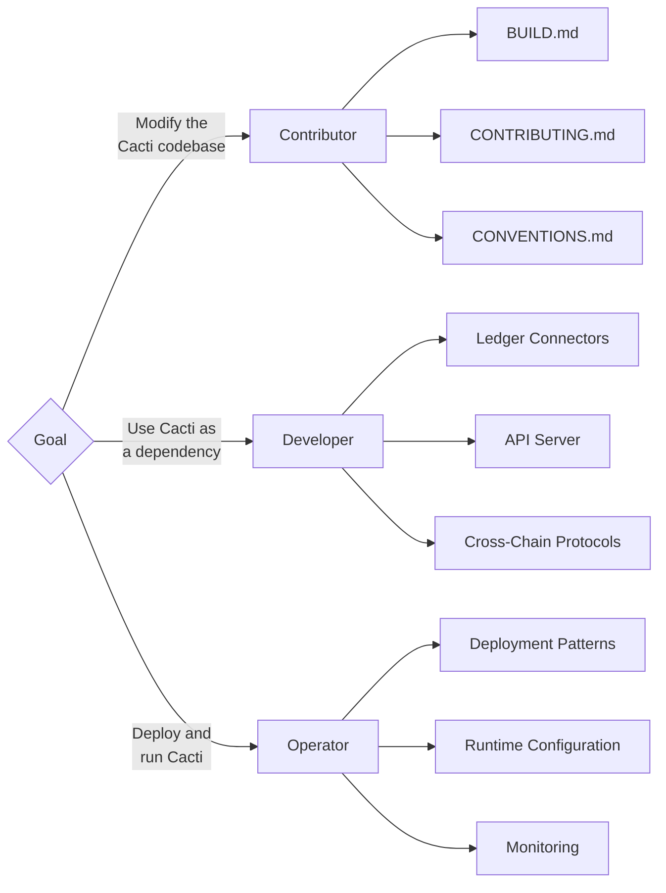

<!-- --8<-- [start:content] -->
# Start Here

Hyperledger Cacti is a pluggable interoperability framework for
distributed ledger and blockchain networks. This page helps you find the
right documentation based on what you want to do with Cacti.

---

## Choose Your Path

Cacti serves three distinct audiences. Identify your role below and
follow the corresponding section to get started.

| Role | Description | Section |
|------|-------------|---------|
| **Contributor** | You want to modify, extend, or fix the Cacti codebase itself. | [For Contributors][contributors] |
| **Developer** | You want to use Cacti packages as dependencies in your own application. | [For Developers][developers] |
| **Operator** | You want to deploy and run Cacti components | [For Operators][operators] |

The following diagram illustrates how each role interacts with the Cacti
ecosystem:



---

## For Contributors

This section is for anyone who wants to build, modify, or contribute
code and documentation to the Cacti repository.

### Prerequisites

Before you begin, ensure you have the following installed:

- [Git][git_install]
- [Docker Desktop][docker_desktop]

### Installation

The fastest way to set up a working development environment is with the
Nix flake. This provisions the full polyglot toolchain (Node.js, Go,
Rust, JDK, Protobuf, Foundry) in a single command. See the [Nix Setup Guide][nix_setup].

```bash
# 1. Clone the repository
git clone https://github.com/hyperledger-cacti/cacti.git
cd cacti

# 2. Enter the Nix development shell
nix develop

# 3. Install dependencies and build
yarn run configure
```

Alternative setup methods are available if Nix is not suitable for your
environment. The different setup methods are:

| Method | Description | Guide |
|--------|-------------|-------|
| **Nix Flake** | One-command reproducible toolchain setup (recommended) | [BUILD.md - Nix Flake Quickstart][build_nix_flake] |
| **Dev Container** | Docker-based VS Code development environment | [BUILD.md - Dev Container Quickstart][build_dev_container] |
| **Manual Setup** | Platform-specific installation (macOS, Linux, Windows/WSL) | [BUILD.md - Getting Started][build_getting_started] |

---

## For Developers

This section is for anyone who want to use Cacti
packages as dependencies in their own applications. You do not need to
clone or build the Cacti repository; instead, you can leverage the project artifacts (npm packages, docker images), or compile them from source.

### What Cacti Provides

Cacti is a modular framework. You can adopt as much or as little of it
as your project requires. The following table lists the primary component
categories:

| Component | Description | Package Scope |
|-----------|-------------|---------------|
| **Ledger Connectors** | Plugins that abstract interaction with specific blockchains (Besu, Fabric, Ethereum, Corda, Stellar) | `@hyperledger/cactus-plugin-ledger-connector-*` |
| **API Server** | Express-based server that hosts plugins and exposes REST/gRPC APIs | `@hyperledger/cactus-cmd-api-server` |
| **Core Libraries** | Common interfaces, types, utilities, and plugin registry | `@hyperledger/cactus-core`, `cactus-core-api`, `cactus-common` |
| **Cross-Chain Protocols** | SATP Hermes (asset transfer), Weaver (relay-based interop), COPM (cross-chain operations) | `@hyperledger/cactus-plugin-satp-hermes`, etc. |
| **Keychain Plugins** | Secure credential storage (Vault, AWS SM, Azure KV, in-memory) | `@hyperledger/cactus-plugin-keychain-*` |
| **Test Tooling** | Docker-based test ledgers and utilities for integration testing | `@hyperledger/cactus-test-tooling` |

### Choosing Your Level of Integration

Cacti supports three levels of integration depth. Choose the level that
matches your project requirements:

| Level | Use Case | Complexity | What You Get |
|-------|----------|------------|--------------|
| **[Level 1: Connector as a Library](#level-1-connector-as-a-library)** | You have an existing Node.js application and need blockchain connectivity | Low | Connector as an npm dependency with direct programmatic access |
| **[Level 2: API Server with Plugins](#level-2-api-server-with-plugins)** | You have a non-Node.js application or want containerized blockchain access | Medium | Standalone API server exposing REST/gRPC endpoints |
| **[Level 3: Full Framework Integration](#level-3-full-framework-integration)** | You want a complete blockchain-integrated application framework | High | Full stack with custom business logic plugins |

#### Level 1: Connector as a Library

Install a connector directly into your existing Node.js or TypeScript
project:

```bash
npm install @hyperledger/cactus-plugin-ledger-connector-ethereum
npm install @hyperledger/cactus-core
npm install @hyperledger/cactus-common
```

This gives you type-safe, programmatic access to blockchain operations
without additional infrastructure.

#### Level 2: API Server with Plugins

Run the Cacti API server as a standalone service and interact with it
over REST or gRPC from any language:

```bash
npm install @hyperledger/cactus-cmd-api-server
```

Configure plugins via a JSON configuration file and access blockchain
operations through the server's HTTP endpoints.

#### Level 3: Full Framework Integration

Build custom business logic plugins that run inside the Cacti API
server. This is the deepest level of integration and is suited for
projects that want to leverage the full plugin architecture.

### Developer Resources

| Resource | Description |
|----------|-------------|
| [Getting Started Guide][getting_started_guide] | Detailed tutorials for each integration level with code examples |
| [Architecture Overview][architecture_overview] | System design and component relationships |
| [OpenAPI Specifications][openapi_specs] | Auto-generated API reference for all plugin endpoints |
| [Weaver Documentation][weaver_doc] | Relay-based interoperability framework |
| [SATP Hermes][satp_hermes] | Secure Asset Transfer Protocol implementation |

---

## For Operators

This section is for anyone responsible for deploying, configuring, and
running Cacti components in production or staging environments.

### Deployment Overview

Cacti components are designed to run as containerized services. A
typical production deployment involves the following:

| Component | Role | Runtime |
|-----------|------|---------|
| **API Server** | Hosts ledger connector plugins and exposes REST/gRPC APIs | Node.js process or Docker container |
| **Ledger Connector Plugins** | Communicate with blockchain nodes (Besu, Fabric, etc.) | Loaded into the API server at startup |
| **Relays** (Weaver) | Route cross-network verification requests between organizations | Standalone service (Rust or Node.js) |
| **Drivers** (Weaver) | Interface between relays and specific ledger networks | Standalone service per ledger type |

### Deployment Patterns

Cacti supports multiple deployment patterns depending on your
infrastructure and security requirements:

| Pattern | Description | When to Use |
|---------|-------------|-------------|
| **Single-Organization** | One API server instance with connectors for each ledger | Development, testing, and single-organization use cases |
| **Multi-Organization with Relays** | Weaver relays and drivers deployed per organization | Cross-organization interoperability requiring independent governance |
| **Hybrid** | API server for direct ledger access combined with relays for cross-network operations | Complex deployments spanning multiple interoperability modes |

### Runtime Configuration

The API server is configured through a JSON configuration file that
specifies which plugins to load and how to connect to ledger nodes.
Key configuration areas include:

- **Plugin Registration:** Which ledger connectors and keychain
  plugins to activate at startup.
- **Network Endpoints:** RPC URLs, TLS certificates, and
  authentication credentials for each blockchain node.
- **CORS and Security:** Allowed origins, API keys, and
  authorization policies.
- **Logging:** Log levels and output destinations for operational
  monitoring.

See [BUILD.md - Configure Cacti][build_configure_cacti] for
detailed configuration instructions and examples.

### Weaver Deployment

For relay-based cross-network interoperability, the Weaver subsystem
requires additional components:

- **Relay Server:** Routes verification requests between networks.
  See Weaver Relay Architecture
  for design details.
- **Drivers:** Network-specific adapters that translate relay requests
  into ledger queries. Drivers exist for Fabric, Corda, and Besu.
- **Interoperation Modules:** Smart contracts or chaincode installed
  on each participating network to handle verification logic.

For detailed deployment instructions, refer to the
[Weaver Getting Started Guide][weaver_getting_started].

### Monitoring and Health Checks

The API server exposes health check endpoints that can be integrated
with container orchestrators (Kubernetes, Docker Compose) for liveness
and readiness probes. Configure your orchestrator to poll the health
endpoint at the API server's base URL.

### Operator Resources

| Resource | Description |
|----------|-------------|
| [BUILD.md - Configure Cacti][build_configure_cacti] | Server configuration, plugin registration, and CORS setup |
| [Weaver Getting Started][weaver_getting_started] | End-to-end setup for cross-network interoperability |

---

## For Contributors 

### Making Your First Contribution

Once your environment is set up, follow this workflow to submit your
first pull request:

1. **Fork** the repository on GitHub.
2. **Create a branch** from `main` with a descriptive name.
3. **Make your changes** in small, focused commits.
4. **Run the local CI checks** before pushing:
   ```bash
   yarn run configure
   yarn run lint
   yarn run test:jest:all
   ```
5. **Push and open a pull request** against `upstream/main`.

### Contributor Documentation

The following documents govern the contribution process, coding
standards, and review expectations:

| Document | Purpose |
|----------|---------|
| [BUILD.md][build_doc] | Development environment setup and build instructions |
| [CONTRIBUTING.md][contributing_doc] | Contribution workflow, PR process, and review guidelines |
| [CONVENTIONS.md][conventions_doc] | Coding standards, package structure, and repository conventions |
| [PULL.md][pull_doc] | Pull request quality standards and review criteria |
| [AI_GUIDELINES.md][ai_guidelines_doc] | Guidelines for AI-assisted contributions |


## Additional Resources

| Resource | Description |
|----------|-------------|
| [ROADMAP.md][roadmap_doc] | Project roadmap and planned integrations |
| [Hyperledger Cacti Documentation][docs_site] | Full documentation site |
| [Discord][discord] | Community chat and support |
| [Mailing List][mailing_list] | Project mailing list |

<!-- --8<-- [end:content] -->

<!-- Reference link definitions for GitHub / local IDE rendering -->

[contributors]: #for-contributors
[developers]: #for-developers
[operators]: #for-operators
[git_install]: https://github.com/git-guides/install-git
[docker_desktop]: https://www.docker.com/
[nix_setup]: ./docs/docs/guides/nix-setup.md
[build_nix_flake]: ./BUILD.md#nix-flake-quickstart
[build_dev_container]: ./BUILD.md#dev-container-quickstart-recommended
[build_getting_started]: ./BUILD.md#getting-started
[build_doc]: ./BUILD.md
[contributing_doc]: ./CONTRIBUTING.md
[conventions_doc]: ./CONVENTIONS.md
[pull_doc]: ./PULL.md
[ai_guidelines_doc]: ./AI_GUIDELINES.md
[getting_started_guide]: ./docs/docs/guides/getting-started.md
[architecture_overview]: ./docs/docs/architecture.md
[openapi_specs]: https://hyperledger-cacti.github.io/cacti/references/openapi/index.html
[weaver_doc]: ./weaver/README.md
[satp_hermes]: ./packages/cactus-plugin-satp-hermes/README.md
[build_configure_cacti]: ./BUILD.md#configure-cacti
[weaver_getting_started]: ./weaver/README.md
[roadmap_doc]: ./ROADMAP.md
[docs_site]: https://hyperledger-cacti.github.io/cacti/
[discord]: https://discord.com/invite/hyperledger
[mailing_list]: mailto:cacti@lists.hyperledger.org

