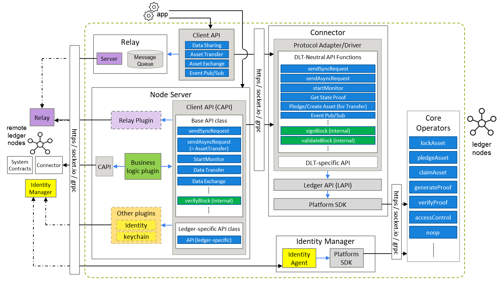
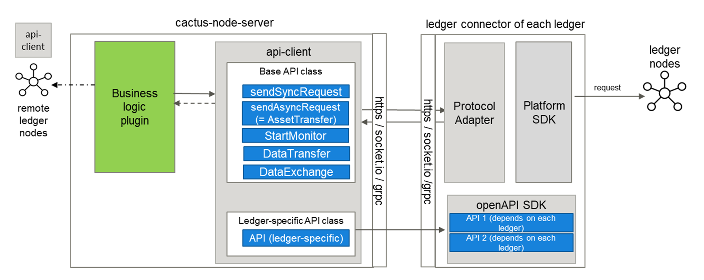

The Cacti integrated architecture is illustrated below.

This consists of a set of modules, services (offering standard APIs), and libraries that offer a selection of cross-network transaction pipelines, which can be constructed by picking and choosing from the collection.

The integrated architecture was generated by fusing the pre-existing Cactus and Weaver architectures, identifying and re-labeling common (or overlapping) components and calling out unique components separately.

For reference, here is the Cactus architecture.

And here is the Weaver architecture.

