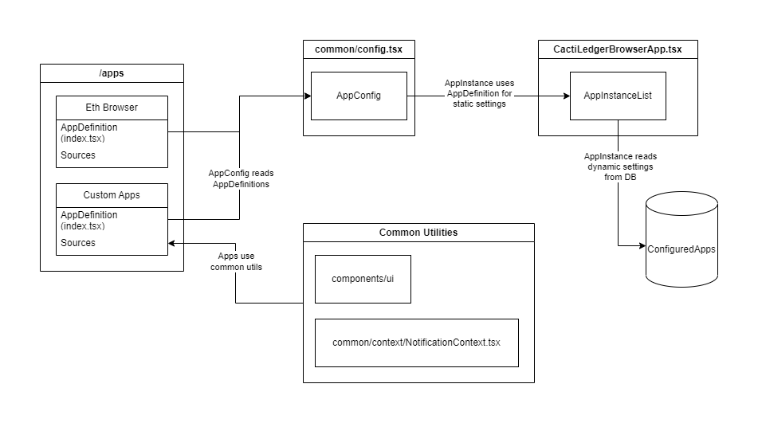

# Architecture

## Components

### AppDefinition

Each application must define an `AppDefinition`. This includes essential information like the app's name, category, and default settings shown to the user during app creation (such as description, path, and custom options). The most critical part of the `AppDefinition` is the `createAppInstance` factory method. This method accepts a `GuiAppConfig` (which contains dynamic app settings configured by the user and stored in a database) and returns an `AppInstance` object.

#### Interface

```typescript
interface AppDefinition {
  /**
   * Application name as shown to the user
   */
  appName: string;

  /**
   * Application category, the user can filter using it.
   * If there's no matching category for your app consider adding a new one!
   */
  category: string;

  /**
   * Full URL to a setup guide, it will be displayed to the user on app configuration page.
   */
  appSetupGuideURL?: string;

  /**
   * Full URL to app documentation page
   */
  appDocumentationURL?: string;

  /**
   * Default value for instance name that user can set to uniquely identify this ap instance.
   */
  defaultInstanceName: string;

  /**
   * Default value for app description.
   */
  defaultDescription: string;

  /**
   * Default path under which app routes will be mounted (must be path with `/`, like `/eth`)
   */
  defaultPath: string;

  /**
   * Default custom, app-specific options in JSON format. This will change between applications.
   */
  defaultOptions: unknown;

  /**
   * Factory method for creating application instance object from configuration stored in a database.
   */
  createAppInstance: CreateAppInstanceFactoryType;
}
```

### AppInstance

An `AppInstance` represents the runtime configuration of an app. It holds all the details required by `Ledger Browser` to render the app correctly. Key components include `menuEntries` (links displayed in the top header bar) and `routes` that adhere to [react-router-dom](https://reactrouter.com/en/main) specifications.

```typescript
interface AppInstance<T = unknown> {
  /**
   * Unique database ID of this app instance.
   */
  id: string;

  /**
   * Name of the application (can be same as appName in app definition)
   */
  appName: string;

  /**
   * Instance name (set by the user)
   */
  instanceName: string;

  /**
   * Instance description (set by the user)
   */
  description: string | undefined;

  /**
   * Path under which app routes will be mounted (must be path with `/`, like `/eth`)
   */
  path: string;

  /**
   * Custom, app-specific options in JSON format. This will change between applications.
   */
  options: T;

  /**
   * List on titles and URL of menu entries to be added to the top bar (used to navigate within an app)
   */
  menuEntries: AppInstanceMenuEntry[];

  /**
   * `react-router-dom` compatible list of this application routes.
   */
  routes: RouteObject[];

  /**
   * Method for retriving application status details.
   */
  useAppStatus: () => GetStatusResponse;

  /**
   * Status component showed when user opens a app status pop up window.
   */
  StatusComponent: React.ReactElement;

  /**
   * Full URL to a setup guide, it will be displayed to the user on app configuration page.
   */
  appSetupGuideURL?: string;

  /**
   * Full URL to app documentation page
   */
  appDocumentationURL?: string;
}
```

### AppConfig

To make an application available to the `Ledger Browser`, it must be added to the main `AppConfig` mapping (located in `common/config.tsx`). When creating a new app, ensure it is included here, and assign it a unique ID within the map.

### ConfiguredApps (GuiAppConfig)

`ConfiguredApps` refers to the dynamic settings for apps as configured by the user and stored in a database. This data is maintained in the `public.gui_app_config` table within the GUI's PostgreSQL instance.

### AppInstance List

During startup, the application reads dynamic app configurations from the database (`GuiAppConfig`), retrieves the corresponding `AppDefinition` from the main `AppConfig`, and uses the `createAppInstance` method to generate the final `AppInstance`. This instance is then added to a list, with its routes mounted under the specified path.

## Diagram

