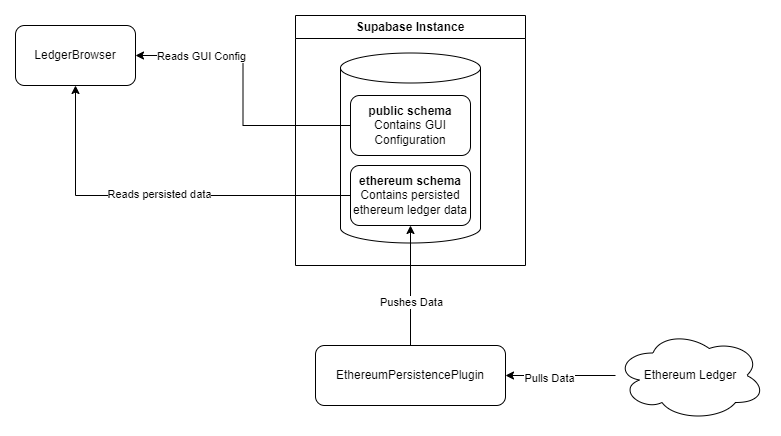

# App Patterns

This page presents different patterns that some plugin applications follow. While not exhaustive, this information can be useful for developing new applications or investigating existing ones.

## Browser App / Persistence Plugin Apps

These applications rely heavily on the existence of Cacti persistence plugins, such as [cactus-plugin-persistence-ethereum](https://github.com/hyperledger-cacti/cacti/tree/main/packages/cactus-plugin-persistence-ethereum) or [cactus-plugin-persistence-fabric](https://github.com/hyperledger-cacti/cacti/tree/main/packages/cactus-plugin-persistence-fabric).

As the name suggests, persistence plugins store the ledger state in an SQL database (e.g., PostgreSQL managed by Supabase). They synchronize all blocks, transactions, token operations, etc., into the database for later use and push new data as it arrives.

Browser applications are used to display this stored data. Therefore, they require a fully operational persistence plugin to function correctly. These applications are typically read-only and do not allow any changes to the ledger state.

### Sample Setup

