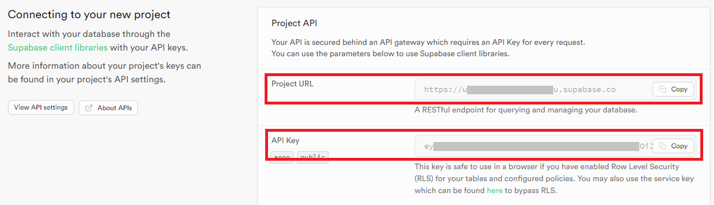

# Setup

## Clone the repository

Clone the [cacti git repository](https://github.com/hyperledger/cacti) on your local machine. Follow these instructions to get a copy of the project up and running for development and testing purposes.

```sh
git clone https://github.com/hyperledger/cacti.git
cd cacti/packages/cacti-ledger-browser/
```

## App Prerequisites

### Install Node

NodeJS v18 or later is required (we recommend using the Node Version Manager (nvm) if available for your OS).

```sh
nvm install 18
nvm use 18
```

### Install Yarn

Run the following command from within the project directory:

```sh
npm run enable-corepack
```

### Install Docker

Ensure Docker Engine is installed and running. You can verify this by running `docker ps -aq`. Follow the installation instructions for Docker [here](https://docs.docker.com/engine/install/ubuntu/).

### Install required packages

You can run the following command from either the root of the project or the `cacti-ledger-browser` folder:

```sh
yarn install
```

## Setup Supabase

### Create Instance

You can start a local instance of Supabase to be used as the GUI backend using our Cacti `supabase-all-in-one` image. Alternatively, follow the [Supabase Self-Hosting guide](https://supabase.com/docs/guides/self-hosting/docker).

#### Using Self-Hosting

1. Open a new console window in the root of the Cacti project.
2. Build the `cactus-supabase-all-in-one` image:

    ```sh
    docker build ./tools/docker/supabase-all-in-one -t cactus-supabase-all-in-one
    ```

3. Run the container (detached):

    ```sh
    docker run --name supabase_all_in_one_gui \
    --detach \
    --privileged \
    -p 8000:8000 \
    -p 5432:5432 \
    cactus-supabase-all-in-one
    ```

4. Copy and save the `SERVICE_ROLE_KEY` (our `API Key`) from the Supabase environment, it will be needed later:

    ```sh
    docker exec -ti supabase_all_in_one_gui cat /home/supabase/docker/.env | grep SERVICE_ROLE_KEY
    ```

5. Open the Supabase dashboard by navigating to http://localhost:8000/
6. Use the following credentials to log in:

    - **Username**: `supabase`
    - **Password**: `this_password_is_insecure_and_should_be_updated`

#### Using Supabase Cloud

Supabase provides a free tier that can be used for development and small projects.

1. Open the dashboard https://supabase.com/dashboard/projects
1. You'll be asked to log in or sign up if you haven't done that already. You can also use your GitHub account to quickly create the account.
1. After a successful login, you'll see a list of your projects (possibly empty). Click the `New project` button on the top of the page to create a new project. Select a default organization (or create a new one if needed).
1. Set any project name and secure database password (remember or save it, it will be needed when setting up some plugin apps). Select a region close to your location.
1. Wait for the project to set up.
1. You can see connection details on the new project home page. Save the `Project URL` and `API Key`, they will be used later on.



### Setup DB Schema

1. Navigate to `SQL Editor` using the navigation panel on the left. Copy the content of `packages/cacti-ledger-browser/src/main/sql/schema.sql` into the editor and run the query (`Run` button or `Ctrl + Enter`).
1. Navigate to `Table Editor` and verify that tables were created in the `public` schema.

Alternatively, you can use the `psql` CLI tool:

```shell
psql "__CONNECTION_STRING_TO_DB__" -f packages/cacti-ledger-browser/src/main/sql/schema.sql
```

## Start the application

### Set the environment variables

1. Copy `packages/cacti-ledger-browser/.env.template` to `packages/cacti-ledger-browser/.env`.
2. Edit the newly created `.env` file (`vim packages/cacti-ledger-browser/.env` or similar).
3. Set `VITE_SUPABASE_URL` to:
    - **Self Hosting**: `http://localhost:8000`.
    - **Supabase Cloud**: `Project URL` from the config page.
4. Set `VITE_SUPABASE_KEY` to:
    - **Self Hosting**: `SERVICE_ROLE_KEY` from `.env` file withing the container.
    - **Supabase Cloud**: `API Key` from the config page.
5. Leave `VITE_SUPABASE_SCHEMA` as `public`.

If there are any connection errors to Supabase when running the app, double-check if the data in this file was filled correctly!

### Development build

```sh
yarn run start
```

The server will run on http://localhost:3001/

### Production build

```sh
yarn run build
yarn run serve
```

The server will run on http://localhost:4173/

## Use application

By default, there will be no configured apps. Click the `Add Application` action card to open the wizard that will guide you through the process.

### Adding Applications

#### Select Group

All (pluggable) applications are divided into groups for better organization.

#### Select Application

Select the application you want to add. Use the `Setup Guide` button to the right of a given app to open its documentation in a separate card. If there's no documentation for a given plugin, the button is grayed out.

#### Common Setup

These are fields common for all plugin apps.

- **Instance Name**: Used to uniquely identify the given application.
- **Description**: Provides more context to the app user.
- **Path**: Path under which the application routes will be mounted. Example: an app with path `/eth` will be available under `http://localhost:3001/eth/`. **Must be unique!**

#### App Specific Setup

- Each app may require its own configuration (e.g., access to the database where data is stored, authentication keys, Cacti connector endpoint, etc.).
- These options can be configured using JSON format.
- Each app can define its own custom format, so this will vary from app to app. Consult the application documentation for more details.

### App Dashboard

On the main page, you can see the list of currently configured applications. Each app has two health indicators:

- **Initialized**: Indicates whether the plugin and all infrastructure required by it were created successfully.
- **Status**: Indicates if all components are running.

You can open the detailed status page by clicking the `Status` button on the app card (this may vary between different plugin apps). You can open the settings page by clicking on the `Configure` button. Clicking on the card itself will navigate to the plugin application.

At any time, you can navigate back to this page by clicking the app grid icon on the far left of the top navigation bar. You can open the documentation for a given app by clicking the far right question mark button on the navigation bar.
