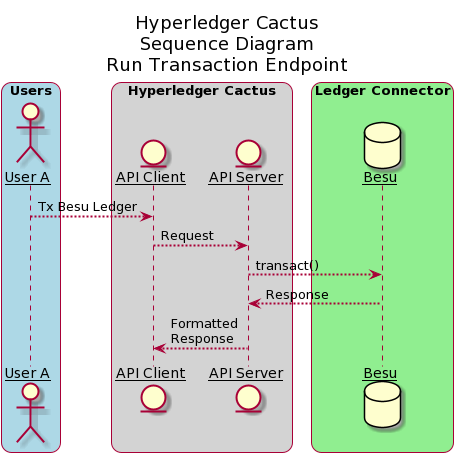
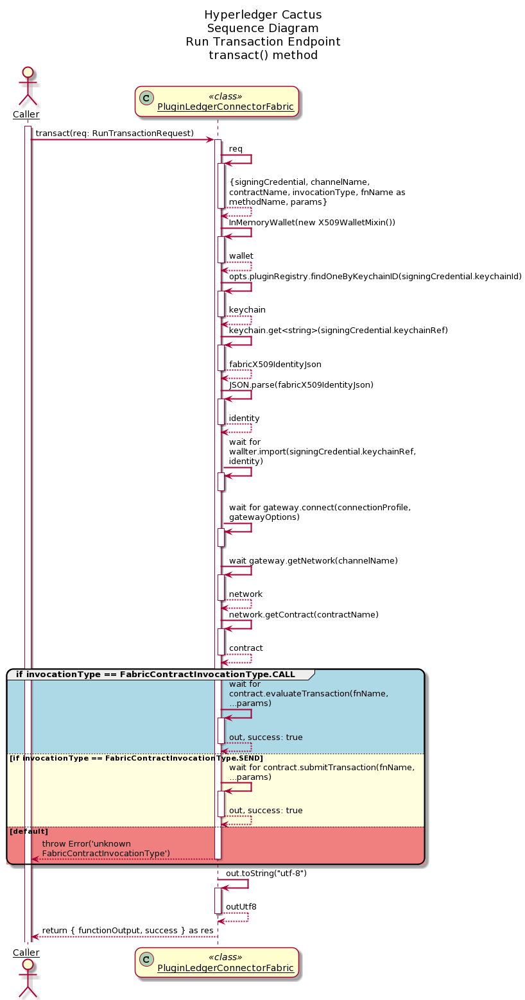
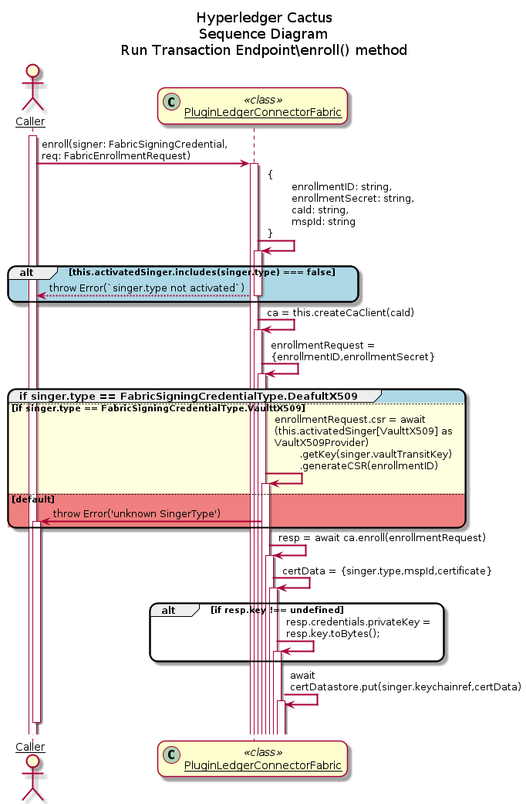

`@hyperledger/cactus-plugin-ledger-connector-fabric`
========================================================================================================================================

1\. Usage
------------------------------------------------

This plugin provides a way to interact with Fabric networks. Using this one can perform:

*   Deploy smart contracts (chaincode).
    
*   Execute transactions on the ledger.
    
*   Invoke chaincode functions.
    

The above functionality can either be accessed by importing the plugin directly as a library (embedding) or by hosting it as a REST API through the [Cactus API server](https://www.npmjs.com/package/@hyperledger/cactus-cmd-api-server)

We also publish the [Cactus API server as a container image](https://github.com/hyperledger/cactus/pkgs/container/cactus-cmd-api-server) to the GitHub Container Registry that you can run easily with a one liner. The API server is also embeddable in your own NodeJS project if you choose to do so.

### 1.1. Installation

**npm**

npm install @hyperledger/cactus-plugin-ledger-connector-fabric

**yarn**

yarn add @hyperledger/cactus-plugin-ledger-connector-fabric

### 1.2. Using as a Library

import {
  PluginLedgerConnectorFabric,
  DefaultEventHandlerStrategy,
} from "@hyperledger/cactus-plugin-ledger-connector-fabric";

const plugin \= new PluginLedgerConnectorFabric({
  // See test cases for exact details on what parameters are needed
});

const req: RunTransactionRequest \= {
  // See tests for specific examples on request properties
};

try {
  const res \= await plugin.transact(req);
} catch (ex: Error) {
  // Make sure to handle errors gracefully (which is dependent on your use-case)
  console.error(ex);
  throw ex;
}

### 1.3. Using Via The API Client

**Prerequisites**

*   A running Fabric ledger (network)
    
*   You have a running Cactus API server on `$HOST:$PORT` with the Fabric connector plugin installed on it (and the latter configured to have access to the Fabric ledger from point 1)
    

import {
  PluginLedgerConnectorFabric,
  DefaultApi as FabricApi,
  DefaultEventHandlerStrategy,
} from "@hyperledger/cactus-plugin-ledger-connector-fabric";

// Step zero is to deploy your Fabric ledger and the Cactus API server
const apiUrl \= \`https://${HOST}:${PORT}\`;

const config \= new Configuration({ basePath: apiUrl });

const apiClient \= new FabricApi(config);

const req: RunTransactionRequest \= {
  // See tests for specific examples on request properties
};

try {
  const res \= await apiClient.runTransactionV1(req);
} catch (ex: Error) {
  // Make sure to handle errors gracefully (which is dependent on your use-case)
  console.error(ex);
  throw ex;
}

### 1.4. Signing Credentials with Hashicorp Vault

To support signing of message with multiple identity types

// vault server config for supporting vault identity provider
const vaultConfig:IVaultConfig \= {
  endpoint : "http://localhost:8200",
  transitEngineMountPath: "/transit",
}
// web-socket server config for supporting vault identity provider
const webSocketConfig:IVaultConfig \= {
  server: socketServer as FabricSocketServer
}
// provide list of identity signing to be supported
const supportedIdentity:FabricSigningCredentialType\[\] \= \[FabricSigningCredentialType.VaultX509,FabricSigningCredentialType.WsX509,FabricSigningCredentialType.X509\]
const pluginOptions:IPluginLedgerConnectorFabricOptions \= {
  // other options
  vaultConfig : vaultConfig,
  webSocketConfig : webSocketConfig,
  supportedIdentity:supportedIdentity
  // .. other options
}
const connector: PluginLedgerConnectorFabric \= new PluginLedgerConnectorFabric(pluginOptions);

To enroll an identity

await connector.enroll(
        {
          keychainId: "keychain-identifier-for storing-certData",
          keychainRef: "cert-data-identifier",

          // require in case of vault
          type: FabricSigningCredentialType.VaultX509, // FabricSigningCredentialType.X509
          vaultTransitKey: {
            token: "vault-token",
            keyName: "vault-key-label",
          },
          // required in case of web-socket server
          type: FabricSigningCredentialType.WsX509,
          webSocketKey: {
            signature: signature,
            sessionId: sessionId,
          },
        },
        {
          enrollmentID: "client2",
          enrollmentSecret: "pw",
          mspId: "Org1MSP",
          caId: "ca.org1.example.com",
        },
      );

To Register an identity using register’s key

const secret \= await connector.register(
        {
          keychainId: "keychain-id-that-store-certData-of-registrar",
          keychainRef: "certData-label",

          // require in case of vault
          type: FabricSigningCredentialType.VaultX509, // FabricSigningCredentialType.X509
          vaultTransitKey: {
            token: testToken,
            keyName: registrarKey,
          },
          // required in case of web-socket server
          type: FabricSigningCredentialType.WsX509,
          webSocketKey: {
            signature: signature,
            sessionId: sessionId,
          },
        },
        {
          enrollmentID: "client-enrollmentID",
          enrollmentSecret: "pw",
          affiliation: "org1.department1",
        },
        "ca.org1.example.com", // caID
      );

To transact with fabric

const resp \= await connector.transact{
  signingCredential: {
          keychainId: keychainId,
          keychainRef: "client-certData-id",

          // require in case of vault
          type: FabricSigningCredentialType.VaultX509, // FabricSigningCredentialType.X509
          vaultTransitKey: {
            token: testToken,
            keyName: registrarKey,
          },
          // required in case of web-socket server
          type: FabricSigningCredentialType.WsX509,
          webSocketKey: {
            signature: signature,
            sessionId: sessionId,
          },
        },
        // .. other options
}

To Rotate the key

await connector.rotateKey(
  {
        keychainId: keychainId,
        keychainRef: "client-certData-id",
        type: FabricSigningCredentialType.VaultX509, // FabricSigningCredentialType.X509

        // require in case of vault
        vaultTransitKey: {
          token: testToken,
          keyName: registrarKey,
        },
        // key rotation currently not available using web-socket server
        // web-socket connection not used to manages external keys
        // user should re-enroll with new pub/priv key pair
  },
  {
      enrollmentID: string;
      enrollmentSecret: string;
      caId: string;
  }
)

> Extensive documentation and examples in the [readthedocs](https://readthedocs.org/projects/hyperledger-cactus/) (WIP)

#### 1.4.1. Identity Providers

Identity providers allows client to manage their private more effectively and securely. Cactus Fabric Connector support multiple type of providers. Each provider differ based upon where the private are stored. On High level certificate credential are stored as

{
  type: FabricSigningCredentialType;
  credentials: {
    certificate: string;
    // if identity type is IdentityProvidersType.X509
    privateKey?: string;
  };
  mspId: string;
}

Currently Cactus Fabric Connector supports following Identity Providers

*   X509 : Simple and unsecured provider wherein `private` key is stored along with certificate in some `datastore`. Whenever connector require signature on fabric message, private key is brought from the `datastore` and message signed at the connector.
    
*   Vault-X.509 : Secure provider wherein `private` key is stored with vault’s transit transit engine and certificate in `certDatastore`. Rather then bringing the key to the connector, message digest are sent to the vault server which returns the `signature`.
    
*   WS-X.509 : Secure provider wherein `private` key is stored with `client` and certificate in `certDatastore`. To get the fabric messages signed, message digest is sent to the client via `webSocket` connection opened by the client in the beginning (as described above)
    

#### 1.4.2. Setting up a WS-X.509 provider

The following packages are used to access private keys (via web-socket) stored on a clients external device (e.g., browser, mobile app, or an IoT device…). -[ws-identity](https://github.com/brioux/ws-identity): web-socket server that issues new ws-session tickets, authenticates incoming connections, and sends signature requests -[ws-identity-client](https://github.com/brioux/ws-identity-client): backend connector to send requests from fabric application to ws-identity -[ws-wallet](https://github.com/brioux/ws-wallet): external clients crypto key tool: create new key pair, request session ticket and open web-socket connection with ws-identity

#### 1.4.3. Building the ws-identity docker image

TBD

### 1.5 Monitoring new blocks (WatchBlocks)

*   Use `ApiClient` to receive new blocks from a fabric ledger.
    
*   Type of the response can be configured.
    
*   Credentials must be configured using `gatewayOptions` argument (you can either send them directly in request or use wallet stored in keychain).
    

#### 1.5.1 Example

For more detailed example check [fabric-watch-blocks-v1-endpoint.test.ts](#./src/test/typescript/integration/fabric-v2-2-x/fabric-watch-blocks-v1-endpoint.test.ts)

// Setup
const signingCredential \= {
  keychainId: uuidv4(),
  keychainRef: "user2",
};

// Create RxJS Observable.
// This will connect to the fabric connector and start the monitoring operation.
const watchObservable \= apiClient.watchBlocksV1({
  channelName: "mychannel", // fabric channel name
  gatewayOptions: { // use signing credential from keychain
    identity: signingCredential.keychainRef,
    wallet: {
      keychain: signingCredential,
    },
  },
  WatchBlocksListenerTypeV1.Full, // return full block data
});

// Subscribe to the observable to receive new blocks
const subscription \= watchObservable.subscribe({
  next(event) {
    // Handle new event
  },
  error(err) {
    // Handle error from connector
  },
});

#### 1.5.2 Listener Type

There are two types of listener type - original and cactus ones.

##### Original

Corresponds directly to `BlockType` from `fabric-common`:

*   `WatchBlocksListenerTypeV1.Filtered`,
    
*   `WatchBlocksListenerTypeV1.Full`,
    
*   `WatchBlocksListenerTypeV1.Private`,
    

##### Cactus (custom)

Parses the data and returns custom formatted block.

*   `WatchBlocksListenerTypeV1.CactusTransactions`: Returns transactions summary. Compatible with legacy `fabric-socketio` monitoring operation.
    

2\. Architecture
--------------------------------------------------------------

The sequence diagrams for various endpoints are mentioned below

### 2.1. run-transaction-endpoint

The above diagram shows the sequence diagram of run-transaction-endpoint. User A (One of the many Users) interacts with the API Client which in turn, calls the API server. API server then executes transact() method which is explained in detailed in the subsequent diagram.

The above diagram shows the sequence diagram of transact() method of the PluginLedgerConnectorFabric class. The caller to this function, which in reference to the above sequence diagram is API server, sends RunTransactionRequest object as an argument to the transact() method. Based on the invocationType (FabricContractInvocationType.CALL, FabricCOntractInvocationType.SEND), corresponding responses are send back to the caller.

The above diagram shows the sequence diagram of enroll() method of the PluginLedgerConnectorFabric class. The caller to this function, which in reference to the above sequence diagram is API server, sends Signer object along with EnrollmentRequest as an argument to the enroll() method. Based on the singerType (FabricSigningCredentialType.X509, FabricSigningCredentialType.VaultX509, FabricSigningCredentialType.WsX509), corresponding identity is enrolled and stored inside keychain.

3\. Containerization
----------------------------------------------------------------------

### 3.1. Building/running the container image locally

In the Cactus project root say:

DOCKER\_BUILDKIT\=1 docker build \-f ./packages/cactus-plugin-ledger-connector-fabric/Dockerfile . \-t cplcb

Build with a specific version of the npm package:

DOCKER\_BUILDKIT\=1 docker build \--build-arg NPM\_PKG\_VERSION\=0.4.1 \-f ./packages/cactus-plugin-ledger-connector-fabric/Dockerfile . \-t cplcb

### 3.2. Running the container

Launch container with plugin configuration as an **environment variable**:

docker run \\
  \--rm \\
  \--publish 3000:3000 \\
  \--publish 4000:4000 \\
  \--env PLUGINS\='\[{"packageName": "@hyperledger/cactus-plugin-ledger-connector-fabric", "type": "org.hyperledger.cactus.plugin\_import\_type.LOCAL", "action": "org.hyperledger.cactus.plugin\_import\_action.INSTALL",  "options": {"instanceId": "some-unique-fabric-connector-instance-id", "dockerBinary": "usr/local/bin/docker","cliContainerEnv": {
    "CORE\_PEER\_LOCALMSPID": "Org1MSP",
    "CORE\_PEER\_ADDRESS": "peer0.org1.example.com:7051",
    "CORE\_PEER\_MSPCONFIGPATH":
      "/opt/gopath/src/github.com/hyperledger/fabric/peer/crypto/peerOrganizations/org1.example.com/users/Admin@org1.example.com/msp",
    "CORE\_PEER\_TLS\_ROOTCERT\_FILE":
      "/opt/gopath/src/github.com/hyperledger/fabric/peer/crypto/peerOrganizations/org1.example.com/peers/peer0.org1.example.com/tls/ca.crt",
    "ORDERER\_TLS\_ROOTCERT\_FILE":
      "/opt/gopath/src/github.com/hyperledger/fabric/peer/crypto/ordererOrganizations/example.com/orderers/orderer.example.com/msp/tlscacerts/tlsca.example.com-cert.pem"
  },
  "discoveryOptions": {
    "enabled": true,
    "asLocalhost": true
  }
  }}}\]' \\
  cplcb

Launch container with plugin configuration as a **CLI argument**:

docker run \\
  \--rm \\
  \--publish 3000:3000 \\
   \--publish 4000:4000 \\
  cplcb \\
    ./node\_modules/.bin/cactusapi \\
    \--plugins\='\[{"packageName": "@hyperledger/cactus-plugin-ledger-connector-fabric", "type": "org.hyperledger.cactus.plugin\_import\_type.LOCAL", "action": "org.hyperledger.cactus.plugin\_import\_action.INSTALL",  "options": {"instanceId": "some-unique-fabric-connector-instance-id", "dockerBinary": "usr/local/bin/docker","cliContainerEnv": {
    "CORE\_PEER\_LOCALMSPID": "Org1MSP",
    "CORE\_PEER\_ADDRESS": "peer0.org1.example.com:7051",
    "CORE\_PEER\_MSPCONFIGPATH":
      "/opt/gopath/src/github.com/hyperledger/fabric/peer/crypto/peerOrganizations/org1.example.com/users/Admin@org1.example.com/msp",
    "CORE\_PEER\_TLS\_ROOTCERT\_FILE":
      "/opt/gopath/src/github.com/hyperledger/fabric/peer/crypto/peerOrganizations/org1.example.com/peers/peer0.org1.example.com/tls/ca.crt",
    "ORDERER\_TLS\_ROOTCERT\_FILE":
      "/opt/gopath/src/github.com/hyperledger/fabric/peer/crypto/ordererOrganizations/example.com/orderers/orderer.example.com/msp/tlscacerts/tlsca.example.com-cert.pem"
  },
  "discoveryOptions": {
    "enabled": true,
    "asLocalhost": true
  }
  }}}\]'

Launch container with **configuration file** mounted from host machine:

echo '\[{"packageName": "@hyperledger/cactus-plugin-ledger-connector-fabric", "type": "org.hyperledger.cactus.plugin\_import\_type.LOCAL", "action": "org.hyperledger.cactus.plugin\_import\_action.INSTALL",  "options": {"instanceId": "some-unique-fabric-connector-instance-id", "dockerBinary": "usr/local/bin/docker","cliContainerEnv": {
    "CORE\_PEER\_LOCALMSPID": "Org1MSP",
    "CORE\_PEER\_ADDRESS": "peer0.org1.example.com:7051",
    "CORE\_PEER\_MSPCONFIGPATH":
      "/opt/gopath/src/github.com/hyperledger/fabric/peer/crypto/peerOrganizations/org1.example.com/users/Admin@org1.example.com/msp",
    "CORE\_PEER\_TLS\_ROOTCERT\_FILE":
      "/opt/gopath/src/github.com/hyperledger/fabric/peer/crypto/peerOrganizations/org1.example.com/peers/peer0.org1.example.com/tls/ca.crt",
    "ORDERER\_TLS\_ROOTCERT\_FILE":
      "/opt/gopath/src/github.com/hyperledger/fabric/peer/crypto/ordererOrganizations/example.com/orderers/orderer.example.com/msp/tlscacerts/tlsca.example.com-cert.pem"
  },
  "discoveryOptions": {
    "enabled": true,
    "asLocalhost": true
  }
  }}}\]' \> cactus.json

docker run \\
  \--rm \\
  \--publish 3000:3000 \\
  \--publish 4000:4000 \\
  \--mount type\=bind,source\="$(pwd)"/cactus.json,target\=/cactus.json \\
  cplcb \\
    ./node\_modules/.bin/cactusapi \\
    \--config-file\=/cactus.json

### 3.3. Testing API calls with the container

Don’t have a fabric network on hand to test with? Test or develop against our fabric All-In-One container!

**Terminal Window 1 (Ledger)**

docker run \--privileged \-p 0.0.0.0:8545:8545/tcp  \-p 0.0.0.0:8546:8546/tcp  \-p 0.0.0.0:8888:8888/tcp  \-p 0.0.0.0:9001:9001/tcp  \-p 0.0.0.0:9545:9545/tcp ghcr.io/hyperledger/cactus-fabric-all-in-one:v1.0.0-rc.2

**Terminal Window 2 (Cactus API Server)**

docker run \\
  \--network host \\
  \--rm \\
  \--publish 3000:3000 \\
  \--publish 4000:4000 \\
  \--env PLUGINS\='\[{"packageName": "@hyperledger/cactus-plugin-ledger-connector-fabric", "type": "org.hyperledger.cactus.plugin\_import\_type.LOCAL", "action": "org.hyperledger.cactus.plugin\_import\_action.INSTALL",  "options": {"instanceId": "some-unique-fabric-connector-instance-id", "dockerBinary": "usr/local/bin/docker","cliContainerEnv": {
    "CORE\_PEER\_LOCALMSPID": "Org1MSP",
    "CORE\_PEER\_ADDRESS": "peer0.org1.example.com:7051",
    "CORE\_PEER\_MSPCONFIGPATH":
      "/opt/gopath/src/github.com/hyperledger/fabric/peer/crypto/peerOrganizations/org1.example.com/users/Admin@org1.example.com/msp",
    "CORE\_PEER\_TLS\_ROOTCERT\_FILE":
      "/opt/gopath/src/github.com/hyperledger/fabric/peer/crypto/peerOrganizations/org1.example.com/peers/peer0.org1.example.com/tls/ca.crt",
    "ORDERER\_TLS\_ROOTCERT\_FILE":
      "/opt/gopath/src/github.com/hyperledger/fabric/peer/crypto/ordererOrganizations/example.com/orderers/orderer.example.com/msp/tlscacerts/tlsca.example.com-cert.pem"
  },
  "discoveryOptions": {
    "enabled": true,
    "asLocalhost": true
  }
  }}}\]' \\
  cplcb

**Terminal Window 3 (curl - replace eth accounts as needed)**

curl \--location \--request POST 'http://127.0.0.1:4000/api/v1/plugins/@hyperledger/cactus-plugin-ledger-connector-fabric/run-transaction' \\
--header 'Content-Type: application/json' \\
--data-raw '{
    channelName: "mychannel",
    contractName: "contract-example";
    invocationType: "FabricContractInvocationType.SEND";
    methodName: "example"
}'

The above should produce a response that looks similar to this:

{
    "success": true,
    "data": {
        "transactionReceipt": {
            "blockHash": "0x7c97c038a5d3bd84613fe23ed442695276d5d2df97f4e7c4f10ca06765033ffd",
            "blockNumber": 1218,
            "contractAddress": null,
            "cumulativeGasUsed": 21000,
            "from": "0x627306090abab3a6e1400e9345bc60c78a8bef57",
            "gasUsed": 21000,
            "logs": \[\],
            "logsBloom": "0x00000000000000000000000000000000000000000000000000000000000000000000000000000000000000000000000000000000000000000000000000000000000000000000000000000000000000000000000000000000000000000000000000000000000000000000000000000000000000000000000000000000000000000000000000000000000000000000000000000000000000000000000000000000000000000000000000000000000000000000000000000000000000000000000000000000000000000000000000000000000000000000000000000000000000000000000000000000000000000000000000000000000000000000000000000000",
            "status": true,
            "to": "0xf17f52151ebef6c7334fad080c5704d77216b732",
            "transactionHash": "0xc7fcb46c735bdc696d500bfc70c72595a2b8c31813929e5c61d9a5aec3376d6f",
            "transactionIndex": 0
        }
    }
}

4\. Prometheus Exporter
----------------------------------------------------------------------------

This class creates a prometheus exporter, which scraps the transactions (total transaction count) for the use cases incorporating the use of Fabric connector plugin.

### 4.1. Usage Prometheus

The prometheus exporter object is initialized in the `PluginLedgerConnectorFabric` class constructor itself, so instantiating the object of the `PluginLedgerConnectorFabric` class, gives access to the exporter object. You can also initialize the prometheus exporter object seperately and then pass it to the `IPluginLedgerConnectorFabricOptions` interface for `PluginLedgerConnectoFabric` constructor.

`getPrometheusExporterMetricsEndpointV1` function returns the prometheus exporter metrics, currently displaying the total transaction count, which currently increments everytime the `transact()` method of the `PluginLedgerConnectorFabric` class is called.

### 4.2. Prometheus Integration

To use Prometheus with this exporter make sure to install [Prometheus main component](https://prometheus.io/download/). Once Prometheus is setup, the corresponding scrape\_config needs to be added to the prometheus.yml

\- job\_name: 'fabric\_ledger\_connector\_exporter'
  metrics\_path: api/v1/plugins/@hyperledger/cactus-plugin-ledger-connector-fabric/get-prometheus-exporter-metrics
  scrape\_interval: 5s
  static\_configs:
    - targets: \['{host}:{port}'\]

Here the `host:port` is where the prometheus exporter metrics are exposed. The test cases (For example, `packages/cactus-plugin-ledger-connector-fabric/src/test/typescript/integration/fabric-v2-2-x/run-transaction-endpoint-v1.test.ts`) exposes it over `0.0.0.0` and a random port(). The random port can be found in the running logs of the test case and looks like (42379 in the below mentioned URL) `Metrics URL: http://0.0.0.0:42379/api/v1/plugins/@hyperledger/cactus-plugin-ledger-connector-fabric/get-prometheus-exporter-metrics`

Once edited, you can start the prometheus service by referencing the above edited prometheus.yml file. On the prometheus graphical interface (defaulted to http://localhost:9090), choose **Graph** from the menu bar, then select the **Console** tab. From the **Insert metric at cursor** drop down, select **cactus\_fabric\_total\_tx\_count** and click **execute**

### 4.3. Helper code

#### 4.3.1. response.type.ts

This file contains the various responses of the metrics.

#### 4.3.2. data-fetcher.ts

This file contains functions encasing the logic to process the data points

#### 4.3.3. metrics.ts

This file lists all the prometheus metrics and what they are used for.

5\. Contributing
--------------------------------------------------------------

We welcome contributions to Hyperledger Cactus in many forms, and there’s always plenty to do!

Please review [CONTRIBUTING.md](#../../CONTRIBUTING.md) to get started.

6\. License
----------------------------------------------------

This distribution is published under the Apache License Version 2.0 found in the [LICENSE](#../../LICENSE) file.

7\. Acknowledgments
--------------------------------------------------------------------

[Previous](cactus-plugin-ledger-connector-corda.md "@hyperledger/cactus-plugin-ledger-connector-corda") [Next](cactus-test-api-client.md "@hyperledger/cactus-test-api-client")

* * *
