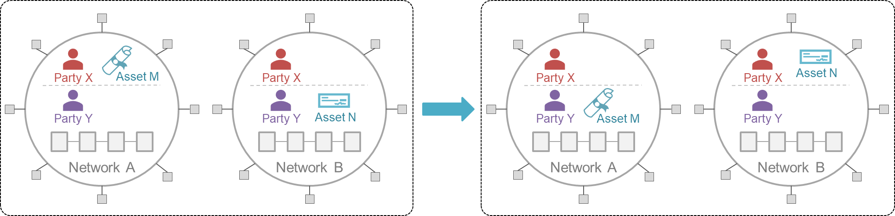

This refers to the change of ownership of an asset in a source network and a corresponding change of ownership in another network. No asset leaves the network it resides in. The well-known terminology for asset exchange is 'Atomic Cross-Chain Swap'.

_For example_: two parties with both Bitcoin and Ethereum accounts may trade Bitcoin for Ethereum based on an exchange rate agreed upon off-chain. We generalize this to permissioned networks, where it may be harder to provide guarantees of finality, and therby, atomicity.

The figure below illustrates a typical asset exchange. Initially, Party X holds Asset M in Network A and Party Y holds Asset N in Network B. Through interoperation, an exchange occurs whereby Y holds M in A and X holds N in B. The changes in these two networks occur atomically. (_Note_: in such a use case, both X and Y must be members of both networks.) See [DvP in Financial Markets](user-stories/financial-markets.md) for an example scenario illustrating asset exchanges.

Both the asset transfer and exchange patterns can be extrapolated to scenarios involving more than 2 parties, 2 assets, and 2 networks. The only fixed criterion is that the actions on all networks happen atomically. For the same reason, the infrastructure and protocols to support both asset transfers and exchanges overlap significantly.