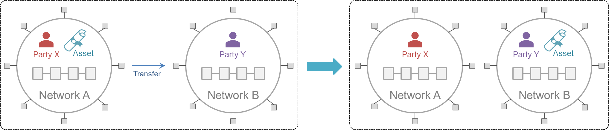

This refers to the movement of an asset from its source ledger to a consuming ledger. Since assets has _singleton_ ownership and can't be _double spent_, the transfer of an asset should result in its burning or locking in the source ledger and its creation on the target ledger.

A typical asset transfer use case is illustrated in the figure below, where Party X initially holds Asset in Network A, and through interoperation transfers Asset to Party Y in Network B. The loss of Asset to X in A must occur simultaneously with the gain of Asset for Y in B;. i.e, these transactions must be _atomic_. ("Holding an asset" refers to a record on a network's shared ledger representing the ownership of that asset by a given entity.)

