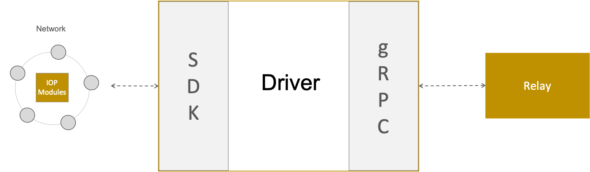

<!--
 Copyright IBM Corp. All Rights Reserved.

 SPDX-License-Identifier: CC-BY-4.0
 -->

> Also known as Driver

The connector is responsible for all communication between the relay and its network. In the previous sections we have thought about the connector as a component of the relay. We have done this because conceptually it makes sense to think about it like that. However, in our reference implementation we have made it a separate process which communicates with the relay via gRPC, as shown below. There are two main reasons for this:

1. There must exist a different connector for each network type (e.g. Fabric, Corda etc.) and therefore having the connector as a separate process makes it easy to "plug" different connectors into the relay.
2. A possible use case of the relay is that a single relay instance may have multiple connectors (e.g. if multiple entities in the network want to run their own connectors). In this case, this plugin style approach of connectors makes it possible to do without having to modify code for each configuration.

