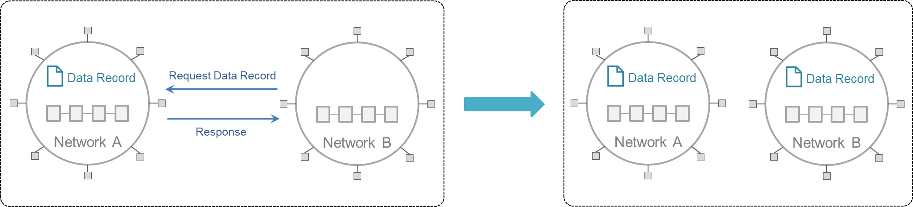

This refers to the transfer of data from its source ledger to a consuming ledger. (In many scenarios, data records in one network ledger may need to be shared with another network ledger in order to drive forward a process on the latter.) The data transferred can be the result of invoking a contract or a database query. There are no technical limits to the number of times a given piece of data can be copied to other ledgers.

The below figure illustrates this pattern, where initially, Data Record is maintained only on Network A's ledger, and through interoperation, a copy resides on Network B's ledger. (_Note_: the data record may be transformed within Network B during the sharing process before a transaction is committed to its ledger.) See [Global Trade](user-stories/global-trade.md) for an example scenario illustrating data sharing.

