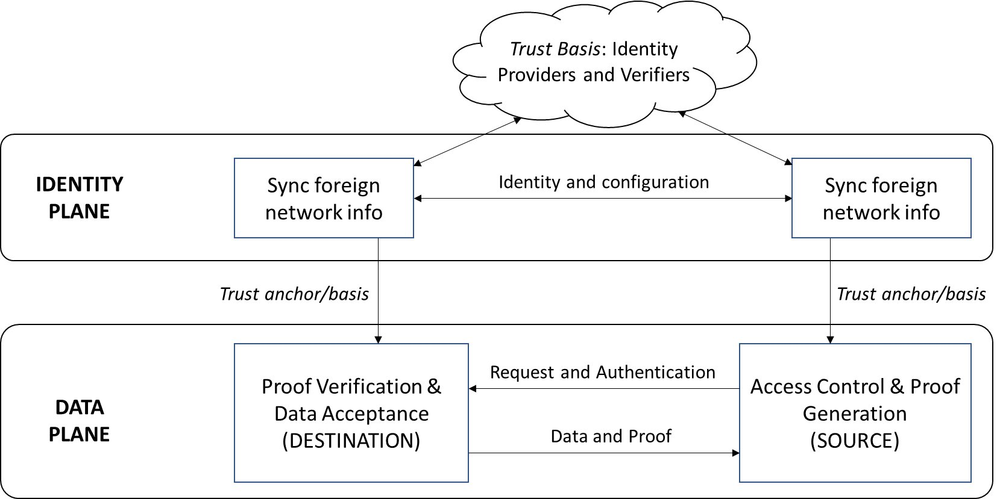

<!--
 Copyright IBM Corp. All Rights Reserved.

 SPDX-License-Identifier: CC-BY-4.0
 -->

Interoperation for asset or data transfers/exchanges relies on a message-passing infrastructure and pan-network data processing modules, as we have seen in earlier pages. But there is yet another crucial basis these data processing modules need to satisfy our design principles of network independence and avoidance of trust parties. This is the ability of a network as a whole and of its individual members to accurately identify and authenticate another network's members.

Further, for the networks to remain independent and interact ad hoc with each other, we cannot impose a central authority that unifies their private identity management systems. So the identity basis of interoperation must be decentralized, leading inevitably to the requirement of exchanging identity information across networks as a pre-requisite for asset and data transfers/exchanges. This is illustrated in the figure below where interoperation protocols are classified in two planes (or tiers), data and identity, with the former depending on the latter.

- In the __data plane__ lies the protocols that effect the actual exchanges of data and assets. The figure above illustrates a typical data-sharing instance, where the network at the left requests a data record from the right. The latter receives the request via the two relays (not explicitly marked in this diagram) and runs an access control check through consensus in its _interop module_ before responding with the data record and supporting proof. The network at the left receives the data and proof, again via the two relays, and verifies the data using the supplied proof. __Note: since a core part of both request and proof are digital signatures of network members, the ability to identify and authenticate network members is necessary to perform these endpoint functions__

Here is where the __identity plane__ enters the picture, as a trust anchor for the data plane. The most general function of this plane is illustrated in the figure, where the networks get each others' identity and configuration (i.e., membership structure and network topology) information. This exchange has as its own trust basis (or dependency) a set of identity providers and verifiers. (_Note_: these identity providers and verifiers may belong to the two networks or they could be external entities.) The outcome of the exchange is a record of the other network's identity and configuration information on one's ledger, which can then be looked up in a data plane protocol instance.