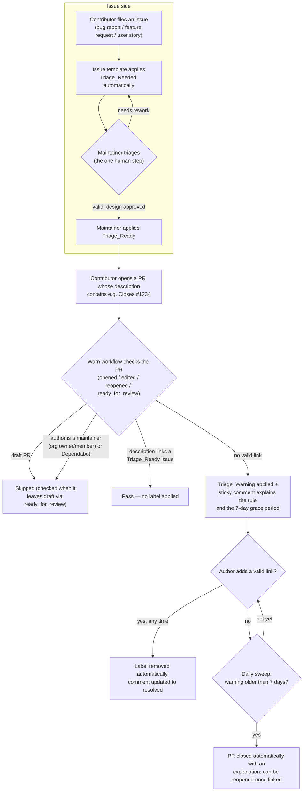
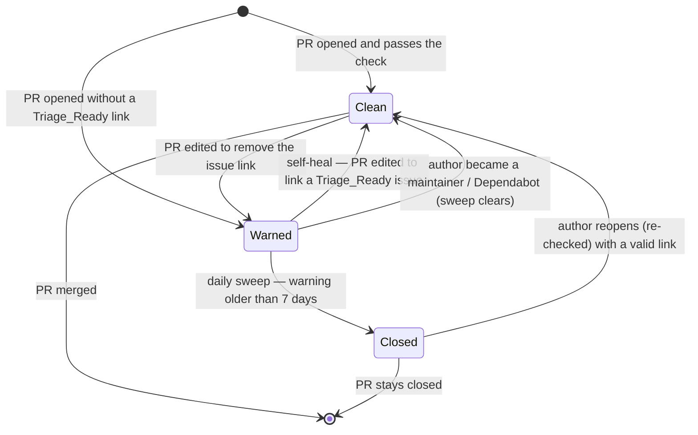

# Triage Gate

The triage gate keeps pull requests connected to triaged work. It enforces
[PULL.md §9 — Linked Issue and Traceability](https://github.com/hyperledger-cacti/cacti/blob/main/PULL.md#9-linked-issue-and-traceability)
and [AI Guidelines §2.6 — Triage Gate for Agents](https://github.com/hyperledger-cacti/cacti/blob/main/AI_GUIDELINES.md#26-triage-gate-for-agents):
**every pull request must reference an issue that carries the `Triage_Ready` label.**

The gate runs automatically. The only human decision in the process is the
triage decision itself — a maintainer marking an issue `Triage_Ready` after
confirming the bug report is valid or the design has been agreed. Everything
after that (warning contributors, tracking the grace period, clearing the
warning once a PR conforms, closing PRs that never conform) is handled by two
GitHub Actions workflows.

## The labels

| Label | Applied to | Applied by | Meaning |
|-------|-----------|------------|---------|
| `Triage_Needed` | Issues | Automatically, by the issue templates | The issue has not been triaged yet. |
| `Triage_Ready` | Issues | A maintainer | The issue is confirmed valid and its design is approved. It is ready to be worked on. |
| `Triage_Warning` | Pull requests | Automatically, by the **warn** workflow | The PR does not link a `Triage_Ready` issue and will be closed automatically if not fixed within 7 days. |

## End-to-end flow



## The `Triage_Warning` lifecycle



### When the warning is applied

The [warn workflow](https://github.com/hyperledger-cacti/cacti/blob/main/.github/workflows/triage-gate-warn.yaml)
runs on every `opened`, `edited`, `reopened`, and `ready_for_review` event of a
pull request. It applies `Triage_Warning` and posts a single sticky comment on
the PR when **all** of the following hold:

* the PR is not a draft,
* the author is **not** exempt (see [Exemptions](#exemptions)),
* the PR description does not link an issue carrying `Triage_Ready`
  (see [how linking works](#how-the-gate-links-a-pr-to-an-issue)).

The comment explains the rule, shows an example (`Closes #1234`), and warns
that the PR will be closed automatically after **7 days**. Editing the PR
description is enough — no maintainer action is needed to clear the warning.

### Exemptions

The gate deliberately stays out of the way of trusted accounts and work that
cannot carry an issue link:

| Exempt | Why |
|--------|-----|
| **Maintainers** — hyperledger-cacti org **owners and members** | Trusted contributors; determined automatically from the PR's `author_association` (`OWNER`/`MEMBER`) |
| **Dependabot** (`dependabot[bot]`) | Dependency-update PRs have no issue to link |
| **Draft PRs** | Not checked; the gate runs once the PR is published (`ready_for_review`) |

Everyone else — including outside collaborators and code owners who are not
org members — must link a `Triage_Ready` issue. The same exemptions apply in
the daily sweep: if a warned PR's author has since become an org member (or
Dependabot), the sweep clears the warning instead of closing the PR.

### If the warning is removed (self-heal)

The warning clears itself, without maintainer involvement, in two ways:

* **Immediately** — the next time the warn workflow runs on that PR
  (`edited`, `reopened`, `ready_for_review`), the label is removed and the
  sticky comment is replaced with a ✅ "Triage gate cleared" message.
* **Daily** — the sweep workflow re-checks all warned PRs and clears the
  label if the PR now conforms, or if the author has since become a
  maintainer (org member) or Dependabot.

### If the warning is not removed

The [sweep workflow](https://github.com/hyperledger-cacti/cacti/blob/main/.github/workflows/triage-gate-sweep.yaml)
runs daily at 00:00 UTC. For each open PR carrying `Triage_Warning` whose
sticky comment is older than 7 days (the comment's creation date is used as
the age source), it posts a closing comment linking [PULL.md §9](https://github.com/hyperledger-cacti/cacti/blob/main/PULL.md#9-linked-issue-and-traceability)
and closes the PR.

The closure is deliberately low-drama: the author can simply add the issue
link, reopen the PR, and the gate re-checks it (`reopened` is a warn trigger).
If the link is valid at that point, the PR proceeds normally.

Edge case: if the sticky comment is missing (for example it was deleted), the
sweep skips the PR rather than closing it, because the age of the warning
cannot be established.

## How the gate links a PR to an issue

The reference must be in the **pull request description** — that is the only
place the gate looks. **Commit messages are not scanned by the automation.**
[PULL.md §9](https://github.com/hyperledger-cacti/cacti/blob/main/PULL.md#9-linked-issue-and-traceability)
additionally asks for the keyword in the commit body ("ideally the commit
body") so that the link survives into the squash-merge commit after the PR
merges, but that is traceability hygiene on the author's side — the gate
itself validates the PR description only.

Concretely, both the warn and sweep workflows:

1. **Keyword scan** — the PR description (capped at the first 16 KiB before
   scanning, purely as a safety measure) is searched case-insensitively for
   GitHub closing keywords followed by an issue number:

   | Keywords | Effect on merge |
   |----------|-----------------|
   | `Closes` / `Closed` / `Close #N` | GitHub closes the issue when the PR merges |
   | `Fixes` / `Fixed` / `Fix #N` | GitHub closes the issue when the PR merges |
   | `Resolves` / `Resolved` / `Resolve #N` | GitHub closes the issue when the PR merges |
   | `Addresses` / `Addressed` / `Address #N` | Issue stays open (partial progress) |
   | `Refs` / `Ref #N` | Issue stays open (reference only) |

2. **Validation** — for every referenced number, the workflow fetches the
   issue through the GitHub API and checks that:
   * it is an actual **issue** (references that turn out to be other PRs are ignored),
   * it carries the **`Triage_Ready`** label (an issue still on `Triage_Needed` does not count).

   Multiple references are allowed; the first conforming one satisfies the gate.

3. **Sticky comment integrity** — the gate only edits comments that carry the
   `<!-- triage-bot -->` marker **and** were authored by `github-actions[bot]`,
   so a contributor cannot spoof or hijack the bot's comment.

## Automation vs. maintainer touchpoints

| Step | Who does it | When |
|------|-------------|------|
| `Triage_Needed` on new issues | Automatic (issue templates) | Issue creation |
| `Triage_Ready` on issues | **Maintainer** — the only recurring human step | During triage |
| `Triage_Warning` + comment on PRs | Automatic (warn workflow) | PR opened / edited / reopened / ready for review |
| Clearing the warning on fixed PRs | Automatic (warn + sweep workflows) | Within minutes of the fix, or at the daily sweep |
| Closing non-conforming PRs | Automatic (sweep workflow) | Daily, after the 7-day grace period |
| Reopening and re-checking | Author + automatic (warn workflow) | On PR reopen |

**Known gap:** issues filed without one of the repository issue templates
(blank issues) do not get `Triage_Needed` applied automatically, because the
labels come from the templates. Maintainers apply labels manually in that case.

## Operating the gate (maintainers)

The sweep supports a manual dry run, which logs what it would do without
modifying any PR:

```bash
gh workflow run triage-gate-sweep.yaml -f dry_run=true
```

Both workflows declare their constants (label names, sticky-comment marker,
grace period, pagination caps) as environment variables at the top of the
file — keep `triage-gate-warn.yaml` and `triage-gate-sweep.yaml` in sync when
changing them.
