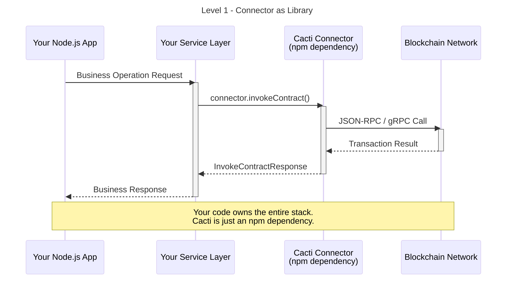
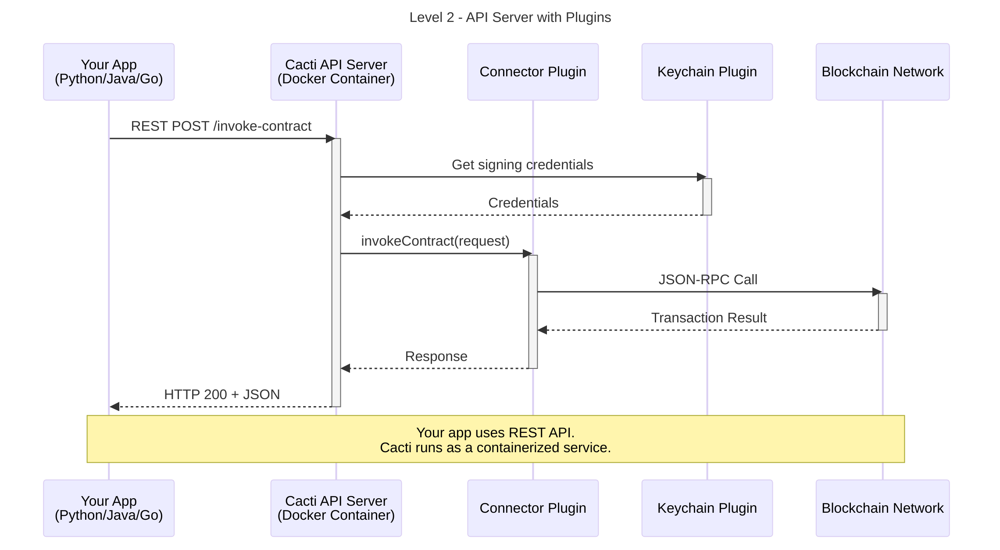
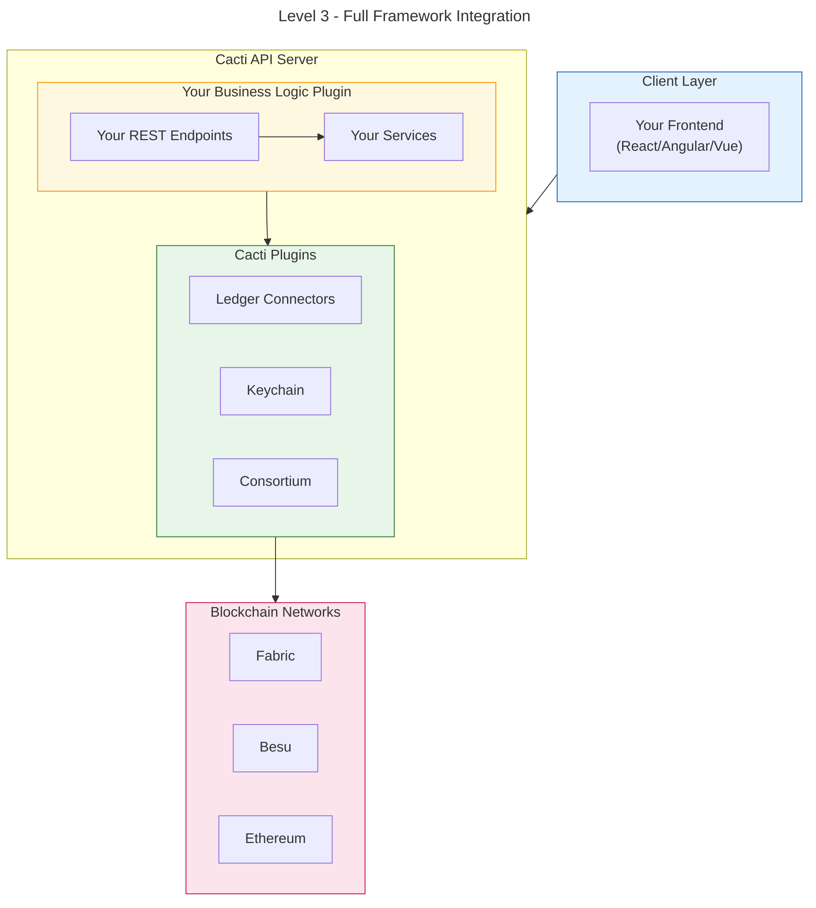

# Getting Started with Hyperledger Cacti

Welcome to Hyperledger Cacti! This guide will help you understand the framework and choose the right level of integration for your project.

## Table of Contents

- [Understanding Cacti's Architecture](#understanding-cactis-architecture)
- [What is Cacti vs What Isn't](#what-is-cacti-vs-what-isnt)
- [Choosing Your Level of Immersion](#choosing-your-level-of-immersion)
- [Level 1: Connector as a Library](#level-1-connector-as-a-library-lowest-immersion)
- [Level 2: API Server with Plugins](#level-2-api-server-with-plugins-medium-immersion)
- [Level 3: Full Framework Integration](#level-3-full-framework-integration-highest-immersion)
- [Deciding Which Level is Right for You](#deciding-which-level-is-right-for-you)

---

## Understanding Cacti's Architecture

Cacti is a **modular, pluggable framework** for blockchain interoperability. Pick and choose the components you need for your use-case.

### Technology Stack Diagram


---

## What is Cacti vs What Isn't

Understanding what Cacti provides (and what it doesn't) is crucial for successful integration.

### ✅ What IS Cacti

| Component | Description | Package |
|-----------|-------------|---------|
| **Ledger Connectors** | Plugins that abstract interaction with specific blockchains | `@hyperledger/cactus-plugin-ledger-connector-*` |
| **Keychain Plugins** | Secure credential storage (Vault, AWS SM, Azure KV, Memory) | `@hyperledger/cactus-plugin-keychain-*` |
| **API Server** | Express-based server that hosts plugins and exposes REST/gRPC APIs | `@hyperledger/cactus-cmd-api-server` |
| **Core API** | Common interfaces, types, and abstractions | `@hyperledger/cactus-core-api` |
| **Common Utilities** | Logging, HTTP, and shared utilities | `@hyperledger/cactus-common` |
| **Plugin Registry** | Mechanism to register and discover plugins | `@hyperledger/cactus-core` |
| **Cross-Chain Protocols** | SATP (Hermes), Weaver, COPM for interoperability | `@hyperledger/cactus-plugin-satp-hermes`, etc. |
| **Consortium Management** | Multi-organization coordination | `@hyperledger/cactus-plugin-consortium-*` |
| **Test Tooling** | Docker-based test ledgers and utilities | `@hyperledger/cactus-test-tooling` |

### ❌ What is NOT Cacti (in the examples)

| Component | Description | What You'll See in Examples |
|-----------|-------------|----------------------------|
| **Frontend Application** | The web UI | React/Angular apps in `examples/*-frontend` |
| **Your Business Logic** | Domain-specific rules and workflows | Custom code in `examples/*-business-logic-plugin` |
| **Your REST API endpoints** | Application-specific endpoints | Routes defined in your business logic |
| **Database** | Persistent storage for your app | Your choice (PostgreSQL, MongoDB, etc.) |
| **Authentication Provider** | Your identity management | Keycloak, Auth0, custom JWT, etc. |

---

## Choosing Your Level of Immersion

| Level | Use Case | Complexity | What You Get |
|-------|----------|------------|--------------|
| **Level 1** | You have an existing Node.js app and just need blockchain connectivity | Low | Connector as npm dependency |
| **Level 2** | You have a non-Node.js app or want containerized blockchain access | Medium | API server with REST/gRPC endpoints |
| **Level 3** | You want a complete blockchain-integrated application framework | High | Full stack with business logic plugins |

---

## Level 1: Connector as a Library (Lowest Immersion)

**Best for:** Existing Node.js/TypeScript projects that need to interact with a blockchain.

### What You Get

- Direct programmatic access to blockchain operations
- Type-safe API with TypeScript definitions
- No additional infrastructure required

### What You Provide

- Your existing application architecture
- Your own API endpoints (if needed)
- Your own authentication and authorization

### Architecture



### Tutorial: Using the Ethereum Connector in Your Existing Project

#### Step 1: Install Dependencies

```bash
# In your existing Node.js project
npm install @hyperledger/cactus-plugin-ledger-connector-ethereum
npm install @hyperledger/cactus-core
npm install @hyperledger/cactus-common
```

#### Step 2: Create and Configure the Connector

```typescript
// src/blockchain/ethereum-client.ts
import {
  PluginLedgerConnectorEthereum,
  Web3SigningCredentialType,
  DefaultApi as EthereumApi,
} from "@hyperledger/cactus-plugin-ledger-connector-ethereum";
import { PluginRegistry } from "@hyperledger/cactus-core";
import { v4 as uuidv4 } from "uuid";

export class EthereumClient {
  private connector: PluginLedgerConnectorEthereum;

  constructor(rpcApiHttpHost: string) {
    // Create the connector - this is the only Cacti component you need!
    this.connector = new PluginLedgerConnectorEthereum({
      instanceId: uuidv4(),
      rpcApiHttpHost: rpcApiHttpHost,
      pluginRegistry: new PluginRegistry(),
      logLevel: "INFO",
    });
  }

  /**
   * Deploy a smart contract to the Ethereum network
   */
  async deployContract(
    bytecode: string,
    abi: unknown[],
    privateKey: string,
    ethAccount: string,
  ): Promise<string> {
    const result = await this.connector.deployContract({
      bytecode,
      contractAbi: abi,
      web3SigningCredential: {
        type: Web3SigningCredentialType.PrivateKeyHex,
        ethAccount,
        secret: privateKey,
      },
      gas: 1000000,
    });
    return result.transactionReceipt?.contractAddress ?? "";
  }

  /**
   * Invoke a contract method (state-changing transaction)
   */
  async invokeContract(
    contractAddress: string,
    contractAbi: unknown[],
    methodName: string,
    params: unknown[],
    privateKey: string,
    ethAccount: string,
  ): Promise<unknown> {
    return this.connector.invokeContract({
      contractAddress,
      contractAbi,
      invocationType: "SEND",
      methodName,
      params,
      web3SigningCredential: {
        type: Web3SigningCredentialType.PrivateKeyHex,
        ethAccount,
        secret: privateKey,
      },
      gas: 1000000,
    });
  }

  /**
   * Query a contract method (read-only call)
   */
  async queryContract(
    contractAddress: string,
    contractAbi: unknown[],
    methodName: string,
    params: unknown[],
  ): Promise<unknown> {
    return this.connector.invokeContract({
      contractAddress,
      contractAbi,
      invocationType: "CALL",
      methodName,
      params,
      web3SigningCredential: {
        type: Web3SigningCredentialType.None,
      },
    });
  }
}
```

#### Step 3: Use in Your Application

```typescript
// src/services/asset-service.ts
import { EthereumClient } from "../blockchain/ethereum-client";
import AssetContract from "../contracts/Asset.json";

export class AssetService {
  private ethereumClient: EthereumClient;
  private contractAddress: string;

  constructor() {
    this.ethereumClient = new EthereumClient(process.env.ETHEREUM_RPC_URL!);
    this.contractAddress = process.env.ASSET_CONTRACT_ADDRESS!;
  }

  async createAsset(
    assetId: string,
    owner: string,
    privateKey: string,
    ethAccount: string,
  ): Promise<void> {
    await this.ethereumClient.invokeContract(
      this.contractAddress,
      AssetContract.abi,
      "createAsset",
      [assetId, owner],
      privateKey,
      ethAccount,
    );
  }

  async getAssetOwner(assetId: string): Promise<string> {
    const result = await this.ethereumClient.queryContract(
      this.contractAddress,
      AssetContract.abi,
      "getOwner",
      [assetId],
    );
    return result as string;
  }
}
```

#### Step 4: Integrate with Your Existing API

```typescript
// src/routes/assets.ts (e.g., Express.js)
import express from "express";
import { AssetService } from "../services/asset-service";

const router = express.Router();
const assetService = new AssetService();

// Your existing API patterns - Cacti is just a library you use
router.post("/assets", async (req, res) => {
  try {
    const { assetId, owner, privateKey, ethAccount } = req.body;
    await assetService.createAsset(assetId, owner, privateKey, ethAccount);
    res.status(201).json({ success: true, assetId });
  } catch (error: unknown) {
    const message = error instanceof Error ? error.message : "Unknown error";
    res.status(500).json({ error: message });
  }
});

router.get("/assets/:assetId/owner", async (req, res) => {
  try {
    const owner = await assetService.getAssetOwner(req.params.assetId);
    res.json({ assetId: req.params.assetId, owner });
  } catch (error: unknown) {
    const message = error instanceof Error ? error.message : "Unknown error";
    res.status(500).json({ error: message });
  }
});

export default router;
```

### Available Connectors for Level 1

| Connector | Package | Ledger |
|-----------|---------|--------|
| Ethereum | `@hyperledger/cactus-plugin-ledger-connector-ethereum` | Ethereum, Geth, etc. |
| Besu | `@hyperledger/cactus-plugin-ledger-connector-besu` | Hyperledger Besu |
| Fabric | `@hyperledger/cactus-plugin-ledger-connector-fabric` | Hyperledger Fabric |
| Corda | `@hyperledger/cactus-plugin-ledger-connector-corda` | R3 Corda |
| Polkadot | `@hyperledger/cactus-plugin-ledger-connector-polkadot` | Polkadot/Substrate |
| Iroha | `@hyperledger/cactus-plugin-ledger-connector-iroha2` | Hyperledger Iroha 2 |
| Stellar | `@hyperledger/cacti-plugin-ledger-connector-stellar` | Stellar |

---

## Level 2: API Server with Plugins (Medium Immersion)

**Best for:** 

- Non-Node.js applications (Python, Java, Go, etc.) that need blockchain access via REST/gRPC
- Microservices architectures where you want containerized blockchain connectivity
- Teams that want built-in authentication, authorization, and observability

### What You Get

- REST and gRPC APIs for all plugin operations
- Built-in authentication (JWT, OAuth2, etc.)
- Containerized deployment ready
- OpenAPI/Swagger documentation
- Prometheus metrics
- Multiple ledger support in one server

### What You Provide

- Your application (any language/framework)
- Configuration for the API server
- Deployment infrastructure (Kubernetes, Docker, etc.)

### Architecture



### Tutorial: Running Cacti API Server with Ethereum Connector

#### Step 1: Run the API Server Container

```bash
docker run \
  --rm \
  --publish 4000:4000 \
  --env AUTHORIZATION_PROTOCOL='NONE' \
  --env AUTHORIZATION_CONFIG_JSON='{}' \
  --env GRPC_TLS_ENABLED=false \
  --env API_TLS_ENABLED=false \
  --env API_HOST=0.0.0.0 \
  --env API_PORT=4000 \
  --env LOG_LEVEL=INFO \
  ghcr.io/hyperledger/cactus-cmd-api-server:latest \
    node index.js \
      --plugins='[{"packageName":"@hyperledger/cactus-plugin-ledger-connector-ethereum","type":"org.hyperledger.cactus.plugin_import_type.LOCAL","action":"org.hyperledger.cactus.plugin_import_action.INSTALL","options":{"instanceId":"eth-connector","rpcApiHttpHost":"http://host.docker.internal:8545"}}]'
```

#### Step 2: Use the REST API from Any Language

**Python Example:**

```python
# python-client/ethereum_client.py
import requests
from typing import Any

class CactiEthereumClient:
    """Client for interacting with Cacti API Server's Ethereum connector."""
    
    def __init__(self, base_url: str, jwt_token: str | None = None):
        self.base_url = base_url
        self.headers = {"Content-Type": "application/json"}
        if jwt_token:
            self.headers["Authorization"] = f"Bearer {jwt_token}"

    def deploy_contract(
        self,
        bytecode: str,
        abi: list,
        private_key: str,
        eth_account: str,
    ) -> dict[str, Any]:
        """Deploy a smart contract via Cacti API."""
        response = requests.post(
            f"{self.base_url}/api/v1/plugins/@hyperledger/cactus-plugin-ledger-connector-ethereum/deploy-contract-solidity-bytecode",
            headers=self.headers,
            json={
                "bytecode": bytecode,
                "contractAbi": abi,
                "web3SigningCredential": {
                    "type": "PRIVATE_KEY_HEX",
                    "ethAccount": eth_account,
                    "secret": private_key,
                },
                "gas": 1000000,
            },
            timeout=30,
        )
        response.raise_for_status()
        return response.json()

    def invoke_contract(
        self,
        contract_address: str,
        abi: list,
        method: str,
        params: list,
        private_key: str,
        eth_account: str,
    ) -> dict[str, Any]:
        """Invoke a smart contract method (state-changing)."""
        response = requests.post(
            f"{self.base_url}/api/v1/plugins/@hyperledger/cactus-plugin-ledger-connector-ethereum/invoke-contract",
            headers=self.headers,
            json={
                "contractAddress": contract_address,
                "contractAbi": abi,
                "invocationType": "SEND",
                "methodName": method,
                "params": params,
                "web3SigningCredential": {
                    "type": "PRIVATE_KEY_HEX",
                    "ethAccount": eth_account,
                    "secret": private_key,
                },
                "gas": 1000000,
            },
            timeout=30,
        )
        response.raise_for_status()
        return response.json()

    def query_contract(
        self,
        contract_address: str,
        abi: list,
        method: str,
        params: list,
    ) -> dict[str, Any]:
        """Query a smart contract (read-only)."""
        response = requests.post(
            f"{self.base_url}/api/v1/plugins/@hyperledger/cactus-plugin-ledger-connector-ethereum/invoke-contract",
            headers=self.headers,
            json={
                "contractAddress": contract_address,
                "contractAbi": abi,
                "invocationType": "CALL",
                "methodName": method,
                "params": params,
                "web3SigningCredential": {"type": "NONE"},
            },
            timeout=30,
        )
        response.raise_for_status()
        return response.json()


# Usage example
if __name__ == "__main__":
    client = CactiEthereumClient("http://localhost:4000")
    
    result = client.query_contract(
        contract_address="0x...",
        abi=[{"name": "balanceOf", "type": "function", "inputs": [...], "outputs": [...]}],
        method="balanceOf",
        params=["0xYourAddress"],
    )
    print(f"Balance: {result}")
```

**Go Example:**

```go
// go-client/main.go
package main

import (
    "bytes"
    "encoding/json"
    "fmt"
    "net/http"
    "time"
)

// CactiClient provides access to Cacti API Server
type CactiClient struct {
    BaseURL    string
    HTTPClient *http.Client
}

// NewCactiClient creates a new Cacti client
func NewCactiClient(baseURL string) *CactiClient {
    return &CactiClient{
        BaseURL:    baseURL,
        HTTPClient: &http.Client{Timeout: 30 * time.Second},
    }
}

// InvokeContractRequest represents the request body
type InvokeContractRequest struct {
    ContractAddress       string                 `json:"contractAddress"`
    ContractAbi           []interface{}          `json:"contractAbi"`
    InvocationType        string                 `json:"invocationType"`
    MethodName            string                 `json:"methodName"`
    Params                []interface{}          `json:"params"`
    Web3SigningCredential map[string]interface{} `json:"web3SigningCredential"`
    Gas                   int                    `json:"gas,omitempty"`
}

// QueryContract performs a read-only contract call
func (c *CactiClient) QueryContract(
    contractAddress string,
    abi []interface{},
    methodName string,
    params []interface{},
) (map[string]interface{}, error) {
    request := InvokeContractRequest{
        ContractAddress:       contractAddress,
        ContractAbi:           abi,
        InvocationType:        "CALL",
        MethodName:            methodName,
        Params:                params,
        Web3SigningCredential: map[string]interface{}{"type": "NONE"},
    }

    body, err := json.Marshal(request)
    if err != nil {
        return nil, err
    }

    resp, err := c.HTTPClient.Post(
        c.BaseURL+"/api/v1/plugins/@hyperledger/cactus-plugin-ledger-connector-ethereum/invoke-contract",
        "application/json",
        bytes.NewBuffer(body),
    )
    if err != nil {
        return nil, err
    }
    defer resp.Body.Close()

    var result map[string]interface{}
    if err := json.NewDecoder(resp.Body).Decode(&result); err != nil {
        return nil, err
    }
    return result, nil
}

func main() {
    client := NewCactiClient("http://localhost:4000")
    result, err := client.QueryContract(
        "0x...",
        []interface{}{}, // ABI
        "getBalance",
        []interface{}{},
    )
    if err != nil {
        fmt.Printf("Error: %v\n", err)
        return
    }
    fmt.Printf("Result: %v\n", result)
}
```

### API Documentation

Once the server is running, access the OpenAPI documentation at:

- Swagger UI: `http://localhost:4000/api/v1/api-docs`
- OpenAPI JSON: `http://localhost:4000/api/v1/openapi.json`

---

## Level 3: Full Framework Integration (Highest Immersion)

**Best for:**

- New projects starting from scratch that want a complete blockchain-integrated stack
- Applications that need sophisticated cross-chain workflows
- Teams that want to leverage Cacti's full feature set including business logic plugins

### What You Get

- Everything from Level 2, plus:
- Business Logic Plugin framework for custom application logic
- Consortium management for multi-organization scenarios
- Cross-chain protocols (SATP, Weaver) for interoperability
- Frontend integration patterns
- Complete example applications as templates

### What You Provide

- Your business logic as a Cacti plugin
- Your frontend application
- Domain-specific smart contracts

### Architecture



### Tutorial: Building a Complete Application

This tutorial walks through creating an application similar to the Supply Chain example, but with clear separation of what's Cacti and what's your code.

#### Step 1: Project Structure

```
my-cacti-app/
├── packages/
│   ├── my-app-business-logic-plugin/     # YOUR CODE - Business logic
│   │   ├── src/main/typescript/
│   │   │   ├── plugin.ts                 # Cacti plugin wrapper
│   │   │   ├── web-services/             # YOUR REST endpoints
│   │   │   └── services/                 # YOUR business logic
│   │   └── package.json
│   ├── my-app-backend/                   # YOUR CODE - App orchestration
│   │   └── src/main/typescript/
│   │       └── app.ts                    # Wires everything together
│   └── my-app-frontend/                  # YOUR CODE - Web UI
├── contracts/                            # YOUR CODE - Smart contracts
└── package.json
```

#### Step 2: Create Your Business Logic Plugin

```typescript
// packages/my-app-business-logic-plugin/src/main/typescript/plugin.ts
import {
  IPluginWebService,
  IWebServiceEndpoint,
  ICactusPlugin,
  ICactusPluginOptions,
} from "@hyperledger/cactus-core-api";
import { PluginRegistry } from "@hyperledger/cactus-core";
import type { Express } from "express";

// Import YOUR services
import { AssetService } from "./services/asset-service";
import { CreateAssetEndpoint } from "./web-services/create-asset-endpoint";
import { GetAssetEndpoint } from "./web-services/get-asset-endpoint";

export interface IMyAppPluginOptions extends ICactusPluginOptions {
  pluginRegistry: PluginRegistry;
  logLevel?: string;
}

/**
 * YOUR plugin that wraps your business logic.
 * Implements Cacti's plugin interface so it can be loaded into the API server.
 */
export class MyAppPlugin implements ICactusPlugin, IPluginWebService {
  private readonly instanceId: string;
  private readonly pluginRegistry: PluginRegistry;
  private readonly assetService: AssetService;
  private endpoints: IWebServiceEndpoint[] | undefined;

  constructor(options: IMyAppPluginOptions) {
    this.instanceId = options.instanceId;
    this.pluginRegistry = options.pluginRegistry;
    
    // YOUR business logic service
    this.assetService = new AssetService(this.pluginRegistry);
  }

  public getInstanceId(): string {
    return this.instanceId;
  }

  public getPackageName(): string {
    return "@my-org/my-app-business-logic-plugin";
  }

  public async onPluginInit(): Promise<unknown> {
    return;
  }

  public async shutdown(): Promise<void> {
    return;
  }

  /**
   * Register YOUR API endpoints with the Cacti API server
   */
  public async getOrCreateWebServices(): Promise<IWebServiceEndpoint[]> {
    if (this.endpoints) {
      return this.endpoints;
    }

    // YOUR endpoints - these are your application's REST API
    this.endpoints = [
      new CreateAssetEndpoint({ assetService: this.assetService }),
      new GetAssetEndpoint({ assetService: this.assetService }),
    ];

    return this.endpoints;
  }

  public async registerWebServices(
    app: Express,
  ): Promise<IWebServiceEndpoint[]> {
    const endpoints = await this.getOrCreateWebServices();
    for (const endpoint of endpoints) {
      endpoint.registerExpress(app);
    }
    return endpoints;
  }
}
```

#### Step 3: Create Your Business Logic Service

```typescript
// packages/my-app-business-logic-plugin/src/main/typescript/services/asset-service.ts
import { PluginRegistry } from "@hyperledger/cactus-core";
import {
  PluginLedgerConnectorEthereum,
  Web3SigningCredentialType,
} from "@hyperledger/cactus-plugin-ledger-connector-ethereum";
import AssetContract from "../../../../contracts/Asset.json";

/**
 * YOUR service - contains your application's business logic.
 * Uses Cacti connectors under the hood for blockchain access.
 */
export class AssetService {
  private readonly pluginRegistry: PluginRegistry;

  constructor(pluginRegistry: PluginRegistry) {
    this.pluginRegistry = pluginRegistry;
  }

  private getEthereumConnector(): PluginLedgerConnectorEthereum {
    // Get the Cacti connector from the plugin registry
    const plugins = this.pluginRegistry.getPlugins();
    const connector = plugins.find(
      (p) => p.getPackageName() === "@hyperledger/cactus-plugin-ledger-connector-ethereum"
    );
    if (!connector) {
      throw new Error("Ethereum connector not found in registry");
    }
    return connector as PluginLedgerConnectorEthereum;
  }

  /**
   * YOUR business logic - creates an asset on the blockchain
   */
  async createAsset(
    assetId: string,
    owner: string,
    value: number,
    ethAccount: string,
    privateKey: string,
  ): Promise<{ assetId: string; transactionHash: string }> {
    const connector = this.getEthereumConnector();
    
    // YOUR business rules
    if (value <= 0) {
      throw new Error("Asset value must be positive");
    }

    // Use Cacti connector to interact with blockchain
    const result = await connector.invokeContract({
      contractAddress: process.env.ASSET_CONTRACT_ADDRESS!,
      contractAbi: AssetContract.abi,
      invocationType: "SEND",
      methodName: "createAsset",
      params: [assetId, owner, value],
      web3SigningCredential: {
        type: Web3SigningCredentialType.PrivateKeyHex,
        ethAccount,
        secret: privateKey,
      },
      gas: 1000000,
    });

    return {
      assetId,
      transactionHash: result.transactionReceipt?.transactionHash ?? "",
    };
  }

  async getAsset(assetId: string): Promise<{ assetId: string; owner: string; value: number }> {
    const connector = this.getEthereumConnector();
    
    const result = await connector.invokeContract({
      contractAddress: process.env.ASSET_CONTRACT_ADDRESS!,
      contractAbi: AssetContract.abi,
      invocationType: "CALL",
      methodName: "getAsset",
      params: [assetId],
      web3SigningCredential: {
        type: Web3SigningCredentialType.None,
      },
    });

    return {
      assetId,
      ...(result.callOutput as { owner: string; value: number }),
    };
  }
}
```

#### Step 4: Wire Everything Together

```typescript
// packages/my-app-backend/src/main/typescript/app.ts
import { v4 as uuidv4 } from "uuid";
import {
  ApiServer,
  ConfigService,
  AuthorizationProtocol,
} from "@hyperledger/cactus-cmd-api-server";
import { PluginRegistry } from "@hyperledger/cactus-core";
import { PluginLedgerConnectorEthereum } from "@hyperledger/cactus-plugin-ledger-connector-ethereum";
import { PluginKeychainMemory } from "@hyperledger/cactus-plugin-keychain-memory";

// YOUR plugin
import { MyAppPlugin } from "@my-org/my-app-business-logic-plugin";

async function main(): Promise<void> {
  // Create the plugin registry (Cacti component)
  const pluginRegistry = new PluginRegistry();

  // Add Cacti keychain plugin
  const keychain = new PluginKeychainMemory({
    instanceId: uuidv4(),
    keychainId: "my-keychain",
    logLevel: "INFO",
  });
  pluginRegistry.add(keychain);

  // Add Cacti Ethereum connector
  const ethereumConnector = new PluginLedgerConnectorEthereum({
    instanceId: "ethereum-connector",
    rpcApiHttpHost: process.env.ETHEREUM_RPC_URL!,
    pluginRegistry,
    logLevel: "INFO",
  });
  pluginRegistry.add(ethereumConnector);

  // Add YOUR plugin
  const myAppPlugin = new MyAppPlugin({
    instanceId: uuidv4(),
    pluginRegistry,
    logLevel: "INFO",
  });
  pluginRegistry.add(myAppPlugin);

  // Create and start the API server (Cacti component)
  const configService = new ConfigService();
  const config = await configService.newExampleConfig();
  config.authorizationProtocol = AuthorizationProtocol.NONE;
  config.configFile = "";
  config.apiCorsDomainCsv = "*";
  config.apiPort = 4000;
  config.cockpitPort = 3100;
  config.logLevel = "INFO";
  config.apiTlsEnabled = false;

  const apiServer = new ApiServer({
    config,
    pluginRegistry,
  });

  await apiServer.start();
  console.log("My App is running!");
  console.log("API: http://localhost:4000");
  console.log("Your endpoints: http://localhost:4000/api/v1/my-app/assets");
}

main().catch(console.error);
```

### What's Cacti vs What's Yours (Level 3 Summary)

| Category | Your Code | Cacti |
|----------|-----------|-------|
| **Frontend** | `my-app-frontend/` - Your web UI | - |
| **Business Logic** | `my-app-business-logic-plugin/services/` | Plugin interface (`IPluginWebService`) |
| **REST Endpoints** | `my-app-business-logic-plugin/web-services/` | Endpoint registration helpers |
| **Smart Contracts** | `contracts/` - Your Solidity/chaincode | - |
| **Blockchain Access** | - | Ledger Connectors |
| **Credential Storage** | - | Keychain Plugins |
| **API Hosting** | - | ApiServer |
| **Plugin Discovery** | - | PluginRegistry |

---

## Deciding Which Level is Right for You

| Question | Level 1 | Level 2 | Level 3 |
|----------|---------|---------|---------|
| Do you have an existing Node.js project? | ✅ Best fit | ✅ Works | ✅ Works |
| Is your project in Python/Java/Go/etc.? | ❌ | ✅ Best fit | ✅ Works |
| Do you need containerized deployment? | ❌ | ✅ Best fit | ✅ |
| Do you need built-in auth/authz? | ❌ | ✅ | ✅ |
| Are you building a new project from scratch? | ✅ Works | ✅ Works | ✅ Best fit |
| Do you need cross-chain transactions (SATP)? | ❌ | ✅ | ✅ Best fit |
| Do you need multi-organization consortium? | ❌ | ✅ | ✅ Best fit |
| Want minimal Cacti footprint? | ✅ Best fit | ❌ | ❌ |

---

## Next Steps

- **Level 1**: Check out the [connector documentation](../cactus/packages.md) for your target ledger
- **Level 2**: See the [API Server configuration guide](../cactus/packages/cactus-cmd-api-server.md)
- **Level 3**: Study the [Supply Chain Example](../cactus/examples/supply-chain-app.md) as a complete reference

## Getting Help

- [Discord](https://discord.com/channels/905194001349627914/908379338716631050) - Community support
- [GitHub Issues](https://github.com/hyperledger-cacti/cacti/issues) - Bug reports and feature requests
- [Documentation](https://hyperledger-cacti.github.io/cacti/) - Full documentation
---\n\n<small>Generated with GitHub Copilot as directed by rafaelapb</small>
