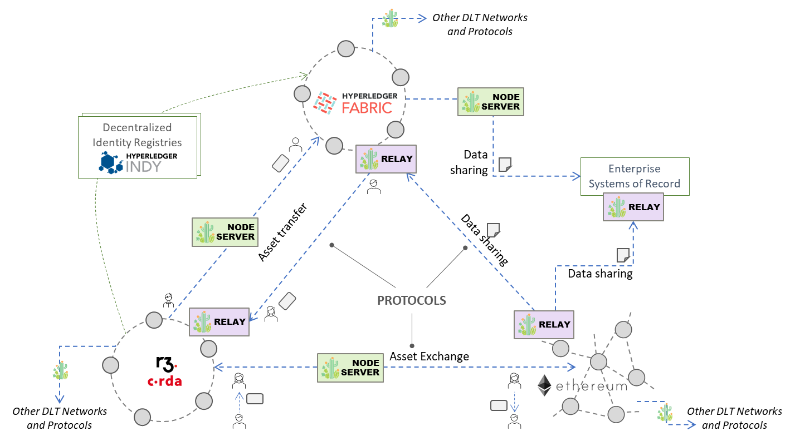
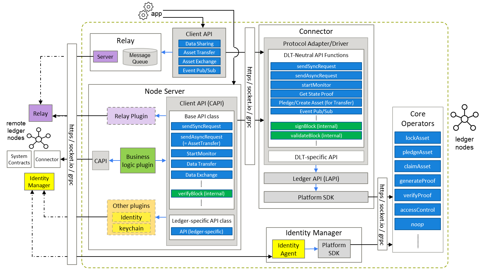
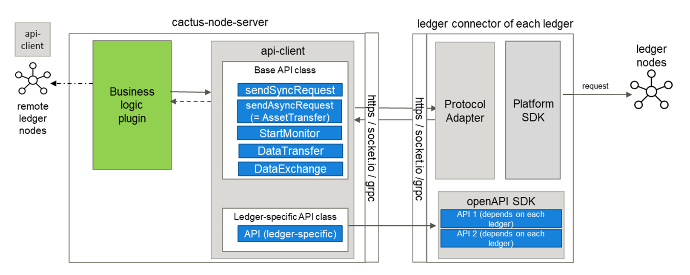
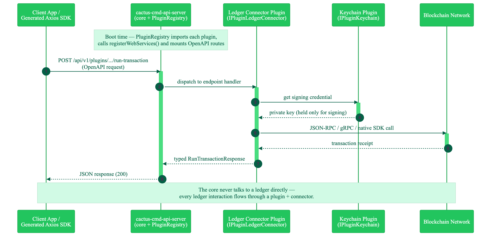
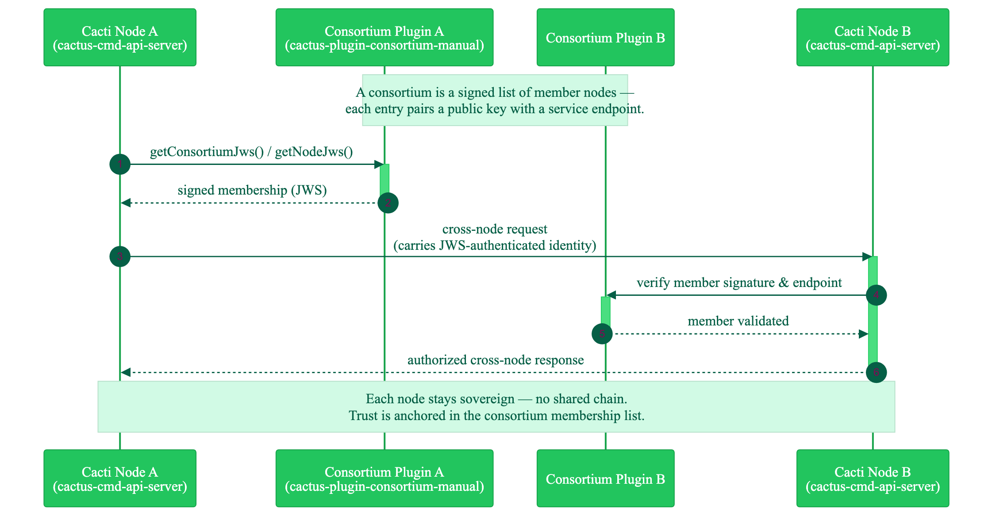
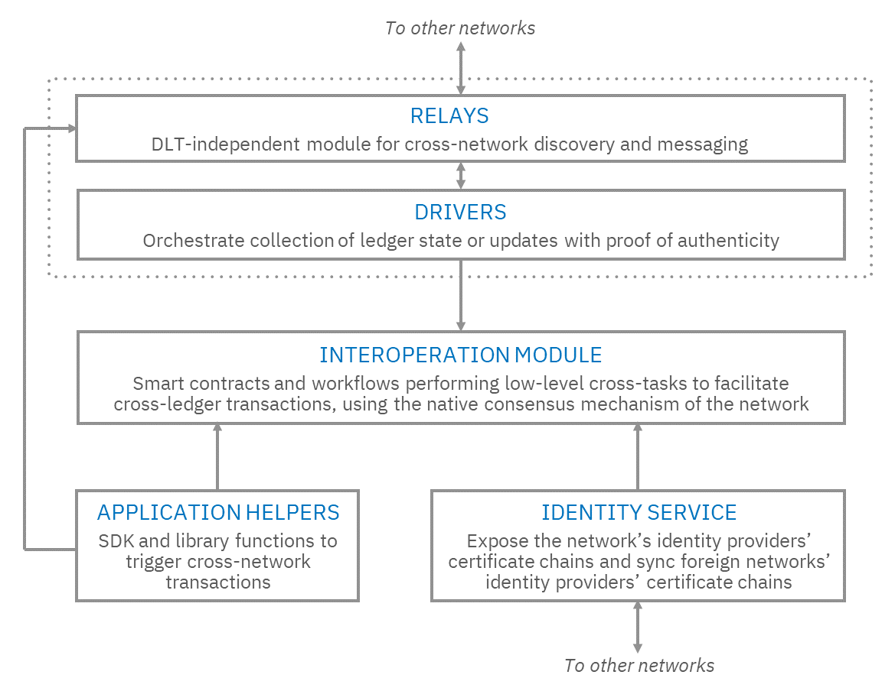
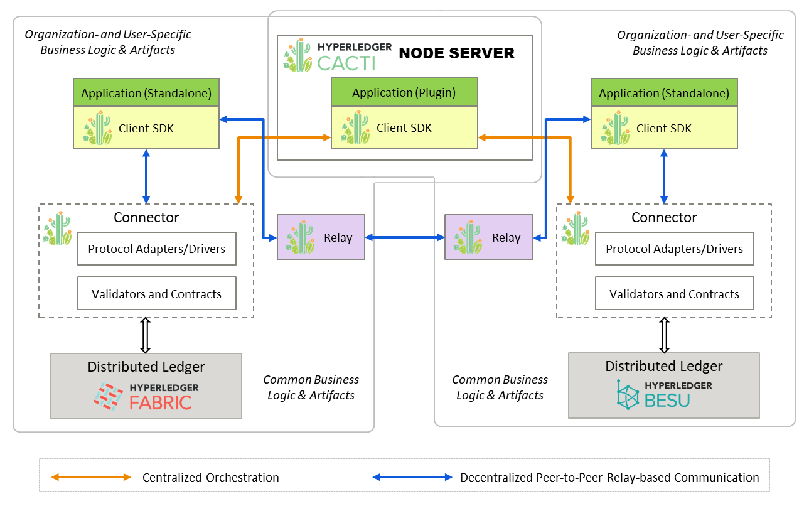
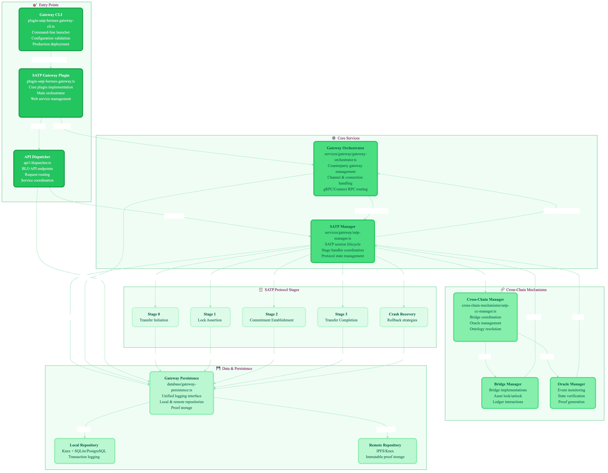

<figure markdown="span">
  { width="340" }
</figure>

# Hyperledger Cacti: An Open Platform for Cross-Chain Applications

Authors: Rafael Belchior, TBD

*with contributions from the Hyperledger Cacti community.*

## Abstract

Hyperledger Cacti is an open-source, multi-faceted interoperability platform
that enables software engineers, enterprise architects, and researchers to
construct cross-chain applications without incurring vendor lock-in or
sacrificing network sovereignty. Cacti
intendeds to lower the barrier of entry for builders and researchers who want
to add cross-chain capabilities to their systems today. 
The platform ships suite of production-ready components: ledger
connectors for Hyperledger Fabric, Besu, Ethereum, Corda, and others;
tooling for cross-chain productization and research, and, most strategically—two
blockchain gateway implementations (cactus-plugin-satp-hermes in Typescript and Weaver in Rust) of the IETF Secure Asset Transfer Protocol (SATP), the emerging international standard for institution-grade digital asset portability.This
document describes the Cacti's architecture, its flagship SATP gateway,
its academic and standards contributions, and its design principles. 

# Table of Contents

[TOC]


# Introduction {#sec-introduction}
Formed in November 2022 through the merger
of Hyperledger Cactus and the Weaver Lab—two complementary frameworks with
distinct design philosophies—Cacti offers a spectrum of interoperability
mechanisms ranging from direct node-server orchestration (Cactus heritage)
to relay-based, proof-driven cross-network communication (Weaver heritage).

Cacti graduated from the Hyperledger incubator in
2024 and is actively co-developed by researchers at INESC-ID/Instituto
Superior Técnico, IBM Research, and a growing open-source community. 

## The Platform Role of Hyperledger Cacti

Blockchain and distributed ledger technology (DLT) ecosystems have matured
considerably since the first enterprise networks went live in the mid-2010s.
What has also matured is the understanding that a proliferation of
purpose-built ledger platforms is not an accident or a failure. Hyperledger
Fabric emerged to serve permissioned enterprise workflows where transaction
privacy and governance customisation are paramount. Ethereum and its
EVM-compatible descendants (Besu, Polygon, Arbitrum, Optimism) emerged for
programmable, open finance. Corda was engineered for regulated bilateral
contracts between known counterparties in financial services. Polkadot and
Cosmos were conceived for composable, sovereign public blockchains. Each
design reflects genuine engineering trade-offs—throughput versus
decentralisation, privacy versus transparency, permissioned governance versus
open participation—and each has found a user community that values those
choices.

The practical consequence for application builders is that the systems they
need to interact with span multiple ledger platforms. A trade finance
application may record provenance data on a Fabric network but need to settle
a payment on a public EVM chain. A CBDC system may operate on a permissioned
ledger domestically but need to interoperate with foreign CBDC systems on
different infrastructure. A carbon market may originate offset credits on a
registry ledger but want to expose them to DeFi composability on a public
chain. In each case, the builder faces the same fundamental challenge: how to
write an application that crosses ledger boundaries reliably, securely, and
without giving up the governance autonomy of either network[^satpusecases][^belchior2023dlt].

Hyperledger Cacti is an open-source, community-first answer to that challenge. It is a platform for
builders and researchers: a comprehensively tooled, production-oriented
collection of protocols, plugins, SDKs, and reference implementations that
radically lowers the cost of writing cross-chain software. The platform's
value proposition is not primarily technical novelty for its own sake; it is accessibility and composability. A developer with experience in TypeScript
and a basic understanding of the target ledgers can be running a cross-chain
prototype in hours, not weeks (and not with LLMs, possibly minutes!). A researcher can add a new interoperability
protocol as a plugin without modifying the platform core and have a reliable testbed for their experiemnts. An enterprise
architect can select the trust model that matches their regulatory context
without forking the codebase.

Cacti achieves this by refusing to pick a single winner in the interoperability
design space. It does not impose a shared settlement chain. It does not require
participating networks to adopt a common identity system. It does not mandate a
single trust model. Instead, it provides a spectrum of mechanisms and leaves
the choice to the operator. This philosophy—pluralism over orthodoxy—is what
distinguishes Cacti from interoperability systems that are optimised for a
single design point. Cacti is also one of the few projects implementing an interoperability standard,
as opposed to proprietary protocols or protocols controlled by one entity. Thus,
Cacti is positioning itself to be a long-term solution for adopters.

## Heritage and Formation

Cacti was formed in November 2022 by merging two Hyperledger projects:
Hyperledger Cactus [^cactus2019whitepaper] and the Weaver Lab
[^belchior2021survey]. Both projects had maintainers with academic and engineering experience
where the vision aligned, although design philosophy differed. A considerable effort was put into
merging these projects into a single codebase, governance structure, and release pipeline,
and it was precisely the complementarity of the two systems that made the
merger compelling.

**Hyperledger Cactus** is an enterprise-grade, pluggable integration
framework built on a node-server architecture. Its core abstractions—OpenAPI
3.x plugin interfaces, a dynamically loadable API server, keychain-backed
credential storage, and a growing library of ledger connectors—made it easy
to add new ledger support without touching the platform core. Cactus was
designed by practitioners from Accenture, Fujitsu, and the broader enterprise
blockchain community, and its priorities reflected enterprise concerns: clear
API contracts, stable versioning, security by default.

**The Weaver Lab** is an academically grounded interoperability research
project created by IBM Research. Weaver's architecture centred on a relay network: off-chain servers
that passed signed proof requests between DLT networks, together with
Interoperation Identity Network (IIN) agents that maintained decentralised
membership and identity state. Weaver's differentiators were its strong
formal foundations, its support for asset exchange
(HTLCs), asset transfer, and data sharing as first-class interoperability
modes, and its deep integration with IETF standardisation efforts
[^hargreaves2022satp][^belchior2022hermes].

The merger combined these strengths without discarding either heritage.
Cactus contributors retained ownership of the node-server model, the
connector library, the API server, and the SATP gateway (Typescript). Weaver contributors retained the relay
infrastructure, IIN agents, and the SATP gateway (Rust). Both lineages are
preserved in the current codebase: Cactus source lives at the repository root;
Weaver source lives in the `weaver/` subdirectory. The release pipeline,
package namespace (`@hyperledger/`), and CI/CD workflows are unified.
A deeper code merge—creating a single undifferentiated Cacti SDK—is
the long-term roadmap goal.

## Graduation and Current Status

Cacti graduated from the Hyperledger incubator in 2024, reaching the
Graduated project status that signifies production readiness, maintainer
diversity, and governance maturity. The strategic focus since release 2.1 has been:

1. **The Cacti Cleanup initiative**: a structured effort to reduce codebase
   complexity, retire deprecated connectors, improve documentation,
   and reduce the vulnerability surface. The initiative is tracked on a
   [public GitHub project board](https://github.com/orgs/hyperledger-cacti/projects/2).

2. **The SATP-Hermes initiative**: active development of
   `cactus-plugin-satp-hermes`, the Cacti implementation of the IETF Secure
   Asset Transfer Protocol. At the `satp/v0.1.0-alpha` milestone (April 2026),
   the plugin represents 38 commits from 17 contributors and includes
   adapter-layer extensibility, NFT transfer support, multi-gateway Prometheus
   metrics, Grafana dashboards, improved crash recovery, and TypeDoc API
   documentation.

3. **Knowledge return**: sustained academic publication and IETF participation
   that feeds research findings back into the codebase and the standards track.

**TBD include release 3**


This whitepaper is organised as follows. [§ architecture](#sec-architecture) describes the
dual-heritage architecture and its spectrum-of-trust design.
[§ plugins](#sec-plugins) surveys the key plugin packages. [§ satp](#sec-satp) covers the IETF
SATP standard and the `cactus-plugin-satp-hermes` implementation.
[§ connectors](#sec-connectors) describes the ledger connector ecosystem. [§ usecases](#sec-usecases)
presents concrete application examples including the CBDC bridging demo,
SATP gateway scenarios, and the carbon credit extension. [§ comparison](#sec-comparison)
situates Cacti alongside Polkadot/XCM, Cosmos IBC, LayerZero, and CCIP as
complementary rather than competing systems. [§ security](#sec-security) provides a
security analysis. [§ knowledge](#sec-knowledge) documents the academic
and standards footprint. [§ future](#sec-future) lists open development directions
linked to the public issue tracker. [§ governance](#sec-governance) covers project governance
and community channels. [§ getting-started](#sec-getting-started) provides a quick-start guide.
[§ glossary](#sec-glossary) provides a canonical glossary of 15–20 terms.


# Architecture Overview {#sec-architecture}

## Design Philosophy

Hyperledger Cacti is built around six core design principles that together
define how the platform scales across diverse deployment environments and
trust contexts. These principles are not aspirational; they are embodied in
concrete architectural decisions described in the subsections that follow.

**Pluggable.** Every functional concern—ledger connectivity, key management,
protocol logic, identity resolution—is packaged as an independently versioned
plugin. Plugins expose OpenAPI 3.x interfaces and are loaded dynamically into
a `cactus-cmd-api-server` instance at runtime. This means an operator can
upgrade or swap a connector without touching unrelated parts of the system.
Contributions of new ledger connectors, new protocol plugins, or new keychain
backends require no changes to the platform core—only the new plugin package.

**Ledger-agnostic.** Cacti does not privilege any ledger. The connector
library currently covers Hyperledger Fabric, Hyperledger Besu, Ethereum
(and other EVM chains), Corda 4.x and 5.1 with community contributions continuously
expanding coverage. Each connector adapts Cacti's unified API to the
ledger's native interface without any coupling between connectors.

**Network independence.** Networks remain self-sovereign. Cacti enables
transactions that span network boundaries without requiring participants to
subscribe to a single canonical chain or a central clearing house. The
platform's design explicitly rejects the "one chain to rule them all"
model, recognising that network sovereignty is a feature, not a limitation.

**Spectrum of trust.** Rather than mandating a single trust model, Cacti
exposes a continuum from "trust the node operator" (direct connector calls
through the API server) through "trust a federation of relays with
IIN-backed identity" (Weaver relay network) to "cryptographic proof via
SATP gateways with on-chain lock and burn/mint semantics." Operators choose
the point on the spectrum that matches their regulatory context, risk
appetite, and performance requirements.

**OpenAPI-first.** Every plugin surface is described by a machine-readable
OpenAPI 3.x specification. Client SDKs in TypeScript (using the Axios HTTP
client) are generated automatically from the spec using the
`openapi-generator-cli` toolchain. This approach makes integration
predictable, prevents manual client drift, and enables tooling like Swagger
UI for documentation and interactive testing. Code generation is automated
in CI, so the generated client always matches the current spec.

**Security by default.** Credentials are never stored in source code,
configuration files, or environment variables. A memory-backed keychain (`cactus-plugin-keychain-memory`)
is available for testing and local development but is explicitly excluded from
production deployment guidance.

## Dual-Heritage Architecture

The conceptual architecture of Cacti is illustrated in [Fig. vision](#fig-vision) and in
[Fig. arch-v2](#fig-arch-v2).

{#fig-vision}

{#fig-arch-v2}

The integrated architecture was produced by fusing the Cactus and Weaver
component models, identifying overlapping concerns (ledger access, identity,
secrets), and calling out unique components separately. The result is a
layered stack with a common orchestration surface above two distinct
execution pipelines.

### The Node-Server (Cactus Heritage)

The Cactus heritage is centred on an **API server** (`cactus-cmd-api-server`)
that hosts plugins exposed as REST endpoints. The server is a Node.js process
that reads a plugin list from its configuration, dynamically imports each
plugin module, calls `registerWebServices`, and mounts the resulting Express
routes. The Swagger UI aggregates all mounted OpenAPI specifications into a
single interactive interface. Any number of API server instances can be
deployed and composed.

Ledger connectors (`cactus-plugin-ledger-connector-*`) are the most
frequently used plugin type. Each connector translates Cacti's unified API
into ledger-specific calls: Fabric SDK calls for the Fabric connector,
JSON-RPC calls for the Besu and Ethereum connectors, Corda RPC for the Corda
connector, and so on. A consortium plugin manages network membership. Additional plugin types—persistence
plugins, HTLC plugins, SATP—extend the server with domain-specific
capabilities.

[Fig. cactus-arch](#fig-cactus-arch) shows the Cactus architecture in isolation.

{#fig-cactus-arch}

The request path through the node-server is uniform for every ledger: the
client calls the core API server, the core dispatches to the relevant plugin,
and the plugin — never the core — is the only component that speaks to a
ledger. [Fig. core-plugin-connector](#fig-core-plugin-connector) traces a
single `run-transaction` call from the client SDK down to the blockchain and
back. Individual plugins can be used without the API server (as npm packages or dockerized applications).

{#fig-core-plugin-connector}

### Multi-Node Orchestration via Consortium

A single API server can execute a cross-network transaction on its own, but
many deployments run several Cacti nodes operated by different organisations.
The `cacti-plugin-consortium-static`
plugin let those nodes discover and authenticate one another without a
central registry. A consortium is a signed list of member nodes — each entry
pairs a public key with a service endpoint — so a node can verify that a
request genuinely originates from a known peer before acting on it.
[Fig. consortium](#fig-consortium) shows a cross-node call authenticated
through consortium membership.

{#fig-consortium}

### The Relay Network (Weaver Heritage)

The Weaver heritage is centred on a **relay network**: off-chain relay servers
that pass signed proof requests between DLT networks. The relay is not a
trusted intermediary; it is a routing layer. The actual trust anchoring is
done at the DLT level, through on-chain verification policies that each network
maintains independently.

The key components of the Weaver stack are:

- **Relays**: gRPC servers that forward proof requests. Multiple relays can
  serve a single network, providing redundancy.
- **Drivers**: analogous to connectors, drivers translate relay protocol
  messages into ledger operations (reading state, invoking contracts, issuing
  tokens).
- **IIN Agents** (Interoperation Identity Network): agents that maintain
  verifiable membership and public key state for each network and relay.
  IIN agents form a decentralised identity layer that prevents Sybil attacks
  on the relay membership set.
- **Interoperation contracts / chaincode**: on-chain logic that verifies
  incoming proof claims against the network's verification policy and executes
  the resulting state transitions.

[Fig. weaver-arch](#fig-weaver-arch) shows the Weaver architecture.

{#fig-weaver-arch}

Weaver supports three interoperability modes: **data sharing** (one network
reads verified state from another), **asset exchange** (two parties swap
assets on different networks using HTLCs), and **asset transfer** (an asset
moves from one network to another using a lock/mint pattern). All three modes
use the relay pipeline and are independently invocable.

## Transaction Orchestration Modes

[Fig. tx-modes](#fig-tx-modes) illustrates how the same logical cross-network transaction can
be executed via either pipeline. In the **node-server mode**, a distributed
application calls the Cacti API server directly; the server co-ordinates calls
to two ledger connectors. In the **relay mode**, the application invokes
Weaver relay infrastructure; relays exchange proof claims; IIN agents attest
membership; drivers execute the local ledger operations.

{#fig-tx-modes}

A third mode—the **gateway mode** (SATP)—adds a formal, standards-based
protocol layer on top of the node-server model. The SATP gateway runs as a
plugin set within the API server and enforces a three-phase commit protocol
with cryptographic proof at every step. [§ satp](#sec-satp) covers this in full.

## Integration Roadmap

TBD - confirm


The longer-term vision (Phase 2 and beyond, described in
[ROADMAP.md](https://github.com/hyperledger-cacti/cacti/blob/main/ROADMAP.md)) is a deeper merge in which the connector
library, the relay driver library, and the SATP gateway share a common SDK
surface, common configuration schemas, and a common identity and credential
management subsystem. This convergence is a community effort and will proceed
iteratively as contributors from both heritages align on unified abstractions.


# Plugin Ecosystem {#sec-plugins}

## Plugin Architecture

Every plugin in Cacti implements the `ICactusPlugin` interface from
`cactus-core-api`. Plugins declare their capabilities through a set of typed
interfaces: `IPluginLedgerConnector` for ledger connectivity,
`IPluginKeychain` for credential storage, `IPluginWebService` for REST
endpoint registration, and `IPluginCrqClient` for consortium registry queries.
The API server enumerates installed plugins at boot, calls
`registerWebServices` on each one, and mounts the resulting Express routes.
All plugin packages are published to npm under the `@hyperledger` scope.

The plugin registration flow is intentionally simple. The API server reads a
JSON configuration file that lists plugin packages by name and options. Each
plugin must export a factory class that accepts an options object and
implements `ICactusPlugin`. The server dynamically imports the package,
instantiates the factory, and calls the registration lifecycle methods.
This design means that a developer can ship a new plugin as an npm package
and have it loadable by any Cacti API server without any core changes.

The code listing below shows the minimal structure needed to mount a custom
plugin. Plugin constructors receive a typed options object; the `getOpenApiSpec`
method returns the plugin's JSON spec; `registerWebServices` mounts the
Express router.

<a id="lst-plugin-skeleton"></a>

```typescript title="plugin-skeleton.ts"
import {
  ICactusPlugin,
  IPluginWebService,
  IWebServiceEndpoint,
} from "@hyperledger/cactus-core-api";
import { Express } from "express";

export class MyPlugin implements ICactusPlugin, IPluginWebService {
  getId(): string { return "@my-org/my-plugin"; }
  getPackageName(): string { return "@my-org/my-plugin"; }
  async registerWebServices(app: Express): Promise<IWebServiceEndpoint[]> {
    // mount routes here
    return [];
  }
  async getOrCreateWebServices(): Promise<IWebServiceEndpoint[]> {
    return [];
  }
  async shutdown(): Promise<void> {}
}
```

## Consortium Plugins

`cacti-plugin-consortium-static`
provides consortium membership management for API server deployments. A
consortium in Cacti terms is a set of known API server nodes with their
public keys and endpoints. The plugin reads membership from a static
JSON configuration. These plugins are used in multi-node
deployments where several API server instances need to discover and
authenticate each other.

## Persistence Plugins

`cactus-plugin-persistence-ethereum` and `cactus-plugin-persistence-fabric`
provide block and transaction persistence to a PostgreSQL-compatible database.
These plugins run a background loop that watches the target ledger for new
blocks, deserialises the transaction data, and writes it to a structured schema.
The persisted data powers the `cacti-ledger-browser`, a React frontend for
browsing Ethereum and Fabric transactions without running a custom explorer.
In v2.1.0, both plugins were extended with sample setup scripts and
improved documentation, making them accessible entry points for operators who
need ledger observability.

## Test Tooling {#sec-test-tooling}

`cactus-test-tooling` is the shared test infrastructure package used across
the monorepo. It provides Docker container managers for Besu, Fabric,
Ethereum (Geth), Corda, and other ledgers; helper functions for spinning up
and tearing down ledger networks in CI; and utility functions for waiting on
block confirmations and inspecting transaction receipts. It can be used for 
creating reproducible test environments suitable for research and development, namely prototype evaluation.

The container managers in `cactus-test-tooling` are the hidden backbone of
Cacti's integration test suite. For instance, in Besu, every integration test that needs a live
Besu node calls `new BesuTestLedger()` and uses the returned object to
start, query, and stop a Docker container running a pre-configured Besu
instance. The container manager handles port allocation (always using port 0
for OS-assigned ports, avoiding collisions in parallel CI runs), image
pulling, health-check polling, and container cleanup on test teardown.
This design means that integration tests are fully self-contained: they do
not assume any externally running infrastructure, and they clean up after
themselves whether they pass or fail.

`cactus-test-tooling` is declared as a `devDependency` in every package
that runs integration tests and is never shipped in production builds.
This is an invariant enforced by the monorepo linting rules.


# IETF SATP and the SATP-Hermes Gateway {#sec-satp}

## What is the IETF?

The **Internet Engineering Task Force** (IETF) is the principal body responsible
for developing and promoting voluntary internet standards, most of which are
published as **Requests for Comments** (RFCs). Founded in 1986 and operating
under the Internet Society, the IETF is an open, volunteer-driven organisation:
anyone may participate in its working groups, mailing lists, and thrice-yearly
plenaries. Standards advance through a defined maturity track — Proposed
Standard → Internet Standard — providing a transparent, peer-reviewed path from
draft to specification. Widely deployed protocols that originated as IETF RFCs
include TCP/IP (RFC 793/791), TLS 1.3 (RFC 8446), HTTP/2 (RFC 7540),
JSON (RFC 8259), and OAuth 2.0 (RFC 6749). The IETF's open process and
royalty-free licensing make its standards the preferred foundation for
interoperability in regulated industries.

The IETF is the natural home for SATP, and by extension for Cacti's gateway
implementation, precisely because of what its most successful protocols
demonstrate: that true interoperability requires a neutral, open specification
that no single vendor controls. 

An example is email and the internet protocols we all use. Any email client
can exchange messages with any email server, across any provider, because
SMTP (RFC 5321), IMAP (RFC 9051), and MIME (RFC 2045) are open standards
implemented by thousands of independent parties. No single company owns email
interoperability. The same holds for the web: a browser written in 2026 can
fetch a page from a server written in 1995 because HTTP (RFC 9110) is a
stable, vendor-neutral standard. These protocols succeeded not because one
company built the best implementation, but because an open specification
allowed *any* implementation to participate. SATP aims for the same outcome
in the digital asset space: any two institutions running SATP-compliant
gateways—regardless of which software vendor or open-source project built
them—should be able to transfer assets between their networks without a
proprietary intermediary. Cacti's `cactus-plugin-satp-hermes` is one
implementation of that standard, not the owner of it. By developing SATP
at the IETF and contributing the reference implementation to the open-source
commons under the Linux Foundation, the Cacti community is building the
infrastructure layer for blockchain interoperability the same way the IETF
built the infrastructure layer for the internet.

## What Is SATP?

The **Secure Asset Transfer Protocol** (SATP) is an IETF standard-track
protocol for moving a digital asset atomically from one DLT network to
another [^hargreaves2022satp]. SATP defines a *gateway* abstraction: each
participating network runs a gateway that acts as the network's authorised
agent for cross-chain transfers. The two gateways interact through a
structured protocol with cryptographic commitments at each step, ensuring
that an asset is never cloned (burned on the source network before being
minted on the destination) and never lost (crash recovery resumes an
interrupted transfer from its last committed phase [^belchior2021recovery]).

The SATP specification has its roots in the earlier ODAP (Open Digital Asset
Protocol) drafts that circulated in the IETF prior to 2022. The current SATP
working group formalised the protocol, tightened the message formats, and
established an interoperability testing regime. Cacti maintainers are among
the co-authors of the core SATP Internet Draft and the crash recovery draft,
giving the project early implementation experience.

SATP is significant for enterprise interoperability for three reasons.
First, it is **standardised at the IETF**, which gives procurement and legal
teams a citable specification rather than a proprietary contract. When a
regulated financial institution deploys a CBDC bridge or a securities
settlement system, procurement requires citing an external standard rather
than committing to a single vendor's API. SATP provides that standard.
Second, it provides **safety guarantees through academic research and good engineering practices**: the burn-before-mint
invariant prevents double-spending; the three-phase commit protocol prevents
partial execution from leaving the system in an inconsistent state.
Third, it is **ledger-agnostic**: any two networks can interoperate provided
they each run a SATP-compliant gateway, regardless of the underlying ledger
technology. A Fabric network and an Ethereum network that have never
previously interacted can transfer assets using SATP as the shared protocol,
without any code changes to either network's internal infrastructure.

## The Three-Phase Commit Protocol

SATP structures an asset transfer as three sequential phases, each of which
produces a cryptographically signed log entry that both gateways retain for
audit purposes. The design is deliberately analogous to the two-phase commit
protocol in distributed databases, extended with a richer message exchange
and an asymmetric lock/mint semantic.

**Phase 1 — Transfer Initiation.** The client submits a transfer request to
the sending gateway via
`POST /api/v1/plugins/@hyperledger/cactus-plugin-satp-hermes/satp/transact`.
The request specifies the asset identifier, the source network identifier,
the destination network identifier, and the recipient identity. The sending
gateway validates the request, opens a TLS connection to the receiving
gateway, and negotiates protocol parameters: supported proof formats,
timeout values, and idempotency nonce. Both gateways agree on a
`SESSION_ID`—a UUID that uniquely identifies this transfer attempt—and the
sending gateway returns the `SESSION_ID` to the client. The client can poll
`GET /satp/status/{SESSION_ID}` at any time to track progress. If the
sending gateway crashes after committing Phase 1 but before starting Phase 2,
crash recovery resumes from Phase 1's terminal state: the session is marked
`INITIATION_COMPLETE` and the next phase begins immediately upon restart. In other words,
the `transact` endpoint is the client gateway entrypoint; the other protocol stages will be 
executed in a peer-to-peer way between gateways (using gRPC as opposed to HTTP).
The adapter layer, later explained, allows gateways to control protocol execution.

**Phase 2 — Lock-Assertion.** The sending gateway instructs the source
ledger to lock (freeze in place) or burn (destroy) the asset. The exact
semantics depend on the asset model: for a burn/mint bridge, the asset is
destroyed on the source; for a lock/unlock bridge, the asset is locked in
an escrow contract. Once the ledger transaction is confirmed, the sending
gateway constructs a *lock assertion* message containing: the asset state
hash, the ledger transaction receipt, a proof (e.g., merkle proof, notarization, zero knowledge proof) anchoring the receipt
to a confirmed block, and the gateway's digital signature. This message is
sent to the receiving gateway. The receiving gateway independently verifies
the proof against its configured verification policy for the source network,
countersigns the assertion, and returns an acknowledgement. Both gateways
write the signed lock-assertion exchange to their durable session logs.
If either gateway crashes after the lock but before the acknowledgement,
the recovery mechanism detects the locked asset on the source chain and
either completes the forward path or safely unlocks the asset on the source,
depending on which side crashed.

**Phase 3 — Commitment.** The receiving gateway instructs the destination
ledger to mint (create) or unlock the equivalent asset to the designated
recipient. Once the destination transaction is confirmed, the gateway
constructs a *commit final* message containing the destination transaction
receipt and both gateways' signatures over the full exchange. This message
is sent to the sending gateway as the definitive proof that the transfer
completed. Both gateways update their session logs with `TRANSFER_COMPLETE`
status. The full audit proof bundle—comprising the signed messages from all
three phases, the ledger receipts, and the session transcript—is retrievable
via `GET /satp/audit/{SESSION_ID}` for compliance and reconciliation purposes.

The protocol provides *at-least-once* delivery semantics. Idempotency guards
in the Phase 3 logic ensure that a duplicate `commit-final` message—which
could be delivered if a gateway restarts and retransmits—is detected and
rejected without causing a second mint. The idempotency check is based on
a combination of the `SESSION_ID` and the asset state hash, stored in the
destination gateway's session log.

## SATP-Hermes: The Cacti Gateway Implementation

`cactus-plugin-satp-hermes` is the Cacti implementation of the SATP
gateway. It is the most strategically active component in the monorepo.
At the `satp/v0.1.0-alpha` milestone (April 2026), the plugin represents
38 commits from 17 contributors. The plugin is structured around three
API layers and a pluggable adapter layer.

The gateway's internal component model is shown in
[Fig. satp-architecture](#fig-satp-architecture), reused from the
`cactus-plugin-satp-hermes` package documentation
(`packages/cactus-plugin-satp-hermes/docs/diagrams/architecture-overview.mmd`).
It maps the entry points, core services, cross-chain mechanisms, persistence,
and the three-phase protocol stages onto the concrete source modules that
implement them.

{#fig-satp-architecture}

### API Type 1 — Core Gateway Operations

The API Type 1 implementation exposes (via HTTP):

- `POST /satp/transact` — initiate a new transfer session
- `GET /satp/status/{SESSION_ID}` — query the current phase and status
- `GET /satp/audit/{SESSION_ID}` — retrieve the full signed proof bundle
- `GET /ledgers` — enumerate the networks this gateway can reach (added v0.1.0-alpha)

Clients that interact solely with Layer 1 are fully isolated from
ledger-specific details; they work with abstract asset identifiers and session
identifiers. A client written against the Layer 1 API will work unchanged
with any gateway deployment, regardless of which ledger pairs it connects.

### API Type 2 — Gateway APIs

[API type 2 includes the gateway to gateway interactions.](https://ietf-satp.github.io/draft-ietf-satp-core/draft-ietf-satp-core.html#name-overview)
All Type 2 messages are exchanged over gRPC between the sending and receiving gateways.
The three SATP stages map directly onto three gRPC service definitions
(`SatpStage1Service`, `SatpStage2Service`, `SatpStage3Service`), each generated
from the proto files under
`packages/cactus-plugin-satp-hermes/src/main/proto/cacti/satp/v02/service/`.

The snippet below shows the Stage 1 `TransferProposal` call — the first
gateway-to-gateway message in a transfer — as it appears in the generated
TypeScript gRPC client:

<a id="lst-api2-transfer-proposal"></a>

```typescript title="api2-transfer-proposal.ts"
import {
  SatpStage1ServiceClient,
  TransferProposalRequest,
} from "@hyperledger/cactus-plugin-satp-hermes";
import * as grpc from "@grpc/grpc-js";

// The sending gateway opens a gRPC channel to the receiving gateway.
const channel = new SatpStage1ServiceClient(
  "receiver-gateway.example.org:3010",
  grpc.credentials.createSsl(),
);

const request: TransferProposalRequest = {
  common: {
    version: "2.0",
    sessionId: "<SESSION_ID>",
    sourceGatewayPubkey: sendingGateway.publicKey,
    recipientGatewayPubkey: receivingGateway.publicKey,
  },
  transferInitClaims: {
    digitalAssetId: "asset-42",
    originatorId: "did:example:alice",
    beneficiaryId: "did:example:bob",
    senderAssetAmount: "100",
    recipientAssetAmount: "100",
  },
  clientSignature: sendingGateway.sign(request.common),
};

// The receiving gateway validates the claims and returns a signed counter-proposal.
const response = await channel.transferProposal(request);
console.log("Session agreed:", response.common.sessionId);
console.log("Server signature:", response.serverSignature);
```

### API Type 3 — Adapter / Operator Hooks
Type 3 API interacts with external systems. A way to implement this API type is 
by providing an adapter layer interface where gateways can interact with external systems.
Our first use case is for a client to control SATP execution. Our implementation allows deployers
to plug in custom business logic at well-defined hooks in the SATP protocol
flow. The adapter is a TypeScript object implementing a typed interface;
it is passed to the gateway plugin constructor and called synchronously at
each hook point. If the hook returns a rejected Promise, the transfer is
aborted and the session is marked `FAILED`, with the rejection reason
recorded in the session log.

Hook points include:

- **Pre-initiation**: validate the transfer request before accepting it
- **Pre-lock**: perform compliance checks before locking the asset (e.g.,
  sanctions screening, KYC verification, balance checks)
- **Post-lock**: notify downstream systems that the asset is locked
- **Pre-mint**: validate the mint parameters on the destination side
- **Post-mint**: trigger notifications, update off-chain records, emit events
- **On-failure**: custom handling for failed or timed-out sessions

The code listing below shows the TypeScript type signature of an adapter
callback used in a pre-lock compliance check:

<a id="lst-satp-adapter"></a>

```typescript title="satp-adapter.ts"
import type { SatpPhase, SessionData } from
  "@hyperledger/cactus-plugin-satp-hermes";

/**
 * Adapter hook invoked immediately before the lock-assertion phase.
 * Returning a rejected Promise aborts the transfer and marks the
 * session as FAILED with the provided error message.
 */
export type PreLockHook = (
  sessionData: Readonly<SessionData>,
  phase: SatpPhase.LockAssertion,
) => Promise<void>;

// Example: sanctions screening hook
const sanctionsCheck: PreLockHook = async (session) => {
  const result = await screeningService.check(session.recipientDid);
  if (result.blocked) {
    throw new Error(`Transfer blocked: recipient flagged by sanctions list`);
  }
};
```

This extensibility model is what makes the carbon credit gateway extension
([§ usecases](#sec-usecases)) possible: the adapter layer injects compliance logic into the
standard SATP flow without forking the protocol implementation.

### NFT Support

Starting from v0.1.0-alpha, `cactus-plugin-satp-hermes` supports end-to-end
NFT transfers in addition to fungible tokens. The NFT path reuses the same
three-phase protocol but replaces the fungible asset lock/burn operation
with a token-ID-scoped lock (`tokenId` field in the lock assertion message)
and uses a distinct mint interface on the destination (calling the NFT
contract's `safeMint` function rather than a fungible `mint`).

The session data model was extended in v0.1.0-alpha to carry NFT-specific
fields: `tokenId`, `tokenURI`, and `tokenMetadataHash`. The `tokenMetadataHash`
field ensures that the receiving gateway can verify the integrity of the
token's metadata at mint time, preventing metadata substitution attacks
where a malicious gateway substitutes different metadata for the minted NFT.

The `cacti-demos` repository provides two NFT demonstration scenarios
(ERC-721 EVM-to-EVM transfers).

### Observability

v0.1.0-alpha introduced multi-gateway Prometheus metrics and Grafana
dashboards with pre-configured alerting rules. The following metrics are
emitted per gateway instance:

- `satp_active_sessions` (gauge): number of sessions currently in progress
- `satp_phase_duration_seconds` (histogram): latency of each phase transition,
  labelled by phase name and ledger pair
- `satp_session_failures_total` (counter): total failed sessions, labelled
  by failure reason
- `satp_crash_recovery_events_total` (counter): number of sessions resumed
  after a crash, labelled by recovery phase

The Grafana dashboard ships as a JSON provisioning artefact inside the plugin
package and is automatically loaded when Grafana starts in the Docker Compose
demo environment. The dashboard includes pre-configured alert rules for
unusually high session failure rates and for crash-recovery events that may
indicate an infrastructure problem.

Session tracing was also improved in v0.1.0-alpha. Each phase transition emits
a structured JSON log event carrying the session identifier, phase name,
gateway pair, wall-clock timestamp, and (for failures) the error message and
stack trace. These events are compatible with the OpenTelemetry log data
model, making integration with enterprise observability stacks (Splunk,
Elastic, Datadog) straightforward via OTLP export.

### Crash Recovery

The crash recovery mechanism is a direct implementation of the IETF draft
[^belchior2021recovery]. The design principle is that a gateway restart should
never require manual intervention to recover an in-flight transfer. Durable
session state is written to a backing store—configurable as in-memory (for
tests), SQLite (for single-node deployments), or a PostgreSQL-compatible
database (for production). Every session state transition writes a new log
record; the log is append-only and hash-chained to detect tampering.

On restart, the gateway reads all sessions that are not in a terminal state
(`TRANSFER_COMPLETE` or `FAILED`) and resumes each one from its most recently
committed phase. The recovery algorithm distinguishes between:

- **Sending gateway crash before lock**: the session is abandoned (no state
  change has occurred on either ledger).
- **Sending gateway crash after lock, before commit-final**: the gateway
  attempts to complete the forward path (proceeding to Phase 3). If the
  receiving gateway reports that it already completed Phase 3, the sending
  gateway updates its local log and marks the session complete.
- **Receiving gateway crash after lock, before mint**: the receiving gateway
  re-requests the lock assertion from the sending gateway and re-executes
  Phase 3.
- **Any gateway crash after commit-final**: idempotency guards ensure that a
  duplicate commit-final is harmless.

Oracle logs—the records of oracle decisions during Phase 2 verification—are
now persisted separately (v0.1.0-alpha), allowing post-incident forensics that
reconstruct the full decision trace without relying on volatile memory.
This is particularly important for regulated environments where audit trails
must survive infrastructure failures.

Future work on formal verification of the recovery paths is tracked at
[#4042](https://github.com/hyperledger-cacti/cacti/issues/4042).

### Release Trajectory

The roadmap targets a `v1.0.0` stable release when:

1. The implementation reaches the latest core IETF SATP specification.
2. The adapter API (Layer 3) is declared stable with no planned breaking changes.
3. The API1 SDK ([#4018](https://github.com/hyperledger-cacti/cacti/issues/4018))
   is published and has received sufficient external adopter feedback.
4. The observability stack has been validated against at least two production-like
   deployment scenarios.

Development progress is tracked on the
[public GitHub project board](https://github.com/orgs/hyperledger-cacti/projects/2).
Contributors interested in accelerating the v1.0.0 milestone are encouraged
to review the open issues tagged `satp-hermes` in the issue tracker.


# Ledger Connectors {#sec-connectors}

## Overview

Ledger connectors are the translation layer between Cacti's unified API
surface and the heterogeneous world of distributed ledger platforms. Each
connector is a self-contained plugin package implementing the
`IPluginLedgerConnector` interface and exposing a ledger-specific OpenAPI
specification. Connectors handle transaction submission, receipt retrieval,
block watching, smart contract deployment, and chain metadata queries.
They are the most diverse part of the codebase, spanning six programming
languages in the underlying ledger SDKs, yet all presenting a consistent
plugin interface to the Cacti platform.

The uniformity of the connector interface has a practical benefit for
application developers: code that calls the Besu connector's
`runTransactionV1` looks almost identical to code that calls the Ethereum
connector's `runTransactionV1`. The differences are in configuration (RPC
endpoint, chain ID, credentials) rather than in the calling code. This
consistency lowers the cognitive cost of adding support for a second or
third ledger to an application.

## Key Connectors

### cactus-plugin-ledger-connector-fabric

The Fabric connector supports Hyperledger Fabric 2.x networks. It exposes
endpoints for chaincode deployment (`deployContractGoSourceV1`), transaction
invocation and query (`runTransactionV1`), block retrieval (`getBlockV1`,
`getChainInfoV1`), and transaction receipt lookup
(`getTransactionReceiptByTxID`). A persistent `WatchBlocksV1` stream
delivers new blocks to subscribers via server-sent events (SSE), enabling
event-driven application patterns without polling.

The connector uses the `fabric-network` Node.js SDK (Fabric Gateway SDK for
Fabric 2.4+) and manages wallet identities through the Cacti keychain
abstraction. Private keys in the Fabric identity wallet are stored in the
configured keychain backend rather than on the local file system. A Fabric
operator who needs to rotate keys can do so in the keychain without modifying
the connector configuration.

### cactus-plugin-ledger-connector-besu

The Besu connector targets Hyperledger Besu 24.x. It supports Solidity
contract deployment from source bytecode or from a compiled ABI and bytecode
pair. The `runTransactionV1` endpoint accepts raw transaction parameters and
returns a structured receipt including gas used, log data, and revert reasons.
The `watchBlocksV1` endpoint delivers a stream of new block headers.

A feature introduced in v2.1.0 is the `IRunTransactionV1Exchange` interface,
which carries the full transaction receipt through the event pipeline to
downstream consumers. This enables observers (such as the persistence plugin)
to record complete receipt data without making a separate RPC call.
Another recent addition is resilience to ledger unavailability: if the Besu
node is unreachable, the connector returns HTTP 503 rather than crashing,
allowing the API server to remain available for other plugin operations.

### cactus-plugin-ledger-connector-ethereum

The Ethereum connector mirrors the Besu connector's feature set and targets
the public Ethereum network and EVM-compatible chains via standard JSON-RPC.
It is the connector used in the SATP demo scenarios that run on local Hardhat
networks, providing a zero-infrastructure path for developers evaluating the
gateway without access to enterprise ledger infrastructure. Hardhat's in-process
mode means that integration tests run without Docker overhead, significantly
accelerating the development feedback loop.

### cactus-plugin-ledger-connector-corda

The Corda connector supports both Corda 4.x (JVM 8/11, via the legacy
`CordaRPCClient`) and Corda 5.1 (JVM 17, via the new HTTP-JSON API introduced
in Corda 5). The dual-version support is implemented through two transport
adapters that share a common TypeScript interface (`ICordaConnectorAdapter`),
allowing callers to switch between Corda 4 and Corda 5 by changing a
configuration flag rather than modifying application code. The `vaultQueryV1`
endpoint provides a typed interface for Corda Vault queries, returning
structured state objects. Flow invocation is exposed via `invokeContractV1`.

### Additional Connectors

**`cacti-plugin-ledger-connector-stellar`**: targets Stellar via the
Horizon REST API and the Stellar SDK. Supports account creation, payment
operations, and asset issuance. Useful for cross-chain scenarios that
involve Stellar-native assets (including Stellar-based CBDCs).

**`cactus-plugin-ledger-connector-iroha2`**: targets Hyperledger Iroha 2,
a permissioned ledger with a strong focus on asset management and
institutional use cases in the Central Asian region.

**`cactus-plugin-ledger-connector-polkadot`**: targets Polkadot/Substrate
chains via `@polkadot/api`. Enables Cacti-orchestrated cross-chain workflows
that include Substrate-based networks as participants.

**`cactus-plugin-ledger-connector-sawtooth`**: targets Hyperledger Sawtooth,
providing transaction submission and state query capabilities for Sawtooth
transaction families.

**COPM connectors**: `cacti-plugin-copm-fabric` and `cacti-plugin-copm-corda`
implement the COPM (Cacti Open Package Manager) model for cross-network
asset management, providing a higher-level abstraction over the raw connector
APIs for pledge/claim, lock/unlock, and HTLC-based asset exchange patterns.

## WatchBlocks Protocol

The `WatchBlocksV1` capability is a first-class feature of connectors that
support streaming. The protocol is as follows:

1. The client calls the `watchBlocksV1` endpoint with a starting block number
   and an optional filter (for EVM chains, a filter on event topics or
   contract addresses).
2. The connector opens an SSE stream and begins sending block or log events
   as they arrive from the ledger.
3. The client consumes the stream and processes events in order.
4. Either side can close the stream; the connector cleans up its subscription
   to the ledger node.

This protocol is used by the SATP gateway to watch for lock-event confirmation
on the source chain (Phase 2) and for mint-event confirmation on the
destination chain (Phase 3), providing event-driven rather than polling-based
phase advancement.


# Application Examples and Demonstrations {#sec-usecases}

## CBDC Bridging: Fabric to Permissioned EVM

One of the most compelling demonstrations of Cacti's production-readiness is a
CBDC (Central Bank Digital Currency) bridge between a Hyperledger Fabric
network and a permissioned EVM-compatible network [^augusto2023cbdc]. This
work, presented at the IEEE International Conference on Blockchain and
Cryptocurrency 2023, used Cacti's node-server architecture to connect two
independently governed ledgers representing the domestic and cross-border legs
of a CBDC transfer.

In the scenario, a commercial bank on the Fabric network initiates an outbound
CBDC transfer. The Cacti CBDC bridging example (`cactus-example-cbdc-bridging`,
available in the `examples/` directory) orchestrates: (1) debit of the
sender's Fabric token balance via a chaincode call; (2) locking of the
equivalent value in a bridge escrow contract on the Fabric side; (3) minting
of the equivalent token on the EVM network; and (4) delivery notification.
The example ships with a React-based frontend (`cactus-example-cbdc-bridging-frontend`)
and a backend orchestration service (`cactus-example-cbdc-bridging-backend`)
that can be run locally with Docker Compose.

This scenario has been extended in the SATP-Hermes track to use the formal
three-phase commit protocol, replacing the ad-hoc bridging logic with a
standards-compliant gateway pair. The `cacti-demos` repository
(<https://github.com/hyperledger-cacti/cacti-demos>) provides Docker Compose
configurations for running a full SATP gateway pair on local Hardhat EVM
networks, making it accessible to developers without access to enterprise
ledger infrastructure.

## SATP Demo Scenarios

The `cacti-demos` repository packages four SATP demonstration scenarios:

1. **Fungible EVM-to-EVM (scenario A):** ERC-20 token transferred between two
   Hardhat networks using the SATP three-phase commit protocol. Demonstrates
   the core burn/mint flow.
2. **Fungible EVM-to-EVM (scenario B):** Variant using a different token
   contract and asset valuation hook in the adapter layer. Demonstrates Layer 3
   extensibility.
3. **NFT EVM-to-EVM:** ERC-721 token transferred between two EVM networks.
   Demonstrates the NFT path introduced in v0.1.0-alpha.
4. **Three-hop circular fungible:** A token traverses three networks in a
   circular path (A → B → C → A). Demonstrates multi-hop gateway chaining and
   the robustness of crash recovery under load.

Each scenario ships with automated setup scripts, pre-funded test accounts,
and end-to-end smoke tests. They serve both as developer tutorials and as
system-level integration tests for the gateway codebase.

TBD add other demos?

# Positioning Alongside Other Interoperability Systems {#sec-comparison}

Hyperledger Cacti is not the only interoperability project in the ecosystem.
It is important to understand how Cacti relates to peer systems: not as a
competition, but as a complementary toolkit that covers different design
points on the interoperability design space, namely being enterprise-grade,
academic-led and standards-anchored.


## Historical Note: ODAP and SATP

SATP evolved from the Open Digital Asset Protocol (ODAP), a series of IETF
Internet Drafts developed from 2021 onward. The `draft-hargreaves-odap-*`
series established the gateway model and the three-phase commit structure that
SATP formalised. Cacti’s gateway implementation inherits directly from that
lineage. Researchers comparing Cacti to earlier interoperability work should
treat ODAP and SATP as the same conceptual protocol at successive stages of
IETF standardisation.


# Security Model {#sec-security}

## Threat Model and Design Boundaries
This section explains the thread model of Cacti.
 A comprehensive security
and privacy analysis of blockchain interoperability systems—including the
attack taxonomy that informs this model—is provided in [^augusto2024sok].

TBD

| STRIDE category | Risk | Mitigation |
|-----------------|------|------------|
| **Spoofing** | Caller impersonates a privileged client | Mutual TLS between API server and connectors; JWT-based endpoint authentication |
| **Tampering** | Transaction parameters modified in transit | TLS; signed request bodies; connector validates against OpenAPI schema |
| **Repudiation** | Operator denies having submitted a transaction | Structured audit logs with request identifiers; optional on-chain receipt anchoring |
| **Denial of service** | Flood of API requests exhausts resources | Rate limiting at the API server level; connector-level circuit breakers |
| **Elevation of privilege** | Plugin registers endpoints that bypass auth | Plugin interface enforces per-endpoint auth policies; plugin identity checked at mount time |


## Security Reporting

Vulnerabilities should be reported through the Hyperledger Security disclosure
process (<https://www.hyperledger.org/security>). The repository includes a
`SECURITY.md` file with the current responsible disclosure policy. The project
maintains an OpenSSF Best Practices badge and undergoes periodic LFX security
scans.

## Known Limitations

Several limitations are acknowledged transparently:

1. **Gateway operator centralisation**: a single gateway operator holding the
   burn/mint authority is a centralisation risk. Multi-party key custody
   (threshold signing) is on the roadmap but not yet shipped.
2. **Smart contract auditing**: bridge and escrow contracts are provided as
   reference implementations. Deployers **must** commission independent audits
   of these contracts before use in production.
3. **Network identification**: the current implementation requires manual
   configuration of network identifiers. A decentralised network registry
   ([#2824](https://github.com/hyperledger-cacti/cacti/issues/2824)) is
   planned.
4. **Formal verification**: SATP session automata have been modelled in the
   Hephaestus framework [^belchior2023hephaestus], but formal machine-checked
   proofs of the full protocol are a research objective, not yet complete.


# The interoperability-theory Companion Repository {#sec-knowledge}

The `interoperability-theory` companion repository
(<https://github.com/hyperledger-cacti/interoperability-theory>) is the
canonical source for the academic publications and formal models that underpin
Cacti's design. Rather than enumerating individual papers in this whitepaper,
readers are directed to the companion repository for a curated, maintained
bibliography that is updated in step with protocol changes.

The academic foundation of the platform spans multiple research areas:
systematic literature surveys of the blockchain interoperability space
[^belchior2021survey][^belchior2024history]; formal performance and reliability
modelling of cross-chain protocols [^belchior2023hephaestus]; systematic
security and privacy analysis [^augusto2024sok]; cross-chain views
[^augusto2024bungee]; and CBDC bridging applications [^augusto2023cbdc].

## IETF Participation

Cacti maintainers are active contributors to the IETF SATP working group
(Secure Asset Transfer Protocol). The group's charter is to produce a
standards-track protocol for the secure transfer of digital assets across
DLT gateways. Cacti's participation model works at four levels:

**Draft authorship.** Maintainers co-author the core SATP Internet Draft
[^hargreaves2022satp] and the crash recovery companion draft
[^belchior2021recovery]. 

**Implementation feedback.** The `cactus-plugin-satp-hermes` package serves
as one of the IETF working group's reference implementations. The Cacti gateway
interoperates with independent implementations from research groups and
industry partners.

**Working group engagement.** Maintainers participate in SATP working group
meetings (held online and at IETF plenaries), contributing to discussions on
message format, security considerations, and protocol extensibility. This
participation ensures that the platform's practical deployment experience
shapes the evolving standard.

# Future Directions {#sec-future}

Cacti's development roadmap is public and community-driven. The following areas
represent open directions that contributors and researchers are actively
exploring.

TBD

# Governance and Community {#sec-governance}

Hyperledger Cacti is a Graduated project under the Linux Foundation's
Hyperledger Foundation umbrella. Governance follows the Hyperledger Project
Governance Guidelines, with a Maintainer Council responsible for release
management, roadmap prioritisation, and security response. The active
maintainer list is documented in
[MAINTAINERS.md](https://github.com/hyperledger-cacti/cacti/blob/main/MAINTAINERS.md) and includes contributors from multiple
institutions and time zones, ensuring that no single organisation can unilaterally
direct the project.

Community coordination happens through:
- **Mailing list**: <cacti@lists.hyperledger.org>
- **Discord**: <https://discord.com/invite/hyperledger> (channel `#cacti`)
- **GitHub Issues**: <https://github.com/hyperledger-cacti/cacti/issues>
- **GitHub Discussions**: for architecture proposals and RFC-style design review

Contributions are welcome in all forms: connector implementations, documentation
improvements, test coverage, security research, and IETF draft authorship.
The [`CONTRIBUTING.md`](https://github.com/hyperledger-cacti/cacti/blob/main/CONTRIBUTING.md) file describes the contribution
workflow, and the "Cacti Cleanup" project board is a curated list of
beginner-friendly issues.

<!-- TODO: expand with TSC structure and voting process -->


# Glossary {#sec-glossary}

**Asset Exchange**
: A cross-chain operation in which two parties swap assets on different
  networks atomically, using a protocol such as Hashed Time-Lock Contracts
  (HTLCs), without moving either asset to a shared ledger.

**Asset Transfer**
: A cross-chain operation in which an asset is moved from one network to
  another, typically by burning (or locking) on the source and minting
  (or unlocking) on the destination. SATP implements this pattern.

**Burn / Mint**
: The asymmetric operation pair used in SATP transfers. The source gateway
  *burns* (destroys) or locks the asset; the destination gateway *mints*
  (creates) an equivalent asset. The pairing ensures conservation of supply
  across networks.

**cactus-cmd-api-server**
: The core runtime process of the Cactus heritage. It loads plugins at
  startup, mounts their OpenAPI routes, and serves a unified REST API. It
  is the recommended deployment unit for Cactus-model interoperability.

**Connector** (also *Driver*)
: A plugin that translates Cacti's unified API into the native interface of
  a specific ledger platform (e.g., Fabric SDK, JSON-RPC, Corda RPC).

**Cross-Chain View**
: A verified snapshot of a subset of one network's ledger state, usable by
  a smart contract or application on a different network without initiating
  an asset transfer. Provided by the `cactus-plugin-bungee-hermes` plugin.

**Data Sharing**
: An interoperability mode in which one network reads or queries state from
  another without transferring asset ownership. Typically implemented using
  relay-based proof delivery in the Weaver model.

**Gateway**
: In the SATP context, an authorised agent that represents a DLT network
  in cross-network asset transfer operations. A gateway holds the signing
  authority for lock/burn and mint operations on its network.

**IIN (Interoperation Identity Network)**
: The Weaver identity layer. IIN agents maintain verifiable membership
  and identity records for relay operators and network participants,
  enabling proof-based cross-network verification without a central authority.

**Interoperability**
: The capability of two or more DLT networks to exchange assets, share state,
  or co-ordinate transactions across their boundaries while each network
  retains its own governance and security model.

**Keychain**
: A Cacti plugin that abstracts private key storage. Implementations include
  HashiCorp Vault, AWS Secrets Manager, Azure Key Vault, Google Secret
  Manager, and an in-memory store for testing.

**Node Server**
: The Cactus-heritage deployment model in which a `cactus-cmd-api-server`
  instance directly co-ordinates calls to two or more ledger connectors to
  execute a cross-network transaction.

**Relay**
: The Weaver-heritage networking component. Relays are off-chain servers that
  pass proof requests and responses between DLT networks. They do not hold
  assets; they carry signed proof claims.

**SATP (Secure Asset Transfer Protocol)**
: An IETF standard-track protocol for gateway-to-gateway digital asset
  transfer. Defines a three-phase commit (Transfer Initiation,
  Lock-Assertion, Commitment) with cryptographic proof at each step.

**Session**
: In SATP, a stateful record of a single asset transfer, identified by a
  `SESSION_ID`. Sessions are durable and survive gateway restarts.

**Spectrum of Trust**
: Cacti's design principle that different deployments have different trust
  requirements. The platform supports a continuum from low-assurance direct
  connector calls to high-assurance cryptographic proof exchange.

**WatchBlocks**
: A connector capability that delivers a real-time stream of new blocks to
  a subscriber. Used for event-driven applications and for detecting
  transaction finality.


# Acknowledgements {#sec-acknowledgements}

This whitepaper was produced with contributions from the Hyperledger Cacti
maintainer community and the broader Hyperledger Foundation ecosystem.
The authors thank the IETF SATP working group participants, the Hyperledger
Technical Steering Committee, and all contributors who have filed issues,
reviewed pull requests, and shared deployment experiences.

This document is licensed under the Creative Commons Attribution 4.0
International License (CC-BY-4.0). See
<https://creativecommons.org/licenses/by/4.0/> for terms.


# References

Citations follow author-year keys. Full BibTeX is preserved in the project's `interoperability-theory` companion repository at <https://github.com/hyperledger-cacti/interoperability-theory>.

[^belchior2021survey]: Belchior, R.; Vasconcelos, A.; Guerreiro, S.; Correia, M. "A Survey on Blockchain Interoperability: Past, Present, and Future Trends." *ACM Computing Surveys* 54(8):168, 2021. doi:[10.1145/3471140](https://doi.org/10.1145/3471140).

[^belchior2022hermes]: Belchior, R.; Vasconcelos, A.; Correia, M.; Hargreaves, T. "HERMES: Fault-tolerant middleware for blockchain interoperability." *Future Generation Computer Systems* 129:236–251, 2022. doi:[10.1016/j.future.2021.11.016](https://doi.org/10.1016/j.future.2021.11.016).

[^augusto2023cbdc]: Augusto, A.; Belchior, R.; Correia, M.; Vasconcelos, A.; Zhang, L.; Hargreaves, T. "Do You Need a Distributed Ledger Technology Interoperability Solution?" *Proc. IEEE Int. Conf. on Blockchain and Cryptocurrency (ICBC)*, 2023. doi:[10.1109/ICBC56567.2023.10174990](https://doi.org/10.1109/ICBC56567.2023.10174990).

[^belchior2023dlt]: Belchior, R.; Riley, L.; Hardjono, T.; Vasconcelos, A.; Correia, M. "Do You Need a Distributed Ledger Technology Interoperability Solution?" *Distributed Ledger Technologies: Research and Practice (DLT)* 2(1):1–37, 2023. doi:[10.1145/3564532](https://doi.org/10.1145/3564532).

[^belchior2023hephaestus]: Belchior, R.; Riley, L.; Hargreaves, T.; Vasconcelos, A.; Correia, M. "Hephaestus: Modeling, Analysis, and Performance Evaluation of Cross-Chain Transactions." *IEEE Transactions on Reliability* 72(3):1147–1163, 2023. doi:[10.1109/TR.2023.3234917](https://doi.org/10.1109/TR.2023.3234917).

[^augusto2024bungee]: Augusto, A.; Belchior, R.; Correia, M.; Vasconcelos, A.; Zhang, L. "BUNGEE: A Middleware to Detect and Exploit Cross-Chain Views." *ACM Distributed Ledger Technologies: Research and Practice (DLT)*, 2024. doi:[10.1145/3643566](https://doi.org/10.1145/3643566).

[^augusto2024sok]: Augusto, A.; Belchior, R.; Correia, M.; Vasconcelos, A.; Hargreaves, T. "SoK: Security and Privacy of Blockchain Interoperability." *Proc. IEEE Symp. on Security and Privacy (S&P)*, 2024. doi:[10.1109/SP54263.2024.00072](https://doi.org/10.1109/SP54263.2024.00072).

[^belchior2024history]: Belchior, R.; Correia, M.; Hargreaves, T. "A Brief History of Blockchain Interoperability." *Communications of the ACM* 67(4):66–76, 2024. doi:[10.1145/3643760](https://doi.org/10.1145/3643760).

[^hargreaves2022satp]: Hargreaves, T.; Ramakrishna, V.; Belchior, R. "Secure Asset Transfer Protocol (SATP) between Gateways." IETF Internet Draft `draft-ietf-satp-core`, 2022. <https://datatracker.ietf.org/doc/draft-ietf-satp-core/>.

[^satpusecases]: Ramakrishna, V.; Hardjono, T.; Liu, C. "Secure Asset Transfer (SAT) Use Cases." IETF Internet Draft `draft-ietf-satp-usecases`, 2026 (work in progress). <https://datatracker.ietf.org/doc/draft-ietf-satp-usecases/>.

[^belchior2021recovery]: Belchior, R.; Hargreaves, T.; Correia, M. "Crash Recovery Mechanism for Blockchain Gateways." IETF Internet Draft `draft-belchior-blockchain-gateway-recovery`, 2021. <https://datatracker.ietf.org/doc/draft-belchior-blockchain-gateway-recovery/>.

[^cactus2019whitepaper]: Hyperledger Cactus Contributors. "Hyperledger Cactus Whitepaper." Hyperledger Foundation, 2019. <https://github.com/hyperledger-cacti/cacti/blob/main/whitepaper/whitepaper.md>.
