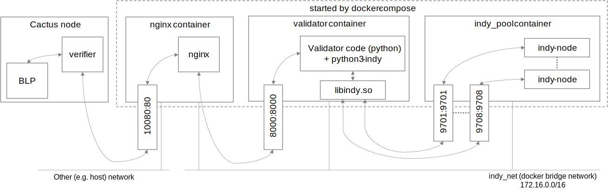

# Cactus discounted-asset-trade

## Abstract

Cactus discounted-asset-trade is a sample application that calculates asset cost based on customer type. In this application, when the users transfer the asset ownership in the cactus discounted-asset-trade, they present their employee proofs to the asset-owner company to receive an employee discount. We implement the employee proofs by proofs on Hyperledger Indy. Asset ownership is represented by a [asset-transfer-basic](https://github.com/hyperledger/fabric-samples/tree/release-2.2/asset-transfer-basic) chaincodetoken on Hyperledger Fabric, which can be exchanged for ETH currency on a private Ethereum blockchain. This Business Logic Plugin (BLP) application controls a process from employee certification using Hyperledger Indy to payment using Ethereum.


## Scenario

The application works in the following scenario:

### Settings

Alice wants to buy an asset using the services of company Thrift Corp. Alice chose this company because she is an employee of Acme Corp., which offers discounts on Thrift Corp.'s services as a benefit.

**Note** : Acme Corp and Thrift Corp have the same names on the sample application on Hyperledger Indy.

### Preparations

Alice knows that Acme Corp. provides digital certificates. She asks Acme Corp. to issue a credential when she uses various services, and the company issues it.

### When Alice Uses the Service

- Alice will use her client application to connect with discounted-asset-trade BLP application. This will create anoncreds connection between her and the BLP app.
- Alice will send a purchase order to the BLP application.
- BLP will request the proof of employment from Alice client application.
- Once verified, the BLP will decide what she should pay based on the price list and then proceed with the business logic using cactus as an escrow to transfer ETH currencies and asset ownership tokens to each other.

## Setup Overview

### fabric-connector

- Validator for fabric ledger.
- Started as part of discounted asset trade BLP.

### ethereum-validator

- Validator for ethereum ledger.
- Started as part of discounted asset trade BLP.

### cmd-socketio-base-image

- Base image for `cactus-example-discounted-asset-trade` BLP.
- Contains cactus cmd socketio server module
- It will build the image and immediately exit on run.

### cactus-example-discounted-asset-trade-blp

- Main logic for this sample application.
- Use it's endpoint (`localhost:5034`) to interact the bussiness logic.
- Docker network: `cactus-example-discounted-asset-trade-net`

## Indy Schema



## Preparations

1. Configure Cactus:

   ```
   # execute in root cactus dir
   pushd ../..
   npm run configure
   popd
   ```

1. Create settings directory and make sure you have write permission on it

   ```bash
   sudo mkdir /etc/cactus
   sudo chown -R __YOUR_USERNAME__ /etc/cactus/
   ```

1. Start the ledgers:

   ```
   ./script-start-ledgers.sh
   ```

   - This script will start all ledger docker containers, networks, and will setup configuration needed to operate the sample app.
   - (NOTICE: Before executing the above, your account needs to be added to the docker group (`usermod -a -G docker YourAccount` from root user))
   - On success, this should start three containers:
     - `geth1`
     - `asset_trade_faio2x_testnet`
     - `asset_trade_indy_all_in_one`

1. Setup Indy credentials:

   - Before running the sample application we need to register employment credential and issue it to Alice (user of our app).
   - Use `setup-credentials` script from `cactus-example-discounted-asset-trade-client`.

   ```bash
   # In separate shell (can be used later for client app)
   cd ./examples/cactus-example-discounted-asset-trade-client
   yarn setup-credentials
   popd
   ```

   - Copy the credential definition ID from the script output into this example application BLP configuration.

     ```bash
     # setup-credentials script output
     Running with log level INFO
     Connecting Alice with Issuer...
     Connecting aliceCactiAgent to issuerCactiAgent...
     Agents connected!
     Register and issue the employment credential...
     Register Credential Schema...
     Register employment certificate credential schema 'cactiJobCert'...
     Employment credential schemaId: did:indy:cacti:test:Th7MpTaRZVRYnPiabds81Y/anoncreds/v0/SCHEMA/cactiJobCert/1.0.0
     Register Credential Definition...
     Register job certificate credential definition (schemaId: 'did:indy:cacti:test:Th7MpTaRZVRYnPiabds81Y/anoncreds/v0/SCHEMA/cactiJobCert/1.0.0') ...
     # COPY THIS >>
     Employment credential credentialDefinitionId: did:indy:cacti:test:Th7MpTaRZVRYnPiabds81Y/anoncreds/v0/CLAIM_DEF/11/default
     # <<
     Issue the credential...
     Employment credential issued: 7f93ba15-98b2-4667-a7cf-ecec3059e9d4
     Accepting credential eb69032d-ec73-4fa1-bd83-1ff52a0dc4b5...
     Credential accepted!
     Credential was issed and accepted by a peer agent!
     Verify employment status proof...
     Proof request was sent
     Accepting proof 4d03e479-073a-4f51-98e4-befd7ba34345...
     Proof request accepted!
     Requested proof status: done
     Finishing - cleaning up the agents...
     All done.

     # Replace __CREDENTIAL_DEFINITION_ID__ in config file with actual credentialDefinitionId
     sed -i 's#__CREDENTIAL_DEFINITION_ID__#did:indy:cacti:test:Th7MpTaRZVRYnPiabds81Y/anoncreds/v0/CLAIM_DEF/11/default#g' "./etc/cactus/usersetting.yaml"

     # ... or do it manually in text editor
     vim ./etc/cactus/usersetting.yaml
     ```

1. Launch discounted-asset-trade and validators from local `docker-compose.yml` (use separate console for that, docker-compose will block your prompt):

   ```
   docker-compose build && docker-compose up
   # or
   npm run start
   ```

   This will build and launch all needed containers, the final output should look like this:

   ```
   ...
   cactus-example-discounted-asset-trade-indy-validator | 2022-01-31 16:00:49,552 INFO success: validator entered RUNNING state, process has stayed up for > than 1 seconds (startsecs)
   ...
   cactus-example-discounted-asset-trade-indy-validator-nginx | 2022/01/31 16:00:49 [notice] 1#1: start worker process 35
   ...
   cmd-socketio-base-dummy exited with code 0
   ...
   cactus-example-discounted-asset-trade-blp      | [2022-01-31T16:00:56.208] [INFO] www - listening on *: 5034
   ```

### Dockerless run

For development purposes, it might be useful to run the sample application outside of docker-compose environment.

1. Configure cactus and start the ledgers as described above.
1. Run `./script-dockerless-config-patch.sh` from `cactus-example-discounted-asset-trade/` directory. This will patch the configs and copy it to global location.
1. Start asset-trade: `npm run start-dockerless`

## How to use this application

- Use `run-discounted-asset-trade-client` script from `cactus-example-discounted-asset-trade-client` to interact with this application.

  ```bash
  # In separat shell
  cd ./examples/cactus-example-discounted-asset-trade-client
  yarn run-discounted-asset-trade-client

  # Sample output
  Running with log level INFO
  Connected to the discounted asset trade sample app agent! ID: 19949a1e-0ef6-449b-9c37-256449258b51
  Action: (Use arrow keys)
  ❯ Start the trade
    Get this agent credentials
    Get assets
    Exit
  ```

1. (Optional) Check credentials in Alice wallet by selecting `Get this agent credentials`.

   ```bash
   Action: Get this agent credentials
   [
     {
       "id": "eb69032d-ec73-4fa1-bd83-1ff52a0dc4b5",
       "schemaId": "did:indy:cacti:test:Th7MpTaRZVRYnPiabds81Y/anoncreds/v0/SCHEMA/cactiJobCert/1.0.0",
       # Note: This credential matches one we'll be requesting in discounted asset trade example
       "credentialDefinitionId": "did:indy:cacti:test:Th7MpTaRZVRYnPiabds81Y/anoncreds/v0/CLAIM_DEF/11/default",
       "connectionId": "32134b50-a245-4de5-8408-f35fcb069373",
       "credentials": [
         {
           "credentialRecordType": "anoncreds",
           "credentialRecordId": "dd6aba0c-8674-451d-a063-a630004be1dd"
         }
       ],
       "credentialAttributes": [
         {
           "mime-type": "text/plain",
           "name": "first_name",
           "value": "Alice"
         },
         {
           "mime-type": "text/plain",
           "name": "last_name",
           "value": "Garcia"
         },
         {
           "mime-type": "text/plain",
           "name": "salary",
           "value": "2400"
         },
         {
           "mime-type": "text/plain",
           "name": "employee_status",
           # Note: Alice is a permanent employee
           "value": "Permanent"
         },
         {
           "mime-type": "text/plain",
           "name": "experience",
           "value": "10"
         }
       ]
     }
   ]
   ```

1. (Optional) Check the balance on Ethereum and the asset ownership on Fabric by selecting `Get assets`.

   ```bash
   Action: Get assets

   # Ethereum fromAccount:
   1.00005515e+26

   # Ethereum escrowAccount:
   0

   # Ethereum toAccount:
   0

   # Fabric:
   [
     {
         ...
     },
     {
         ID: 'asset2',
         color: 'red',
         size: 5,
         owner: 'Brad',
         appraisedValue: 400
     },
     ...
   ]
   ```

1. Run the transaction execution by selecting `Start the trade`

   ```bash
   Action: Start the trade
   Trade request sent! Response: { tradeID: '20231103185232057-001' }
   ```

1. (Optional) Check the final balance on Ethereum and the asset ownership on Fabric by selecting `Get assets`.

   ```bash
   Action: Get assets

   # Ethereum fromAccount:
   1.000057e+26

   # Ethereum escrowAccount:
   0

   # Ethereum toAccount:
   25

   # Fabric:
   [
     {
         ...
     },
     {
         ID: 'asset2',
         color: 'red',
         size: 5,
         owner: 'Cathy',
         appraisedValue: 400
     },
     ...
   ]
   ```

## How to stop the application and Docker containers

1. Press `Ctrl+C` in `docker-compose` console to stop the application.
1. Run cleanup script

   ```

   sudo ./script-cleanup.sh # for root owned files
   ./script-cleanup.sh # for user owner files

   ```

#### Manual cleanup instructions

1. Remove the config files on your machine

   ```

   sudo rm -r ./etc/cactus/

   ```

1. Stop the docker containers of Ethereum, Fabric and Indy

   - `docker stop geth1 asset_trade_faio2x_testnet asset_trade_indy_all_in_one`
   - `docker rm geth1 asset_trade_faio2x_testnet asset_trade_indy_all_in_one`

1. Clear indy-all-in-one

   ```

   pushd ../../tools/docker/indy-all-in-one/
   ./script-cleanup.sh
   popd

   ```

1. Remove geth files

   ```

   pushd ../../tools/docker/geth-testnet/
   rm -fr ./data-geth1/geth/
   popd
   ```
