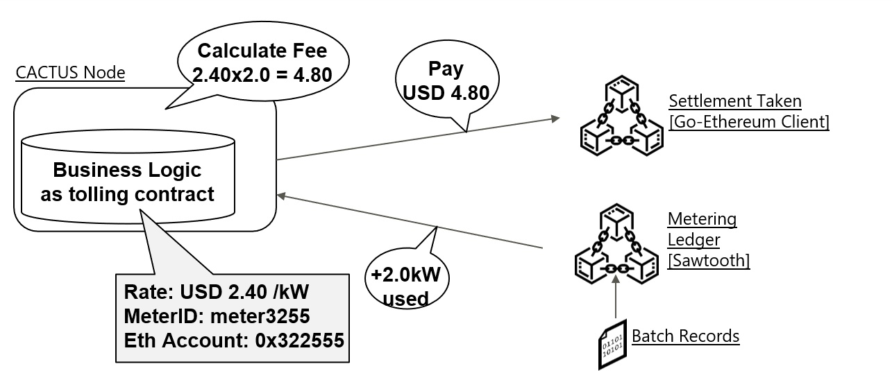

# Cactus electricity-trade

## Abstract

Cactus **electricity-trade** is a sample application for exchanging electricity (which is measured by a device that is logging to a Sawtooth blockchain) for ETH currency on a private Ethereum blockchain. When the measuring device detects power usage, a Sawtooth transaction triggers a Cactus LedgerEvent to pay the device user's currency on the Ethereum blockchain, where the amount paid is proportional to the amount of power usage recorded on the Sawtooth blockchain.
In this example, we use the Sawtooth intkey transaction processor as an application for power measurement logging.



## Required software components

- OS: Linux (recommend: Ubuntu18.04 or CentOS7)
- Docker (recommend: v17.06.2-ce or greater)
- Docker-compose (recommend: v1.14.0 or greater)
- node.js v12 (recommend: v12.20.2 or greater)

## Prerequisites

- Available directory (This directory must be empty):
  - `./etc/cactus`: the directory for storing the config files of `cactus-common-example-server`, will be mounted by the containers.

## Setup

1. Configure Cactus:

   ```
   # execute in root cactus dir
   pushd ../..
   npm run configure
   popd
   ```

1. Start the ledgers:

   ```
   ./script-start-ledgers.sh
   ```

   - This script will start all ledger docker containers, networks, and will setup configuration needed to operate the sample app.
   - (NOTICE: Before executing the above, your account needs to be added to the docker group (`usermod -a -G docker YourAccount` from root user))
   - On success, this should start the following containers:
     - `sawtooth_all_in_one_ledger_1x`
     - `geth1`

1. Launch electricity-trade and validators from local `docker-compose.yml` (use separate console for that, docker-compose will block your prompt):

   ```
   docker-compose build && docker-compose up
   # or
   npm run start
   ```

   This will build and launch all needed containers, the final output should look like this:

   ```
   cmd-socketio-base-dummy    | OK - Exit
   cmd-socketio-base-dummy exited with code 0
   cactus-example-electricity-trade-blp      | [2022-02-14T15:47:47.312] [INFO] www - Using BLP with id = h40Q9eMD
   cactus-example-electricity-trade-blp      | start Dynamic loading.
   cactus-example-electricity-trade-blp      | path: /api/v1/bl/cactus-example-electricity-trade/, routerJs: /root/cactus/dist/cactus-example-electricity-trade.js
   cactus-example-electricity-trade-blp      | path: /api/v1/bl/balance/, routerJs: /root/cactus/dist/balance.js
   cactus-example-electricity-trade-blp      | [2022-02-14T15:47:47.399] [INFO] www - listening on *: 5034
   ```

### Dockerless run

For development purposes, it might be useful to run the sample application outside of docker-compose environment.

1. Configure cactus and start the ledgers as described above.
1. Run `./script-dockerless-config-patch.sh` from `cactus-example-electricity-trade/` directory. This will patch the configs and copy it to global location.
1. Start electricity-trade: `npm run start-dockerless`

## How to use this application

- Source account on Ethereum: `06fc56347d91c6ad2dae0c3ba38eb12ab0d72e97`
- The privkey of source account on Ethereum: `cb5d48d371916a4ea1627189d8af4f642a5d72746a06b559780c3f5932658207`
- Destination account on Ethereum: `9d624f7995e8bd70251f8265f2f9f2b49f169c55`
- The key name of intkey on Sawtooth: `MI000001`

1. (Optional) Check the balance on ethereum accounts and current electricity usage

   - `./script-get-app.sh`

   The result looks like the following (note there's no electricity usage yet so the output is empty):

   ```
   # Source Eth balance:
   100000

   # Destination Eth balance:
   0

   # Electricity usage
   ```

1. Register an account information

   ```
   ./script-post-setup-request.sh
   ```

   ... or send request manually:

   ```
   curl localhost:5034/api/v1/bl/electricity-trade/meter/register/ -XPOST -H "Content-Type: application/json" -d '{"businessLogicID":"h40Q9eMD","meterParams":["MI000001", "06fc56347d91c6ad2dae0c3ba38eb12ab0d72e97", "cb5d48d371916a4ea1627189d8af4f642a5d72746a06b559780c3f5932658207", "9d624f7995e8bd70251f8265f2f9f2b49f169c55"]}'
   ```

1. Start the electricity-trade application

   - The example response of tradeID: `{"tradeID":"20210220075755506-001"}`
   - (Then, the application starts to monitor the Sawtooth blockchain)

   ```
   ./script-post-start-request.sh
   ```

   ... or send request manually:

   ```
   curl localhost:5034/api/v1/bl/electricity-trade/ -XPOST -H "Content-Type: application/json" -d '{"businessLogicID":"h40Q9eMD"}'
   ```

1. Execute the intkey transaction on Sawtooth blockchain

   - `./script-gen-electricity-usage.sh`

   The result looks like the following:

   ```
   # Create intkey batch representing electricity usage
   {
   "link": "http://rest-api:8008/batch_statuses?id=4e85337e170917c138e4f7de44c85c9dea9c5e17916fded672b90adb85a07ca009002580f8629660e26e1117e9ac15f4c1164d9dc05fc77ac8e212672dc5e97a"
   }
   # Increase usage
   {
   "link": "http://rest-api:8008/batch_statuses?id=88b4dfa2128c7ad4b646b4fe6be878948f7c17651baf9c6384080a9eaae5036e219c432b46f74331a2d56b80bf2dcc94496ff261d1a941f23210d637badacf14"
   }
   ```

1. (Optional) Check the balance on Ethereum accounts using the following script (after `##remittanceTransaction sendAsyncRequest finish` is printed)

   - `./script-get-app.sh`

   The result looks like the following:

   ```
   # Source Eth balance:
   99976

   # Destination Eth balance:
   24

   # Electricity usage
   MI000001: 74
   ```

## How to stop the application and cleanup Docker containers

1. Press `Ctrl+C` in `docker-compose` console to stop the application.
1. Run cleanup script
   ```
   sudo ./script-cleanup.sh
   ```
