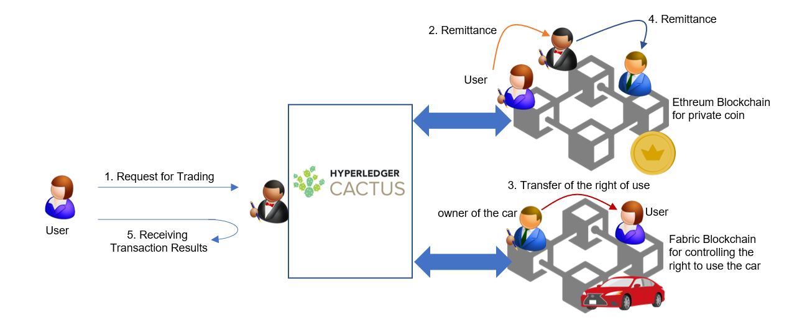

# Cactus car-trade

## Abstract

Cactus **car-trade** is a sample application where users can exchange car ownership (represented by Fabcar chaincode tokens on a Hyperledger Fabric blockchain) for ETH currency on a private Ethereum blockchain. The application takes the form of a "business logic plugin" which is a central point of our architecture.



## Required software components
- OS: Linux (CentOS7)
- Docker (recommend: v17.06.2-ce or greater)
- Docker-compose (recommend: v1.14.0 or greater)
- node.js v12 (recommend: v12.20.2 or greater)

## Prerequisites

- Available ports:
    - `5034`: the port of `cactus-cmd-socketio-server`
    - `5040`: the port of `cactus-plugin-ledger-connector-fabric-socketio`
    - `5050`: the port of `cactus-plugin-ledger-connector-go-ethereum-socketio`
    - You can modify port exported to the host in `./docker-compose.yml`
- Available directory (This directory must be empty):
    - `./etc/cactus`: the directory for storing the config files of `cactus-cmd-socket-server`, will be mounted by the containers.

## Setup
1. Configure Cactus:
    ```
    # execute in root cactus dir
    pushd ../..
    npm run configure
    popd
    ```

1. Start the ledgers:
    ```
    ./script-start-ledgers.sh
    ```
    - This script will start all ledger docker containers, networks, and will setup configuration needed to operate the sample app.
    - (NOTICE: Before executing the above, your account needs to be added to the docker group (`usermod -a -G docker YourAccount` from root user))
    - On success, this should start two containers:
        - `geth1`
        - `cartrade_faio2x_testnet`

1. Build cartrade:
    ```
    ./script-build-cartrade.sh
    ```

1. Launch cartrade and validators from local `docker-compose.yml` (use separate console for that, docker-compose will block your prompt):
    ```
    npm run start
    ```
    This will build and launch all needed containers, the final output should look like this:
    ```
    cartrade-ethereum-validator  |
    cartrade-ethereum-validator  | > @hyperledger/cactus-plugin-ledger-connector-go-ethereum-socketio@1.0.0-rc.3 start /root/cactus
    cartrade-ethereum-validator  | > cd ./dist && node common/core/bin/www.js
    cartrade-ethereum-validator  |
    cartrade-ethereum-validator  | listening on *:5050
    cartrade-fabric-socketio-validator |
    cartrade-fabric-socketio-validator | > @hyperledger/cactus-plugin-ledger-connector-fabric-socketio@1.0.0-rc.3 start /root/cactus
    cartrade-fabric-socketio-validator | > cd ./dist && node common/core/bin/www.js
    cartrade-fabric-socketio-validator |
    cartrade_blp                 | /opt/cactus-cmd-socketio-server ~/cactus
    cmd-socketio-build-dummy     | OK - Exit
    cmd-socketio-build-dummy exited with code 0
    cartrade-fabric-socketio-validator | listening on *:5040
    cartrade_blp                 | [2022-01-27T14:27:26.610] [INFO] www - Using BLP with id = guks32pf
    cartrade_blp                 | start Dynamic loading.
    cartrade_blp                 | path: /api/v1/bl/trades/, routerJs: /root/cactus/dist/trades.js
    cartrade_blp                 | path: /api/v1/bl/asset/, routerJs: /root/cactus/dist/asset.js
    cartrade_blp                 | path: /api/v1/bl/balance/, routerJs: /root/cactus/dist/balance.js
    cartrade_blp                 | path: /api/v1/bl/cars/, routerJs: /root/cactus/dist/cars.js
    cartrade_blp                 | [2022-01-27T14:27:27.324] [INFO] www - listening on *: 5034
    ```

## How to use this application

1. (Optional) Check the balance on Ethereum and the fabcar ownership on Fabric using the following script:
    - `./script-build-get-app.sh` (only the first time)
    - `./script-get-app.sh`

    The result looks like the following (simplified output):
    ```
    [process] Execute an app for getting Balance on Ethereum
    ...
    The balance of fromAccount:
    BigNumber { s: 1, e: 4, c: [ 100000 ] }
    The balance of toAccount:
    BigNumber { s: 1, e: 1, c: [ 0 ] }
    ...
    [process] Execute an app for getting ownership on Fabcar
    ...
    Transaction has been evaluated, result is: [
        {
            ...
        },
        {
            Key: 'CAR1',
            Record: { colour: 'red', make: 'Ford', model: 'Mustang', owner: 'Brad' }
        },
        ...
    ]
    ```
1. Run the transaction execution using the following script:
    ```
    ./script-post-cartrade-sample.sh
    ```
    ... or send request manually:
    ```
    curl localhost:5034/api/v1/bl/trades/ -XPOST -H "Content-Type: application/json" -d '{"businessLogicID":"guks32pf","tradeParams":["0x06fc56347d91c6ad2dae0c3ba38eb12ab0d72e97", "0x9d624f7995e8bd70251f8265f2f9f2b49f169c55", "Brad", "Cathy", 50, "CAR1"],"authParams":["none"]}'
    ```
    After this, the transactions are executed by order. When the following log appears on the console where you executed `docker-compose`, the transactions are completed.
    ```
    [INFO] BusinessLogicCartrade - ##INFO: completed cartrade, businessLogicID: guks32pf, tradeID: *******-001
    ```
1. (Optional) Check the balance on Ethereum and the fabcar ownership on Fabric using the following script
    ```
    ./script-get-app.sh
    ```
    The result looks like the following (simplified output). In the following case, 50 coins from `fromAccount` was transferred to `toAccount`, and the car ownership ("owner") was transferred from Brad to Cathy.
    ```
    [process] Execute an app for getting Balance on Ethereum
    ...
    The balance of fromAccount:
    BigNumber { s: 1, e: 4, c: [ 99950 ] }
    The balance of toAccount:
    BigNumber { s: 1, e: 1, c: [ 50 ] }
    ...
    [process] Execute an app for getting ownership on Fabcar
    ...
    Transaction has been evaluated, result is: [
        {
            ...
        },
        {
            Key: 'CAR1',
            Record: { colour: 'red', make: 'Ford', model: 'Mustang', owner: 'Cathy' }
        },
        ...
    ]
    ```

## How to stop the application and Docker containers

1. Press `Ctrl+C` in `docker-compose` console to stop the application.
1. Remove the config files on your machine
    ```
    sudo rm -r ./etc/cactus/
    ```
1. Stop the docker containers of Ethereum and Fabric
    - `docker stop geth1 cartrade_faio2x_testnet`
    - `docker rm geth1 cartrade_faio2x_testnet`
