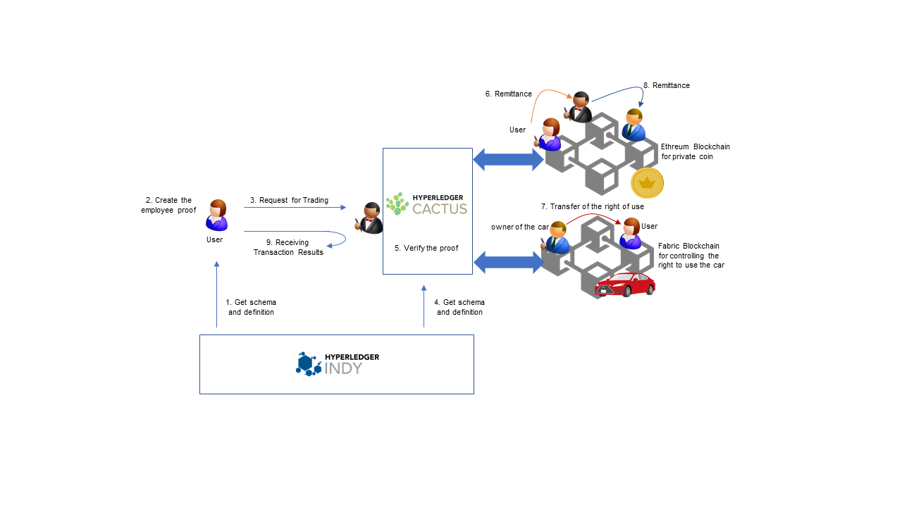
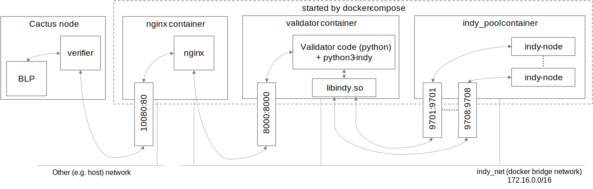

# Cactus discounted-cartrade


## Abstract

Cactus discounted-cartrade is a sample application that adds employee discounts to the original Cactus cartrade. In this application, when the users transfer the car ownership in the cactus cartrade, they present their employee proofs to the rent-a-car company to receive an employee discount. We implement the employee proofs by proofs on Hyperledger Indy. As with the original application, car ownership is represented by a Fabcar chaincodetoken on Hyperledger Fabric, which can be exchanged for ETH currency on a private Ethereum blockchain. This Business Logic Plugin (BLP) application controls a process from employee certification using Hyperledger Indy to payment using Ethereum.



## Scenario

The application works in the following scenario:

### Settings

Alice wants to rent a car using the services of rental car company Thrift Corp. Alice chose this company because she is an employee of Acme Corp., which offers discounts on Thrift Corp.'s services as a benefit.

**Note** : Acme Corp and Thrift Corp have the same names on the sample application on Hyperledger Indy.

### Preparations

Alice knows that Acme Corp. provides digital certificates. She asks Acme Corp. to issue a credential when she uses various services, and the company issues it.

### When Alice Uses the Service

Alice will use credentials and other Indy formats such as schema and definition to create an employee proof that she will present when applying the lent-a-car service. Alice then sends a car usage application and her employee proof to the Cactus Node Server via an End User Application. The employee proofs consist of proof requests and proofs on Hyperledger Indy. The Cactus Node server receives the schema and definition from the Indy ledger via Validator and uses this information to verify the proof with the BLP. Once verified, the BLP will decide what she should pay based on the price list and then proceed with the original cartrade application using cactus as an escrow to transfer ETH currencies and car ownership tokens to each other.

## Setup Overview

### fabric-socketio-validator
- Validator for fabric ledger.
- Docker networks: `fabric-all-in-one_testnet-14`, `discounted-cartrade-net`

### ethereum-validator
- Validator for ethereum ledger.
- Docker network: `geth1net`, `discounted-cartrade-net`

### indy-sdk-cli-base-image
- Base image for indy validator.
- It will build the image and immediately exit on run.

### indy-validator
- Validator for indy ledger.
- Assumes ledger runs at `172.16.0.2`
- Docker network: `indy-testnet_indy_net`
- Accessed only by nginx proxy container.

### indy-validator-nginx
- Load balancer / gateway for indy validator.
- Use it's endpoint to talk to indy validator.
- Uses config from `./nginx/nginx.conf`
- Docker network: `indy-testnet_indy_net`, `discounted-cartrade-net`

### cmd-socketio-base-image
- Base image for `discounted-cartrade` BLP.
- Contains cactus cmd socketio server module
- It will build the image and immediately exit on run.

### discounted-cartrade-blp
- Main logic for this sample application.
- Use it's endpoint (`localhost:5034`) to interact the bussiness logic.
- Docker network: `discounted-cartrade-net`

### req_discounted_cartrade
- Setup application.
- Will generate proof and store it in local configuration on startup.
- This application can also be used to send requests to the BLP.

## Indy Schema


## Preparations
1. Configure Cactus:
    ```
    # execute in root cactus dir
    pushd ../..
    npm run configure
    popd
    ```

1. Start the ledgers:
    ```
    ./script-start-ledgers.sh
    ```
    - This script will start all ledger docker containers, networks, and will setup configuration needed to operate the sample app.
    - (NOTICE: Before executing the above, your account needs to be added to the docker group (`usermod -a -G docker YourAccount` from root user))
    - On success, this should start three containers:
        - `geth1`
        - `discounted_cartrade_faio2x_testnet`
        - `indy-testnet-pool`

1. Build cartrade:
    ```
    ./script-build-discounted-cartrade.sh
    ```

1. Launch cartrade and validators from local `docker-compose.yml` (use separate console for that, docker-compose will block your prompt):
    ```
    docker-compose build && docker-compose up
    # or
    npm run start
    ```
    This will build and launch all needed containers, the final output should look like this:
    ```
    discounted-cartrade-ethereum-validator | listening on *:5050
    ...
    discounted-cartrade-fabric-socketio-validator | listening on *:5040
    ...
    discounted-cartrade-indy-validator | 2022-01-31 16:00:49,552 INFO success: validator entered RUNNING state, process has stayed up for > than 1 seconds (startsecs)
    ...
    discounted-cartrade-indy-validator-nginx | 2022/01/31 16:00:49 [notice] 1#1: start worker process 35
    ...
    cmd-socketio-base-dummy exited with code 0
    ...
    indy-sdk-cli-base-dummy exited with code 0
    ...
    req_discounted_cartrade      | Done.
    req_discounted_cartrade exited with code 0
    ...
    discounted-cartrade-blp      | [2022-01-31T16:00:56.208] [INFO] www - listening on *: 5034
    ```

## How to use this application

1. (Optional) Check the balance on Ethereum and the fabcar ownership on Fabric using the following script:
    - `./script-build-get-app.sh` (only the first time)
    - `./script-get-app.sh`

    The result looks like the following (simplified output):
    ```
    [process] Execute an app for getting Balance on Ethereum
    ...
    The balance of fromAccount:
    BigNumber { s: 1, e: 4, c: [ 100000 ] }
    The balance of toAccount:
    BigNumber { s: 1, e: 1, c: [ 0 ] }
    ...
    [process] Execute an app for getting ownership on Fabcar
    ...
    Transaction has been evaluated, result is: [
        {
            ...
        },
        {
            Key: 'CAR1',
            Record: { colour: 'red', make: 'Ford', model: 'Mustang', owner: 'Brad' }
        },
        ...
    ]
    ```
1. Run the transaction execution using the following script:
    ```
    ./script-post-discounted-cartrade-sample.sh
    ```

    ... or send request manually:

    ```
    docker run --rm -ti -v "$(pwd)/etc/cactus/":"/etc/cactus/" --net="host" req_discounted_cartrade
    ```

    After this, the transactions are executed by order. When the following log appears on the console where you executed `docker-compose`, the transactions are completed.

    ```
    [INFO] BusinessLogicCartrade - ##INFO: completed cartrade, businessLogicID: guks32pf, tradeID: *******-001
    ```

1. (Optional) Check the balance on Ethereum and the fabcar ownership on Fabric using the following script
    ```
    ./script-get-app.sh
    ```
    The result looks like the following (simplified output). In the following case, 50 coins from `fromAccount` was transferred to `toAccount`, and the car ownership ("owner") was transferred from Brad to Cathy.
    ```
    [process] Execute an app for getting Balance on Ethereum
    ...
    The balance of fromAccount:
    BigNumber { s: 1, e: 4, c: [ 99950 ] }
    The balance of toAccount:
    BigNumber { s: 1, e: 1, c: [ 50 ] }
    ...
    [process] Execute an app for getting ownership on Fabcar
    ...
    Transaction has been evaluated, result is: [
        {
            ...
        },
        {
            Key: 'CAR1',
            Record: { colour: 'red', make: 'Ford', model: 'Mustang', owner: 'Cathy' }
        },
        ...
    ]
    ```

## How to stop the application and Docker containers

1. Press `Ctrl+C` in `docker-compose` console to stop the application.
1. Remove the config files on your machine
    ```
    sudo rm -r ./etc/cactus/
    ```
1. Stop the docker containers of Ethereum and Fabric
    - `docker stop geth1 cartrade_faio2x_testnet`
    - `docker rm geth1 cartrade_faio2x_testnet`
    - `docker rm geth1 indy-testnet-pool`

1. Clear indy testnet sandbox
    ```
    pushd ../../tools/docker/indy-testnet/
    ./script-cleanup.sh
    popd
    ```
