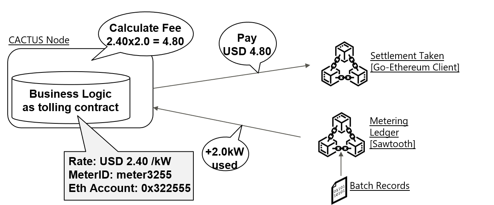

# Cactus electricity-trade

## Abstract

Cactus **electricity-trade** is a sample application for exchanging electricity (which is measured by a device that is logging to a Sawtooth blockchain) for ETH currency on a private Ethereum blockchain. When the measuring device detects power usage, a Sawtooth transaction triggers a Cactus LedgerEvent to pay the device user's currency on the Ethereum blockchain, where the amount paid is proportional to the amount of power usage recorded on the Sawtooth blockchain.
In this example, we use the Sawtooth intkey transaction processor as an application for power measurement logging.



## Required software components

- OS: Linux (recommend: Ubuntu18.04 or CentOS7)
- Docker (recommend: v17.06.2-ce or greater)
- Docker-compose (recommend: v1.14.0 or greater)
- node.js v12 (recommend: v12.20.2 or greater)

## Prerequisites

- Available ports:
    - `5034`: the port of `cactus-cmd-socketio-server`
    - `5050`: the port of `cactus-plugin-ledger-connector-go-ethereum-socketio`
    - `5140`: the port of `cactus-plugin-ledger-connector-sawtooth-socketio`
    - If it is already used, the following processes can be done by changing the port number setting
- Available directory (This directory must be empty):
    - `/etc/cactus`: the directory for storing the config files of `cactus-cmd-socketio-server`

## Boot method

1. Before booting, please prepare the directory for storing config files on the directoty `/etc/cactus` on your server
    ```
    sudo mkdir /etc/cactus
    sudo chmod 777 /etc/cactus
    ```

1. Before booting, please modify `applicationHostInfo.hostName` and `applicationHostInfo.hostPort` on `cactus/etc/cactus/default.yaml` to adjust to your environment.
    ```
    vi cactus/etc/cactus/default.yaml

    [cactus/etc/cactus/default.yaml]
    applicationHostInfo:
      hostName: http://aaa.bbb.ccc.ddd # please change hostName to your IP address
      hostPort: 5034 # if you want to change the port number, please change hostPort to the port number which you want to use
    ```

1. Start ledgers:
    ```
    cd cactus/examples/electricity-trade/
    ./script-start-ledgers.sh
    ```
    - (NOTICE: Before executing the above, your account needs to be added to the docker group (`usermod -a -G docker YourAccount` from root user))
    - If the following containers are started when displaying the container list with the docker ps command, it will be fine.
        ```
        CONTAINER ID        IMAGE                                              COMMAND                  CREATED             STATUS              PORTS                                                    NAMES
        6fe03a6e1716        hyperledger/sawtooth-shell:nightly                 "bash -c 'sawtooth k…"   4 hours ago         Up 4 hours          4004/tcp, 8008/tcp                                       sawtooth-shell-default
        c5bbe6ea9904        hyperledger/sawtooth-settings-tp:nightly           "settings-tp -vv -C …"   4 hours ago         Up 4 hours          4004/tcp                                                 sawtooth-settings-tp-default
        016eaa658ed2        hyperledger/sawtooth-intkey-tp-python:nightly      "intkey-tp-python -v…"   4 hours ago         Up 4 hours          4004/tcp                                                 sawtooth-intkey-tp-python-default
        95b77877b672        hyperledger/sawtooth-xo-tp-python:nightly          "xo-tp-python -vv -C…"   4 hours ago         Up 4 hours          4004/tcp                                                 sawtooth-xo-tp-python-default
        1d7ecbc5b84d        hyperledger/sawtooth-rest-api:nightly              "sawtooth-rest-api -…"   4 hours ago         Up 4 hours          4004/tcp, 0.0.0.0:8008->8008/tcp                         sawtooth-rest-api-default
        b44ffa3b385f        hyperledger/sawtooth-devmode-engine-rust:nightly   "devmode-engine-rust…"   4 hours ago         Up 4 hours                                                                   sawtooth-devmode-engine-rust-default
        8f50d8fbe985        hyperledger/sawtooth-validator:nightly             "bash -c 'sawadm key…"   4 hours ago         Up 4 hours          0.0.0.0:4004->4004/tcp                                   sawtooth-validator-default
        b519eb5ed1cd        ethereum/client-go:v1.8.27                         "geth --rpc --networ…"   4 hours ago         Up 4 hours          8546/tcp, 0.0.0.0:8545->8545/tcp, 30303/tcp, 30303/udp   geth1
        ```

1. Please prepare the three consoles on your machine as the following:
    - **console 1**: console for launching `cactus-plugin-ledger-connector-go-ethereum-socketio`
    - **console 2**: console for launching `cactus-plugin-ledger-connector-sawtooth-socketio`
    - **console 3**: console for launching `cactus-cmd-socketio-server` including `electricity-trade` business logic application.

1. Launch the validators:
    - Please execute [the boot methods](../../packages/cactus-plugin-ledger-connector-go-ethereum-socketio/README.md#boot-methods) of `cactus-plugin-ledger-connector-go-ethereum-socketio` on the **console 1** using the port `5050`
    - Please execute [the boot methods](../../packages/cactus-plugin-ledger-connector-sawtooth-socketio/README.md#boot-methods) of `cactus-plugin-ledger-connector-sawtooth-socketio` on the **console 2** using the port `5140`

1. Launch `cactus-cmd-socketio-server` including `electricity-trade` business logic application:
    - Use the **console 3**
    - Build base npm packages (including `cactus-cmd-socketio-server`) from  cactus root directory
        ```
        npm run configure
        ```
    - Install and build npm packages on `examples/electricity-trade`
        ```
        cd ./examples/electricity-trade
        npm install
        npm run build
        ```
    - Launch the `cactus-cmd-socketio-server` including `electricity-trade` business logic application
        ```
        cd ./examples/electricity-trade
        npm run start
        ```
    - After executing the above script, `cactus-cmd-socketio-server` is launched on the port `5034`.

## How to use this application

#### Assumption

- The parameters are used on this application
    - Source account on Ethereum: `06fc56347d91c6ad2dae0c3ba38eb12ab0d72e97`
    - The privkey of source account on Ethereum: `cb5d48d371916a4ea1627189d8af4f642a5d72746a06b559780c3f5932658207`
    - Destination account on Ethereum: `9d624f7995e8bd70251f8265f2f9f2b49f169c55`
    - The key name of intkey on Sawtooth: `MI000001`

#### Setup the application

1. Set the intkey script on Sawtooth docker:
    ```
    ./script-set-sawtooth-intkey.sh
    ```
1. Register on account information:
    ```
    curl localhost:5034/api/v1/bl/electricity-trade/meter/register/ -XPOST -H "Content-Type: application/json" -d '{"businessLogicID":"h40Q9eMD","meterParams":["MI000001", "06fc56347d91c6ad2dae0c3ba38eb12ab0d72e97", "cb5d48d371916a4ea1627189d8af4f642a5d72746a06b559780c3f5932658207", "9d624f7995e8bd70251f8265f2f9f2b49f169c55"]}'
    ```

#### Run the application

1. (Optional) Check the balance on Ethereum accounts using the following script
    - Check the balance of the source account as the following:
    ```
    curl localhost:5034/api/v1/bl/balance/06fc56347d91c6ad2dae0c3ba38eb12ab0d72e97
    ```
    - The result: `{"status":200,"amount":100000}`
    - Check the balance of the destination account:
    ```
    curl localhost:5034/api/v1/bl/balance/9d624f7995e8bd70251f8265f2f9f2b49f169c55
    ```
    - The result: `{"status":200,"amount":0}`

1. Start the electricity-trade application
    ```
    curl localhost:5034/api/v1/bl/electricity-trade/ -XPOST -H "Content-Type: application/json" -d '{"businessLogicID":"h40Q9eMD"}'
    ```
    - The example response of tradeID: `{"tradeID":"20210220075755506-001"}`
    - (Then, the application starts to monitor the Sawtooth blockchain)

1. Execute the intkey transaction on Sawtooth blockchain
    - Open the docker bash:
        ```
        docker exec -it sawtooth-shell-default bash
        ```
    - Execute the intkey transaction:
        ```
        intkey create_batch --key-name MI000001 --value-set 50 --value-inc 24
        sawtooth batch submit -f batches.intkey --url http://rest-api:8008
        ```
    - (In the above, the value of the key `MI000001` is set as 50, and increased by 24)
    - After that, exit the docker bash:
        ```
        exit
        ```

1. (Optional) Check the balance on Ethereum accounts using the following script
    - Check the balance of the source account as the following:
    ```
    curl localhost:5034/api/v1/bl/balance/06fc56347d91c6ad2dae0c3ba38eb12ab0d72e97
    ```
    - The result: `{"status":200,"amount":99976}`
    - Check the balance of the destination account:
    ```
    curl localhost:5034/api/v1/bl/balance/9d624f7995e8bd70251f8265f2f9f2b49f169c55
    ```
    - The result: `{"status":200,"amount":24}`
    - (The result shows that the asset was transferred between Ethereum addresses depending on the value of the change in Sawtooth intkey.)

## How to stop the application and cleanup Docker containers

1. Stop the validators and `cactus-cmd-server-socket`
    - Press Ctrl+C on the above the console 1, 2, and 3.
1. Remove the config files on your machine
    ```
    sudo rm -r /etc/cactus/
    ```
1. Cleanup the docker containers of Ethereum and Sawtooth
    - Run `./cleanup.sh`