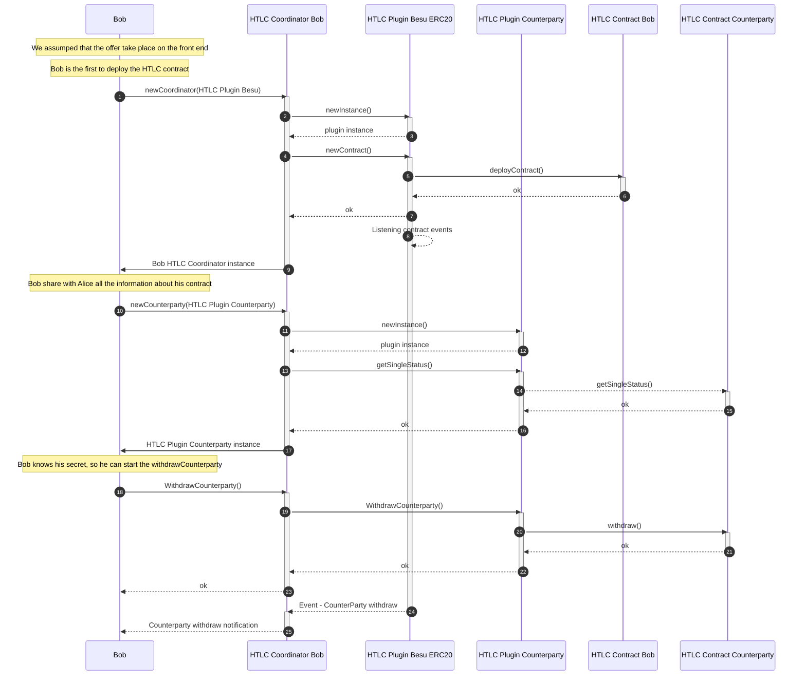

```mermaid
sequenceDiagram
autonumber
    participant Bob
    participant HTLC Coordinator Bob
    participant HTLC Plugin Besu ERC20
    participant HTLC Plugin Counterparty
    participant HTLC Contract Bob
    participant HTLC Contract Counterparty
    
    Note over Bob: We assumped that the offer take place on the front end
    Note over Bob: Bob is the first to deploy the HTLC contract
    Bob ->> HTLC Coordinator Bob: newCoordinator(HTLC Plugin Besu)
    activate HTLC Coordinator Bob
        HTLC Coordinator Bob ->> HTLC Plugin Besu ERC20:newInstance()
        activate HTLC Plugin Besu ERC20
            HTLC Plugin Besu ERC20-->> HTLC Coordinator Bob: plugin instance
        deactivate HTLC Plugin Besu ERC20
        HTLC Coordinator Bob ->> HTLC Plugin Besu ERC20:newContract()
            activate  HTLC Plugin Besu ERC20
                HTLC Plugin Besu ERC20->> HTLC Contract Bob: deployContract()
                activate HTLC Contract Bob
                    HTLC Contract Bob -->> HTLC Plugin Besu ERC20:ok
                deactivate HTLC Contract Bob
                HTLC Plugin Besu ERC20-->>  HTLC Coordinator Bob: ok
                HTLC Plugin Besu ERC20-->>  HTLC Plugin Besu ERC20:Listening contract events
           
        HTLC Coordinator Bob ->> Bob: Bob HTLC Coordinator instance
    deactivate HTLC Coordinator Bob
    Note over Bob: Bob share with Alice all the information about his contract
    Bob ->> HTLC Coordinator Bob: newCounterparty(HTLC Plugin Counterparty)
    activate HTLC Coordinator Bob
        HTLC Coordinator Bob ->> HTLC Plugin Counterparty: newInstance()
        activate HTLC Plugin Counterparty
            HTLC Plugin Counterparty-->> HTLC Coordinator Bob: plugin instance
        deactivate HTLC Plugin Counterparty
        HTLC Coordinator Bob  ->> HTLC Plugin Counterparty: getSingleStatus()
        activate HTLC Plugin Counterparty
            HTLC Plugin Counterparty -->> HTLC Contract Counterparty: getSingleStatus()
            activate HTLC Contract Counterparty
            HTLC Contract Counterparty -->> HTLC Plugin Counterparty: ok
            deactivate HTLC Contract Counterparty
            HTLC Plugin Counterparty -->>  HTLC Coordinator Bob: ok
        deactivate HTLC Plugin Counterparty
        HTLC Coordinator Bob ->> Bob: HTLC Plugin Counterparty instance
    deactivate HTLC Coordinator Bob
    
    
   Note over Bob: Bob knows his secret, so he can start the withdrawCounterparty
    Bob ->> HTLC Coordinator Bob: WithdrawCounterparty()
    activate HTLC Coordinator Bob
        HTLC Coordinator Bob ->> HTLC Plugin Counterparty: WithdrawCounterparty()
        activate HTLC Plugin Counterparty
        HTLC Plugin Counterparty ->> HTLC Contract Counterparty: withdraw()
            activate HTLC Contract Counterparty
                HTLC Contract Counterparty -->> HTLC Plugin Counterparty: ok
            deactivate HTLC Contract Counterparty
            HTLC Plugin Counterparty -->>  HTLC Coordinator Bob: ok
        deactivate HTLC Plugin Counterparty
    HTLC Coordinator Bob -->> Bob: ok
    deactivate HTLC Coordinator Bob
     HTLC Plugin Besu ERC20-->> HTLC Coordinator Bob: Event - CounterParty withdraw
    deactivate HTLC Plugin Besu ERC20
    activate HTLC Coordinator Bob
        HTLC Coordinator Bob -->> Bob: Counterparty withdraw notification
    deactivate HTLC Coordinator Bob
    
```