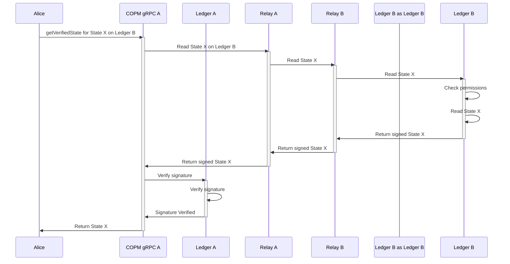
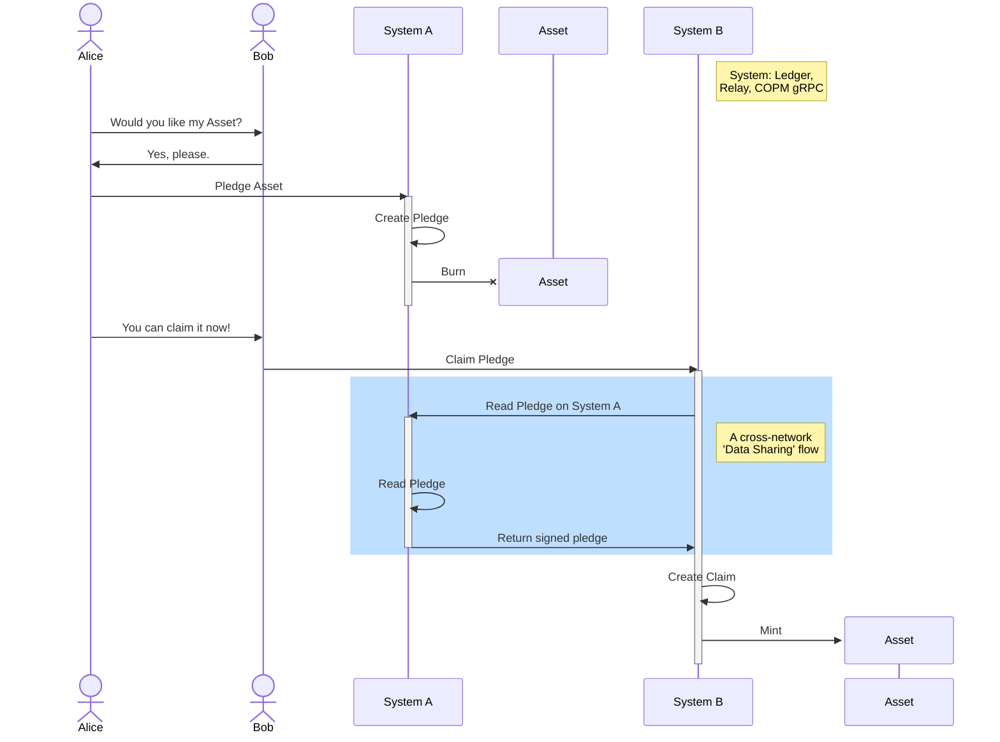
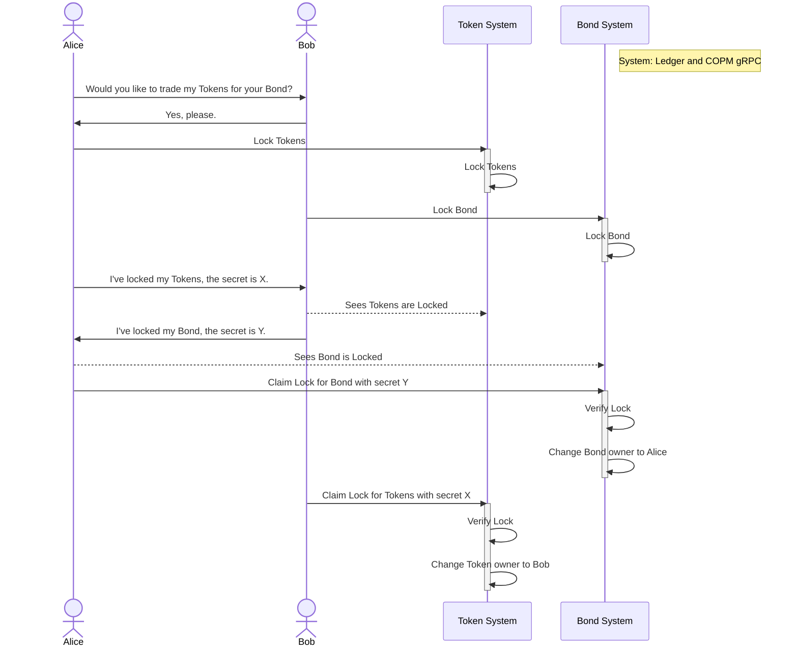

- [Overview](#overview)
- [Usage](#usage)
  - [Installation](#installation)
  - [Data Sharing](#data-sharing)
    - [COPM Command](#copm-command)
    - [Figure: Data Sharing with getVerifiedState](#figure-data-sharing-with-getverifiedstate)
  - [Asset Transfer](#asset-transfer)
    - [COPM Commands](#copm-commands)
    - [Figure: Asset Transfer Pledge and ClaimPledge](#figure-asset-transfer-pledge-and-claimpledge)
  - [Asset Exchange](#asset-exchange)
    - [COPM Commands](#copm-commands-1)
    - [Figure: Asset Exchange with Lock and ClaimLock](#figure-asset-exchange-with-lock-and-claimlock)
- [Development](#development)

# Overview

This package defines the common types, interfaces, and endpoints for the
COPM module to be used by Digital Ledger-specific implementations.

These endpoints require specific chaincode and weaver relays to be deployed on the network.
Please refer to [the Weaver documentation](https://hyperledger-cacti.github.io/cacti/weaver/introduction/).

# Usage

For a detailed command specification, please refer to the [OpenAPI Endpoint Documentation](https://hyperledger-cacti.github.io/cacti/references/openapi/cacti-copm-core_openapi/)

## Installation

Yarn: 

    yarn add --exact @hyperledger-cacti/cacti-copm-core

## Data Sharing
 - ability to read data on another network
 - the other network must first give you permission
  
### COPM Command
 - getVerifiedState

### Figure: Data Sharing with getVerifiedState

## Asset Transfer

 - Asset changes networks
 - Asset burnt on Ledger A, minted on Ledger B
 - Introduces 2 ledger data types:
    - Pledge
       - A record created on Ledger A when an asset is burnt
       - Contains details about the asset, who it is promised to 
   - Claim
        - A record created on Ledger B when the pledged asset is minted
### COPM Commands
  - Pledge
  - ClaimPledge

### Figure: Asset Transfer Pledge and ClaimPledge

## Asset Exchange

 - Assets stay where they are
 - Two parties swap asset ownership of two assets
   - Assets can be on different networks
 - Uses HTLC (Hash Time Lock Contract) 
 - Both parties have visibility of both assets/networks
 - No inter-network communication needed 
    - no relays 

### COPM Commands
 - Lock
 - ClaimLock 
  
### Figure: Asset Exchange with Lock and ClaimLock

# Development

When implementing a new distributed ledger, the following interfaces must be implemented:

- DLTransactionContext:  Implements running a transaction on the local network
- DLRemoteTransactionContext: Uses the weaver relays to run a transaction on another network
- DLTransactionContextFactory: Factory to return either local or remote context for the specific DLT.
