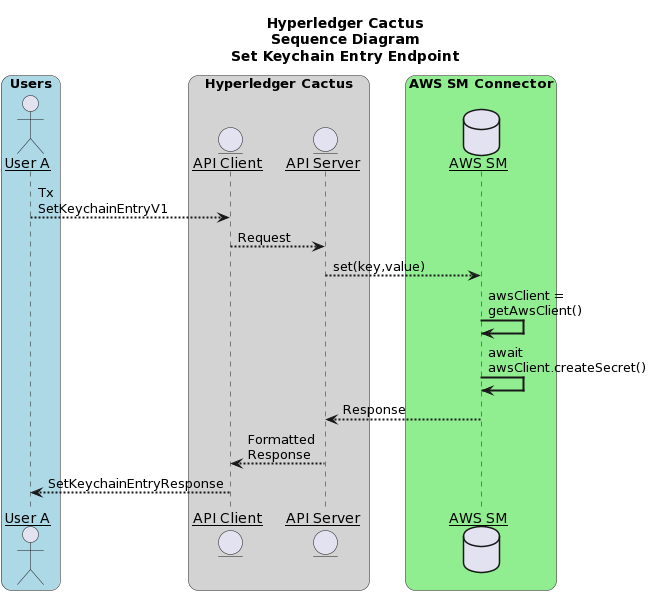
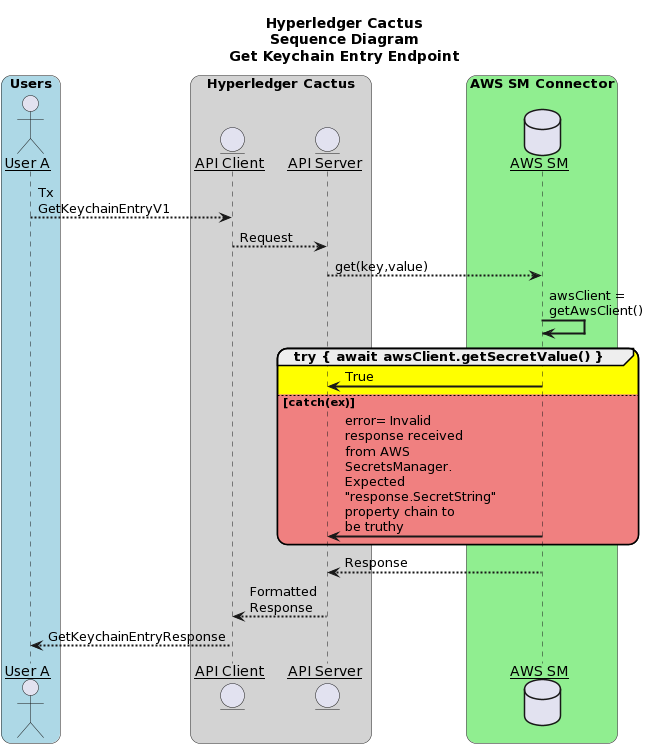
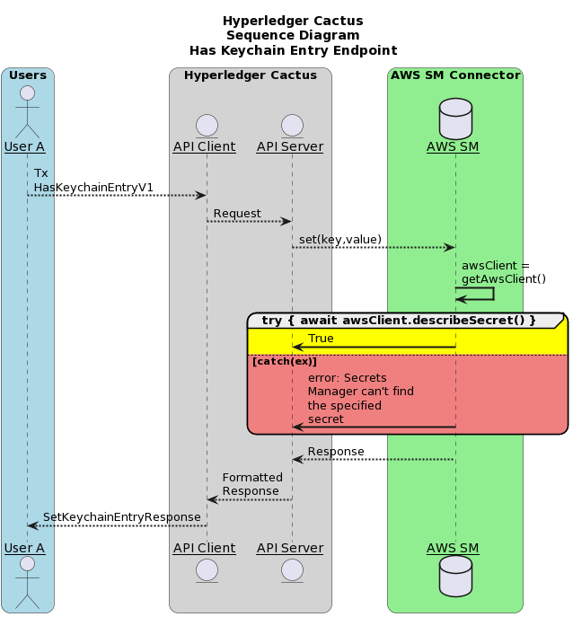
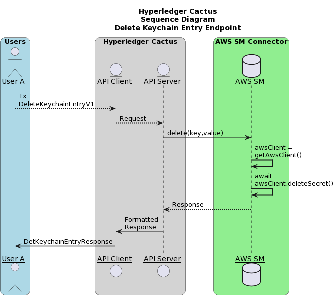

# `@hyperledger/cactus-plugin-keychain-aws-sm`

- [`@hyperledger/cactus-plugin-keychain-aws-sm`](#hyperledgercactus-plugin-keychain-aws-sm)
  - [1. Usage](#1-usage)
    - [1.1. Installation](#11-installation)
    - [1.2. Using as a Library](#12-using-as-a-library)
    - [1.3. Using via the API Client](#13-using-via-the-api-client)
  - [2. Architecture](#2-architecture)
    - [2.1. set-keychain-entry-endpoint](#21-set-keychain-entry-endpoint)
    - [2.2. get-keychain-entry-endpoint](#22-get-keychain-entry-endpoint)
    - [2.3. has-keychain-entry-endpoint](#23-has-keychain-entry-endpoint)
    - [2.4. delete-keychain-entry-endpoint](#24-delete-keychain-entry-endpoint)
  - [3. Monitoring](#3-monitoring)
    - [3.1. Prometheus Exporter](#31-prometheus-exporter)
      - [3.1.1. Usage Prometheus](#311-usage-prometheus)
      - [3.1.2. Prometheus Integration](#312-prometheus-integration)
      - [3.1.3. Helper code](#313-helper-code)
        - [3.1.3.1. response.type.ts](#3131-responsetypets)
        - [3.1.3.2. data-fetcher.ts](#3132-data-fetcherts)
        - [3.1.3.3. metrics.ts](#3133-metricsts)
  - [4. Contributing](#4-contributing)
  - [5. License](#5-license)
  - [6. Acknowledgments](#6-acknowledgments)
## 1. Usage

This plugin provides a way to interact with the AWS Secrets Manager.
Using this one can perform:
* Set key,value pair
* Get value for a particular key
* Check if a certain key exists
* Delete a certain key,value pair

The above functionality can either be accessed by importing hte plugin directly as a library (embedding) or by hosting it as a REST API through the [Cactus API server](https://www.npmjs.com/package/@hyperledger/cactus-cmd-api-server)

We also publish the [Cactus API server as a container image](https://github.com/hyperledger/cactus/pkgs/container/cactus-cmd-api-server) to the Github Container Registry that you can run easily with a one liner.
The API server is also embeddable in your own NodeJS project if you choose to do so.

### 1.1. Installation

**npm**

```sh
npm install @hyperledger/cactus-plugin-keychain-aws-sm
```

**yarn**

```sh
yarn add @hyperledger/cactus-plugin-keychain-aws-sm
```

### 1.2. Using as a Library

```typescript
import {
  PluginKeychainAwsSm,
  AwsCredentialType,
} from "@hyperledger/cactus-plugin-keychain-aws-sm";

const plugin = new PluginKeychainAwsSm({
    // See test cases for exact details on what parameters are needed
});

const res = await plugin.get(
    // See function definition for exact details on what parameters are needed and the corresponding output
);
```

### 1.3. Using via the API Client

**Prerequisites**
- An AWS account with access to AWS Secrets Manager
- You have a running Cactus API server on `$HOST:$PORT` with the AWS Secrets Manager connector plugin installed on it (and the latter configured to have access to the AWS Secrets manager from point 1)

```typescript
import {
  PluginKeychainAwsSm,
  AwsCredentialType,
  DefaultApi as KeychainAwsSmApi,
} from "@hyperledger/cactus-plugin-keychain-aws-sm";

// Step zero is to deploy the Cactus API server
const apiUrl = `https://${HOST}:${PORT}`;

const config = new Configuration({ basePath: apiUrl });

const apiClient = new KeychainAwsSmApi(config);

// Example: To set a key,value pair 
const res = await apiClient.setKeychainEntryV1({
      key: key,
      value: value,
});
```

## 2. Architecture
The sequence diagrams for various endpoints are mentioned below

### 2.1. set-keychain-entry-endpoint 



### 2.2. get-keychain-entry-endpoint 



### 2.3. has-keychain-entry-endpoint 



### 2.4. delete-keychain-entry-endpoint 



## 3. Monitoring 
This section explains various monitoring tools used
### 3.1. Prometheus Exporter

This creates a prometheus exporter, which scraps the transactions (total transaction count) for the use cases incorporating the use of AWS Secret Manager connector plugin.


#### 3.1.1. Usage Prometheus
The prometheus exporter object is initialized in the `PluginKeychainAwsSm` class constructor itself, so instantiating the object of the `PluginKeychainAwsSm` class, gives access to the exporter object.
You can also initialize the prometheus exporter object seperately and then pass it to the `IPluginKeychainAwsSmOptions` interface for `PluginKeychainAwsSm` constructor.

`getPrometheusExporterMetricsEndpointV1` function returns the prometheus exporter metrics, currently displaying the total transaction count, which currently increments everytime the `set()` method of the `PluginKeychainAwsSm` class is called and decreases everytime the `delete()` method of the `PluginKeychainAwsSm` class is called.

#### 3.1.2. Prometheus Integration
To use Prometheus with this exporter make sure to install [Prometheus main component](https://prometheus.io/download/).
Once Prometheus is setup, the corresponding scrape_config needs to be added to the prometheus.yml

```(yaml)
- job_name: 'aws_sm_exporter'
  metrics_path: 'api/v1/plugins/@hyperledger/cactus-plugin-keychain-aws-sm/get-prometheus-exporter-metrics'
  scrape_interval: 5s
  static_configs:
    - targets: ['{host}:{port}']
```

Here the `host:port` is where the prometheus exporter metrics are exposed. The test cases (For example, packages/cactus-plugin-keychain-aws-sm/src/test/typescript/integration/plugin-keychain-aws-sm.test.ts) exposes it over `0.0.0.0` and a random port(). The random port can be found in the running logs of the test case and looks like (42379 in the below mentioned URL)
`Metrics URL: http://0.0.0.0:42379/api/v1/plugins/@hyperledger/cactus-plugin-keychain-aws-sm/get-prometheus-exporter-metrics`

Once edited, you can start the prometheus service by referencing the above edited prometheus.yml file.
On the prometheus graphical interface (defaulted to http://localhost:9090), choose **Graph** from the menu bar, then select the **Console** tab. From the **Insert metric at cursor** drop down, select **cactus_keychain_awssm_managed_key_count** and click **execute**

#### 3.1.3. Helper code

##### 3.1.3.1. response.type.ts
This file contains the various responses of the metrics.

##### 3.1.3.2. data-fetcher.ts
This file contains functions encasing the logic to process the data points

##### 3.1.3.3. metrics.ts
This file lists all the prometheus metrics and what they are used for.

## 4. Contributing

We welcome contributions to Hyperledger Cactus in many forms, and there’s always plenty to do!

Please review [CONTRIBUTING.md](../../CONTRIBUTING.md) to get started.

## 5. License

This distribution is published under the Apache License Version 2.0 found in the [LICENSE](../../LICENSE) file.

## 6. Acknowledgments
