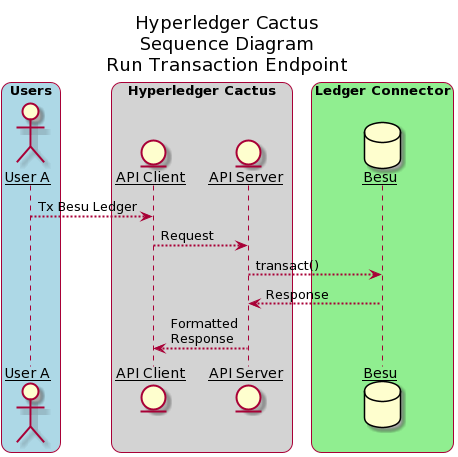
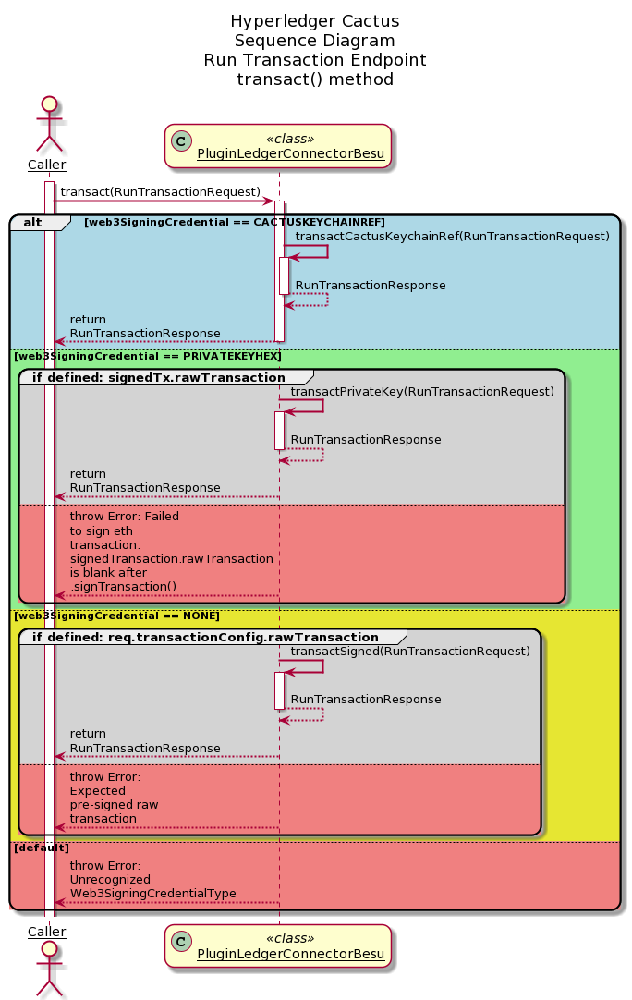
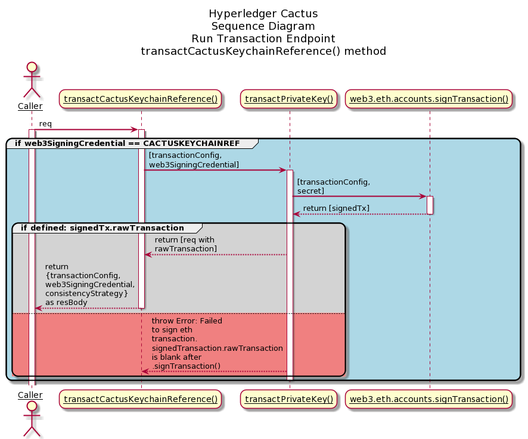
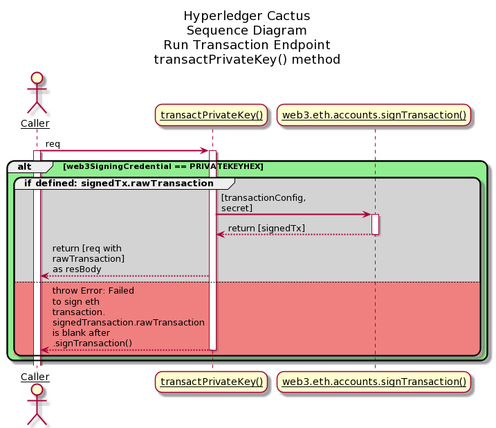
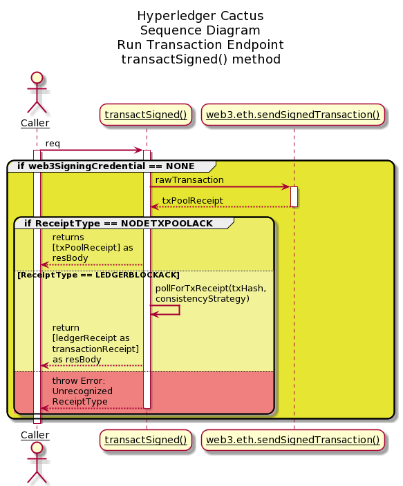
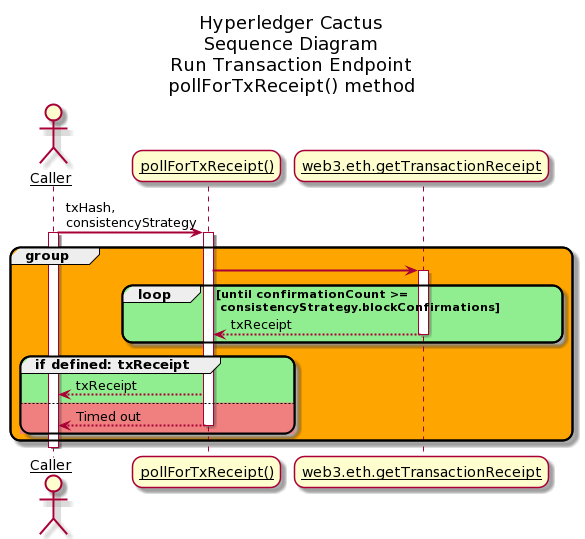

# `@hyperledger/cactus-plugin-ledger-connector-besu`

This plugin provides `Cactus` a way to interact with Besu networks. Using this we can perform:
* Deploy Smart-contracts through bytecode.
* Build and sign transactions using different keystores.
* Invoke smart-contract functions that we have deployed on the network.
## Summary

  - [Getting Started](#getting-started)
  - [Architecture](#architecture)
  - [Usage](#usage)
  - [Prometheus Exporter](#prometheus-exporter)
  - [Runing the tests](#running-the-tests)
  - [Built With](#built-with)
  - [Contributing](#contributing)
  - [License](#license)
  - [Acknowledgments](#acknowledgments)

## Getting Started

Clone the git repository on your local machine. Follow these instructions that will get you a copy of the project up and running on
your local machine for development and testing purposes.

### Prerequisites

In the root of the project to install the dependencies execute the command:
```sh
npm run configure
```

### Compiling

In the project root folder, run this command to compile the plugin and create the dist directory:
```sh
npm run tsc
```

### Architecture
The sequence diagrams for various endpoints are mentioned below

#### run-transaction-endpoint

The above diagram shows the sequence diagram of run-transaction-endpoint. User A (One of the many Users) interacts with the API Client which in turn, calls the API server. API server then executes transact() method which is explained in detailed in the subsequent diagrams.

The above diagram shows the sequence diagraom of transact() method of the PluginLedgerConnectorBesu class. The caller to this function, which in reference to the above sequence diagram is API server, sends RunTransactionRequest object as an argument to the transact() method. Based on the type of Web3SigningCredentialType, corresponsing responses are sent back to the caller.  

The above diagram shows transactCactusKeychainReference() method being called by the transact() method of the PluginLedgerConnector class when the Web3SigningCredentialType is CACTUSKEYCHAINREF. This method inturn calls transactPrivateKey() which calls the signTransaction() method of web3 library. 

The above diagram shows transactPrivateKey() method being called by the transact() method of the PluginLedgerConnector class when the Web3SigningCredentialType is PRIVATEKEYHEX. This method then calls the signTransaction() method of the web3 library.

The above diagram shows transactSigned() method being called by the transact() method of the PluginLedgerConnector class when the Web3SigningCredentialType is NONE. This method calls the sendSignedTransaction() of the web3 library and then calls pollForTxReceipt() method.

The above diagram shows pollForTxReceipt() method which is called by the transactSigned() method as described in the previous sequence diagram. This method waits for the block confirmation in a loop and then sends the corresponding response back to the caller.

### Usage

To use this import public-api and create new **PluginFactoryLedgerConnector**. Then use it to create a connector.
```typescript
const factory = new PluginFactoryLedgerConnector({
    pluginImportType: PluginImportType.LOCAL,
  });
  const connector: PluginLedgerConnectorBesu = await factory.create({
    rpcApiHttpHost,
    instanceId: uuidv4(),
    pluginRegistry: new PluginRegistry(),
  });
```
You can make calls through the connector to the plugin API:

```typescript
async invokeContract(req: InvokeContractV1Request):Promise<InvokeContractV1Response>;
async transactSigned(rawTransaction: string): Promise<RunTransactionResponse>;
async transactPrivateKey(req: RunTransactionRequest): Promise<RunTransactionResponse>;
async transactCactusKeychainRef(req: RunTransactionRequest):Promise<RunTransactionResponse>;
async deployContract(req: DeployContractSolidityBytecodeV1Request):Promise<RunTransactionResponse>;
async signTransaction(req: SignTransactionRequest):Promise<Optional<SignTransactionResponse>>;
```

Call example to deploy a contract:
```typescript
const deployOut = await connector.deployContract({
  web3SigningCredential: {
    ethAccount: firstHighNetWorthAccount,
    secret: besuKeyPair.privateKey,
    type: Web3SigningCredentialType.PrivateKeyHex,
  },
  bytecode: SmartContractJson.bytecode,
  gas: 1000000,
});
```
The field "type" can have the following values:
```typescript
enum Web3SigningCredentialType {
    CACTUSKEYCHAINREF = 'CACTUS_KEYCHAIN_REF',
    GETHKEYCHAINPASSWORD = 'GETH_KEYCHAIN_PASSWORD',
    PRIVATEKEYHEX = 'PRIVATE_KEY_HEX',
    NONE = 'NONE'
}
```

### Transaction Privacy Feature
Private transactions using Besu are currently enabled.

The privateFor and privateFrom fields must be populated, more information about Besu Private Transactions [here](https://besu.hyperledger.org/en/stable/Concepts/Privacy/Private-Transactions/).

Call example to deploy a private contract:
```typescript
  const deployOut = await connector1.deployContract({
    bytecode: SmartContract.bytecode,
    contractAbi: SmartContract.abi,
    contractName: SmartContract.contractName,
    constructorArgs: [],
    privateTransactionConfig: {
      privateFrom: SendingTesseraPublicKey,
      privateFor: [
        Member1TesseraPrivateKey,
        Member2TesseraPrivateKey,
      ],
    },
    web3SigningCredential: {
      secret:SendingBesuPrivateKey,
      type: Web3SigningCredentialType.PrivateKeyHex,
    },
    gas: 3000000
  });
```

> Extensive documentation and examples in the [readthedocs](https://readthedocs.org/projects/hyperledger-cactus/) (WIP) 


### Building/running the container image locally

In the Cactus project root say:

```sh
DOCKER_BUILDKIT=1 docker build -f ./packages/cactus-plugin-ledger-connector-besu/Dockerfile . -t cplcb
```

Build with a specific version of the npm package:
```sh
DOCKER_BUILDKIT=1 docker build --build-arg NPM_PKG_VERSION=0.4.1 -f ./packages/cactus-plugin-ledger-connector-besu/Dockerfile . -t cplcb
```

#### Running the container

Launch container with plugin configuration as an **environment variable**:
```sh
docker run \
  --rm \
  --publish 3000:3000 \
  --publish 4000:4000 \
  --env PLUGINS='[{"packageName": "@hyperledger/cactus-plugin-ledger-connector-besu", "type": "org.hyperledger.cactus.plugin_import_type.LOCAL", "action": "org.hyperledger.cactus.plugin_import_action.INSTALL",  "options": {"rpcApiHttpHost": "http://localhost:8545", "instanceId": "some-unique-besu-connector-instance-id"}}]' \
  cplcb
```

Launch container with plugin configuration as a **CLI argument**:
```sh
docker run \
  --rm \
  --publish 3000:3000 \
   --publish 4000:4000 \
  cplcb \
    ./node_modules/.bin/cactusapi \
    --plugins='[{"packageName": "@hyperledger/cactus-plugin-ledger-connector-besu", "type": "org.hyperledger.cactus.plugin_import_type.LOCAL", "action": "org.hyperledger.cactus.plugin_import_action.INSTALL",  "options": {"rpcApiHttpHost": "http://localhost:8545", "instanceId": "some-unique-besu-connector-instance-id"}}]'
```

Launch container with **configuration file** mounted from host machine:
```sh

echo '[{"packageName": "@hyperledger/cactus-plugin-ledger-connector-besu", "type": "org.hyperledger.cactus.plugin_import_type.LOCAL", "action": "org.hyperledger.cactus.plugin_import_action.INSTALL",  "options": {"rpcApiHttpHost": "http://localhost:8545", "instanceId": "some-unique-besu-connector-instance-id"}}]' > cactus.json

docker run \
  --rm \
  --publish 3000:3000 \
  --publish 4000:4000 \
  --mount type=bind,source="$(pwd)"/cactus.json,target=/cactus.json \
  cplcb \
    ./node_modules/.bin/cactusapi \
    --config-file=/cactus.json
```

#### Testing API calls with the container

Don't have a Besu network on hand to test with? Test or develop against our Besu All-In-One container!

**Terminal Window 1 (Ledger)**
```sh
docker run -p 0.0.0.0:8545:8545/tcp  -p 0.0.0.0:8546:8546/tcp  -p 0.0.0.0:8888:8888/tcp  -p 0.0.0.0:9001:9001/tcp  -p 0.0.0.0:9545:9545/tcp hyperledger/cactus-besu-all-in-one:latest
```

**Terminal Window 2 (Cactus API Server)**
```sh
docker run \
  --network host \
  --rm \
  --publish 3000:3000 \
  --publish 4000:4000 \
  --env PLUGINS='[{"packageName": "@hyperledger/cactus-plugin-ledger-connector-besu", "type": "org.hyperledger.cactus.plugin_import_type.LOCAL", "action": "org.hyperledger.cactus.plugin_import_action.INSTALL",  "options": {"rpcApiHttpHost": "http://localhost:8545", "instanceId": "some-unique-besu-connector-instance-id"}}]' \
  cplcb
```

**Terminal Window 3 (curl - replace eth accounts as needed)**
```sh
curl --location --request POST 'http://127.0.0.1:4000/api/v1/plugins/@hyperledger/cactus-plugin-ledger-connector-besu/run-transaction' \
--header 'Content-Type: application/json' \
--data-raw '{
    "web3SigningCredential": {
      "ethAccount": "627306090abaB3A6e1400e9345bC60c78a8BEf57",
      "secret": "c87509a1c067bbde78beb793e6fa76530b6382a4c0241e5e4a9ec0a0f44dc0d3",
      "type": "PRIVATE_KEY_HEX"
    },
    "consistencyStrategy": {
      "blockConfirmations": 0,
      "receiptType": "NODE_TX_POOL_ACK"
    },
    "transactionConfig": {
      "from": "627306090abaB3A6e1400e9345bC60c78a8BEf57",
      "to": "f17f52151EbEF6C7334FAD080c5704D77216b732",
      "value": 1,
      "gas": 10000000
    }
}'
```

The above should produce a response that looks similar to this:

```json
{
    "success": true,
    "data": {
        "transactionReceipt": {
            "blockHash": "0x7c97c038a5d3bd84613fe23ed442695276d5d2df97f4e7c4f10ca06765033ffd",
            "blockNumber": 1218,
            "contractAddress": null,
            "cumulativeGasUsed": 21000,
            "from": "0x627306090abab3a6e1400e9345bc60c78a8bef57",
            "gasUsed": 21000,
            "logs": [],
            "logsBloom": "0x00000000000000000000000000000000000000000000000000000000000000000000000000000000000000000000000000000000000000000000000000000000000000000000000000000000000000000000000000000000000000000000000000000000000000000000000000000000000000000000000000000000000000000000000000000000000000000000000000000000000000000000000000000000000000000000000000000000000000000000000000000000000000000000000000000000000000000000000000000000000000000000000000000000000000000000000000000000000000000000000000000000000000000000000000000000",
            "status": true,
            "to": "0xf17f52151ebef6c7334fad080c5704d77216b732",
            "transactionHash": "0xc7fcb46c735bdc696d500bfc70c72595a2b8c31813929e5c61d9a5aec3376d6f",
            "transactionIndex": 0
        }
    }
}
```

## Prometheus Exporter

This class creates a prometheus exporter, which scrapes the transactions (total transaction count) for the use cases incorporating the use of Besu connector plugin.

### Prometheus Exporter Usage
The prometheus exporter object is initialized in the `PluginLedgerConnectorBesu` class constructor itself, so instantiating the object of the `PluginLedgerConnectorBesu` class, gives access to the exporter object.
You can also initialize the prometheus exporter object seperately and then pass it to the `IPluginLedgerConnectorBesuOptions` interface for `PluginLedgerConnectoBesu` constructor.

`getPrometheusMetricsV1` function returns the prometheus exporter metrics, currently displaying the total transaction count, which currently increments everytime the `transact()` method of the `PluginLedgerConnectorBesu` class is called.

### Prometheus Integration
To use Prometheus with this exporter make sure to install [Prometheus main component](https://prometheus.io/download/).
Once Prometheus is setup, the corresponding scrape_config needs to be added to the prometheus.yml

```(yaml)
- job_name: 'besu_ledger_connector_exporter'
  metrics_path: api/v1/plugins/@hyperledger/cactus-plugin-ledger-connector-besu/get-prometheus-exporter-metrics
  scrape_interval: 5s
  static_configs:
    - targets: ['{host}:{port}']
```

Here the `host:port` is where the prometheus exporter metrics are exposed. The test cases (For example, packages/cactus-plugin-ledger-connector-besu/src/test/typescript/integration/plugin-ledger-connector-besu/deploy-contract/deploy-contract-from-json.test.ts) exposes it over `0.0.0.0` and a random port(). The random port can be found in the running logs of the test case and looks like (42379 in the below mentioned URL)
`Metrics URL: http://0.0.0.0:42379/api/v1/plugins/@hyperledger/cactus-plugin-ledger-connector-besu/get-prometheus-exporter-metrics`

Once edited, you can start the prometheus service by referencing the above edited prometheus.yml file.
On the prometheus graphical interface (defaulted to http://localhost:9090), choose **Graph** from the menu bar, then select the **Console** tab. From the **Insert metric at cursor** drop down, select **cactus_besu_total_tx_count** and click **execute**

### Helper code

###### response.type.ts
This file contains the various responses of the metrics.

###### data-fetcher.ts
This file contains functions encasing the logic to process the data points

###### metrics.ts
This file lists all the prometheus metrics and what they are used for.

## Running the tests

To check that all has been installed correctly and that the pugin has no errors run the tests:

* Run this command at the project's root:
```sh
npm run test:plugin-ledger-connector-besu
```

## Contributing

We welcome contributions to Hyperledger Cactus in many forms, and there’s always plenty to do!

Please review [CONTIRBUTING.md](../../CONTRIBUTING.md) to get started.

## License

This distribution is published under the Apache License Version 2.0 found in the [LICENSE](../../LICENSE) file.

## Acknowledgments 
