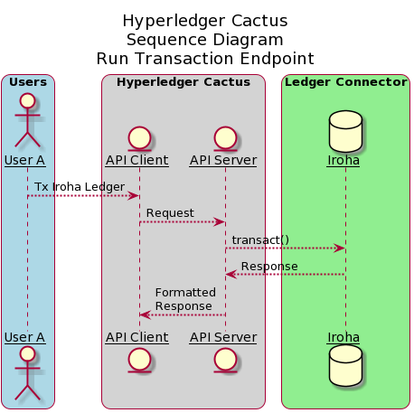
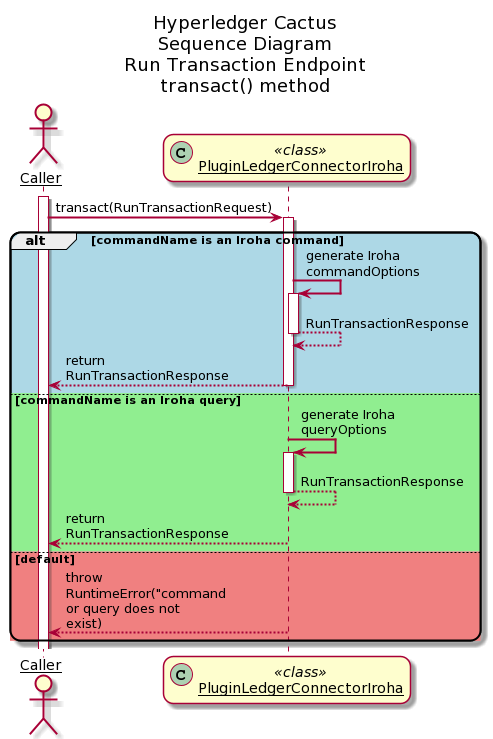

# `@hyperledger/cactus-plugin-ledger-connector-iroha`

This plugin provides `Cactus` a way to interact with Iroha networks. Using this we can perform:
* Run various Iroha leger commands and queries.
* Build and sign transactions using any arbitrary credential.
## Summary

  - [Getting Started](#getting-started)
  - [Architecture](#architecture)
  - [Usage](#usage)
  - [Runing the tests](#running-the-tests)
  - [Built With](#built-with)
  - [Contributing](#contributing)
  - [License](#license)
  - [Acknowledgments](#acknowledgments)

## Getting Started

Clone the git repository on your local machine. Follow these instructions that will get you a copy of the project up and running on your local machine for development and testing purposes.

### Prerequisites

In the root of the project, execute the command to install the dependencies:
```sh
yarn run configure
```

### Compiling

In the project root folder, run this command to compile the plugin and create the dist directory:
```sh
# For one off builds:
yarn run build:dev:backend
```

```sh
# For continuous watching of the source code with 
# automatic recompilation (more convenient) 
yarn run watch
```

### Architecture
The sequence diagrams for various endpoints are mentioned below

#### run-transaction-endpoint


The above diagram shows the sequence diagram of run-transaction-endpoint. User A (One of the many Users) interacts with the API Client which in turn, calls the API server. The API server then executes `transact()` method which is explained in detailed in the subsequent diagrams.



The above diagram shows the sequence diagram of `transact()` method of the `PluginLedgerConnectorIroha` class. The caller to this function, which in reference to the above sequence diagram is API server, sends `RunTransactionRequestV1` object as an argument to the `transact()` method. Based on the exact command name of the request, corresponsing response `RunTransactionResponse` is sent back to the caller.  

### Usage

To use this import public-api and create new **PluginFactoryLedgerConnector**. Then use it to create a connector.
```typescript
  const factory = new PluginFactoryLedgerConnector({
    pluginImportType: PluginImportType.Local,
  });

  const connector: PluginLedgerConnectorIroha = await factory.create({
    rpcToriiPortHost,
    instanceId: uuidv4(),
    pluginRegistry: new PluginRegistry(),
  });
```
You can make calls through the connector to the plugin API:

```typescript
async transact(req: RunTransactionRequestV1):Promise<RunTransactionResponse>;
```

Call example to run an Iroha execute account command:
```typescript
    const req = {
      commandName: IrohaCommand.CreateAccount,
      baseConfig: {
        irohaHost: "localhost",
        irohaPort: 50051,
        creatorAccountId: "admin@test",
        privKey: ["f101537e319568c765b2cc89698325604991dca57b9716b58016b253506cab70"],
        quorum: 1,
        timeoutLimit: 5000,
      },
    const res = await apiClient.runTransactionV1(req);
```
Call example to run an Iroha get account query:
```typescript
    const req = {
      commandName: IrohaQuery.GetAccount,
      baseConfig: {
        irohaHost: "localhost",
        irohaPort: 50051,
        creatorAccountId: "admin@test",
        privKey: ["f101537e319568c765b2cc89698325604991dca57b9716b58016b253506cab70"],
        quorum: 1,
        timeoutLimit: 5000,
      },
      params: ["admin@test"],
    };
    const res = await apiClient.runTransactionV1(req);
```
> Extensive documentation and examples in the [readthedocs](https://readthedocs.org/projects/hyperledger-cactus/) (WIP) 


### Building/running the container image locally

In the Cactus project root say:

```sh
DOCKER_BUILDKIT=1 docker build -f ./packages/cactus-plugin-ledger-connector-iroha/Dockerfile . -t cplcb
```

Build with a specific version of the npm package:
```sh
DOCKER_BUILDKIT=1 docker build --build-arg NPM_PKG_VERSION=latest -f ./packages/cactus-plugin-ledger-connector-iroha/Dockerfile . -t cplcb
```

#### Running the container

Launch container with plugin configuration as an **environment variable**:
```sh
docker run \
  --rm \
  --publish 3000:3000 \
  --publish 4000:4000 \
  --publish 5000:5000 \
  --env PLUGINS='[{"packageName": "@hyperledger/cactus-plugin-ledger-connector-iroha", "type": "org.hyperledger.cactus.plugin_import_type.LOCAL", "action": "org.hyperledger.cactus.plugin_import_action.INSTALL",  "options": {"rpcApiHttpHost": "http://localhost:8545", "instanceId": "some-unique-iroha-connector-instance-id"}}]' \
  cplcb
```

Launch container with plugin configuration as a **CLI argument**:
```sh
docker run \
  --rm \
  --publish 3000:3000 \
  --publish 4000:4000 \
  --publish 5000:5000 \
  cplcb \
    ./node_modules/.bin/cactusapi \
    --plugins='[{"packageName": "@hyperledger/cactus-plugin-ledger-connector-iroha", "type": "org.hyperledger.cactus.plugin_import_type.LOCAL", "action": "org.hyperledger.cactus.plugin_import_action.INSTALL",  "options": {"rpcApiHttpHost": "http://localhost:8545", "instanceId": "some-unique-iroha-connector-instance-id"}}]'
```

Launch container with **configuration file** mounted from host machine:
```sh

echo '[{"packageName": "@hyperledger/cactus-plugin-ledger-connector-iroha", "type": "org.hyperledger.cactus.plugin_import_type.LOCAL", "action": "org.hyperledger.cactus.plugin_import_action.INSTALL", "options": {"rpcApiHttpHost": "http://localhost:8545", "instanceId": "some-unique-iroha-connector-instance-id"}}]' > cactus.json

docker run \
  --rm \
  --publish 3000:3000 \
  --publish 4000:4000 \
  --publish 5000:5000 \
  --mount type=bind,source="$(pwd)"/cactus.json,target=/cactus.json \
  cplcb \
    ./node_modules/.bin/cactusapi \
    --config-file=/cactus.json
```

#### Testing API calls with the container

Don't have an Iroha network on hand to test with? Test or develop against our Iroha All-In-One dockerfile!

**Terminal Window 1 (Ledger)**
```sh
docker run -p 0.0.0.0:8545:8545/tcp  -p 0.0.0.0:8546:8546/tcp  -p 0.0.0.0:8888:8888/tcp  -p 0.0.0.0:9001:9001/tcp  -p 0.0.0.0:9545:9545/tcp hyperledger/cactus-iroha-all-in-one:latest
```

**Terminal Window 2 (Cactus API Server)**
```sh
docker run \
  --network host \
  --rm \
  --publish 3000:3000 \
  --publish 4000:4000 \
  --publish 5000:5000 \
  --env PLUGINS='[{"packageName": "@hyperledger/cactus-plugin-ledger-connector-iroha", "type": "org.hyperledger.cactus.plugin_import_type.LOCAL", "action": "org.hyperledger.cactus.plugin_import_action.INSTALL", "options": {"rpcApiHttpHost": "http://localhost:8545", "instanceId": "some-unique-iroha-connector-instance-id"}}]' \
  cplcb
```

**Terminal Window 3 (curl - replace transaction request as needed)**
```sh
curl --location --request POST 'http://127.0.0.1:4000/api/v1/plugins/@hyperledger/cactus-plugin-ledger-connector-iroha/run-transaction' \
--header 'Content-Type: application/json' \
--data-raw '{
  commandName: 'createAsset',
  baseConfig: {
    irohaHost: 'localhost',
    irohaPort: 50051,
    creatorAccountId: 'admin@test',
    privKey: [
      'f101537e319568c765b2cc89698325604991dca57b9716b58016b253506cab70'
    ],
    quorum: 1,
    timeoutLimit: 5000
  },
  params: [ 'coolcoin', 'test', 3]
}'
```

The above should produce a response that looks similar to this:

```json
{
    "success": true,
    "data": {
        "transactionReceipt": {
            "txHash": "c3ffd772f26950243aa357ab4f21b9703d5172490b66ddc285355230d6df60b8",
            "status": "COMMITTED"
        }
    }
}
```

## Running the tests

To check that all has been installed correctly and that the plugin has no errors run the tests:

* Run this command at the project's root:
```sh
yarn run test:plugin-ledger-connector-iroha
```

## Contributing

We welcome contributions to Hyperledger Cactus in many forms, and there’s always plenty to do!

Please review [CONTIRBUTING.md](../../CONTRIBUTING.md) to get started.

## License

This distribution is published under the Apache License Version 2.0 found in the [LICENSE](../../LICENSE) file.

## Acknowledgments 
