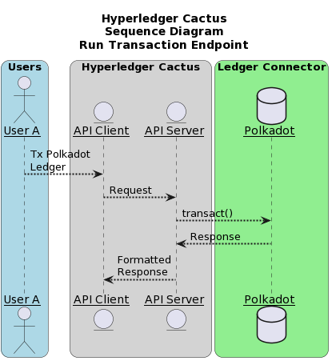
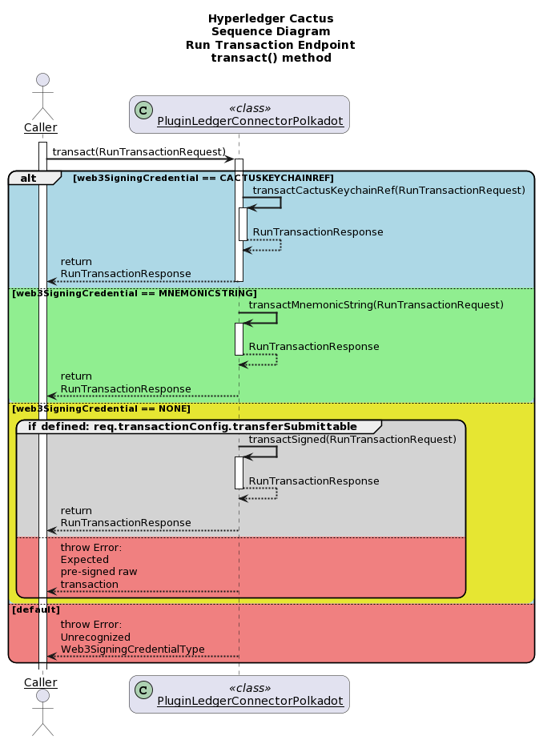
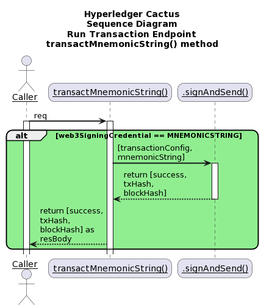
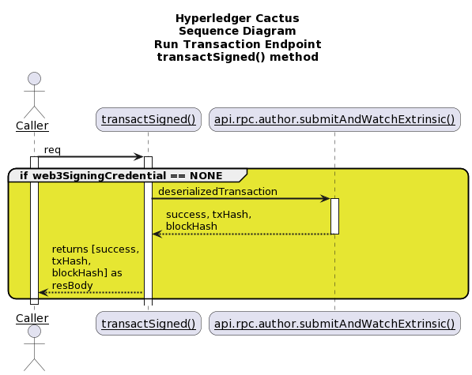

# `@hyperledger/cactus-plugin-ledger-connector-polkadot` <!-- omit in toc -->

## Table of Contents <!-- omit in toc -->

- [1. Usage](#1-usage)
  - [1.1. Installation](#11-installation)
  - [1.2. Using as a Library](#12-using-as-a-library)
  - [1.3. Using Via The API Client](#13-using-via-the-api-client)
- [2. Architecture](#2-architecture)
  - [2.1. run-transaction-endpoint](#21-run-transaction-endpoint)
- [3. Containerization](#3-containerization)
  - [3.1. Running the container](#31-running-the-container)
- [4. Prometheus Exporter](#4-prometheus-exporter)
  - [4.1. Usage Prometheus](#41-usage-prometheus)
  - [4.2. Prometheus Integration](#42-prometheus-integration)
  - [4.3. Helper code](#43-helper-code)
    - [4.3.1. response.type.ts](#431-responsetypets)
    - [4.3.2. data-fetcher.ts](#432-data-fetcherts)
    - [4.3.3. metrics.ts](#433-metricsts)
- [5. Contributing](#5-contributing)
- [6. License](#6-license)
- [7. Acknowledgments](#7-acknowledgments)


## 1. Usage

This plugin provides a way to interact with Substrate networks.
Using this one can perform:
* Deploy smart contracts (ink! contract).
* Execute transactions on the ledger.
* Invoke ink! contract functions.

The above functionality can either be accessed by importing the plugin directly as a library (embedding) or by hosting it as a REST API through the [Cactus API server](https://www.npmjs.com/package/@hyperledger/cactus-cmd-api-server)

We also publish the [Cactus API server as a container image](https://github.com/hyperledger/cactus/pkgs/container/cactus-cmd-api-server) to the GitHub Container Registry that you can run easily with a one liner.
The API server is also embeddable in your own NodeJS project if you choose to do so.

### 1.1. Installation

**npm**

```sh
npm install @hyperledger/cactus-plugin-ledger-connector-polkadot
```

**yarn**

```sh
yarn add @hyperledger/cactus-plugin-ledger-connector-polkadot
```

### 1.2. Using as a Library

```typescript
import {
  PluginLedgerConnectorPolkadot,
} from "@hyperledger/cactus-plugin-ledger-connector-polkadot";

const plugin = new PluginLedgerConnectorPolkadot({
  // See test cases for exact details on what parameters are needed
});

const req: RunTransactionRequest = {
  // See tests for specific examples on request properties
};

try {
  const res = await plugin.transact(req);
} catch (ex: Error) {
  // Make sure to handle errors gracefully (which is dependent on your use-case)
  console.error(ex);
  throw ex;
}
```

### 1.3. Using Via The API Client

**Prerequisites**
- A running Substrate ledger (network)
- You have a running Cactus API server on `$HOST:$PORT` with the Polkadot connector plugin installed on it (and the latter configured to have access to the Substrate ledger from point 1)

```typescript
import {
  PluginLedgerConnectorPolkadot,
  DefaultApi as PolkadotApi,
} from "@hyperledger/cactus-plugin-ledger-connector-polkadot";

// Step zero is to deploy your Substrate ledger and the Cactus API server

const apiHost = `http://${address}:${port}`;

const apiConfig = new Configuration({ basePath: apiHost });

const apiClient = new PolkadotApi(apiConfig);

const req: RunTransactionRequest = {
  // See tests for specific examples on request properties
};

try {
  const res = await apiClient.runTransaction(req);
} catch (ex: Error) {
  // Make sure to handle errors gracefully (which is dependent on your use-case)
  console.error(ex);
  throw ex;
}
```
## 2. Architecture
The sequence diagrams for various endpoints are mentioned below

### 2.1. run-transaction-endpoint

  
The above diagram shows the sequence diagram of run-transaction-endpoint. User A (One of the many Users) interacts with the API Client which in turn, calls the API server. API server then executes transact() method which is explained in detailed in the subsequent diagrams.  
  
The above diagram shows the sequence diagram of transact() method of the PluginLedgerConnectorPolkadot class. The caller to this function, which in reference to the above sequence diagram is API server, sends RunTransactionRequest object as an argument to the transact() method. Based on the type of Web3SigningCredentialType, corresponding responses are sent back to the caller.  
  
The above diagram shows transactCactusKeychainReference() method being called by the transact() method of the PluginLedgerConnector class when the Web3SigningCredentialType is CACTUSKEYCHAINREF. This method inturn calls transactMnemonicString() which calls the signAndSend() method of the Polkadot library.  
  
The above diagram shows transactMnemonicString() method being called by the transact() method of the PluginLedgerConnector class when the Web3SigningCredentialType is MNEMONICSTRING. This method then calls the signAndSend() method of the Polkadot library.  
  
The above diagram shows transactSigned() method being called by the transact() method of the PluginLedgerConnector class when the Web3SigningCredentialType is NONE. This method calls the api.rpc.author.submitAndWatchExtrinsic() of the Polkadot library.  


## 3. Containerization

### 3.1. Running the container

Launch container with plugin configuration as an **environment variable**:

> FIXME

Launch container with plugin configuration as a **CLI argument**:

> FIXME

Launch container with **configuration file** mounted from host machine:

> FIXME

## 4. Prometheus Exporter

This class creates a Prometheus exporter, which scraps the transactions (total transaction count) for the use cases incorporating the use of Fabric connector plugin.


### 4.1. Usage Prometheus
The Prometheus exporter object is initialized in the `PluginLedgerConnectorPolkadot` class constructor itself, so instantiating the object of the `PluginLedgerConnectorPolkadot` class, gives access to the exporter object.
You can also initialize the Prometheus exporter object separately and then pass it to the `IPluginLedgerConnectorPolkadotOptions` interface for `PluginLedgerConnectorPolkadot` constructor.

`getPrometheusExporterMetricsEndpoint` function returns the Prometheus exporter metrics, currently displaying the total transaction count, which currently increments every time the `transact()` method of the `PluginLedgerConnectoPolkadot` class is called.

### 4.2. Prometheus Integration
To use Prometheus with this exporter make sure to install [Prometheus main component](https://prometheus.io/download/).
Once Prometheus is setup, the corresponding scrape_config needs to be added to the prometheus.yml

```(yaml)
- job_name: 'polkadot_ledger_connector_exporter'
  metrics_path: api/v1/plugins/@hyperledger/cactus-plugin-ledger-connector-polkadot/get-prometheus-exporter-metrics
  scrape_interval: 5s
  static_configs:
    - targets: ['{host}:{port}']
```

Here the `host:port` is where the Prometheus exporter metrics are exposed. The test cases (For example, packages/cactus-plugin-ledger-connector-polkadot/src/test/typescript/integration/run-transaction.test.ts) exposes it over `0.0.0.0` and a random port(). The random port can be found in the running logs of the test case and looks like (42379 in the below mentioned URL)
`Metrics URL: http://0.0.0.0:42379/api/v1/plugins/@hyperledger/cactus-plugin-ledger-connector-polkadot/get-prometheus-exporter-metrics`

Once edited, you can start the Prometheus service by referencing the above edited prometheus.yml file.
On the Prometheus graphical interface (defaulted to http://localhost:9090), choose **Graph** from the menu bar, then select the **Console** tab. From the **Insert metric at cursor** drop down, select **cactus_Polkadot_total_tx_count** and click **execute**

### 4.3. Helper code

#### 4.3.1. response.type.ts
This file contains the various responses of the metrics.

#### 4.3.2. data-fetcher.ts
This file contains functions encasing the logic to process the data points

#### 4.3.3. metrics.ts
This file lists all the Prometheus metrics and what they are used for.

## 5. Contributing

We welcome contributions to Hyperledger Cactus in many forms, and there’s always plenty to do!

Please review [CONTRIBUTING.md](../../CONTRIBUTING.md) to get started.

## 6. License

This distribution is published under the Apache License Version 2.0 found in the [LICENSE](../../LICENSE) file.

## 7. Acknowledgments