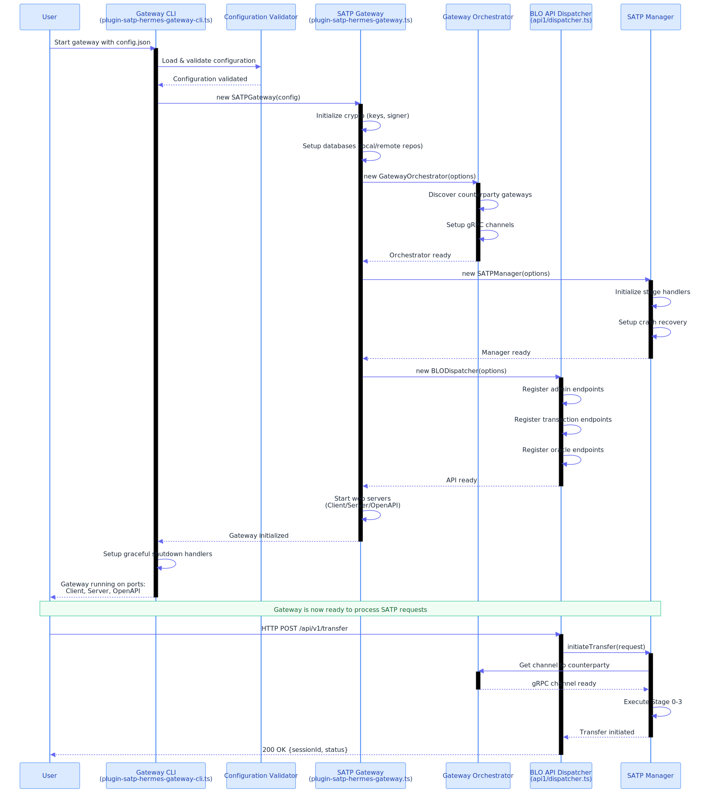

# SATP Hermes Plugin - Architecture Documentation

## Overview

The SATP Hermes Plugin implements the IETF Secure Asset Transfer Protocol (SATP) for cross-chain asset transfers between distributed ledgers. This documentation provides comprehensive API references and architectural insights.

## 📊 Architecture Diagrams

### Complete System Architecture



The diagram above shows the complete SATP Hermes architecture including:

- **Entry Points** (Green): Three ways to use SATP Hermes
  - Gateway CLI for production deployment
  - SATP Gateway Plugin for programmatic usage  
  - BLO API Dispatcher for REST API access

- **Core Services** (Blue): Internal orchestration
  - Gateway Orchestrator manages counterparty connections
  - SATP Manager coordinates protocol execution

- **Cross-Chain Layer** (Orange): Blockchain interactions
  - Cross-Chain Manager coordinates operations
  - Bridge Manager handles asset lock/unlock
  - Oracle Manager monitors events

- **Data Layer** (Purple): Persistence and logging
  - Gateway Persistence provides unified logging
  - Local/Remote repositories for audit trails

- **Protocol Stages** (Teal): SATP implementation
  - Stage 0: Transfer Initiation
  - Stage 1: Lock Assertion
  - Stage 2: Commitment Establishment
  - Stage 3: Transfer Completion
  - Crash Recovery for failure handling

### Entry Point Initialization



This sequence diagram illustrates the complete initialization process when launching a gateway through the CLI:

1. CLI loads and validates configuration
2. Gateway instance is created with crypto setup
3. Orchestrator is initialized for counterparty management
4. SATP Manager is created for protocol coordination
5. API endpoints are registered
6. HTTP servers are started

### Use Case Scenarios


Three deployment models leverage the same core:

- **Production Deployment**: Use Gateway CLI with Docker containers
- **Programmatic Integration**: Import Gateway Plugin as a library
- **REST API Access**: Access via BLO API Dispatcher endpoints

## 📦 Module-Level Architecture

### Core Module


The **Core Module** implements the SATP protocol state machine:

- **Constants & Configuration**: Protocol defaults, stage definitions, error codes
- **Logger & Session Utils**: Structured logging and session management
- **Stage Handlers (0-3)**: Individual stage implementations with message routing
- **Client/Server Services**: Protocol message exchange over gRPC/Connect RPC
- **Crash Manager**: Recovery coordinator with rollback strategies
- **Error Types**: Typed exceptions for protocol violations

### API Module


The **API Module** provides REST endpoints for external access:

- **BLO API Dispatcher**: Central routing for HTTP requests
- **Admin Endpoints**: Gateway configuration and status (`/info`, `/health`)
- **Transaction Management**: Asset transfer initiation and monitoring (`/transfer`, `/sessions`)
- **Oracle Operations**: Bridge event queries and proof retrieval (`/oracle/task`)

### Cross-Chain Module


The **Cross-Chain Module** handles blockchain interactions:

- **Cross-Chain Manager**: Coordinates bridge and oracle operations
- **Bridge Core**: Asset lock/unlock abstraction layer
- **Fabric/EVM/Besu Bridges**: Blockchain-specific implementations
- **Oracle Core**: Event monitoring and proof generation
- **Smart Contracts**: On-chain lock/unlock logic
- **Ontology**: Asset definition resolution

### Database Module


The **Database Module** manages persistence:

- **Gateway Persistence**: Unified logging interface
- **Local Repository**: SQLite/PostgreSQL for sessions and logs
- **Remote Repository**: IPFS for immutable proof storage
- **Knex Configuration**: Query builder and migration management
- **Migrations & Seeds**: Schema versioning and test data

### Services Module


The **Services Module** provides gateway orchestration:

- **Gateway Orchestrator**: Counterparty connection management
- **SATP Manager**: Protocol coordination across stages
- **Metrics Collector**: Performance and protocol metrics
- **Alert Manager**: Error notification and recovery triggers
- **Network Resolver**: Gateway discovery and DNS resolution
- **Validators**: Configuration and message validation

### Factory Module


The **Factory Module** handles component creation:

- **Plugin Factory**: Dependency injection and lifecycle management
- **Configuration**: Gateway parameters and crypto keys
- **Component Creation**: Instantiates Orchestrator, Manager, Repositories

## � API Layer Architecture

### API1 - BLO REST Endpoints


The **API1 Module** provides RESTful HTTP endpoints for external access:

#### Admin Endpoints
- **GET /healthcheck** - Gateway health status and dependency checks
- **GET /status** - Gateway configuration and network information
- **GET /integrations** - Available blockchain connectors and bridges
- **GET /audit** - Session logs and transaction history
- **POST /add-gateway** - Register counterparty gateways
- **GET /sessions** - Active session tracking and metadata

#### Transaction Endpoints
- **POST /transact** - Initiate asset transfer with SATP protocol
- **GET /approve-address** - Validate addresses and asset verification

#### Oracle Endpoints
- **POST /oracle/register** - Setup event monitoring with filters
- **POST /oracle/execute** - Manual task trigger and proof generation
- **DELETE /oracle/unregister** - Stop monitoring and cleanup
- **GET /oracle/status** - Task status and processing metrics

### API3 - SATP Protocol gRPC/ConnectRPC


The **API3 Module** implements gateway-to-gateway SATP protocol communication:

#### Client Services (Outbound Requests)
- **Stage 0**: Transfer proposal and negotiation
- **Stage 1**: Lock assertion and claim generation
- **Stage 2**: Commitment preparation and readiness
- **Stage 3**: Completion assertion and acknowledgment

#### Server Services (Inbound Handlers)
- **Stage 0**: Receive proposals and validate requests
- **Stage 1**: Verify lock proofs and generate receipts
- **Stage 2**: Process commitments and state transitions
- **Stage 3**: Verify completion and finalize sessions

#### Crash Recovery Protocol
- **Recovery Client**: State restoration and rollback initiation
- **Recovery Server**: Recovery coordination and rollback execution

## �🎯 Entry Points

### 1. Gateway CLI (`plugin-satp-hermes-gateway-cli.ts`)

**Purpose**: Command-line launcher for production SATP gateway deployments

**Usage**:
```bash
docker run -v /path/to/config:/opt/cacti/satp-hermes/config \
  hyperledger/cactus-plugin-satp-hermes
```

**Features**:
- Configuration validation with detailed error reporting
- Containerized deployment support
- Graceful startup/shutdown handling
- Production logging integration

---

### 2. SATP Gateway Plugin (`plugin-satp-hermes-gateway.ts`)

**Purpose**: Core plugin for programmatic SATP gateway integration

**Usage**:
```typescript
import { SATPGateway } from '@hyperledger/cactus-plugin-satp-hermes';

const gateway = new SATPGateway({
  instanceId: 'gateway-001',
  keyPair: keyPairConfig,
  localRepository: localRepo,
  remoteRepository: remoteRepo,
  // ... additional configuration
});

await gateway.onPluginInit();
```

**Features**:
- Full TypeScript/JavaScript API
- Embedded gateway capability
- Flexible programmatic configuration
- Event-driven architecture

---

### 3. BLO API Dispatcher (`api1/dispatcher.ts`)

**Purpose**: REST API layer for external SATP client access

**Endpoints**:
- `POST /api/v1/transfer` - Initiate asset transfer
- `GET /api/v1/status` - Gateway status
- `GET /api/v1/sessions` - Active SATP sessions
- `POST /api/v1/oracle/task` - Oracle operations

**Usage**:
```bash
curl -X POST http://gateway:3000/api/v1/transfer \
  -H "Content-Type: application/json" \
  -d '{"assetId": "...", "amount": 100, ...}'
```

**Features**:
- RESTful HTTP endpoints
- OpenAPI/Swagger specification
- Request routing and error handling
- Admin and transaction operations

## 🔗 Core Components

### Gateway Orchestrator

Manages connections to counterparty gateways, handles channel lifecycle, and routes gRPC/Connect RPC messages.

**Key Responsibilities**:
- Gateway discovery and resolution
- Channel management
- Message routing
- Session coordination

### SATP Manager

Coordinates SATP protocol execution across all four stages, manages session state, and handles crash recovery.

**Key Responsibilities**:
- Protocol state machine
- Stage handler coordination
- Session lifecycle management
- Crash recovery orchestration

### Cross-Chain Manager

Coordinates blockchain interactions through bridge and oracle components.

**Key Responsibilities**:
- Bridge operation coordination
- Oracle event monitoring
- Ontology resolution
- Proof generation and verification

### Gateway Persistence

Unified logging interface for SATP operations with dual repository support.

**Key Responsibilities**:
- Transaction logging to local DB
- Immutable proof storage to remote repository (IPFS)
- Audit trail maintenance
- Crash recovery data

## 📋 SATP Protocol Stages

The plugin implements the IETF SATP specification across four stages:

### Stage 0: Transfer Initiation
Negotiates transfer parameters and establishes session between gateways.

### Stage 1: Lock Assertion  
Locks assets on source ledger and generates cryptographic proofs.

### Stage 2: Commitment Establishment
Establishes commitment between gateways with signed receipts.

### Stage 3: Transfer Completion
Unlocks assets on destination ledger and finalizes transfer.

### Crash Recovery
Handles failure scenarios with rollback strategies for each stage.

## 🚀 Getting Started

### Documentation Navigation

- **Modules**: Browse all TypeScript modules organized by functionality
- **Classes**: Explore class hierarchies and implementations
- **Interfaces**: Review contract definitions and types
- **Functions**: Find utility functions and helpers

### Quick Links

- [SATP Protocol Specification](https://github.com/hyperledger-cacti/cacti/tree/main/packages/cactus-plugin-satp-hermes)
- [Hyperledger Cacti](https://hyperledger-cacti.github.io/cacti/)
- [GitHub Repository](https://github.com/hyperledger-cacti/cacti)

### Building Documentation

```bash
# Generate diagrams and documentation
yarn docs:generate

# Serve locally
yarn docs:serve

# Validate completeness
yarn docs:validate
```

## 📖 Additional Resources

For detailed implementation guides, configuration examples, and troubleshooting:

- **[Documentation README](../README.md)** - Diagram generation, build instructions, and documentation maintenance
- **Individual module documentation** - Refer to API specifics for each component
- **[GitHub Examples](https://github.com/hyperledger-cacti/cacti/tree/main/examples)** - Use cases and sample implementations

### Additional Documentation Files

All documentation files from the `docs/` folder are available in the generated TypeDoc output:

- Browse to `/docs/` in the documentation website to access all markdown files
- Architecture diagrams are available at `/assets/diagrams/`
- Supplementary materials are included in their respective subdirectories

---

**Version**: 0.0.3-beta  
**SATP Draft**: core-02, architecture-02, crash-02  
**License**: Apache-2.0
