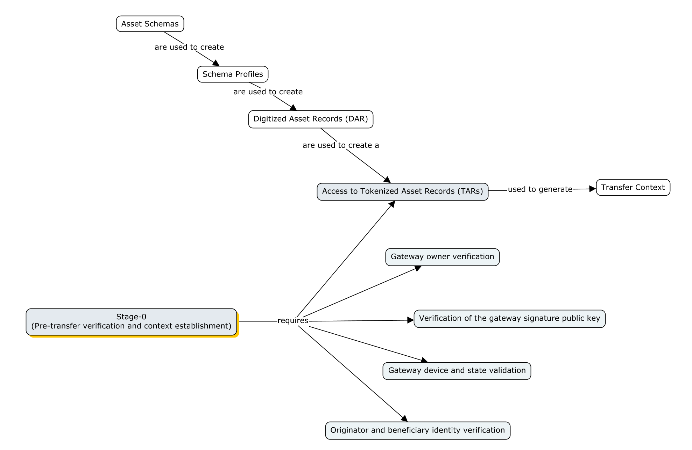
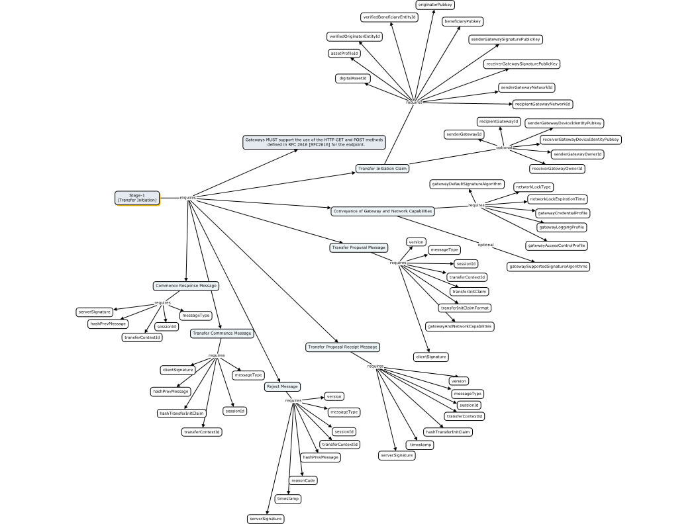

**What is the issue?**

[Issue 3752](https://github.com/hyperledger-cacti/cacti/issues/3752): Given that SATP is a work in progress, new versions of the specification are being published concurrently with SATP's implementation. New versions of specification contain new information regarding SATP, which can lead to semanti and syntactic inconsistencies between the specification and the implementation. 
The goals of this report are to:
- Identify inconsistencies, regarding SATP's Stage 0 and Stage 1;
- Create action points, in the form of sub-issues, to solve each inconsistency.

**How can the issue be solved?**

1. Map SATP Stage 0 and Stage 1 [specification draft version 08](https://datatracker.ietf.org/doc/html/draft-ietf-satp-core#autoid-38) requirements;
2. Understand cactus-plugin-satp-hermes implementation;
3. Detect and propose corrections to incoherences;

**Requirements - Stage 0:**



**Requirements - Stage 1:**



**Inconsistencies - Stage 0:**

- Access to tokenized asset records:
  - State: 
    - Inconsistent
  - Description: 
      - According to the specification, stage 0 starts with a request transfer context, from the client application to the source gateway. This requests provides a Tokenized Asset Record (TAR) to the gateway, which is used to generate a Transfer Context ID (TCID), that is returned to the Client application, and used throughout the session. The current implementation does not handle TARs, instead it returns an Asset Profile object that contains the TCID.
  - TODO: 
    - [Sub-issue 3795](https://github.com/hyperledger-cacti/cacti/issues/3795) - Implement an Asset handling mechanism that passes a TAR to a client SATP gateway. The gateway's response must include the Transfer Context ID used for the session.
  
- Gateway owner verification:
  - State: 
    - Inconsistent
  - Description:
    - This is the verification of the identity of the owners of the gateways. The type considers the existence of a pubkey (has an optional parameter). However, the e2e integration test does not perform the verification of a pubkey, in the gateway instantiation. I did not find an explicit verification method for the gateway’s identity, in the implementation.
  - TODO: 
    - [Sub-issue 3796](https://github.com/hyperledger-cacti/cacti/issues/3796) - Implement a mechanism that allows for the identification of the owners of the gateway.
  
- Verification of the gateway signature public key
  - State: 
    - Inconsistent
  - Description:
    - The sender gateway and receiver gateway must validate their respective signature public keys that will later be used to sign assertions and claims. This may include validating the X509 certificates of these keys. Probably should implemented at the transact-handler-service.ts.
  - TODO:
      - [Sub-issue 3796](https://github.com/hyperledger-cacti/cacti/issues/3796) - Implement a mechanism that allows for the identification of the owners of the gateway.
  
- Gateway device and state validation
  - State:
    - Inconsistent
  - Description:
    - This is the device attestation evidence [RFC9334](https://datatracker.ietf.org/doc/html/rfc9334) that a gateway must collect and convey to each other, where a verifier is assumed to be available to decode, parse and appraise the evidence. In the implementation, it is not explicitly defined in the transfer method or in the stage0-handler.ts. It should maybe be implemented in the NewSessionRequest. The process should comply with the Remote ATtestation procedureS (RATS) Architecture.  
  - TODO:
    - [Sub-issue 3797](https://github.com/hyperledger-cacti/cacti/issues/3797) - Implement a mechanism that complies with [RFC9334](https://datatracker.ietf.org/doc/html/rfc9334) for gateway state evidence collection and conveyance.
  
- Originator and beneficiary state validation
  - State:
    - Inconsistent
  - Description:
    - This is the identity and public-key of the entity (originator) in the origin network seeking to transfer the asset to another entity (beneficiary) in the destination network. The public keys are included in the messages of the implementation; But there is no validation mechanism implemented (e.g. Certificate Authorities - Public Key Infrastructure).    
  - TODO:
    - [Sub-issue 3798](https://github.com/orgs/hyperledger-cacti/projects/1/views/1?pane=issue&itemId=100462882&issue=hyperledger-cacti%7Ccacti%7C3798) - Implement a mechanism to validate the identity and public-key of the entity (originator) in the origin network seeking to transfer the asset to another entity (beneficiary) in the destination network.

**Inconsistencies - Stage 1:**

- Transfer initiation claim
  - State:
    - Small Inconsistencies
  - Description:
    - The inconsistencies are raised by 
      - missing message fields: 
        ```JSON
        senderGatewayID, recipientGatewayId, senderGatewayDeviceIdentityPubkey, receiverGatewayDeviceIdentityPubkey
        ```
      - message fields with different names than the specification: 
        ```JSON 
        clientGatewaySignaturePubkey (in specification is senderGatewaySignaturePublicKey), serverGatewayPubkey (in specification is receiverGatewaySignaturePublicKey)
        ```
      - additional fields not defined in the specification: 
        ```JSON
        maxRetries, maxTimeout, amountFromOriginator, amountToBeneficiary, processPolicies, mergePolicies
        ```
  - TODO:
    - Decide if wether the specification should be updated to match the implementation, or the other way around.
  
- Conveyance of gateway and network capabilities
  - State: 
    - Small Inconsistencies
  - Description:
    - The inconsistencies are raised by 
      - message fields with different names than the specification: 
        ```JSON
        signatureAlgorithm (gatewayDefaultSignatureAlgorithm), supportedSignatureAlgorithms (gatewaySupportedSignatureAlgorithms), locktype (networkLockType), lockExpirationTime (networkLockExpirationTime), credentialProfile (gatewayCredentialProfile), loggingProfile (gatewayLoggingProfile), accessControlProfile (gatewayAccessControlProfile)
        ```
      - additional fields not defined in the specification: 
        ```JSON
        senderGatewayNetworkId, permissions?, developerUrn, applicationProfile, subsequentCalls, history
        ```
  - TODO:
    - Decide if wether the specification should be updated to match the implementation, or the other way around.
  
- Transfer proposal message
  - State: 
    - Small Inconsistencies
  - Description:
    - The inconsistencies are raised by 
      - message fields with different names than the specification: 
        ```JSON
        networkCapabilities(gatewayAndNetworkCapabilities)
        ```
      - additional fields not defined in the specification:
        ```JSON
        multipleClaimsAllowed, multipleCancelsAllowed, sequenceNumber, resourceUrl, actionResponse
        ```
  - TODO:
    - Decide if wether the specification should be updated to match the implementation, or the other way around.
  
- Transfer proposal receipt message
  - State: 
    - Small Inconsistency
  - Description:
    - additional fields not defined in the specification:
      ```JSON
      transferCounterClaims
      ```
  - TODO:
    - Decide if wether the specification should be updated to match the implementation, or the other way around.
  
- Reject message
  - State: 
    - Inconsistent
  - Description: 
    - No Reject message object defined in the implementation. The most similar to this message are the error and errorCode fields defined in the CommonSatp message object.
  - TODO:
    - Decide if wether the specification should be updated to match the implementation, or the other way around.
  
- Transfer commence message
  - State:
    - Small Inconsistency
  - Description:
    - additional fields not defined in the specification:
      ```JSON
      clientTransferNumber
      ```
  - TODO:  
    - Decide if wether the specification should be updated to match the implementation, or the other way around.
  
- Commence response message
  - State:
    - Small Inconsistency
  - Description:
    - additional fields not defined in the specification:
      ```JSON
      serverTransferNumber
      ```
  - TODO:
    - Decide if wether the specification should be updated to match the implementation, or the other way around.

**Future work:**

Solving the resulting sub-issues in order to reduce inconsistency between the specification and implementation.

**Published in:**

18th of March 2025 by Rodolfo Carapau