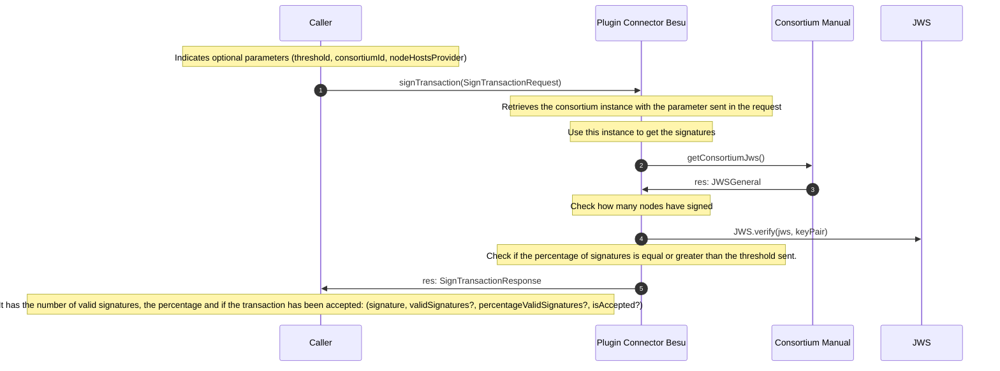

```mermaid
sequenceDiagram
autonumber
    participant Caller
    participant Plugin Connector Besu
    participant Consortium Manual
    participant JWS
    

    Note over Caller: Indicates optional parameters (threshold, consortiumId, nodeHostsProvider)
    Caller ->> Plugin Connector Besu: signTransaction(SignTransactionRequest)
    Note over Plugin Connector Besu: Retrieves the consortium instance with the parameter sent in the request
    Note over Plugin Connector Besu: Use this instance to get the signatures
    Plugin Connector Besu ->> Consortium Manual: getConsortiumJws()
    Consortium Manual ->> Plugin Connector Besu: res: JWSGeneral
    Note over Plugin Connector Besu: Check how many nodes have signed
    Plugin Connector Besu ->> JWS: JWS.verify(jws, keyPair)
    Note over Plugin Connector Besu: Check if the percentage of signatures is equal or greater than the threshold sent.
    Plugin Connector Besu ->> Caller: res: SignTransactionResponse
    Note over Caller: It has the number of valid signatures, the percentage and if the transaction has been accepted: (signature, validSignatures?, percentageValidSignatures?, isAccepted?)
```