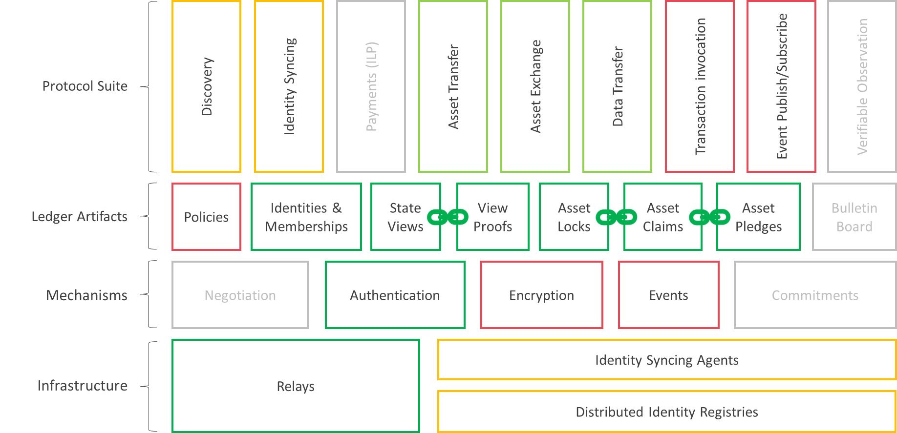

<!--
 Copyright IBM Corp. All Rights Reserved.

 SPDX-License-Identifier: CC-BY-4.0
 -->
# Interoperability RFCs

These RFCs capture abstractions, models, protocols and data formats for facilitating cross-ledger communication and transactions.

If you are new to Weaver (or to blockchain interoperability), we recommend starting with the [protocol overview document](../OVERVIEW.md).

If you wish to see Weaver in action, test it, or apply it to your own application, you can switch to the [Getting Started Tutorial](https://labs.hyperledger.org/weaver-dlt-interoperability/docs/external/getting-started/guide).

Instead, if you wish to find out more details about the Weaver design and wish to contribute to the code base, you can explore these RFCs, beginning with the [models](./models). Protocol engineers will find in [RFC: 01-009](./models/infrastructure/relays.md) a useful overview of the relay model, and may then progress on to reading one of the existing protocols' design and implementation; e.g., the data sharing protocol in [RFC: 02-001](./protocols/data-sharing/generic.md). If you are interested in adding support for a new ledger technology, see the [existing driver implementations](../core/drivers) and [existing interoperability module implementations](../core/network). Where relevant we use [ABNF](https://tools.ietf.org/html/rfc5234) for formal syntax definitions.

Precise definitions of terms you may encounter in these RFCs can be found in the [terminology page](terminology.md).

## Index of RFCs

The RFC numbering convention is: `<type>:<id>`. The list of types (`<type>`) is as follows:
| `<type>` | Document Type/Category      |
|----------|-----------------------------|
|    01    | Concepts and Models         |
|    02    | Protocols and Mechanisms    |
|    03    | Data Structures and Formats |

| RFC #  | Title                               | Category | Status                                                                  |
|--------|-------------------------------------|----------|-------------------------------------------------------------------------|
| 01-001 | Views                               | Model    | [Proposed](./models/ledger/views.md)                                    |
| 01-002 | Cryptographic Proofs                | Model    | [Proposed](./models/ledger/cryptographic-proofs.md)                     |
| 01-003 | Verifiable Observation of State     | Model    | [Draft](./models/ledger/observation-of-state.md)                        |
| 01-004 | Events                              | Model    | [Draft](./models/ledger/events.md)                                      |
| 01-005 | Cross-Ledger Operations             | Model    | [Draft](./models/ledger/cross-ledger-operations.md)                     |
| 01-006 | Atomic Cross-Ledger Transactions    | Model    | [Proposed](./models/ledger/atomic-cross-ledger-transactions.md)         |
| 01-007 | Security Domains                    | Model    | [Proposed](./models/security/security-domains.md)                       |
| 01-008 | End-to-End Confidentiality          | Model    | [Proposed](./models/security/confidentiality.md)                        |
| 01-009 | Relays                              | Model    | [Proposed](./models/infrastructure/relays.md)                           |
| 01-010 | Interoperation Modules              | Model    | [Proposed](./models/infrastructure/interoperation-modules.md)           |
| 01-011 | Identity Management                 | Model    | [Proposed](./models/identity/network-identity-management.md)            |
| 01-012 | Identity Registry                   | Model    | [Proposed](./models/identity/iin.md)                                    |
| 01-013 | Identity Agent                      | Model    | [Proposed](./models/identity/iin-agent.md)                              |
| 01-014 | Identity Trust Anchor Agent         | Model    | [Retired](./models/identity/iin-steward-agent.md)                       |
| 01-015 | Network Identity Updates            | Model    | [Proposed](./models/identity/identity-update-policy.md)                 |
| 02-001 | Data Sharing                        | Protocol | [Proposed](./protocols/data-sharing/generic.md)                         |
| 02-002 | Data Sharing in Fabric              | Protocol | [Proposed](./protocols/data-sharing/fabric.md)                          |
| 02-003 | Data Sharing in Corda               | Protocol | [Proposed](./protocols/data-sharing/corda.md)                           |
| 02-004 | Asset Exchange through HTLC         | Protocol | [Proposed](./protocols/asset-exchange/generic-htlc.md)                  |
| 02-005 | Asset Exchange in Fabric            | Protocol | [Proposed](./protocols/asset-exchange/fabric-htlc.md)                   |
| 02-006 | Asset Exchange in Corda             | Protocol | [Proposed](./protocols/asset-exchange/corda-htlc.md)                    |
| 02-007 | Asset Exchange in Besu              | Protocol | [Draft](./protocols/asset-exchange/besu-htlc.md)                        |
| 02-008 | Asset Transfer                      | Protocol | [Proposed](./protocols/asset-transfer/generic.md)                       |
| 02-009 | Asset Transfer in Fabric            | Protocol | [Proposed](./protocols/asset-transfer/fabric.md)                        |
| 02-010 | Asset Transfer in Corda             | Protocol | [Proposed](./protocols/asset-transfer/corda.md)                         |
| 02-011 | Identity and Config Sharing         | Protocol | [Superseded](./protocols/identity/id-config-sharing.md)                 |
| 02-012 | Cross-Domain Identity Management    | Protocol | [Proposed](./protocols/identity/identity-syncing.md)                    |
| 02-013 | Security Domain Discovery           | Protocol | [Draft](./protocols/discovery/discovery.md)                             |
| 02-014 | Cross-Domain Negotiation            | Protocol | [Draft](./protocols/discovery/negotiation.md)                           |
| 02-015 | Transaction Invocation              | Protocol | [Draft](./protocols/contract-invocation/invocation.md)                  |
| 02-016 | Event Bus                           | Protocol | [Draft](./protocols/events/event-bus.md)                                |
| 02-017 | Security Domain Identity Validation | Protocol | [Proposed](./protocols/identity/security-domain-identity-validation.md) |
| 02-018 | Cross-Domain Membership Syncing     | Protocol | [Proposed](./protocols/identity/membership-syncing.md)                  |
| 03-001 | View Address                        | Format   | [Proposed](./formats/views/addressing.md)                               |
| 03-002 | Generic View                        | Format   | [Proposed](./formats/views/definition.md)                               |
| 03-003 | Fabric View                         | Format   | [Proposed](./formats/views/fabric.md)                                   |
| 03-004 | Corda View                          | Format   | [Proposed](./formats/views/corda.md)                                    |
| 03-005 | Besu View                           | Format   | [Draft](./formats/views/besu.md)                                        |
| 03-006 | Ethereum View                       | Format   | [Draft](./formats/views/ethereum.md)                                    |
| 03-007 | View Request                        | Format   | [Proposed](./formats/views/request.md)                                  |
| 03-008 | Access Control Policy               | Format   | [Proposed](./formats/policies/access-control.md)                        |
| 03-009 | Proof Verification Policy           | Format   | [Proposed](./formats/policies/proof-verification.md)                    |
| 03-010 | Verification Policy DSL             | Format   | [Draft](./formats/policies/dsl.md)                                      |
| 03-011 | Membership                          | Format   | [Proposed](./formats/network/membership.md)                             |
| 03-012 | Network Identities                  | Format   | [Proposed](./formats/network/identity.md)                               |
| 03-013 | Asset Exchange Units                | Format   | [Proposed](./formats/assets/exchange.md)                                |
| 03-014 | Asset Transfer Units                | Format   | [Proposed](./formats/assets/transfer.md)                                |
| 03-015 | Relay Messages                      | Format   | [Proposed](./formats/communication/relay.md)                            |
| 03-016 | Fabric Interop Chaincode API        | Format   | [Proposed](./formats/network/fabric-interop-chaincode.md)               |
| 03-017 | Interoperation CorDapp API          | Format   | [Proposed](./formats/network/interop-cordapp.md)                        |
| 03-018 | Besu Interop Contract API           | Format   | [Proposed](./formats/network/besu-interop-contract.md)                  |
| 03-019 | Application SDK                     | Format   | [Proposed](./formats/network/application-sdk.md)                        |
| 03-020 | DID Method for DLT Networks         | Format   | [Proposed](./formats/network/iin_method.md)                             |

## RFC Process

NOTE: The following is only a tentative process pending further discussion.

-   Draft
-   Proposed
-   Active
-   Superseded
-   Retired
-   Abandoned
