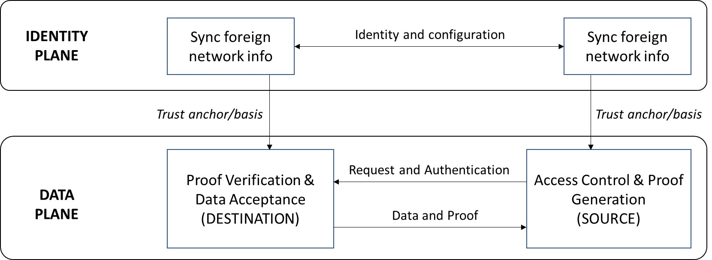

<!--
 Copyright IBM Corp. All Rights Reserved.

 SPDX-License-Identifier: CC-BY-4.0
 -->
# Distributed Identity Management for Interoperation

* Authors: Venkatraman Ramakrishna
* Status: Draft
* Since: 14-Sept-2020

# Overview

The primary functions performed through consensus in the _endpoint_ peer networks, namely _request access control_ and _view proof validation_, depend on the availability of authentic information about the counterparty network's identity providers and their credentials. Snapshots of these _identity configurations_, changing at punctuated intervals, act as essential _trust anchors_ for access control checks and proof validations. As the below figure indicates, our protocol has two distinct planes of operation, an _identity plane_ that syncs identity information as necessary and a _data place_ where requests and responses occur. (_Note_: data query is just one example of a protocol operating in the data plane, independent of the protocol operating in the identity plane yet dependent on the information obtained through the latter.)

In the data transfer protocol 1.0, the protocol in the identity plane is implemented through the simplistic means of each network exposing a single public (i.e., without any access control) REST API function, from one of its active web servers, that reveals portions of the latest network configuration:
* In Fabric, this is the channel configuration containing root CA and intermediate CA certificates and other possibly relevant metadata for every organization participating in the channel.
* In Corda, this is a set of certificate chains, typically network root --> doorman --> node for each network node.

This solution, implemented as a stopgap measure, suffers from various drawbacks. First, it is insecure, relying on a single designated spokesperson to expose identity information in a participating network, and further not enforcing access controls on the information being exposed. Second, it assumes a priori trust between the two networks, while in the real world, parties rely on common trusted authorities for the introductory step.

To enable data and asset exchange protocols between permissioned networks on-demand, we need a more secure and systematized process for exposing and consuming identity information. Further, this process should be decentralized in a way that allows participating networks and their units to own, control, and expose their identity information as they see fit and not have to rely on centralized parties as mediums of exchange. The process should also ensure extensibility, and scalability to the extent possible, by enabling a network with units owning decentralized identities (DIDs) which can be verified by well-known and trusted identity providers to exchange data or assets with permissioned networks already part of the ecosystem. Finally, trust in identity providers should be based on blockchain (or distributed ledger) principles, mitigating the possibility of collusion between networks and identity providers.

A slightly amended figure illustrates our view of the solution below, where you can see that the identity plane protocol relies both on bilateral communication and a "cloud" of identity providers that provides the fundamental trust basis for interoperation. We will sketch out the details of this cloud and the identity information exchanges later.

Having established our mode of blockchain interoperatiomn as a two-plane networking system, we can focus on the components and mechanisms in the identity plane. Other specifications in this repository cover the gamut of features implemented in the data plane.

# Design Approaches and Choices

There is a range, or spectrum, of architectural choices available to build identity plane infrastructure and protocols, which are described at length [here](./design-choices.md). In this document and in the rest of the specification, we will select one of those choices and describe a reference architecture and set of protocols in detail. Before doing that, we will describe the landscape as we see it, list our assumptions, and provide some reasoning for our design choices.

The concepts of _Decentralized Identity (DID)_ and _Verifiable Credential (VC)_ already exist and are in W3C draft status. There are several examples of DID registries where user identities can be stored and looked up from in controllable ways. Credential issuers have existed on the Web for many years, and we expect that most will soon provide VCs to DID holders as this is the most promising approach to ensurxiinge decentralized, controllable, and privacy-preserving authentication. Entities that participate in blockchain networks may already possess DIDs from one or more of these registries, and if not, can easily get DIDs issued from reputed ones. They can also obtain VCs from reputed certifiers if they do not already possess them. Therefore, our design relies on blockchain network participants possessing DIDs and VCs issued by entities outside those networks.

What we cannot know beforehand is what configuration of DID registries or VC issuers will exist at any given time nor should we make any assumptions that will limit our choices in the future. We can also not know the complete trust calculus beforehand that tells us how to connect two interoperating networks via common DID registries and VC issuers. We can only rely on the existence of DID and VC standards that everyone will eventually converges to. But for the purpose of our design, we can (and will) select a particular configuration that shows how the basis of interoperation can be built using DIDs and VCs. Our mechanisms can be easily adapted for different configurations of DID registries and VC issuers than the one we will describe in detail in this RFC.

# Distributed Identity Management Architecture

The below figure illustrates our identity plane architecture:
* A set of identity providers and verifiers to establish a trust basis for exchange of identity and any other network configuration information. We assume, withoug loss of generality, that such identity providers belong to networks which we term as _Interoperation Identity Networks (IINs)_.
* A set of agents that act on behalf of units within a network that collectively supply and fetch membership, identity, and any other configuration information, of the counterparty network.

_Some Notes on IINs (Pertaining to the Design Choices Described Earlier)_:
* _The term 'Interoperation Identity Network' is a placeholder to describe a unit of our proposed architecture, and is subject to change in the future. A term that may replace it is 'Distributed Identity Registry', which captures both the role and the nature of this entity, and which practitioners may already be familiar with_.
* _An IIN is not a new concept or system we are inventing for interoperation purposes but is rather an extrapolation of the concept of a DID registry, many varieties of which exist today, to a distributed system that may maintain DID records through consensus among a committee on a shared ledger rather than maintain them in a centralized repository_.
* _An IIN brings within its purview both a DID registry maintained as a shared ledger as well as well-known issuers of DIDs and verifiable credentials (VCs) who collectively maintain that ledger. In the real-world, registries as well as issuers already exist, though not necessarily part of a single network. The design and protocol we describe can accommodate existing DID registries and VC issuers, even though they be independent (and centralized) entities, but in our discussion we will assume, without loss of generality, that they belong to one or the other network (labeled as an IIN). Our mechanisms rely on the ability to negotiate with issuers and read/write to DID registries; neither function is constrained by the nature of the issuers or the registries_.
* _We use Hyperledger Indy as the canonical basis for an IIN simply because it brings together a DID registry and VC issuers (or trust anchors) together in one network and maintains records in a shared ledger rather than in one or more centralized repositories. If other technologies similar in function emerge, they can be used in place of Indy too_.

The following figure illustrates a representative instance of the generalized architecture. We envision an ecosystem consisting of multiple independent DLT networks, each of which chooses to interoperate for data or asset exchanges with another network bilaterally on a need basis. In this ecosystem, there also exist one or more IINs, each of which consist of one or more reputable stewards. Each network MUST have a trust relationship with at least one steward of one IIN, and by implication, access privileges to the corresponding IIN.

Prerequisites for interoperation between network N1 connected to steward S1 on IIN1 and N2 connected to steward S2 on IIN2:
* N1 must have access privileges to IIN2's ledger and N2 must have access privileges to IIN1's ledger
* N1 must trust S2 as an identity provider and verifier, and N2 must trust S1 similarly
(_Note_: this calculus becomes simpler if IIN1 and IIN2 are the same network, and even simpler if S1 and S2 are the same. In the latter case, the scenario devolves into N1 and N2 having a common root of trust.)

## Reference Architecture and Functional Requirements

From a functional perspective, the mechanism to exchange identity information and keep it in sync across network boundaries is agnostic of the trust relationship between networks. The simplest way to implement our architecture would be using a single IIN with multiple stewards representing either individual network consortiums or authorities trusted by the networks' constituent members, as mentioned earlier in this document. Functionally, this will be identical to a multi-IIN setup and so we will use this as the canonical architecture to describe the exchange protocol. The specification for IINs and the network components will leave room for multiple IINs though.

# Interoperation Identity Network

See specification for IINs [here](./iin.md). Our canonical IIN is a distributed shared ledger, maintained by stewards and trust anchors, built on [Hyperledger Indy](https://hyperledger-indy.readthedocs.io/projects/sdk/en/latest/docs/getting-started/indy-walkthrough.html).

# Network Structure and IIN Agents

See specifications for an IIN Agent as well as the specifications for augmenting a DLT network connected to an IIN via these agents [here](./iin-agent.md).

## Forms of Identity

Our framework consists of both hierarchical and decentralized identities. Decentralized identities belong to constituent units of participating DLT networks, each of whom is assumed to be an independent actor with an identity that is may not owe its existence to the network in question. Yet, for interoperation purposes, that decentralized identity will be associated with the corresponding network's identity, as will the identities of all the other units of that network. Below are the primary identities that will be maintained and used in identity plane protocols:
* _Network Identity_: The identity of a network recognized by an IIN. This is not a DID but rather an attribute recorded on the IIN ledger.
* _Steward Verinym_: This is a static DID representing an IIN steward, created at IIN bootstrap time.
* _Network Unit Verinym_: The identity of a network unit represented by an IIN Agent. This is a DID issued by an IIN steward or trust agent. On a given IIN, this DID may be associated with one or more network identities.

# Artifacts in Ledgers and Wallets

Trust bases are created and maintained through artifacts on the ledgers of the networks as well as the IINs.
* On an IIN ledger, we maintain the following:
  * Network membership list credential schema (corresponding to Steward Verinym)
  * Network membership list credential definition (public key) (corresponding to Steward Verinym)
  * Network unit membership credential schema (corresponding to network unit DID)
  * Network unit membership credential definition (public key) (corresponding to Network Unit Verinym)
* On a participating network's ledger, we maintain the following:
  * Trust store containing a list of IINs trusted to verify a foreign network's units' identities
  * A [Security Group definition](../security.md) corresponding to each network unit
    * _This is augmented with a DID attribute denoting the identity owned by the IIN Agent associated with this network unit/security group_
Indy agents (both stewards and IIN Agents) maintain wallets containing credentials and private keys:
* IIN Steward:
  * Network IDs
  * Membership lists for each network ID: `[<Network Unit Verinym>,<IIN Agent Endpoint>]`
* IIN Agent:
  * Membership info: `[<Network Unit Verinym>,<Network ID>,<Name within Network and Other Attributes.....>]` (this corresponds to names of organizations or other groupings along with any other relevant metadata)

# Protocol: End-to-End Network Membership and Credential Sharing

Prerequisites:
* Each network must have a module installed to initialize and maintain a trust store for foreign IINs
* Each network must have a module installed to initialize and maintain Security Groups for foreign networks
Unless it is techically infeasible, we recommend that these modules be implemented as smart contracts using the native programming and consensus models of their networks' respective DLTs.

There are three distinct phases of this protocol serving separate functions, though they must be carried out in the following chronological order:
1. **Network unit registration**: a network unit acquires a verinym (DID) from a steward of an IIN, and the IIN updates the membership list for this network. (_Note_: this may need be done just once in the lifetime of a network as long as the unit is an active part of it.)
2. **Fetch foreign network membership info**: each IIN Agent within a network fetches membership information for a foreign network and subsequently fetches Security Group information from each unit of that network present in the membership list. (_Note_: this is done concurrently and independently by each IIN Agent.)
3. **Update foreign network Security Group info**: the IIN Agents collect signatures over a validated set of Security Groups for a given foreign network ID through an application-layer flow, and subsequently record it to the local ledger via a module/smart contract that can validate the signatures for unanimity or a quorum. (_Note_: this operation is idempotent, so multiple agents can do this parallelly without requiring any coordination.)

_TODO: Remove and revoke a network unit_

A full specification of this protocol is provided [here](../../protocols/id-config-sharing/README.md).
