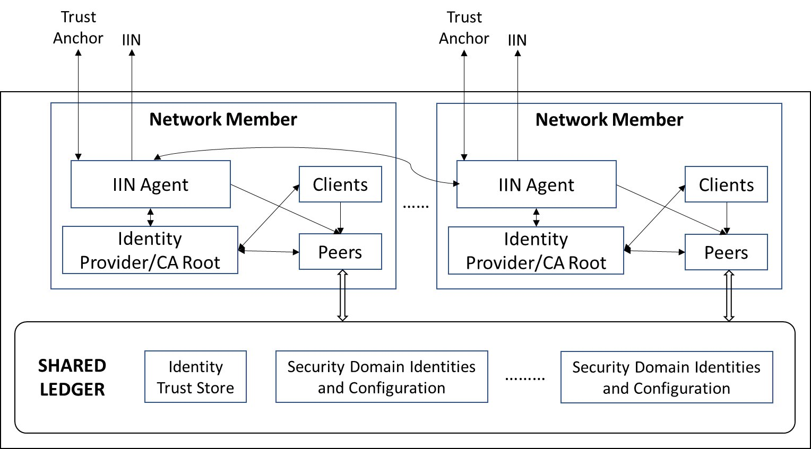

<!--
 Copyright IBM Corp. All Rights Reserved.

 SPDX-License-Identifier: CC-BY-4.0
 -->
# IIN Agents in a DLT Network

- RFC: 01-013
- Authors: Venkatraman Ramakrishna, Krishnasuri Narayanam, Bishakh Chandra Ghosh, Ermyas Abebe
- Status: Proposed
- Since: 24-Sep-2021

# Summary

This document specifies a component of a DLT network's participant unit that is responsible for exposing as well as consuming identity information with the help of IINs, and also act as a bridge between the data plane and the identity plane. The IIN Agent specifically interacts with the DID registry of the IINs, the trust anchors, and IIN agents of other networks' participant units to expose, discover and exchange identity information. The IIN agent also communicates with the data plane to read and configure data plane identity certificates and credentials.

# Network Architecture with IIN Agents

In our view, a DLT network seeking to interoperate with another using any of our protocols is composed of units that are consituent members of that network, and are assumed to have identities independent of the network in the identity plane. Representing each unit in an IIN is an IIN Agent, managing the participant unit's DID. Furthermore, these IIN agents are used to discover, resolve, and verify other participant units' identities as well as network identities. We also assume that each nework unit is a root identity provider within the data plane of its DLT network. In Fabric: an MSP root CA server (typically, but not mandatorially, having a 1-1 relationship with an organization). In Corda: network root CA.

This view is illustrated in the figure below (Fig.1), which maps quite naturally to Fabric networks where each organization is a unit, but is general enough to encompass other permissioned DLTs like Corda and Besu too.

 
<figcaption>Fig.1 - IIN Agent.</figcaption>

 

# Data Plane Identity Artifacts

The following artifacts in the data plane are relevant to identity plane protocols:
* _Identity trust store_: this is a set of IINs and Trust anchors `<IIN>,<Trust-Anchor-DID>`. It implies that the network trusts a given trust anchor or all trust anchors in a given IIN to certify the identity/membership credentials of foreign network units. 

* The IIN definition can additionally contain peer connectivity information (to access the IIN ledger). This data will be looked up in the identity sharing protocol, while fetching membership information for a foreign network. It can also be used in proof verification (or view validation) in data plane protocols.
* _Foreign network identities and configurations_: these are [security domains](../security-domains.md), containing identities and certificates corresponding to a foreign network's units. (_Each security domain is augmented with a DID attribute denoting the identity owned by the IIN Agent associated with this network unit/security domain_). The IIN Agent of the network participants together update these configurations from the identity plane information.

# Hyperledger Indy implementation of IIN Agent

An IIN Agent represents a network unit that is also a self-certified identity provider for some subset of the network, as stated earlier in the summary. It is simultaneously an IIN (Indy) client and a network (Fabric, Corda, etc.) client. Therefore, there are different ways in which it can be implemented, but its core feature is that it lies within the trust boundary of a root identity provider of a network.

Being an IIN client, the IIN Agent, like an [IIN Steward Agent](../iin-steward-agent.md), or some portion of it, must be built according to the canonical specification of an Indy Agent with the capability to create a wallet, interact with other agents (including stewards), and access an Indy ledger. These form the trust anchros in the IINs. Another portion of the IIN Agent must be built as a regular network client with the ability to exercise smart contracts for looking up and recording ledger data.

The IIN Agent can be built and deployed in the following configurations:
* As an augmentation of a network root identity provider or CA: in Fabric, this would mean augmenting the Fabric CA Server to perform the functions of an IIN Agent
* As a separate service with a trusted communication channel (e.g., using gRPC) to a network root identity provider or CA
* As two separate services, one resembling an IIN Agent and another a network client (e.g., a Fabric Client SDK-based application). These two services will communicate with each other and with the network root identity provider or CA using a trusted communication channel
(As shown in the above diagram (Fig.1), there must be exactly one IIN Agent service, however configured, for every network unit)

## Bootstrap/Initialize an IIN Agent
* Start a [Hyperleder Aries](https://www.hyperledger.org/use/aries) service, which consists of a <_controller_, _agent_> pair, with the agent built using [Aries Cloud Agent - Python](https://github.com/hyperledger/aries-cloudagent-python) as it supports persistent storage. This service has the capability to communicate with other agents using the peer-to-peer Aries protocol. It is recommended that this service be launched in a Docker container. Post-launch, the following actions must be carried out:
  1. Initialize a wallet to store DIDs, keys, and any other crypto material
  2. Obtain and load the service endpoints for an IIN and a Steward this network unit is associated with
  3. Register a verinym (DID record) through the standard Indy protocol (described [here](../../protocols/id-config-sharing-protocol/README.md))
  4. Obtain and load the local network's ID
  5. Fetch membership list and endpoint info for other units of the local network from the steward (_Consider: this can be done without IIN involvement too_)
  At this point, the IIN Agent has ownership of its DID that is recorded on its IIN's ledger. Its IIN Steward Agent now recognizes it as a member of its network and is ready to make a presentation of the member list of the network to any requestor.
* Start a network client service (if this is to be a standalone service) or initialize one according to the network's native procedure. Example: in Fabric, do the following:
  1. Initialize a Fabric wallet to store keys, certificates, and MSP configurations
  2. Initialize configuration information with the network's interoperation contract deployment ID: this is needed to record security domain info on the ledger
  3. Import a connection profile and connect to a network gateway

## Interact with Network Units' IIN Agents
The IIN Agent interacts with other IIN Agents in the following ways:
* With local network agents: to launch or participate in a flow that collects a multi-signature over a foreign network's unit's security domain
* With foreign network agents: to request/offer membership and security domain presentations, prove membership within its network, and prove ownership of a security domain

Details of these protocols can be found [here](../../protocols/identity/readme.md).

## IIN Agents for Trust Anchors
Trust anchors associated with IINs, or DID registries in general, and which issue identity and membership VCs to individual network participants (see [IIN model](./iin.md)), also must run an agent to interact with network members' IIN agents. The model for an IIN agent specified earlier in this document can be used for trust anchor agents with some salient differences:
* The trust anchor agent will need to be equipped with the capability to issue VCs, and return VPs when an IIN agent sends a valid request for one.
* The trust anchor agent will not need to understand a DLT protocol for the purpose of recording identities to a network's ledger.

(_Note_: If the IIN is built on Hyperledger Indy, where trust anchors are referred to as _stewards_, the corresponding agent will register the verinym (DID) for its steward along with key-generation seed values (generated using a random number generator) in the Indy ledger. This registration occurs at genesis (or bootstrap) time.)

