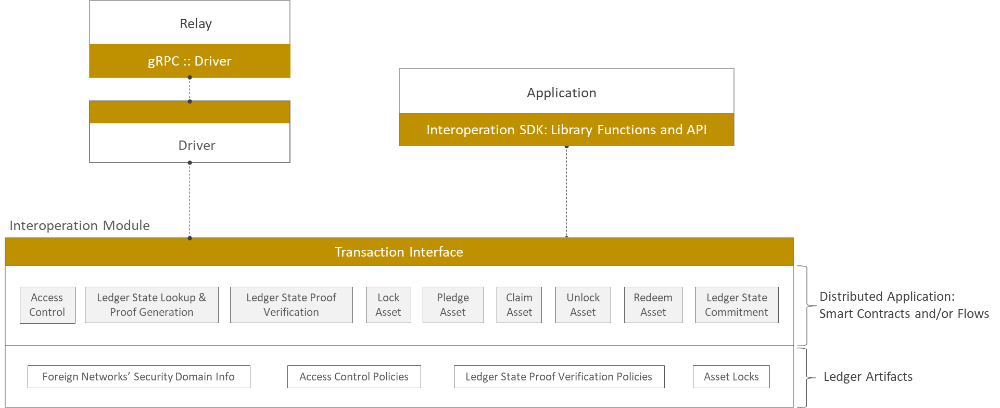

<!--
 Copyright IBM Corp. All Rights Reserved.

 SPDX-License-Identifier: CC-BY-4.0
 -->
# Interoperation Modules

- RFC: 01-010
- Authors: Venkatraman Ramakrishna, Sandeep Nishad, Krishnasuri Narayanam, Dhinakaran Vinayagamurthy
- Status: Proposal
- Since: 02-Apr-2022

## Summary

- Consensus-driven module to perform core basic interoperation functions involving access control, proof management, and asset lock management.
- Implemeented as a typical smart contract and/or DApp (distributed application) on a given DLT platform.
- Forms a trusted base for interoperation as it is exactly as trustworthy as the network (collective) as a whole.

## Interoperation Module as a Trusted Base for Interoperation

An interoperation module is a DLT-aware module that performs all cross-network interoperability-related functions that require consensus-driven decision making by a network. The interoperation module serves as an endpoint for any [interoperability mode](../ledger/cross-ledger-operations.md), or cross-network operation/protocol, supported by Weaver. The logic behind using such modules for the core functions performed within a network during any protocol session is that those functions must be executed by the network's participants as a collective and adhere to the network's consensus standard. Therefore, such a module is no less trustworthy than the network as a whole and is no more susceptible to Byzantine failure than the network. To compare against a strawman, using a trusted proxy to run the interoperation module's functions would be insecure as the proxy may be unreliable. Hence, using an interoperation module that makes decisions via its network's native consensus mechanism provides a trusted base for any cross-network interoperation using Weaver.

For an interoperation module to provide a trusted base of this kind, it must be implemented as a smart contract or a distributed app (DApp) on a given DLT, as smart contracts and DApps in any DLT are designed to finalize transactions with consensus-driven safeguards. Once implemented for a given DLT, it can be reused with minimal network-specific customization on any network built on that DLT platform. Some examples:
- In Hyperledger Fabric, it is implemented as a set of chaincodes deployed on all the peers of a channel that are running applications involved in cross-network (or cross-ledger) operations.
- In Corda, it is implemented as a CorDapp and installed on all nodes maintaining data in their vaults that are impacted by cross-network operations.
- In Hyperledger Besu, it is implemented as a set of Solidity contracts installed on the network's nodes.

## Core Basic Interoperation Module Functions

The basic capabilities an interoperation module offers are listed below (in the future, other capabilities may be added to support new interoperation modes):
- Access control for [view requests](../../formats/views/request.md) originating outside the network
- [Proof generation](../ledger/cryptographic-proofs.md) for ledger [views](../ledger/views.md)
- [Proof verification](../../formats/policies/proof-verification.md) for ledger views
- Locks, claims, and unlocks for [asset exchanges](../../protocols/asset-exchange/generic-htlc.md)
- Pledges and reclaims for [asset transfers](../../protocols/asset-transfer/generic.md)
- [Ledger commitments](../../protocols/contract-invocation/invocation.md) requested by parties outside the network

These functions are illustrated in the layer marked '_Distributed Application: Smart Contracts and/or Flows_' in the figure below.

To perform the core functions, the smart contracts or distributed apps need to maintain several artifacts on the ledgers (e.g., channels in Fabric, vaults in Corda) as indicated in the figure. These are:
- [Security domain](../security/security-domains.md) information of foreign networks, primarily consisting of those networks' members/participants and their CA certificates
- [Access control policies](../../formats/policies/access-control.md) governing external requests
- [Proof verification policies](../../formats/policies/proof-verification.md) to validate external ledger views
- [Lock and claim statuses of assets](../../formats/assets/exchange.md) maintained by smart contracts or distributed applications for asset exchanges
- [Pledge and claim statuses of assets](../../formats/assets/transfer.md) maintained by smart contracts or distributed applications for asset tramsfers

## Generic Interface Template

The interoperation module exposes its capabilities to relay drivers as well as applications running on the network, as indicated in the above figure. Because interoperation modules can vary significantly in design with DLT type, we don't specify a precise common API but instead provide a template or reference interface that can be instantiated as appropriate in a given DLT.

_TBD: List functions that any interoperation module, regardless of the DLT type, ought to expose, and specify their purposes._

## Application SDK

Every blockchain or DLT platform offers an SDK consisting of library functions and a well-defined API for developers' ease-of-use and to hide the complexity of the underlying platform's commitment and consensus processes. In Weaver, we adopt a similar philosophy and provide an SDK that enables the developers to write code that interfaces both with the interoperation module (as can be seen in the above figure) and with a relay in an intuitive manner. In essence, the core capabilities of the interoperation module are exposed at the application layer through this SDK. For details, see the [Application SDK formats](../../formats/network/application-sdk.md).

## Interoperation Module Designs in Prominent DLT Platforms

Weaver supports interoperation modules for three prominent DLTs, listed below.

### Hyperledge Fabric

The interoperation module takes the form of a Fabric Interopration Chaincode, which has two parts:
- A chaincode that must be installed on all peers of a channel which maaintains ledger data that is involved in cross-network operations, and which can be invoked by the relay drivers and client applications.
- A set of interfaces and utility functions that can be imported into application chaincode and exercised for asset exchanges and transfers as required.

For details, see the [Fabric Interoperation Chaincode API](../../formats/network/fabric-interop-chaincode.md).

### Corda

The interoperation module takes the form of an Interoperation CorDapp, consisting of flows, contracts, and states, that provide basic interoperation capabilities.

_TBD: Add more details here._

For details, see the [Interoperation CorDapp API](../../formats/network/interop-cordapp.md).

### Hyperledger Besu

The interoperation module takes the form of a Besu Interoperation Contract that consists of a set of Solidity contracts. As with Fabric, some of these contracts are installed on the network nodes and can be invoked by relay drivers and applications, whereas other provide interfaces and library functions for application Solidity contracts to import and exercise.

_TBD: Add more details here._

For details, see the [Besu Interoperation Contract API](../../formats/network/besu-interop-contract.md).
