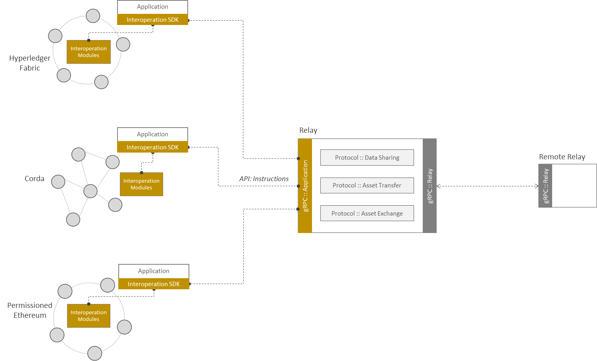
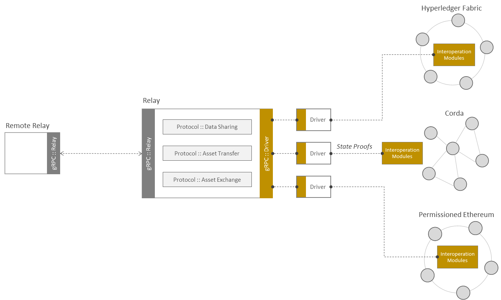

<!--
 Copyright IBM Corp. All Rights Reserved.

 SPDX-License-Identifier: CC-BY-4.0
 -->
# Relays

- RFC: 01-009
- Authors: Allison Irvin, Antony Targett, Christian Vecchiola, Dileban Karunamoorthy, Ermyas Abebe, Nick Waywood, Venkatraman Ramakrishna, Sandeep Nishad
- Status: Proposal
- Since: 30-May-2022

## Summary

- A relay is a fulcrum of inter-network (or inter-ledger) communication.
- Supports a DLT-neutral, asynchronous, event-based, message-passing protocol across boundaries of networks built on arbitrary DLT stacks.
- Acts as a gateway for a network, serving as both an ingress and an egress point for cross-network messages.
- Trustless for end-to-end integrity and confidentiality.
- Multiple relays can serve a network, or relays can be hosted by dedicated services outside network boundaries.

## Relays for Cross-Ledger Communication

Relays are the fulcra (or mediums) of communication across networks maintaining distributed ledgers. They perform the following functions:
- Pass messages conveying queries, instructions, and information from one network to another.
- Mediate end-to-end protocols corresponding to [basic interoperability modes](../ledger/cross-ledger-operations.md) supported by Weaver.
- Discover foreign networks' relays.
- Route messages to foreign networks' relays if direct inter-relay communication is not possible.

A relay runs both a server and a client, to serve and to initiate requests respectively. Both server and client should be built on a common transport protocol, and the protocol chosen in Weaver for this purpose is [gRPC](https://grpc.io/), because it is ubiquitous, standardizes, and actively supported in all popular programming languages.

Cross-network protocols mediated through relays are DLT-neutral, i.e., independent of any specific DLT's characteristics. The basic protocol involves asynchronous, event-based, message-passing, and is stateless. Optionally, for added robustness and end-to-end reliability guarantees, the protocol can be made stateful through support for fault-tolerant communications and message queueing. Additionally, support for message prioritization and load balancing can be added to meet desired performance SLAs.

Relays can serve as both ingress and egress points for networks. They offer application clients the ability to send requests to remote networks using a well-defined API and message structure as is illustrated in the figure below.

The same relays can send messages to, and receive messages from, other relays, as is illustrated in the figure below. This figure also shows how a request received from a remote relay is served within the network using [drivers](#drivers-for-dlt-specific-operations) and [interoperation modules](./interoperation-modules.md).

A relay recognizes and communicates the following messages:
- Ledger [view requests](../../formats/views/request.md) consisting of [view addresses](../../formats/views/addressing.md) and associated metadata
- Ledger [views](../ledger/views.md)
- Ledger (or smart contract) transaction invocations
- Ledger [events](../ledger/events.md)

Relays are trustless for end-to-end protocol integrity and confidentiality. This enables a variety of [deployment configurations](#deployment-models-and-considerations) without adversely impacting a network's security or increasing a network's trust footprint. Such trustlessness is achieved using [network-centric interoperation modules](./interoperation-modules.md) and specifications can be found in the [protocols section](../../protocols/).

The relay module can be reused in any network built on any DLT platform with minimum network-specific customizations. It can be maintained independent of the DLT platform.

## Drivers for DLT-Specific Operations

Drivers are ledger-specific and DLT protocol-aware relay plug-ins, which can be selected and activated by relays in a protool within an endpoint network, as illustrated in the figure above. A driver serves the following functions:
- Translate a DLT-neutral query or instruction, typically originating outside the network boundary, into a DLT-specific query or instruction that can be executed within the network by an interoperation module.
- Generate a ledger view in response to a relay query.
- Translate a DLT-neutral event into a DLT-specific event and vice versa.

For example, in the [data sharing protocol](../../protocols/data-sharing/generic.md), a driver are tasked with orchestrating the generation of a view in response to a view address and collecting [authenticity proof](../ledger/cryptographic-proofs.md) to satisfy the [verification policy](../../formats/policies/proof-verification.md) within the request.

Drivers are implemented as typical client applications on a given DLT platform. Some examples are as follows:
- In Hyperledger Fabric, a driver is implemented on the Fabric SDK (in Node.js or Java or Go) through the `fabric-network` package and Gateway API, using which it can invoke chaincode deployed on the network's channels.
- In Corda, a driver is implemented as a CorDapp that has the ability to trigger flows through the network's nodes.
- In Hyperledger Besu, a driver is implemented as a Web3.js application that has the ability to invoke Solidity contracts deployed on the network.

Because these are client applications, drivers must possess valid network creentials, typically in the form of wallet identities.

As an ancillary component of the relay, a driver is also trustless for end-to-end protocol integrity and confidentiality.

A relay module and a driver module can be coupled to varying extents, but our default design will assume a loose coupling whereby the driver runs a separate gRPC service from the relay and communicates with the latter using service APIs.

Once a driver is designed for a given DLT, it can be reused in any network built on that DLT with minimum network-specific customizations. It will need to be periodically maintained for alignment with the clatest version of that DLT though.

## Relay Functional API

Here we list API function specs exposed to [application clients](#api-for-application-client), [relay](#api-for-other-relays) and [drivers](#api-for-driver). These all are RPC endpoints that can be implemented directly in a well-known protocol like gRPC. See the [relay](../../formats/communication/relay.md) and [view request](../../formats/views/request.md) format specifications for more details.

### API for Application Client

- **RequestState(networks.networks.NetworkQuery): returns common.ack.Ack**
    This endpoint is for a client application (i.e., above the contracts) running in a DLT network, to request remote state via local relay, initiating [data sharing protocol]((../../protocols/data-sharing/generic.md#relay-flow) session. Since this request is asynchronous w.r.t the network, the request info/state machine is stored in a database on the requesting relay indexed via uniquely generated random id called `request_id`. This `request_id` is used to uniquely identify this query request in all the other endpoints' arguments or return messages. The local relay then sends the query to the remote relay via an API available for relay-relay communication (explained below).  This API takes a message of type [NetworkQuery](../../formats/communication/relay.md#networkquery) as argument, and returns [Ack](../../formats/views/request.md#ack) message. The local relays returns positive [Ack](../../formats/views/request.md#ack) to the client application when query is sent successfully to the remote relay, else a negative Ack with error message. On positive `Ack` client application can poll for the response by calling `GetState` API of the relay.
    
- **GetState(networks.networks.GetStateMessage): returns common.state.RequestState**
    This endpoint is used by client application for polling the local relay to get the response to the query by using `request_id` returned in positive [Ack](../../formats/views/request.md#ack) by `RequestState` API (called by the same client earlier initiating data sharing protocol). The local relay fetches the database state based on provided `request_id` and prepares the response. It takes a message of type [GetStateMessage](../../formats/communication/relay.md#getstatemessage) as argument, and returns [RequestState](../../formats/views/request.md#requeststate) message. The `RequestState` can be in 4 states, indicated by `status` field, depending upon whether the local relay has received Ack from remote relay, or it is still pending; there is an error in the protocol or protocol is successfully completed and response view is available.

### API for other Relays

- **RequestState(common.query.Query): returns common.ack.Ack**
    The requesting relay sends a [data sharing](../../protocols/data-sharing/generic.md) request, using RequestState API, to the remote relay with a query defining the data it wants to receive. The remote relay calls the driver using the gRPC endpoint provided by driver server (RequestDriverState, details below), passing on the query to the driver. It takes a message of type [Query](../../formats/views/request.md#query) as argument, and returns [Ack](../../formats/views/request.md#ack) message.

- **SendState(common.state.ViewPayload): returns common.ack.Ack**
    The remote relay, after receiving the response from the driver, asynchronously sends it to requesting relay using this endpoint. The requesting relay upon receiving the response, stores it in the database corresponding to the `request_id` key. It takes a message of type [ViewPayload](../../formats/views/request.md#viewpayload) as argument, and returns [Ack](../../formats/views/request.md#ack) message.

### API for Driver

- **SendDriverState(common.state.ViewPayload): returns common.ack.Ack**
    This endpoint is used by the driver to send back the response of the query to the remote relay. The remote relay then passes this response to the requesting relay using the `SendState` API (explained above). It takes a message of type [ViewPayload](../../formats/views/request.md#viewpayload) as argument, and returns [Ack](../../formats/views/request.md#ack) message.

## Driver Functional API

Here we list API function specs exposed to relays by the drivers. These are RPC endpoints that can be implemented directly in a well-known protocol like gRPC. See the [view request](../../formats/views/request.md) format specifications for more details.

- **RequestDriverState(common.query.Query): returns (common.ack.Ack)**
    The remote relay sends a request to the driver, identified by the [view address](../../formats/views/addressing), with a query defining the data it wants to receive. This is where driver unpacks the view address, makes a call to the requested contract using given arguments, and collects the response along with the proof, packages them into a DLT-specific view message, and then encapsulating it to a DLT-neutral view message. This final message is then sent back to remote relay using above relay's API (SendDriverState). It takes a message of type takes [Query](../../formats/views/request.md#query) as argument, and returns [Ack](../../formats/views/request.md#ack).

## Deployment Models and Considerations

Relays and drivers can be deployed in a variety of configurations, depending on the trust assumptions on which a network is built and ease of maintenance. They can be deployed and run by one of the network participants, as a separate network participant in their own right, or as part of a centralized service managed by the network's consortium. These options are illustrated in the Hyperledger Fabric context in the figure below, where a relay (the driver is not explicitly called out but is assumed to be an extension of the relay) can belong to one of the existing organizations (Model A), belong to the ordering service organization (Model B), or be part of a separate organization created just for the purpose of running a relay (Model C).

Because drivers need credentials (or wallet identities), the relay/driver combination, or at least the driver, must belong to a network participant unit that has the authority to issue credentials (like an organization in a Fabric network, as illustrated in the above figure). As the driver is trustless, the deployment mode does not impact the integrity and confidentiality of the interoperability protocols though. Therefore, ease of use and maintenance should be the determining factor, and our recommendation is that Model A be the default choice for a Fabric network (and equivalents of this model for other DLTs).

The DLT-neutral relay component does not need to be tied to a network participant or even to the network itself. Though our default recommendation is that it be maintained by one of the network's participant units, it may also be offered by services external to a network using some form of a subscription model.

Different considerations apply for availability and fault tolerance. Multiple relays, either maintained by different network participants, or even by entities external to the network, will provide a higher quality of service than a single relay, and this should be the default model for a production deployment. Redundant drivers should also be used for high availability. In addition, different drivers can be deployed to serve different shared ledgers or private data collections within a network too, which would allow the network administrators to issue different credentials with minimum privilege to these drivers instead of issuing broad-access credentials to a single driver.
