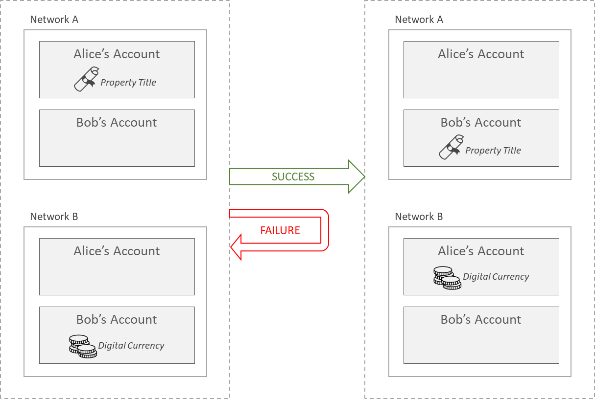
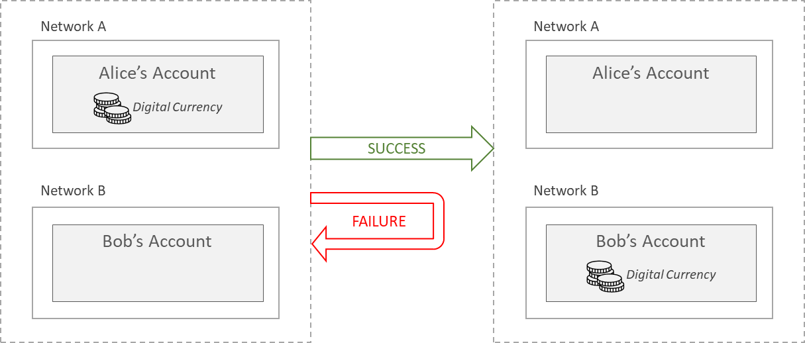

<!--
 Copyright IBM Corp. All Rights Reserved.

 SPDX-License-Identifier: CC-BY-4.0
 -->
# Atomic Cross-Ledger Transactions

- RFC: 01-006
- Authors: Venkatraman Ramakrishna, Ermyas Abebe, Sandeep Nishad, Krishnasuri Narayanam, Dhinakaran Vinayagamurthy
- Status: Proposed
- Since: 15-Jun-2021

## Summary

- The ability to commit transactions atomically in multiple ledgers is a core requirement for interoperability.
- This involves making transaction proposals/offers/intents as a first step (like in a 2-phase or 3-phase commit protocol in a distributed database).
- Either all transactions are finalized or all are reverted for cross-ledger integrity to be maintained.
- Transaction proposals and commitments must be verifiable by the counterparty ledger.
- The process relies on decentralized consensus and time locks within the distributed ledgers, and does not require trusted third parties or escrows.
- The interoperability modes, or use cases, of asset exchange and asset transfer can be realized in this model.

## Atomic Cross-Network Transactions as Fair Exchanges

As discussed in the [cross-ledger operations specification](./cross-ledger-operations.md), bidirectional dependencies between ledgers (or networks) necessitate atomicity of operations that span ledgers: either both ledgers are written to or neither is. Such atomicity constraints are necessary and most apparent when the contracts (or distributed apps) on the networks are dealing with assets whose integrity is destroyed if they can eb copied or deleted, and a clear ownership trail cannot be established. Smart contracts in all DLTs ensure such asset integrity within shared ledgers but it is challenging to ensure this for assets that have significance across ledger boundaries.

We can relate this challenge to the classic [fair exchange](http://citeseerx.ist.psu.edu/viewdoc/summary?doi=10.1.1.48.959) problem, which analyzes how two independent entities can conduct some form of a _quid pro quo_ transaction in a decentralized manner without a trusted third party in a mediating role. Though classically, this problem was [proven impossible](https://www.cs.utexas.edu/~shmat/courses/cs395t_fall04/pagnia.pdf) without a trusted third party, blockchains/DLTs and smart contracts can help us carry out such exchanges in a completely decentralized manner.

Both the [asset exchange and the asset transfer use cases](./cross-ledger-operations.md#building-blocks-of-cross-network-use-cases) can be considered forms of fair exchange. The analogy is apparent in the former, where two parties exchange assets held in two different ledgers. But the asset transfer problem, where an asset is relinquished by one party in favor of another can also be mapped to fair exchange, bbecause the asset must remain with the original owner unless it is conclusively claimed by the target recipient. The models for both use cases are illustrated below.

## Asset Exchange

This is a cross-network interoperability mode that is a generalization of what is referred to as [atomic swap](https://www.investopedia.com/terms/a/atomic-swaps.asp) in the cryptocurrency community. In Weaver, we aim to support atomic swaps (or exchanges) or arbitrary assets (of both the fungible and non-fungible kinds) held on ledgers built on heterogeneous DLT stacks. The generic model can be described very simply and is illustrated through an example in the figure below.

- Two parties, Alice and Bob, have accounts in both Network A and Network B.
- Initially, Alice owns a property title (e.g. embodied in an NFT) in Network A and Bob owns some digital currency in Network B
- Alice is willing to sell the title to Bob in exchange for some units of currency, and Bob is in agreement
- Finally, the exchange must must either succeed or fail, as per atomicity constraints:
  - If it succeeds, Alice gains currency units in Network B and loses the property title in Network A while Bob gains the title in Network A and loses currency units in Network B
  - If it fails, there is no change to the original states of the assets and their ownerships
  - We must guarantee that the final state will not result in partial transactions, where either Alice or Bob ends up with both the property title and the currency units and the other party gets nothing in exchange

The classic technique for asset exchange is the Hash Time Locked Contract (HTLC), which is what the [Weaver asset exchange protocol](../../protocols/asset-exchange/generic-htlc.md) is also based on.

## Asset Transfer

In this interoperability mode, an asset leaves one shared ledger for another in a way that is not destructive in a global sense; i.e., in the final state, the original asset (or an equivalent, or interchangeable form) is still present on some shared ledger. The asset can be fungible (e.g., cryptocurrency) or non-fungible. The generic model can be described very simply and is illustrated through an example in the figure below.

- Alice has an account in Network A and Bob has an account in Network B. (_Note_: Alice and Bob may represent the same real-world entity.)
- Initially, Alice owns some digital currency in Network A, which it wishes to transfer to Bob in Network B as per an agreement
- Finally, the transfer must either succeed or fail, as per atomicity constraints:
  - If it succeeds, Alice loses currency units in Network A while Bob gains the same number of currency units (or some equivalent) in Network B
  - If it fails, there is no change to the original currency balances of Alice or Bob in either network
  - We must guarantee that the final state will not result in a partial transaction, where Alice loses some currency units but Bob doesn't gain the same number of units, destroying value in effect

See the [Weaver asset transfer protocol](../../protocols/asset-transfer/generic.md) for more details.
