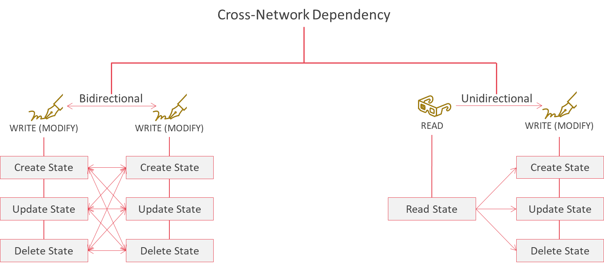
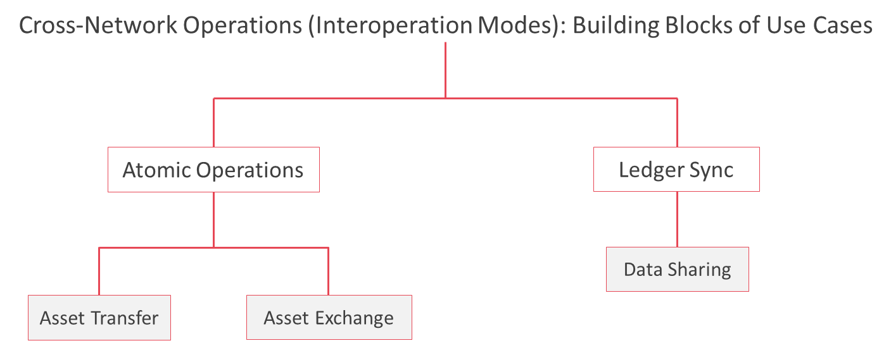

<!--
 Copyright IBM Corp. All Rights Reserved.

 SPDX-License-Identifier: CC-BY-4.0
 -->
# Cross-Network Operations on Resources

- RFC: 01-005
- Authors: Venkatraman Ramakrishna
- Status: Draft
- Since: 02-11-2020

## Summary

- Interaction between networks is asymmetrical, with either end assuming a designated role that complements the other to fulfill a cross-ledger requirement.
- We can draw inspiration from both database operations and the HTTP client server protocols with its limited number of methods (GET, PUT, POST, and DELETE)
- Broadly, the cross-network operations can be classified into unidirectional (write following a read) and bidirectional (simultaneous writes)
- Ledger resources can be classified into data, which can be copied, and assets, which have designated ownership and a limited number of instances
- Broadly, the building blocks of use cases can be classified into those that sync data and those that move assets

## Cross-Network Dependencies

We can reason about the range and exhaustiveness of operations that two distinct shared ledgers, and the networks that maintain them, would like to perform in concert by considering what kinds of resources are present on a ledger and the nature of dependencies between ledgers and the smart contracts deployed on them. This will them help us define the most common and useful cross-network protocols that a platform like Weaver ought to support.

At the most basic level, we can classify the dependencies into the following:
- _Bidirectional_: an action in one network triggers an action in another network and simultaneously is triggered by the latter. In other words, actions in two networks must occur atomically; i.e., both happen or neither happens.
- _Unidirectional_: an action in one network triggers an action in another network. There is a definite chronological ordering between the actions.

The figure below illustrates this classification.

Within these dependency categories, we can further drill down into low-level operations on ledger state, as called out in the above figure. These operations are inspired both by databases and web services (HTTP), from which we can determine that the fundamental operations one would like to perform on any state is exhaustively covered by the following list:
- Create state
- Update (or write to) state
- Read state
- Delete state

_Note_: in these operations, "state" refers to units of a ledger's database, whereas the higher level categories (bidirectional and unidirectional) refer to writes or reads from the ledger database as a whole.

Examples:
- An operation involving the simultaneous creation of a record in one ledger and the update of another record in a different ledger (bidirectional, atomic)
- An operation involving the deletion of a record in one ledger after reading another record in a different ledger (unidirectional, chronological)

## Building Blocks of Cross-Network Use Cases

Extrapolating from the above figure, we can now think about a taxonomy of the kinds of records are typically maintained on shared ledger using smart contracts, producing two types:
- _Assets_: these are digital embodiments of some tangible real-world physical goods that have designated owners and a limited and immutable number of instances; i.e., they cannot be just copied digitally without losing their integrity.
- _Data_: these are all digital records that are not assets. They can describe properties about entities, things, or the environment, and can be copied arbitrarily while retaining their value.

Inspired by the previously discussed list of cross-network dependencies, we can classify the basic use cases (or protocols) for cross-network interoperation into bidirectional and unidirectional dependencies. The former deals only with atomic operations whereas the latter deals with sync operations, as illustrated in the figure below.

Finally, we can synthesize the categories into tangible use cases that manipulate assets or data for two distinct shared ledgers, in effect building bridges across networks to enable them to work in concert and behave as a single virtual system. These basic use cases, or _interoperability modes_ are as follows:
- _Asset Transfer_: the movement of an asset from one ledger to another, in effect destroying it in the former while simultaneously recreating it in the latter. As an asset cannot be double spent, transfer of an asset should result the termination/locking of its use in the source ledger, and its creation into the target ledger, atomically; i.e., either both these actions happen or neither does. Example mechanisms: one-way and two-way pegs. See the Weaver [asset transfer protocol specification](../../protocols/asset-transfer/generic.md) for more details.
- _Asset Exchange_: The change of ownership of an asset in one network and a corresponding change of ownership of another asset in another network, typically between the same pair of parties but in opposite directions. No actual value leaves the networks' boundaries. Example mechanism: atomic cross-chain swap. See the Weaver [asset exchange protocol specification](../../protocols/asset-exchange/generic-htlc.md) for more details.
- _Data Sharing_: The copying (or transferring) of data from one ledger to another. The sharing can either be a result of a transaction in the source network, or an explicit request from a consuming (destination) network. See the Weaver [data sharing protocol specification](../../protocols/data-sharing/generic.md) for more details.
