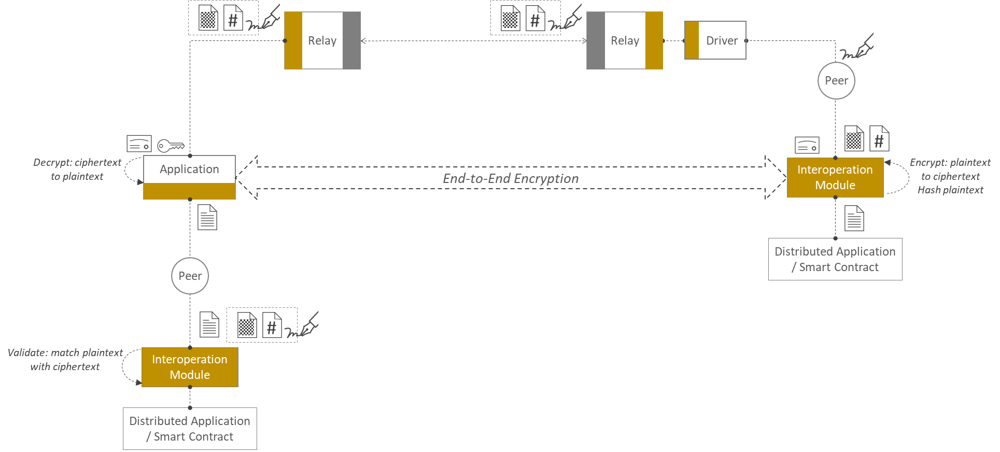

<!--
 Copyright IBM Corp. All Rights Reserved.

 SPDX-License-Identifier: CC-BY-4.0
 -->
# End-to-End Confidentiality

- RFC: 01-008
- Authors: Venkatraman Ramakrishna, Dhinakaran Vinayagamurthy, Sandeep Nishad, Krishnasuri Narayanam, Sikhar Patranabis
- Status: Proposed
- Since: 10-May-2022

## Security Concerns and Threat Model

The communication of information from one permissioned ledger to another via the Weaver infrastructure faces several security challenges. The canonical protocol we will analyze and protect in this document is the [data sharing protocol](../../protocols/data-sharing/generic.md) but the threats and solutions specified here will be application to other cross-network interactions, such as [contract invocation](protocols/contract-invocation/invocation.md) and [event dissemination](../ledger/events.md).

Cross-network data sharing communicates a [view](../ledger/views.md) from a source ledger to a destination ledger via [relays](../infrastructure/relays.md) and [interoperation modules](../infrastructure/interoperation-modules.md). An interoperation module, run using a network's native consensus mechanism, forms a trusted base for cross-network protocols but a relay is trustless, and therefore any protocol must have inbuilt safeguards against malicious relays. View integrity is safeguarded using [cryptographic proofs](../ledger/cryptographic-proofs.md). We focus on two other properties of importance here:
1. _Confidentiality against relays_: malicious relays can leak (or _exfiltrate_) view contents to anybody, thereby potentially violating the [access control policy](../../formats/policies/access-control.md) of the source ledger.
2. _Data authenticity for destination interoperation modules_: interoperation modules in the destination (or receiving) ledger must be able to independently [validate view contents](../../formats/policies/proof-verification.md) supplied by an application client that could maliciously fake view contents. The application client, as one endpoint of the view request-response protocol, will have this opportunity unless safeguards are built into the data sharing protocol.

## Confidentiality and Authenticity through Asymmetric Cryptography

We describe a mechanism to ensure end-to-end confidentiality across untrusted relays using public (asymmetric) key cryptography. Other mechanisms using different public key algorithms or using symmetric keys may be specified in the future.

As the figure below illustrates, the data sharing protocol first involves a round-trip request-response for a view into a ledger (source ledger, at the right). This part of the protocol has as its endpoints a client application running in the destination network (at the left), which initiates the request, and the interoperation module installed on the source ledger. The interoperation module is privy to view contents extracted from the smart contracts or distributed apps maintaining the view data on the ledger. The client application, which is the receiver of the data, can also be privy to the view contents as it cannot tamper with the data without invalidating the accompanying proof. (Both data, in plaintext, and proof must be submitted by the client application to the interoperation module in its network, for validation.) The two relays in the middle (including a driver) must not be able to see the view contents in plaintext, as the figure below illustrates.

The steps to achieve end-to-end confidentiality, as illustrated in the figure above, are as follows, with more specific details:
- The client application in the destination network (left) that initiates the view request supplies its certificate with an embedded public key with that request.
- The interoperation module, or the contract/app running on the nodes on which that module is deployed, in the source network (right):
  * encrypts view contents obtained from the contract (or distributed app) using the public key within the certificate, and
  * hashes the view contents with a randomly sampled value to produce an [HMAC](https://en.wikipedia.org/wiki/HMAC).
- The nodes on which the interoperation module is deployed digitally sign both the encrypted view contents and the HMAC as part of the proof generation process.
- The source network's driver packages the encrypted view contents, the HMACs, and signatures (proof) into a view and passes it through the source network's relay, which only sees ciphertext, hashes, and signatures.
- The source network's relay communicates the view with ciphertext contents to the destination network's relay, which also sees only ciphertext, hashes, and signatures.
- The destination network's relay queues up the view to the client application, which, using its private key corresponding to the public key within the certificate, decrypts the ciphertext embedded within the contents.

(_Note_: only the view contents obtained from the contract, or distributed app, are encrypted. The view metadata, which is used by the relays and drivers, is not encrypted.)

At the point, the view has reached the destination network in plaintext without being exposed to the intermediary relays. Now the client application must submit the view and the proof embedded within it for validation and processing to the destination network's interoperation module. But because the signatures constituting the proof were created over encrypted view data, the nodes running the interoperation module must be able to associate the signed messages with the decrypted data supplied by the client application. Here the HMAC created by the source network's interoperation module comes to the rescue. The interoperation module now just needs to validate the decrypted data supplied by the client against this HMAC (in addition to validating the signatures in the proof) to verify its authenticity.

This protocol ensures confidentiality against potentially malicious relays and also ensures integrity against a potentially malicious decrypter (the application client in the destination network).

There are different ways in which the above protocol can be realized, and these are listed and discussed in the [appendix](confidentiality-design-choices.md). We use [Protocol #5](./confidentiality-design-choices.md#protocol-5) in the above model, as it is the most secure and usable option, and this is implemented in Weaver as a reference.

Additional notes:
- Initially, Weaver will support encryption and decryption using [ECIES](https://github.com/ethereum/go-ethereum/tree/master/crypto/ecies) but other asymmetric key algorithms may be supported in the future, including with Ed25519 keys.
- We can consider an alternative solution whereby even the applicaton client does not possess the private key, which instead is maintained by the interoperation module in the destination network. But this requires a private key to be disseminated to, and maintained in secondary storage by, multiple nodes. This is both logistically challenging and insecure; hence, we recommend the procedure describes above.
