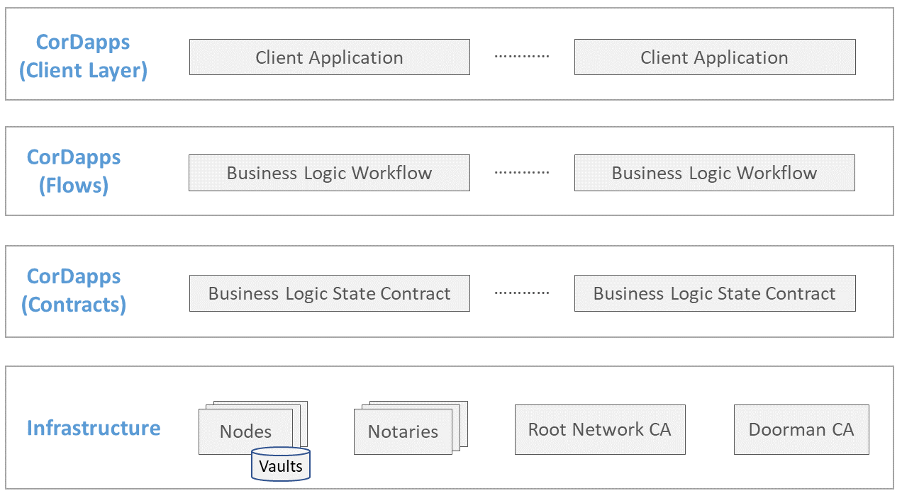
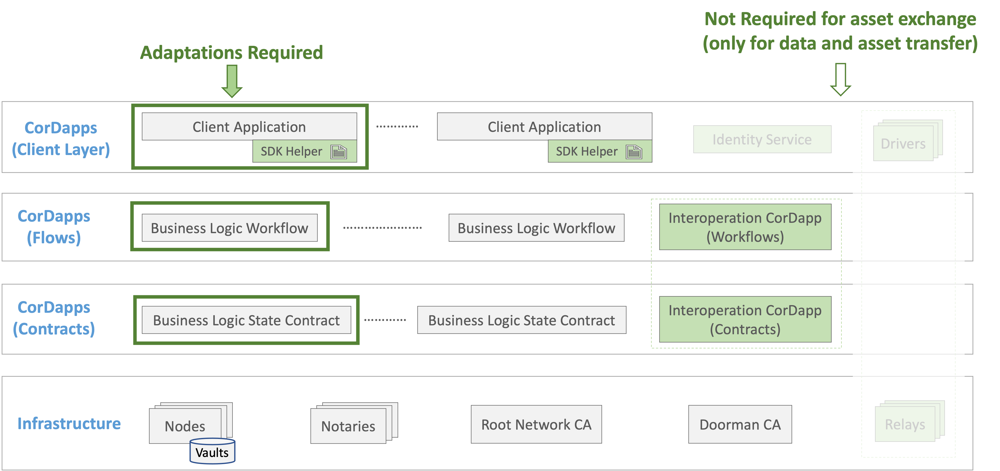

<!--
 Copyright IBM Corp. All Rights Reserved.

 SPDX-License-Identifier: CC-BY-4.0
 -->
# Asset Exchange - HTLC Protocol Units in Corda Networks

- RFC: 02-006
- Authors: Krishnasuri Narayanam, Sandeep Nishad, Venkatraman Ramakrishna, Dhinakaran Vinayagamurthy
- Status: Proposed
- Since: 25-Nov-2020

## Generic Corda Network
Below figure depicts the different components of a Corda network. Primarily it consists of the infrastructure used for the creation of the network and the distributed applications (CorDapps) deployed on the network. Any such CorDapp is a combination of contracts, flows and a client component to interact with the network.

## Weaver enabled Corda Network
Below figure depicts the different components of a Corda network with Weaver adaptations (highlighted in _green_ color). It requires changes in both infrastructure and CorDapp (contracts, flows, and client) layers. However, not all these adaptations are needed to demonstrate asset exchange protocol. For example, changes to infrastructure layer (addition of _Relays_) and changes to client layer (addition of _Identity Services_ and _Drivers_) are only needed to demonstrate _data sharing_ and _asset transfer_ protocols.

### Details of adaptations
The ownus on the changes required to made lies both on the application developer (as Weaver is agnostic to the client application) and on Weaver as the platform provider.

#### Responsibilities of CorDapp developer

- Asset contract must be augmented with the ability to verify lock, claim, and unlock requests (using Weaver libraries)
- Asset contract also should provide a function to create a state using _StateAndRef_ with owner passed as argument.
- Create following flows to support lock, and claim of an asset (using Weaver SDK):
  - UpdateOwnerFlow: Takes _StatePointer_, and returns _Asset State_ with updated owner, where caller will be the new owner.
  - RetrieveStateAndRef: Takes (assetType, id) for non-fungible assets or (assetType, quantity) for fungible assets as arguments, and returns the _StateAndRef_ for the corresponding asset.
- Add client support:
  - Endpoints: lock, claim, unlock, and query status of, an asset (using Weaver SDK)
  - Endpoints: receive hash locks and secrets from corresponding app in the other network
  - Send: hash locks and secrets to corresponding app in the other network

#### Responsibility of Weaver
- HTLC states maintained in vaults
- Interoperation CorDapp to manage bulk of lock, claim, and unlock flows

## Weaver HTLC implementation approach for Corda network
Below we describe the approach for the implementation of asset exchange between Alice & Bob using HTLC that requires only non-validating notary.
- Lock transaction: Consumes an input *Asset State* and produces *HTLC State* as the output. Since the claim/unlock later happens in the same ledger, a reference to the consumed *Asset State* is maintained as a Corda *StaticPointer* instead of copying the entire *Asset State* object.
  - both parties (Alice & Bob) are owners of the _HTLC State_ (this prevents any of these parties to cheat the other)

- Claim transaction: Consumes an input *HTLC State* and produces *Asset State* as the output. Checks the validity of the hash-preimage and timout as part of a Corda contract _command_. The Corda _flow_ that implements this transaction triggers a _subFlow_ to create asset object as per _StateRef_ with owner set to the party claiming (Bob).
  - The _subFlow_ will be part of the client corDapp, but not part of the interoperation corDapp of the Corda network.  

- Unlock transaction: Carried out by Alice after expiry of the timeout. It is similar to Claim transaction except that the _owner_ of the _Asset State_ is set to a party who performed locking (Alice).

All the above transactions collect the consent (signature) from both parties (Alice & Bob) for the execution completion. This helps:
- to ensure that the revealed preimage matches the hash in a claim transaction
- to guard against malicious lockers unlocking the assets illegally in a unlock transaction

A non-validating notary used in this approach doesn't check the validity of the transaction, but only ensure to prevent _double spending_ by the parties. This ensures the privacy of the transaction data.
