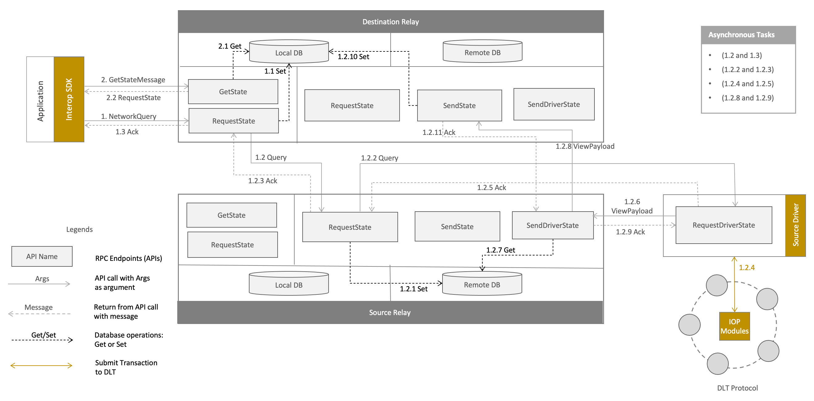

<!--
 Copyright IBM Corp. All Rights Reserved.

 SPDX-License-Identifier: CC-BY-4.0
 -->
# Data Sharing Protocol

- RFC: 02-001
- Authors: Antony Targett, Nick Waywood, Sandeep Nishad, Venkatraman Ramakrisna
- Status: Proposed
- Since: 02-Jan-2023

## Summary

This document specifies a request-response-validate protocol whereby a client application in one network requests data from another network's peers and submits the received data to its network's peers for validation.
Each network has a [relay](../../models/infrastructure/relays.md) that acts as an ingress and egress point for cross-network communication (i.e., messages and notifications).
This pair of network relays communicate messages using a DLT-agnostic protocol.
The [request](../../formats/views/request.md) is communicated in the form of a [view address](../../formats/views/addressing.md) plus a [verification policy](../../formats/policies/proof-verification.md).
The response is communicated in the form of a [view](../../formats/views/definition.md), which contains a [proof](../../models/ledger/cryptographic-proofs.md).
The responding network's peers run [access control policy](../../formats/policies/access-control.md) checks agianst the received view address.
The responding network's peers can optionally [encrypt the requested data using the requesting client's public key](../../models/security/confidentiality.md) before sending a response.
Access control checks, encryptions, and validations, are performed by the respective networks' [interoperation modules](../../models/infrastructure/interoperation-modules.md).

## Motivation

Data sharing (i.e. querying data) across networks/ledgers is a fundamental interoperability requirement or mode. It enables the stiching of smart contracts running in separate networks whereby a data requirement in a workflow in one network can be fulfilled by sourcing that data from a different network rather than relying on potentially untrustworthy clients or third parties. This enables the scaling up of business workflows across (or spanning) multiple networks without sacrificing the decentralization and trust offered by DLT protocols.

## Key Concepts

- [Discovery protocol](../discovery/discovery.md): Before a data sharing can occur between two networks, the requesting network needs to be aware of other networks. The discovery protocol is responsible for this.
- [Addressing](../../formats/views/addressing.md): Addressing is how a network can specify the data it wants from another network. This is akin to URLs in the World Wide Web.
- [Views](../../models/ledger/views.md): The self-authenticating data that can be shared by a network and identified by an address from outside the network. Its [format](../../formats/views/definition.md) has DLT-agnostic and DLT-specific parts, and it consists of [DLT-specific proofs](../../models/ledger/cryptographic-proofs.md) indicating an authentic association with the source ledger.
- [Verification Policy](../../formats/policies/proof-verification.md): Standard for authenticity proof as supplied by the data requestor, usually accompanying a view address.
- [View request](../../formats/views/request.md): A message consisting of a view address and an associated verification policy.
- [Access control policy](../../formats/policies/access-control.md): Standard for supplying addressable data to a requestor. Typically maintained as a collection of rules specifying which entities may access which categories of data (i.e., which comprise views).
- [Confidentiality](../../models/security/confidentiality.md): Data embedded in views can be encrypted using the requestor's public key.

## Protocol Overview

The high-level overview of the protocol is illustrated in the figure below. By convention, the destination network (requesting and consuming the data) is on the left and the source network (sharing the data) is on the right:

The key steps are in the following sequence:
1. Application client in destination network (left-hand side) sends a view request (view address and verification policy) to its network's relay.
2. Destination network's relay discovers the source network's relay and communicates the view address to it.
3. Source network's relay, via a suitable driver, invokes its network's interoperation module to satisfy the view request.
4. Source network's interoperation module:
  a. Runs an access control check before invoking the appropriate contract/dapp to fetch the state corresponding to the view request.
  b. Optionally encrypts the received state using the application client's public key if end-to-end confidentiality is (i) mandated by the source network, or (ii) specified in the view request.
5. Source network's interoperation module returns a collection of states with associated proofs (e.g., endorsement signatures) to the requesting driver.
6. Source network's driver packages the collection of states and proofs into a view and dispatches it to its relay.
7. Source network's relay communicates the view to the destination network's relay.
8. Destination network's relay communicates the view to the application client.
9. Application client optionally decrypts the state embedded in the view if it is encrypted, and also optionally validates the proof accompanying the view.
10. Application client submits the view, optionally the decrypted state, and the view address in the request to the destination network's interoperation module for validation.
11. Destination network's interoperation module validates the proof and invokes the appropriate contract/dapp to perform an operation as per its business workflow using the state embedded in the view.

The protocol with its sequence of steps is also illustrated in a model diagram below linking two separate networks running on different DLTs (loosely modeled on Corda at the left and Fabric on the right), with the protocol units and the Weaver components exercised set in context within their respective networks:

## Protocol Flow and Messages

A more detailed flow diagram is illustrated in the figure below:

Messages and API functions in relevant steps in the above workflow are given below:
- *Client Application `-->` Destination Interoperation Module*: Query verification policy for view address: this is done using the `GetVerificationPolicy` or `GetVerificationPolicyBySecurityDomain` function exposed by the interoperation module.
- *Destination Interoperation Module `-->` Client Application*: Response: `verification policy`: this is a serialized form of a [VerificationPolicy protobuf message](../../formats/policies/proof-verification.md#defining-verification-policies).
- *Client Application `-->` Destination Relay*: Request: `<view address, verification policy>`: the client application sends a [NetworkQuery](../../formats/communication/relay.md#networkquery) message to the relay.
- *Destination Relay `-->` Source Relay*: Request: `<request id, view address, verification policy>`: the destination relay sends a [Query](../../formats/views/request.md#query) message to the source relay.
- *Source Relay `-->` Source Driver*: Request: `<request id, view address, verification policy>`: the source relay sends a [Query](../../formats/views/request.md#query) message to the source driver.
- *Source Driver `-->` Source Interoperation Module*: Query state: this is done using the `HandleExternalRequest` function exposed by the interoperation module.
- *Source Interoperation Module `-->` Source Driver*: Response: `<state, proof>`: this is a serialized form of a DLT-specific view, e.g., [FabricView protobuf message](../../formats/views/fabric.md#view-data-definition)in Fabric networks, [ViewData protobuf message](../../formats/views/corda.md#view-data-definition) in Corda networks.
- *Source Driver `-->` Source Relay*: Response/poll: `<view, proof>`: this is a serialized form of a [ViewPayload protobuf message](../../formats/views/request.md#viewpayload).
- *Source Relay `-->` Destination Relay*: Response/poll: `<view, proof>`: this is a serialized form of a [ViewPayload protobuf message](../../formats/views/request.md#viewpayload).
- *Destination Relay `-->` Client Application*: Response/poll: `<view, proof>`: this is a serialized form of a [ViewPayload protobuf message](../../formats/views/request.md#viewpayload).
- *Client Application `-->` Destination Interoperation Module*: Submit state validation Tx: `<contract/dapp Tx, view, proof>`: this is done using the `WriteExternalState`function exposed by the interoperation module.
- *Destination Interoperation Module `-->` Client Application*: Response: `Tx success/failure`: this is either a blank (success) or an error message (failure).

## Inter-Relay Protocol

The protocol between two relays is both DLT-agnostic and completely separable from the rest of the data sharing protocol. We specify its salient features in this section.

### Roles

There are two roles in the `data-sharing` protocol: `requester` and `responder`. The requester asks the responder for some data, and the responder answers. Each role uses a single message type.

### States

This is a classic two-step request~response interaction, so it uses the predefined state machines for any `requester` and `responder`:

### Relay Flow

The end-to-end flow is explained in figure above. The steps numbers from figure are illustrated below:

1. Client prepares `NetworkQuery` and sends it to Destination Relay via `RequestState` (Client App) API.
  * **1.1:** Destination relay (inside Client’s `RequestState`) generates unique `request_id` for the query and stores the `RequestState` message with current status as `PENDING_ACK` in local database at key `request_id`.
  * **1.2:** Destination relay (inside Client’s `RequestState`) prepares `Query` and spawns a thread to send the Query to source relay via `RequestState` (Relay Service) API. When destination relay will receive `Ack` from source relay, it will update the status of `RequestState` as `PENDING` in database at key `request_id`
  * **1.2a:** Destination relay (inside Client’s `RequestState`) returns Ack to the client at the end of this API (happens asynchronously with step **1.2**).
  * **1.3:** Source relay (inside Relay’s `RequestState`) upon receiving the `Query`, stores it in remote database at key `request_id`.
  * **1.4:** Source relay (inside Relay’s `RequestState`) then spawns a thread to send `Query` to the intended driver based on Query via `RequestDriverState` API exposed by the driver.
  * **1.4a:** Source relay (inside Relay’s `RequestState`) returns `Ack` back to the destination relay (happens asynchronously with step **1.4**).
  * **1.5:** Driver (inside `RequestDriverState`) based on `Query`, asynchronously spawns a thread that submits transaction to DLT network using [interoperation module](./interoperation-modules.md). The response payload from `interoperation module` is received by the driver, then it creates a `View` payload based on DLT platform (e.g. [Fabric View](../../formats/views/fabric.md), [Corda View](../../formats/views/corda.md) or [Besu View](../../formats/views/besu.md) ), and then encapsulate it to DLT-neutral [View](../../formats/views/definition.md) along with meta-data. 
  * **1.5a:** Driver returns `Ack` back to the source relay (happens asynchronously with step **1.5**).
  * **1.6:** Driver (inside `RequestDriverState`) and then prepares and sends the `ViewPayload` to the source relay via `SendDriverState` API.
  * **1.7:** Source relay (inside `SendDriverState`) then fetches the `Query` from remote database using `request_id` from `ViewPayload`.
  * **1.8:** Source relay (inside `SendDriverState`) spawns a thread to send the `ViewPayload` back to the destination relay via `SendState` API.
  * **1.8a:** Source relay (inside `SendDriverState`) returns `Ack` back to the driver (happens asynchronously with step **1.8**).
  * **1.9:** Destination relay (inside `SendState`) stores the `RequestState` message with updated `state` (storing view) and `status` as `COMPLETED`, in the local database at key `request_id`.
  * **1.10:** Destination relay (inside `SendState`) returns `Ack` back to the source relay.
2. Client polls for response from Destination Relay via `GetState` API, passing `GetStateMessage` containing `request_id`.
  * **2.1:** Destination relay fetches the `RequestState` message stored in local database at key `request_id`.
  * **2.2:** Destination relay returns the `RequestState` obtained in step **2.1** to the client.

## Client API and SDK

In the [flow diagram](./generic.md#protocol-flow-and-messages), the client application is the initiator and orchestrator of the request-response-validate protocol for cross-network data sharing. For developer convenience, it is recommended that a single synchronous function be provided in the Weaver SDK for DLT applications to run the end-to-end flow. In the diagram, this would cover the entire vertical span of the "Client Application" line, from looking up a wallet identity to getting a notification of transaction success or failure in the local network. Optionally, based on a supplied parameter, this function may terminate when the client application receives a `ViewPayload` message from the local network's relay containing the data supplied by the remote network. The submission of the view for validation may, in certain situations, be deferred to a different time as per the client's (or the business workflow's) requirement.
