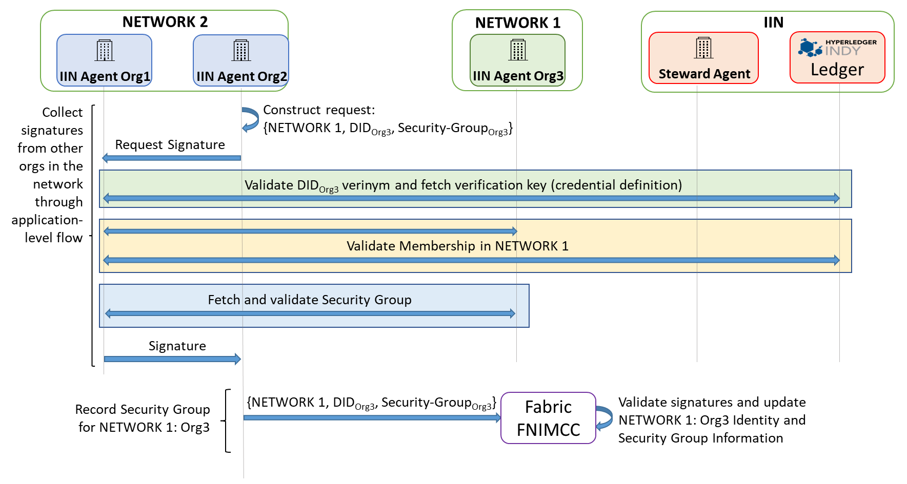

<!--
 Copyright IBM Corp. All Rights Reserved.

 SPDX-License-Identifier: CC-BY-4.0
 -->
# Protocol: Sharing of Identity and Configuration Information between Interoperating Networks

- RFC: 02-011
- Authors: Venkatraman Ramakrishna
- Status: Superseded (by 02-012)
- Since: 22-Oct-2020

# Background

This is an identity plane protocol to exchange identity information between two interoperating networks. This establishes a basis (or trust anchor) for proof-based data sharing. For background and component information, start [here](../../models/identity/distributed-identity-management.md).
(You can also check out our [ICBC 2021 research paper](https://arxiv.org/abs/2104.03277) on this topic.)

# Overview

As mentioned in the background document (linked to above), there are three phases in the process between a new network unit making itself known via an IIN and a Steward up to the point when its identity and certificates are accepted and recorded by a foreign network with which an interoperation (in the data plane) may occur in the future. These phases are separate protocol instances in themselves, though they must follow a particular chronological order. The full process is illustrated in the figure below:

First, each network unit of a network (above, without loss of generality, `NETWORK 1`) must register itself with an IIN and a Steward in that IIN. So Step 1 in the above figure must be carried out by each unit independently before a network is ready to interoperate with another.

Second, any of the network units of a network (above, without loss of generality, `NETWORK 2`) can fetch the latest identity and certificate information for a foreign network (again, without loss of generality, `NETWORK 1`) based on a trigger, which can be any of the following:
* Manual trigger applied by a network administrator
* Timeout after a poll interval: the network unit in `NETWORK 1` polls for updates to `NETWORK 2`
* Event notification: a network unit in `NETWORK 1` receives an event notifying it about a change in `NETWORK 2`

Third, any of the network units of a network that have obtained updated information about another network can run a process leading up the recording of this information as a set of security domains to its local ledger using the interoperation module (in Fabric, the interoperation chaincode; in Corda, the interoperation Cordapp). This process involves a flow among the various network units to collect a multi-signature, as is described later in this document.

# Protocol Phases

The protocol in each phase is described below. As above, without loss of generality, we consider a scenario where `NETWORK 1` has one unit (`Org3`) that needs to register, `NETWORK 2` has two units that collectively record the Security Domain of `NETWORK 1: Org3` on their network's ledger, and a single IIN with a single Steward represented by an agent (`Steward Agent`) that issues membership list credentials for networks and membership credentials for network units. This set of components is sufficient to demonstrate all the basic facets of the protocol; a protocol instance with any additional network units or steward agents will only consist of these facets repeated one or more times:
* Registering a new network unit as a member of a given network and obtaining a DID
* Network unit obtaining a credential from a steward or trust anchor certifying its membership in a network
* Network unit self-certifying its Security Domain info (typically, a set of certificate chains)
* Network unit fetching and validating a membership list for a foreign network from a steward or trust anchor
* Network unit validating DID records for a foreign network's unit on an IIN
* Network unit requesting and validating network membership presentation made by foreign network's unit using an IIN
* Network unit requesting and validating self-certified Security Domain info presentation made by foreign network's unit
* Network unit triggering a flow among other units within its network to collect signatures over a foreign network's unit's Security Domain info
* Network unit participating in signature-collection flow triggered by another network unit and supplying its signature post-validation of presentations of a foreign network's unit's membership and its Security Domain info
* Network unit recording counter-signed Security Domain info for a foreign network's unit on the ledger using the interoperation module (typically smart contract)

## Protocol: Registration

An IIN Agent represents each network unit: two for `NETWORK 2` and one for `NETWORK 1`.

The registration procedure illustrated in the above figure involves two entities (and the IIN):
* IIN Agent of the registering network unit: `IIN Agent Org3` (`NETWORK 1`)
* Steward Agent of the IIN maintaining a membership list for the above unit's network (`NETWORK 1`): `Steward Agent`
The steps of this registration procedure are as follows:
1 `IIN Agent Org3` creates a temporary DID for communication with the `Steward Agent` as per standard Indy protocol
2 `IIN Agent Org3` requests and obtains a DID (`Verinym`) from `Steward`, in the process recording `Verinym` on to the IIN ledger. `Steward Agent` updates the membership list in its local store ([ref](../../models/iin-steward-agent.md))
3 `IIN Agent Org3` requests a verifiable membership credential ([ref](../../models/iin.md)) from `Steward Agent`
4 `IIN Agent Org3` issues itself a verifiable credential for its network unit's Security Domain info. (In Fabric, this only requires a signature over an organization's MSP's Fabric CA Server root certificate, as any downstream certificates have a validity chain leading up to this root.) This credential is stored in the local wallet of `IIN Agent Org3`

## Protocol: Get Foreign Network Membership Information

This stage of the protocol involves three entities (and the IIN):
* IIN Agent of a recently registered network unit: `IIN Agent Org3` (`NETWORK 1`)
* IIN Agent of a network unit that seeks the identity (Security Domain info) of the above network unit: `IIN Agent Org2` (`NETWORK 2`)
* Steward Agent of the IIN maintaining a membership list and issuing membership credentials for the recently registered unit's network (`NETWORK 1`): `Steward Agent`
The steps of this information fetching protocol are as follows:
1. `IIN Agent Org2` requests a membership list presentation for `NETWORK 1` from `Steward Agent`, getting a self-certified credential consistinf of the membership list credential. The credential contains the list of DIDs of every network unit of `NETWORK 1` known to `Steward Agent`. It can be authenticated by `IIN Agent Org2` by fetching the verification key (credential definition) from the IIN ledger if the wallet of `IIN Agent Org2` does not already contain that key.
2. For each DID in this membership list, `IIN Agent Org2` confirms its Verinym's presence on the IIN ledger and fetches the membership credential verification key for that DID from IIN. It is strictly optional to do this for every member DID and `IIN Agent Org2` can adopt different policies like the following:
  * Only new (i.e., not previously known) member DIDs are validated
  * A DID is validated only if enough time has elapsed since the last validation (the elapsed time threshold can be configured)
3. `IIN Agent Org2` performs a membership credential validation check by requesting a verifiable membership credential from `IIN Agent Org3`, which the latter obtained from `Steward Agent` in the Registration Phase. The validation relies on the credential schema and definition in the IIN ledger, according to the standard Indy protocol
4. `IIN Agent Org2` obtains Security Domain info from `IIN Agent Org3` by requesting a presentation. This is a self-signed presentation and hence can be validated using the verification key of `IIN Agent Org3` that was fetched earlier in this stage from the IIN ledger.

### Sub-Protocol: Refresh Foreign Network Membership Information

If the membership list of `NETWORK 1` has not changed (inferred in Step 1 above) since the last check, `IIN Agent Org2` can jump directly to Step 4 and get the latest Security Domain info from `IIN Agent Org3`.

It is possible for the membership credential schema or verification key to be replaced over time (Indy doesn't allow an update to these; a steward or trust anchor needs to register a new schema or key on the IIN ledger). In this case, Step 2 will also have to be repeated for `IIN Agent Org3`, but this can happen separately (or on a different frequency) from the Security Domain refresh cycle.

## Protocol: Update Foreign Network Information

This stage of the protocol involves all the entities that participate in this scenario (and the IIN):
* IIN Agent of a recently registered network unit: `IIN Agent Org3` (`NETWORK 1`)
* IIN Agent of a network unit that starts a flow to collect signatures over the identity (Security Domain info) of the above network unit: `IIN Agent Org2` (`NETWORK 2`)
* IIN Agent of a network unit that participates in a flow to collect signatures over the identity (Security Domain info) of the above network unit: `IIN Agent Org1` (`NETWORK 2`)
* Steward Agent of the IIN maintaining a membership list and issuing membership credentials for the recently registered unit's network (`NETWORK 1`): `Steward Agent`
The steps of this information update protocol are as follows:
1. `IIN Agent Org2` constructs a _signature collection procedure_ request message consisting of the following: `{<Network-ID>,<Network-Unit-DID>,<Network-Unit-Security-Domain>},<Signature>` (here, `<Signature>` is generated over the preceding structure
2. `IIN Agent Org2` triggers a _signature collection procedure_ by sending the request to every other IIN Agent in `NETWORK 2`; in the instance illustrated in the above figure, this set consists of only `IIN Agent Org1`. The requestees return signatures over the structure generated above to `IIN Agent Org2`.
  * This can be orchestrated completely by the triggering agent, which sends requests and receives responses from every other IIN Agent.
  * Alternatively, this could be a flow, where the trigger agent is simply the first node to generate a signature after which the request is handed off to another node. Eventually, when enough signatures are collected, a ledger update can be triggered (see Step 6 further below)
3. (_Optional_) `IIN Agent Org1` confirms the presence of the DID (Verinym) of `IIN Agent Org3` on the IIN ledger and fetches the verification key. This replicates what `IIN Agent Org2` did in Step 2 of the "Get Foreign Network Membership Information" protocol phase. As mentioned in that that stage, this step is optional and may rely on local wallet contents rather than the IIN ledger.
4. (_Optional_) `IIN Agent Org1` performs a membership credential validation check for `IIN Agent Org3` just like `IIN Agent Org2` did in Step 3 of the "Get Foreign Network Membership Information" protocol phase.
5. `IIN Agent Org1` obtains and validates Security Domain info for `IIN Agent Org3` just like `IIN Agent Org2` did in Step 4 of the "Get Foreign Network Membership Information" protocol phase.
6. When `IIN Agent Org2` obtains signatures from all IIN Agents in `NETWORK 2`, it updates the Security Domain info on the network ledger by submitting a transaction to the Interoperation module (a chaincode in the Fabric implementation, a Cordapp in the Corda implementation). The transaction payload consists of: `{<Security-Domain-NETWORK 1-Org3>,[<Signature-Org1>,<Signature-Org2>]}`. The signatures are validated by multiple peers and committed to the ledger after passing through a consensus protocol.

## Notes

Both the "Get Foreign Network Membership Information" protocol phase and the "Update Foreign Network Information" protocol phase may be run independently by an IIN Agent of a network that seeks to obtain the latest identity information of a foreign network. These agents require no coordination among themselves as the final step, involving a local ledger transaction, is idempotent (i.e., if the input arguments don't change, the state of the ledger remains unchanged). We can optionally add optimizations to minimize the amount of work done by the IIN Agents, such as refraining from starting a signature collection procedure (in the third phase) if a signature request is received from another agent in the network (detected in Step 2 of the third phase).
