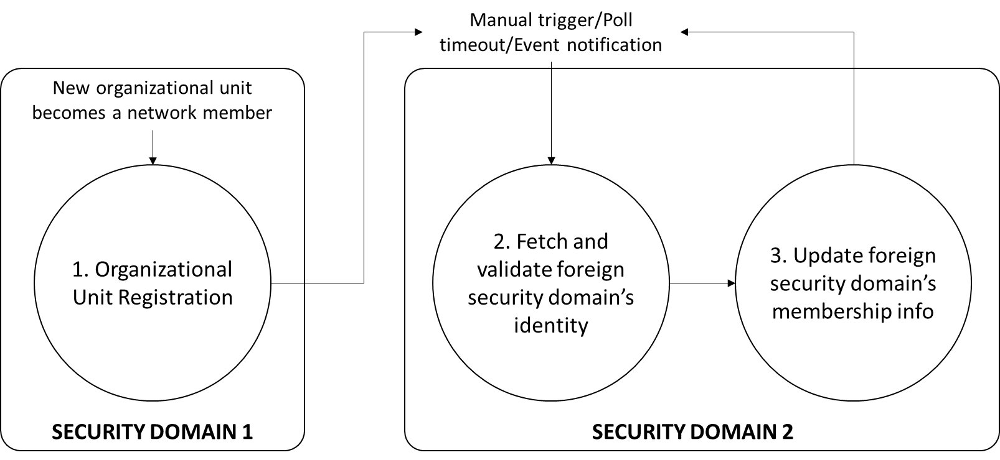

<!--
 Copyright IBM Corp. All Rights Reserved.

 SPDX-License-Identifier: CC-BY-4.0
 -->
# Credentials update with changes in identity plane

- RFC: 02-012-appendix-c
- Authors: Venkatraman Ramakrishna, Krishnasuri Narayanam, Bishakh Chandra Ghosh, Ermyas Abebe
- Status: Proposed
- Since: 24-Sep-2021

# Overview

As mentioned in the [identity exchange protocol](./identity-syncing.md), there are three phases in the process between a network making itself known via an IIN to the point when its identity and certificates are accepted and recorded by a foreign network with which an interoperation (in the data plane) may occur in the future. These phases are separate protocol instances in themselves, though they must follow a particular chronological order. The full process is illustrated in the figure below:

First, each network unit of a network (above, without loss of generality, `NETWORK 1`) must register its network identity with an IIN. So Step 1 in the above figure must be carried out the network units before a network is ready to interoperate with another.

Second, any of the network units of a network (above, without loss of generality, `NETWORK 2`) can fetch the latest identity and certificate information for a foreign network (again, without loss of generality, `NETWORK 1`) based on a trigger, which can be any of the following:
* Manual trigger applied by a network administrator
* Timeout after a poll interval: the network unit in `NETWORK 1` polls for updates to `NETWORK 2`
* Event notification: a network unit in `NETWORK 1` receives an event notifying it about a change in `NETWORK 2`

Third, any of the network units of a network that have obtained updated information about another network can run a process leading up the recording of this information as a set of security domains to its local ledger using the interoperation module (in Fabric, the interoperation chaincode; in Corda, the interoperation Cordapp). This process involves a flow among the various network units to collect a multi-signature, as is described in the [data plane identity configuration protocol](./data-plane-identity-configuration.md).
