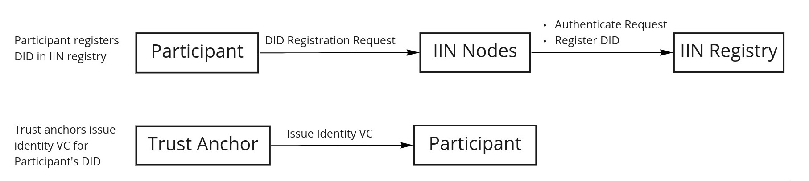
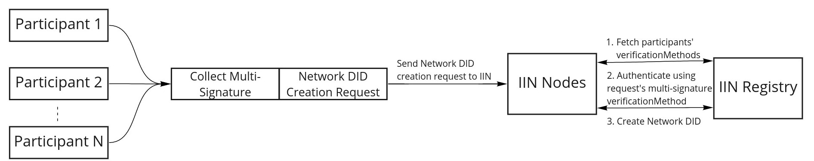

<!--
 Copyright IBM Corp. All Rights Reserved.

 SPDX-License-Identifier: CC-BY-4.0
 -->
# Protocols for Decentralized Network-Identity Configuration, Exchannge and Validation, for Interoperation

- RFC: 02-012
- Authors: Venkatraman Ramakrishna, Krishnasuri Narayanam, Bishakh Chandra Ghosh, Ermyas Abebe
- Status: Proposed
- Supersedes: 02-011
- Since: 24-Sep-2021


## Summary

This is an identity plane protocol to exchange identity information between two interoperating blockchain networks. This establishes a basis (or trust anchor) for proof-based data sharing. For background and component information, start [here](../../models/identity/network-identity-management.md).

The entire Network Identity Discovery and Management protocol involves the following protocols for different steps:

1. Particpant Unit Identity Creation
2. Network Identity Creation as Network DID
3. Netwrok Discovery
4. Network Identity Validation
5. Data Plane Identity Configuration
6. Updating Network DID with changing Network Structure

## Roles

There are different units in the identity plane with different roles as follows:

**participant** - A blockchain network's participant unit such as an organization or individual.

**network** - A blockchain network that is formed of participants.

**IIN** - The Interoperation Identity Network consisting of the `IIN registry`, `IIN nodes`, and `trust anchors`.


**IIN registry** - DID registry and verifiable data registry provided by the IIN.

**IIN nodes** - Nodes that maintain the IIN DLT based registry acting as validators/miners of transactions.

**trust anchor** - An entity (individual/organization) that issues VCs to assert claims about identity or membership or others to participant as well as networks. Different networks and participants can trust different trust anchors.

**IIN Agents** - Each `participant` has one or more IIN Agent, which is the identity plane component of the participant that interacts with the IIN and other participant's IIN Agents.

## Particpant Unit Identity Creation

Each network participant unit such as individuals or organizations participating in any blockchain network must have their DID registered in some IIN. To create a DID in an IIN registry, the following steps are performed.





**Step 1. participant chooses a unique DID**

The DID is a globally unique [identifier](https://w3c.github.io/did-core/#identifier) (`did:<method-name>:<method-specific-id>`) which is constructed using a   `method-name` and a `method-specific-id` that is unique wthin the method. Each IIN registry will have its unique `method-name` and specify how to generate the `method-specific-id` component of a DID.


Example:

If `method-name` of an IIN registry is `exampleiin`, and the participant chooses a `method-specific-id` as `org1`, then `org1` must be unique within `exampleiin`, and `did:exampleiin:org1` must be unique globally.

> Note: An IIN registry may enforce participant DIDs to have a fixed prefix in the `method-specific-id` to determine that it is a participant DID and not a network DID. Eg: if the fixed prefix is `participant:`, then a valid participant did will be `did:exampleiin:participant:org1`. Similarly a network DID can be `did:exampleiin:network:tradelens`. 

**Step 2. participant creates a DID Document**

The participant DID Document must specify one verification method with [authentication](https://w3c.github.io/did-core/#authentication) verification relationship. An example of participant DID document:

```json
{
  "id": "did:exampleiin:org1",
  "verificationMethod": [{
    "id": "did:exampleiin:org1#key1",
    "type": "Ed25519VerificationKey2020",
    "controller": "did:exampleiin:org1",
    "publicKeyMultibase": "zH3C2AVvLMv6gmMNam3uVAjZpfkcJCwDwnZn6z3wXmqPV"
  }],

  "authentication": ["did:exampleiin:org1#key1"]
}
```

**Step 3. participant send a DID registration request to the IIN (IIN registry).**

The DID registration (create method) request must contain the DID document, as well as a signature that can be verified against the `authentication` verification method specified in the DID document. This request is sent by the `IIN Agent` of the participant. The underlying protocol dictating how the DID registration request will be sent to the IIN depends on the create method of the IIN registry.

Example DID registration request:
```json
{
  "DIDDocument": {
    "id": "did:exampleiin:org1",
    "verificationMethod": [{
      "id": "did:exampleiin:org1#key1",
      "type": "Ed25519VerificationKey2020",
      "controller": "did:exampleiin:org1",
      "publicKeyMultibase": "zH3C2AVvLMv6gmMNam3uVAjZpfkcJCwDwnZn6z3wXmqPV"
    }],

    "authentication": ["did:exampleiin:org1#key1"]
  },
  "signature": "..."
}
```
Here signature is done on the DIDDocument.

**Step 4. IIN validates a DID registration request and creates the DID**

A DID registration request, that is the DID create method of the IIN registry, must authenticate the request. This authentication is to be done by validating the signature in the request with the help of the authentication method present in the DID Document of the request.

**Step 5. Trust anchors issue identity VC to participant DID.**

A DID and a DID document do not inherently carry any personal data such as physical identity / real worl identity ([binding did to physical identity](https://w3c.github.io/did-core/#binding-to-physical-identity)). Therefore, to map a participant's did to its physical identity, some trust anchor must issue VCs attesting the real world physical identity of the participant , to the participant's DID. The participant itself becomes the holder of those identity VCs and can present it to others to prove its physical identity.

> Step 5 has flexibility in terms of how many trust anchors and which trust anchors issue identity VC to a particular participant. These identity VCs might be used for validating network identity by other network participants.  See *Network Identity Validation* step.


## Network Identity Creation as Network DID



A network formed of participants creates its own Network DID in an IIN registry. The Network DID is controlled jointly by its participants ([group controller](https://w3c.github.io/did-core/#group-control)). This Network DID can be used as an address to the network, to discover and configure its identity during interoperation. 

Creation of a Network DID involves the following steps:

**Step 1. Creating Network DID Document**

In addition to the usual fields of a DID Document, a Network DID document must contain a `verificationMethod` of type `BlockchainNetworkMultiSig`, and `networkParticipants` property listing the DIDs of the participants. 
The `BlockchainNetworkMultiSig` verificationMethod defines the group controller of the Network DID.

Each participant in `networkParticipants` must already have a registered DID in some IIN registry.

The DID, that is the `id` property in the Network DID document can be chosen by the network.

See  [Network DID Identity format](../../formats/identity.md) for details about Network DID format.


**Step 2. Preparing Network DID creation request**

Creating a Network DID is only possible by the DID's controller. Therefore to create a Network DID for the first time, the request has to be authenticated by verifying attestations of all participants of the network. This is done while forming the Network DID creation request.

A Network DID creation request has a `NetworkDIDDocument` and `signatures`. `NetworkDIDDocument` contains the Network DID Document with the `networkParticipants` and a `BlockchainNetworkMultiSig` verificationMethod. The `signatures` is a set of signatures from all participants.

> Note: During NetworkDID creation, the `updatePolicy` of the `BlockchainNetworkMultiSig` verificationMethod is not used. Instead. the request has to be authenticated against all the participants in `networkParticipants` list.

Example NetworkDID creation request:

```json
{
  "NetworkDIDDocument": {
    "id": "did:<iin_name>:<network_name>",
    "networkParticipants": [
      "did:<iin_name>:<network_participant_1>",
      "did:<iin_name>:<network_participant_2>",
      "did:<iin_name>:<network_participant_3>"
    ],
    "verificationMethod": [{
        "id": "did:<iin_name>:<network_name>#multisig",
        "type": "BlockchainNetworkMultiSig",
        "controller": "did:<iin_name>:<network_name>",
        "multisigKeys": [
          "did:<iin_name>:<network_participant_1>#key1",
          "did:<iin_name>:<network_participant_2>#key3",
          "did:<iin_name>:<network_participant_3>#key1"
        ],
        "updatePolicy": {
          "id": "did:<iin_name>:<network_name>#updatepolicy",
          "controller": "did:<iin_name>:<network_name>",
          "type": "VerifiableCondition2021",
          "conditionAnd": [{
              "id": "did:<iin_name>:<network_name>#updatepolicy-1",
              "controller": "did:<iin_name>:<network_name>",
              "type": "VerifiableCondition2021",
              "conditionOr": ["did:<iin_name>:<network_participant_3>#key1",
                "did:<iin_name>:<network_participant_2>#key3"
              ]
            },
            "did:<iin_name>:<network_participant_1>#key1"
          ]
        }
      },

      {
        "id": "did:<iin_name>:<network_name>#fabriccerts",
        "type": "DataplaneCredentials",
        "controller": "did:<iin_name>:<network_name>",
        "FabricCredentials": {
          "did:<iin_name>:<network_participant_1>": "Certificate3_Hash",
          "did:<iin_name>:<network_participant_2>": "Certificate2_Hash",
          "did:<iin_name>:<network_participant_3>": "Certificate3_Hash"
        }
      }
    ],
    "authentication": [
      "did:<iin_name>:<network_name>#multisig"
    ],
    "relayEndpoints": [{
        "hostname": "10.0.0.8",
        "port": "8888"
      },
      {
        "hostname": "10.0.0.9",
        "port": "8888"
      }

    ]
  },
  "signatures": {
    "did:<iin_name>:<network_participant_1>": "...",
    "did:<iin_name>:<network_participant_2>": "...",
    "did:<iin_name>:<network_participant_3>": "..."
  }
}

```

How this request is created is out of the scopt of this specification. However, generally it is recommended that the signatures of the request are collected through a smart contract in the network blockchain itself.

**Step 3. Network sends the Network DID creation request to IIN**

The Network DID creation request containing signatures from all the participants can then be sent to an IIN. This can be done by any entity's IIN agent, for example by the IIN agent of a participant of the network. How the participant is selected can vary from implementation to implementation.


**Step 4. IIN validates a Network DID creation request**

The DID create method of the IIN registry must authenticate the a Network DID creation request differently from other DIDs. For a Network DID, the IIN first validates if the DID Document has the requisite properties: `networkParticipants`, and a verificationMethod of type `BlockchainNetworkMultiSig`. Additionally, the request must contain the signatures from all participants of the network authenticating it.

The authentication process is carried out by validating signature from each participant in the `networkParticipants` as follows:

1. The participant DID is obtained from `networkParticipants`.
   - Example: `did:<iin_name>:<network_participant_1>`
2. From the `BlockchainNetworkMultiSig` verification, which verification method for the participant will be used is determined.
   - Example: `did:<iin_name>:<network_participant_1>#key1` indicates that key1 will be used which is specified by the fragment at the end of the URI.
3. The DID Document of the participant is obtained by resolving the DID, and the required verification method is obtained.
   - Example:
   ```json
    {​
      "id": "did:<iin_name>:<network_participant_1>",​
      ...​
      "verificationMethod": [
        {
          "id": "did:<iin_name>:<network_participant_1>#key1",
          "type": "Bls12381G2Key2020",
          "controller": "did:<iin_name>:<network_participant_1>",
          "publicKeyBase58": "25ETdUZDVnME6yYuAMjFRCnCPcDmYQcoZDcZuXAfeMhXPvjZg35QmZ7uctBcovA69YDM3Jf7s5BHo4u1y89nY6mHiji8yphZ4AMm4iNCRh35edSg76Dkasu3MY2VS9LnuaVQ",

        }]
    "assertionMethod": ["did:example:org1#key1"],
    "authentication": ["did:example:org1#key2"]​
    }​
   ```

4. From `singatures` in Network DID creation request, the participant is validated with the help of the verificationMethod obtained in the previous step.


Once each participant's signature is validated, the Network DID is registered in the IIN registry.

Since the IIN registry is a decentralized registry, the validation of a Network DID creation request is carried out by multiple peers so that consensus is reached, and the DID is committed in the registry.


## Network Discovery

The first step towards interoperation between two blockchain networks is discovery. Any network with a registered Network DID in an IIN can be discovered using the DID only.

Given the DID of a foreign network in the format `did:<iin_name>:<network_name>` (example `did:iinindy:tradelens`), the foreign network can be discovered by standard DID resolution. The IIN agent of a participant of a local network contacts the DID registry (example: `iinindy`) and resolves the DID to download the Network DID document.

Find the network discovery protocol specifications [here](../discovery/readme.md). 


## Network Identity Validation

After discovery of the network and fetching the Network DID document, the authenticity of it has to be verified by validating the identity of the network. This is carried out through the Network Identity Validation protocol described [here](./network-identity-validation.md).

## Data Plane Identity Configuration

After foreign network identities are validated, it has to be configured in the data plane for interoperation. A single participant unit cannot update identity information in the network's ledger. This needs agreement among all the participanting units. This agreement is ensured through collection of signatures through an application level flow as discussed in detail [here](./data-plane-identity-configuration.md).

## Updating Network DID with changing Network Structure

Permissioned blockchain networks might change with time with existing participants leaving and new participants joining the network. As a result, the Network DID also needs to be updated with the new list of participants forming the group controller. Updating the Network DID involves the following steps:


**Step 1. Creating updated Network DID Document**

While updating a Network DID for changing network structure, primarily two properties need to be updated: `BlockchainNetworkMultiSig` verification method, and `networkParticipants`.

The `networkParticipants` is updated with the new list of DIDs of  the network participants.

`BlockchainNetworkMultiSig` verification method is updated with the changed updation policy.

**Step 2. Network DID updation request**

Updating a Network DID requires the request to be authenticated against the `BlockchainNetworkMultiSig` verification method's `updatePolicy`.

Similar to the Network DID creation request, the updation request has a NetworkDIDDocument and signatures. NetworkDIDDocument contains the updated Network DID document and signatures is a set of signatures satisfying the  `updatePolicy` in the `BlockchainNetworkMultiSig` verification method of the existing DID document, as well as the `networkParticipants`.

The updation request can be made by IIN agent of any participant of the network.

**Step 3. IIN validates a Network DID updation request**

The IIN registry authenticates a Network DID updation request based on two conditions:
(1) The signatures must  satisfy the `updatePolicy` in the `BlockchainNetworkMultiSig` verification method of the existing Network DID document.


## Dataplane credentials update with changes in identity plane

The identity exchange and validation has to be done whenever there is a change in the identity of any network. Thus, the identity exchange protocol steps explained in this document must be triggered within a network whenever the identities of the participant units of any network it wishes to interoperate with change. This is further explained [here](./identity-change-updates.md).
