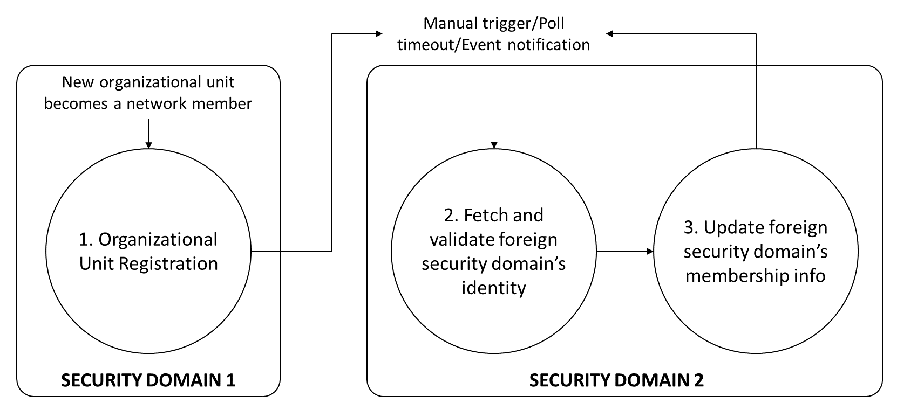

<!--
 Copyright IBM Corp. All Rights Reserved.

 SPDX-License-Identifier: CC-BY-4.0
 -->
# Cross-Domain Identity and Membership Syncing

- RFC: 02-012
- Authors: Venkatraman Ramakrishna, Krishnasuri Narayanam, Bishakh Chandra Ghosh, Ermyas Abebe
- Status: Proposed
- Supersedes: 02-011
- Since: 25-Aug-2022


## Summary

This is set of identity plane protocols to enable two interoperating blockchain networks, i.e., two independent security domains, to discover, offer, and validate each other's identities and memberships. This establishes a trust basis for proof-based [data sharing](../data-sharing/generic.md) and [asset transfer](../asset-transfer/generic.md) data plane protocols. For background information and an overview of the architectural assumptions, start with the [identity management specs](../../models/identity/network-identity-management.md).

We can list the protocols that comprise an end-to-end process from network creation to setting the basis for data plane interoperation in sequence as follows:

1. Organizational Unit Identity Creation
2. Creation of a Security Domain DID for a Network
3. Security Domain Discovery
4. Security Domain Identity Validation
5. Security Domain Membership Syncing
6. Syncing Identity and Membership upon Network Structure Change

## Roles

There are different units in the identity plane with different roles as follows:

**member** - An organizationa unit that is also a blockchain/DLT network's member.

**security domain** - A blockchain/DLT network or subgroup of a blockchain/DLT network that is self-sovereign for identity issuance and governance purposes.

**IIN** - The Interoperation Identity Network consisting of an `IIN registry`, `IIN nodes`, and `trust anchors`. See the [IIN spec](../../models/identity/iin.md) for more details.

**IIN registry** - Verifiable data registry maintaining DID records.

**IIN nodes** - IIN nodes that maintain a shared DLT-based registry and act as validators/miners of transactions.

**trust anchor** - A well-known entity (individual/organization) that issues VCs to assert claims about an organizational unit or security domain. These claims include, but are not limited to, identity and network membership. Different networks/domains and the organization units that constitute their memberships may trust different trust anchors.

**IIN Agents** - Each security domain member controls at least one IIN Agent, which interfaces with at least one IIN and one trust anchor and with other members' (local or foreign) IIN Agents.


## Network Member (Organizational Unit) Identity Creation

The organizational unit corresponding to each network member must have its DID record registered in some IIN. The following steps must be performed to create a DID record in an IIN registry.


**Step 1. member chooses a unique DID**

The DID is a globally unique [identifier](https://w3c.github.io/did-core/#identifier) (`did:<method-name>:<method-specific-id>`) which is constructed using a `method-name` and a `method-specific-id` that is unique wthin the method. Each IIN registry will have its unique `method-name` and specify how to generate the `method-specific-id` component of a DID.

Example:

If `method-name` of an IIN registry is `exampleiin`, and the organizational unit chooses a `method-specific-id` as `org1`, then `org1` must be unique within `exampleiin`, and `did:exampleiin:org1` must be unique globally.

> Note: An IIN registry may mandate organizational unit DIDs to have a fixed prefix in the `method-specific-id` to signal that it is a network member's DID and not a network's (or security domain's) DID. Eg: if the fixed prefix is `member:`, then a valid organizational unit DID will be `did:exampleiin:member:org1`. Similarly a security domain DID can be `did:exampleiin:security-domain:tradelens`. 

**Step 2. member creates a DID Document**

The member DID Document must specify one verification method (`verificationMethod`) with its [authentication](https://w3c.github.io/did-core/#authentication) [verification relationship](https://w3c.github.io/did-core/#dfn-verification-relationship). An example of such a member DID document is as follows:

```json
{
  "id": "did:exampleiin:org1",
  "verificationMethod": [{
    "id": "did:exampleiin:org1#key1",
    "type": "Ed25519VerificationKey2020",
    "controller": "did:exampleiin:org1",
    "publicKeyMultibase": "zH3C2AVvLMv6gmMNam3uVAjZpfkcJCwDwnZn6z3wXmqPV"
  }],

  "authentication": ["did:exampleiin:org1#key1"]
}
```

**Step 3. member send a DID registration request to the IIN (IIN registry)**

The DID registration (`create` method) request must contain the DID document as well as a signature that can be verified against the verification method associated with the `authentication` field specified in the DID document. This request is sent by the member's IIN Agent using the appropriate DID registration protocol (i.e., `create` method) for the IIN registry.

Example DID registration request:
```json
{
  "DIDDocument": {
    "id": "did:exampleiin:org1",
    "verificationMethod": [{
      "id": "did:exampleiin:org1#key1",
      "type": "Ed25519VerificationKey2020",
      "controller": "did:exampleiin:org1",
      "publicKeyMultibase": "zH3C2AVvLMv6gmMNam3uVAjZpfkcJCwDwnZn6z3wXmqPV"
    }],

    "authentication": ["did:exampleiin:org1#key1"]
  },
  "signature": "..."
}
```
Here, the `signature` is generated over the `DIDDocument`.

**Step 4. IIN validates a DID registration request and creates the DID**

When an IIN registry receives a DID registration request, i.e., the DID `create` method, it must first authenticate the request by validating the `signature` in the request with reference to the authentication method present in the DID Document of the request.

**Step 5. Trust anchors issue identity VC to member DID**

A DID document does not contain any personal information about its holder, like physical identity or real world identity (see [binding DID to physical identity](https://w3c.github.io/did-core/#binding-to-physical-identity) for reference). Therefore, to map an organization unit's DID to its physical identity, some trust anchor must issue VCs attesting real world identities of the member to its DID. The member can hold these VCs in a wallet and present them to others to prove various identities or affiliations as required in particular scenarios.

> Any nummber of trust anchors may issue identity VCs to a member in Step 5. These identity VCs may be used for validating its security domain's identity by other members of that domain.  See the *Security Domain Identity Validation* section for more details.


## Security Domain Identity Creation as Security Domain DID


A security domain creates its own DID record in an IIN registry. The Security Domain DID is controlled jointly by its members according to the [group controller specification](https://w3c.github.io/did-core/#group-control). This DID can then be used as a way of addressing the network/domain, to discover and configure its identity and membership for interoperation. 

Creation of a Security Domain DID involves the following steps:

**Step 1. Creating Securtiy Domain DID Document**

In addition to the typical fields found in a DID Document, a Security Domain DID document must contain a `verificationMethod` of type `BlockchainNetworkMultiSig`, and `networkMembers` property listing the DIDs of the network's members. This method defines the group controller of the Security Domain DID.

Each member in `networkMembers` must already have a registered DID in some IIN registry.

The unique identity in the DID document, i.e., the `id` property, can be chosen by the network.

See the [Security Domain DID Identity format specs](../../formats/identity.md) for more details.


**Step 2. Preparing Security Domain DID creation request**

A Security Group DID can only be created by its group controller. Therefore, to create such a DID for the first time, the `create` request must be authenticated by verifying attestations of all members of the network, which are included in the DID creation request.

The Security Domain DID creation request must have the following fields:
* `SecurityDomainDIDDocument`: the security domain's DID Document with a `networkMembers` field and a `verificationMethod` of type `BlockchainNetworkMultiSig`.
* `signatures`: a set of signatures from all network members.

> Note: During the DID creation, the `updatePolicy` field in the `verificationMethod` is not used. Instead. the request must be authorized by all the members listed in the `networkMembers` field using their signatures.

Example Security Domain DID creation request:

```json
{
  "SecurityDomainDIDDocument": {
    "id": "did:<iin_name>:<network_name>",
    "networkMembers": [
      "did:<iin_name>:<network_member_1>",
      "did:<iin_name>:<network_member_2>",
      "did:<iin_name>:<network_member_3>"
    ],
    "verificationMethod": [{
        "id": "did:<iin_name>:<network_name>#multisig",
        "type": "BlockchainNetworkMultiSig",
        "controller": "did:<iin_name>:<network_name>",
        "multisigKeys": [
          "did:<iin_name>:<network_member_1>#key1",
          "did:<iin_name>:<network_member_2>#key3",
          "did:<iin_name>:<network_member_3>#key1"
        ],
        "updatePolicy": {
          "id": "did:<iin_name>:<network_name>#updatepolicy",
          "controller": "did:<iin_name>:<network_name>",
          "type": "VerifiableCondition2021",
          "conditionAnd": [{
              "id": "did:<iin_name>:<network_name>#updatepolicy-1",
              "controller": "did:<iin_name>:<network_name>",
              "type": "VerifiableCondition2021",
              "conditionOr": ["did:<iin_name>:<network_member_3>#key1",
                "did:<iin_name>:<network_member_2>#key3"
              ]
            },
            "did:<iin_name>:<network_member_1>#key1"
          ]
        }
      },

      {
        "id": "did:<iin_name>:<network_name>#fabriccerts",
        "type": "DataplaneCredentials",
        "controller": "did:<iin_name>:<network_name>",
        "FabricCredentials": {
          "did:<iin_name>:<network_member_1>": "Certificate3_Hash",
          "did:<iin_name>:<network_member_2>": "Certificate2_Hash",
          "did:<iin_name>:<network_member_3>": "Certificate3_Hash"
        }
      }
    ],
    "authentication": [
      "did:<iin_name>:<network_name>#multisig"
    ],
    "relayEndpoints": [{
        "hostname": "10.0.0.8",
        "port": "8888"
      },
      {
        "hostname": "10.0.0.9",
        "port": "8888"
      }

    ]
  },
  "signatures": {
    "did:<iin_name>:<network_member_1>": "...",
    "did:<iin_name>:<network_member_2>": "...",
    "did:<iin_name>:<network_member_3>": "..."
  }
}

```

A protocol among network members to collectively create uch a request is out of scope for this specification. However, we recommended that request be collecteded using a multisig smart contract deployed in the IIN, where the smart contract state machine waits for a set of signatures before automatically composing and recording the DID document for a security domain.


**Step 3. Security Domain sends the Security Domain DID creation request to IIN**

The Security Domain DID creation request containing signatures from all the participants can be sent to an IIN by the IIN agent of any of the network members. The member selection criteria can vary across implementations. Multiple IIN agents may submit identical creation requests without causing any harm as these requests will be idempotent.


**Step 4. IIN validates a Security Domain DID creation request**

An IIN registry must authenticate a Security Domain DID creation request differently from creation requests for other DID types. First, the IIN checks that the DID Document has the requisite properties: `networkMembers`, and a `verificationMethod` of type `BlockchainNetworkMultiSig`. Additionally, the request must contain the signatures from all members of the network as listed in the request structure.

The authentication process is carried out by validating signature from each member listed in `networkMembers` as follows:

1. The member's organizational unit DID is obtained from `networkMembers`.
   - Example: `did:<iin_name>:<network_member_1>`
2. The appropriate verification method for this member is looked up from the `BlockchainNetworkMultiSig` specification.
   - Example: `did:<iin_name>:<network_member_1>#key1` indicates that key1 will be used which is specified by the fragment at the end of the URI.
3. The DID Document of the member is obtained by resolving the DID, and its verification method is looked up.
   - Example:
   ```json
    {​
      "id": "did:<iin_name>:<network_member_1>",​
      ...​
      "verificationMethod": [
        {
          "id": "did:<iin_name>:<network_member_1>#key1",
          "type": "Bls12381G2Key2020",
          "controller": "did:<iin_name>:<network_member_1>",
          "publicKeyBase58": "25ETdUZDVnME6yYuAMjFRCnCPcDmYQcoZDcZuXAfeMhXPvjZg35QmZ7uctBcovA69YDM3Jf7s5BHo4u1y89nY6mHiji8yphZ4AMm4iNCRh35edSg76Dkasu3MY2VS9LnuaVQ",

        }]
    "assertionMethod": ["did:example:org1#key1"],
    "authentication": ["did:example:org1#key2"]​
    }​
   ```

4. From the `signatures` field of the Security Domain DID creation request, the member's authenticity is verified using the `verificationMethod` obtained in the previous step.


Once each member's signature is validated, the Security Domain DID is recorded in the IIN registry.

Since the IIN registry is typically built on a decentralized ledger, the Security Domain DID creation request validation occurs through a consensus protocol among the IIN nodes before the DID record is committed in the registry.


## Network Discovery

The first step towards interoperation between two blockchain networks is discovery. Any network with a registered Security Domain DID in an IIN can be discovered using the DID only.

Given the DID of a foreign network in the format `did:<iin_name>:<network_name>` (example `did:iinindy:tradelens`), the foreign network can be discovered by standard DID resolution. The IIN agent of a participant of a local network contacts the DID registry (example: `iinindy`) and resolves the DID to download the Security Domain DID document.

See the [network discovery protocol specifications](../discovery/discovery.md) for more details. 


## Security Domain Identity Validation

After a network has been discovered, and its Security Domain DID document has been fetched, the authenticity of that DID must be verified. See the [Security Domain Identity Validation protocol](./security-domain-identity-validation.md) for details of how the network's identity is validated.


## Security Domain Membership Fetching and Recording

After a foreign network's (or security domain's) identity is validated, its membership information must be configured in the network's ledger for interoperation protocols to work in the data plane. A single organizational unit (or network member) cannot unilaterally update this membership information; instead, members must agree on that information before it is deemed acceptable for recording on the ledger. See the [Membership Syncing protocol specifications](./membership-syncing.md) for details on how this is achieved by the IIN Agents representing the members self-orchestrating a flow to collect attestations.


## Updating Security Domain DID upon a Change in Security Domain Identity or Structure

Permissioned blockchain networks might morph over time, with existing members leaving and new organizational units joining. The Security Domain DID must be updated whenever the members' list comprising the group controller changes. This is done through the following steps:

**Step 1. Creating updated Security Domain DID Document**

The `BlockchainNetworkMultiSig` verification method, and `networkMembers` list must be updated to reflect the new network membership.
* `networkMembers` is updated with the list of DIDs of the new network members.
* A new update policy is associated with the `BlockchainNetworkMultiSig` verification method.

**Step 2. Security Domain DID updation request**

A Security Domain DID update request must be validated against the `updatePolicy` associated with the current DID document's `BlockchainNetworkMultiSig` verification method.

Similar to the creation request, the update request has the following fields:
* `SecurityDomainDIDDocument`: updated security domain's DID Document with a `networkMembers` field and a `verificationMethod` of type `BlockchainNetworkMultiSig`.
* `signatures`: a set of signatures satisfying the `updatePolicy` in the `BlockchainNetworkMultiSig` verification method of the existing DID document.

The update request can be made by the IIN agent of any existing (i.e., before the change) member of the network.

**Step 3. IIN validates a Security Domain DID updation request**

The IIN registry authenticates a Security Domain DID update request the same way it validates a creation request except for one change: the signature set must be validated against the existing `updatePolicy` rather than against tne entire list of `networkMembers.


## Syncing Security Domain Membership Changes

The security domain validation and membership syncing protocols must be re-run every time there is a change in a security domain's identity (DID document) or in its membership configuration. The flow diagram below illustrates the complete process from the time a change occurs in one network up to the point where its updated identity and membership info is reflected in another network's ledger as a prerequisite for data plane interoperation. Each step in this diagram represents a separate protocol: (1) is described in this document above, (2) is described in the [security domain identity validation specification](./security-domain-identity-validation.md), and (3) in the [membership syncing specification](./membership-syncing.md).



The trigger for Step 2 can be any of the following:
* Manual trigger applied by a network administrator
* Timeout after a poll interval: the network unit in `SECURITY DOMAIN 1` polls for updates to `SECURITY DOMAIN 2`
* Event notification: a network unit in `SECURITY DOMAIN 1` receives an event notifying it about a change in `SECURITY DOMAIN 2`
