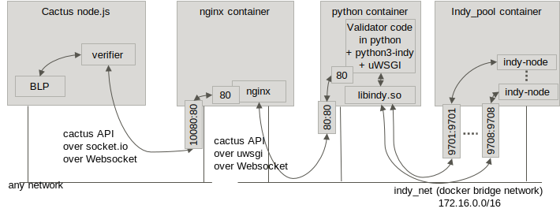

# Launching Hyperledger Indy pool and validator

## Abstract

scripts in this directory builds, starts indy node pool and the cactus validator for indy

## What will be built, run by using the scripts

One bridge network and three containers will be started by `docker-compse up` command (after building the images).



- Network
  - name: indy_net
  - subnet: 172.16.0.0/24
- Containers
  - nginx container
    - proxies requests from verifiers to the validator in the python container
      - NOTE:  At the moment, this container does nothing.
      - TODO: Configure to proxy requests. Enable uWSGI (towards the python container).
    - IP address: 172.16.0.3 on indy_net
    - port 10080 is open to the world
  - clientbase
    - this is a temporary container based on template image for indy client (used by validator/Dockerfile)
    - immediately exits when you docker-compose up
  - validator container
    - validator code in the container receives requests from validators, which requests are proxied by the nginx container, and interacts with indy nodes in the indy_pool container
    - IP address: 172.16.0.4
    - port 8000 is open to containers on indy_net
  - indy_pool container
    - indy nodes run in this container and serves requests from validator in the python container
      - it mounts sandbox directory of host environment to save the status of Indy nodes
    - IP address: 172.16.0.2
    - ports 9701-9708 are open to containers on indy_net

## How to build

- edit `.env` to set environment variables
- run `run-before-build.sh`
- run `docker-compose build`

### How to edit `.env` file

Edit `.env` file in this directory to set the environment variables.

```
HTTP_PROXY=http://<proxy_host>:<proxy_port>
NO_PROXY=<local addresses>
```

Set `HTTP_PROXY` and `NO_PROXY` if your network requires HTTP proxy access to reach the internet.


### How to build docker images

Use this command to build images

```
docker-compose build
```
## How to start and stop containers

Use this command to start containers.

```
docker-compose up
```

Press CTRL-C to stop the containers.

## How to verify that validator and ledger is up

Copy python script from example directory

1. Copy files from cactus and indy-sdk and edit address of the application (BLP)

    Create a directory for a container.

    ```bash
    cd cactus/tools/docker/indy-testnet
    mkdir indycli
    ```

    Copy python files from indy-sdk and cactus example directory and edit variable `http_req_params.url` in file `req_discounted_cartrade.py` to point to `http://host.docker.internal:5034/api/v1/bl/trades/` (localhost --> host.docker.internal).

    ```bash
    cp -frp ../../../../indy-sdk/samples/python indycli
    cp -frp cactus/examples/register-indy-data/req_discounted_cartrade.py indycli/python/src
    cd indycli/python/src
    vi req_discounted_cartrade.py
    ```

    Copy javascript files and edit variable `const url = "http://localhost:8000"` in file `testsock.js` to point to `http://host.docker.internal:10080`. This port is served by nginx container (and forwarded to the Indy validator).

    ```bash
    cd ../../..
    cp -frp validator/cactus_validator_socketio/testcli/ indycli
    cd indycli/testcli
    vi testsock.js
    ```

1. Start a container to run the initialization script

    ```bash
    cd ../../..
    docker run -it -v $(pwd)/indycli:/tmp/indycli --user indy --name indycli --network indy_net --add-host host.docker.internal:host-gateway clientbase /bin/bash
    ```

1. Run the initialization script

    In the container, run the python script

    ```bash
    . ~/.venv/bin/activate
    cd /tmp/indycli/python
    TEST_POOL_IP=172.16.0.2 python -m src.req_discounted_cartrade
    ```

    This script might fail at end because it tries to `POST` a JSON to an application (BLP), which is not ready if you have not started it yet. You can assume the test was successful if the script created `myproof.json` in current directory.

1. Copy myproof.json and run validator test client

    In the container, copy myproof.json to testcli directory and run testsock.js.

    ```bash
    cp myproof.json ../testcli
    cd ../testcli
    node testsock.js
    ```

